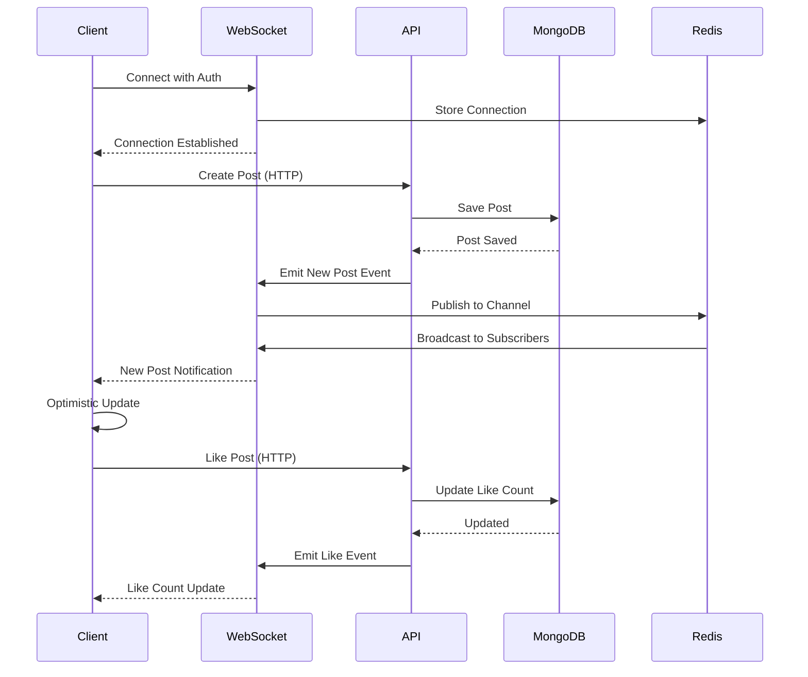

# リアルタイム更新機能 設計書

## 1. 概要

本設計書は、Next.js 15アプリケーションにおけるリアルタイム更新機能の実装について定義します。
WebSocketを使用した双方向通信により、新着投稿の通知、いいね数の即座更新、その他のリアルタイムインタラクションを実現します。

## 2. アーキテクチャ

### 2.1 システム構成図

```
┌─────────────────────────────────────────────────────────┐
│                    クライアント層                          │
├─────────────────────────────────────────────────────────┤
│  React Components                                        │
│  ├─ useWebSocket Hook                                   │
│  ├─ RealtimeProvider Context                            │
│  └─ Optimistic Update Manager                           │
└─────────────────────────────────────────────────────────┘
                            ↕ WebSocket
┌─────────────────────────────────────────────────────────┐
│                    WebSocket層                           │
├─────────────────────────────────────────────────────────┤
│  Socket.io Server                                        │
│  ├─ Connection Manager                                   │
│  ├─ Room Manager                                         │
│  ├─ Event Handler                                        │
│  └─ Redis Adapter (スケーリング用)                        │
└─────────────────────────────────────────────────────────┘
                            ↕
┌─────────────────────────────────────────────────────────┐
│                    アプリケーション層                      │
├─────────────────────────────────────────────────────────┤
│  Next.js API Routes                                      │
│  ├─ Event Emitter                                       │
│  ├─ Database Triggers                                   │
│  └─ Queue Manager                                       │
└─────────────────────────────────────────────────────────┘
                            ↕
┌─────────────────────────────────────────────────────────┐
│                    データ層                              │
├─────────────────────────────────────────────────────────┤
│  MongoDB                                                 │
│  ├─ Change Streams                                      │
│  ├─ Event Collections                                   │
│  └─ Cache Layer (Redis)                                 │
└─────────────────────────────────────────────────────────┘
```

### 2.2 通信フロー



## 3. WebSocketサーバー設計

### 3.1 サーバー構成

```typescript
// server/socket.ts
interface SocketServerConfig {
  port: number;
  cors: {
    origin: string | string[];
    credentials: boolean;
  };
  adapter: 'redis' | 'memory';
  pingTimeout: number;
  pingInterval: number;
  maxHttpBufferSize: number;
  transports: ('websocket' | 'polling')[];
}

class RealtimeServer {
  private io: Server;
  private redis: RedisClient;
  private connections: Map<string, SocketConnection>;
  
  constructor(config: SocketServerConfig) {
    this.io = new Server(config);
    this.setupMiddleware();
    this.setupEventHandlers();
    this.setupMonitoring();
  }
  
  // 認証ミドルウェア
  private authenticateSocket(socket: Socket, next: Function) {
    const token = socket.handshake.auth.token;
    // JWT検証
    // ユーザー情報をsocketに付与
  }
  
  // ルーム管理
  private joinUserRooms(socket: Socket, userId: string) {
    socket.join(`user:${userId}`);
    socket.join('public');
    // フォロー中のユーザーのルームに参加
  }
  
  // イベントハンドラー
  private setupEventHandlers() {
    this.io.on('connection', this.handleConnection);
    this.io.on('disconnect', this.handleDisconnect);
  }
}
```

### 3.2 イベント定義

```typescript
// types/socket-events.ts
export enum SocketEvents {
  // 接続管理
  CONNECT = 'connect',
  DISCONNECT = 'disconnect',
  RECONNECT = 'reconnect',
  ERROR = 'error',
  
  // 投稿関連
  POST_CREATED = 'post:created',
  POST_UPDATED = 'post:updated',
  POST_DELETED = 'post:deleted',
  POST_LIKED = 'post:liked',
  POST_UNLIKED = 'post:unliked',
  
  // コメント関連
  COMMENT_ADDED = 'comment:added',
  COMMENT_UPDATED = 'comment:updated',
  COMMENT_DELETED = 'comment:deleted',
  
  // 通知関連
  NOTIFICATION_NEW = 'notification:new',
  NOTIFICATION_READ = 'notification:read',
  
  // ユーザー関連
  USER_ONLINE = 'user:online',
  USER_OFFLINE = 'user:offline',
  USER_TYPING = 'user:typing',
  USER_STOPPED_TYPING = 'user:stopped_typing',
  
  // システム
  HEARTBEAT = 'heartbeat',
  SYNC_REQUEST = 'sync:request',
  SYNC_RESPONSE = 'sync:response',
}

export interface SocketEventPayload {
  [SocketEvents.POST_CREATED]: {
    post: Post;
    author: User;
    timestamp: Date;
  };
  
  [SocketEvents.POST_LIKED]: {
    postId: string;
    userId: string;
    likeCount: number;
    timestamp: Date;
  };
  
  [SocketEvents.NOTIFICATION_NEW]: {
    notification: Notification;
    userId: string;
    priority: 'high' | 'normal' | 'low';
  };
  
  // ... 他のイベントペイロード
}
```

### 3.3 ルーム管理

```typescript
// server/rooms.ts
class RoomManager {
  private rooms: Map<string, Set<string>>;
  
  // ダイナミックルーム作成
  createRoom(roomId: string): void {
    if (!this.rooms.has(roomId)) {
      this.rooms.set(roomId, new Set());
    }
  }
  
  // ユーザーをルームに追加
  joinRoom(userId: string, roomId: string): void {
    this.createRoom(roomId);
    this.rooms.get(roomId)!.add(userId);
  }
  
  // ルームタイプ
  getRoomTypes(userId: string): string[] {
    return [
      `user:${userId}`,           // 個人ルーム
      `following:${userId}`,      // フォロー中のユーザーの更新
      'public',                   // パブリック更新
      `hashtag:${hashtagId}`,     // ハッシュタグフォロー
    ];
  }
  
  // ルーム内ブロードキャスト
  broadcast(roomId: string, event: string, data: any): void {
    this.io.to(roomId).emit(event, data);
  }
}
```

## 4. クライアント側実装

### 4.1 WebSocket Hook

```typescript
// hooks/useWebSocket.ts
import { useEffect, useRef, useState, useCallback } from 'react';
import io, { Socket } from 'socket.io-client';

interface UseWebSocketOptions {
  url?: string;
  autoConnect?: boolean;
  reconnectionAttempts?: number;
  reconnectionDelay?: number;
  onConnect?: () => void;
  onDisconnect?: () => void;
  onError?: (error: Error) => void;
}

export function useWebSocket(options: UseWebSocketOptions = {}) {
  const [isConnected, setIsConnected] = useState(false);
  const [isReconnecting, setIsReconnecting] = useState(false);
  const socketRef = useRef<Socket | null>(null);
  const reconnectTimeoutRef = useRef<NodeJS.Timeout>();
  const eventHandlersRef = useRef<Map<string, Function[]>>(new Map());
  
  // 接続初期化
  const connect = useCallback(() => {
    if (socketRef.current?.connected) return;
    
    const socket = io(options.url || '', {
      transports: ['websocket', 'polling'],
      reconnection: true,
      reconnectionAttempts: options.reconnectionAttempts || 5,
      reconnectionDelay: options.reconnectionDelay || 1000,
      auth: {
        token: getAuthToken(),
      },
    });
    
    socket.on('connect', () => {
      setIsConnected(true);
      setIsReconnecting(false);
      options.onConnect?.();
    });
    
    socket.on('disconnect', () => {
      setIsConnected(false);
      options.onDisconnect?.();
    });
    
    socket.on('reconnect_attempt', () => {
      setIsReconnecting(true);
    });
    
    socket.on('error', (error) => {
      console.error('WebSocket error:', error);
      options.onError?.(error);
    });
    
    socketRef.current = socket;
  }, [options]);
  
  // イベントリスナー登録
  const on = useCallback((event: string, handler: Function) => {
    if (!eventHandlersRef.current.has(event)) {
      eventHandlersRef.current.set(event, []);
    }
    eventHandlersRef.current.get(event)!.push(handler);
    
    socketRef.current?.on(event, handler);
    
    return () => off(event, handler);
  }, []);
  
  // イベントリスナー解除
  const off = useCallback((event: string, handler: Function) => {
    const handlers = eventHandlersRef.current.get(event);
    if (handlers) {
      const index = handlers.indexOf(handler);
      if (index > -1) {
        handlers.splice(index, 1);
      }
    }
    
    socketRef.current?.off(event, handler);
  }, []);
  
  // イベント送信
  const emit = useCallback((event: string, data?: any) => {
    if (!socketRef.current?.connected) {
      console.warn('Socket is not connected');
      return false;
    }
    
    socketRef.current.emit(event, data);
    return true;
  }, []);
  
  // 切断
  const disconnect = useCallback(() => {
    socketRef.current?.disconnect();
    socketRef.current = null;
    setIsConnected(false);
  }, []);
  
  // クリーンアップ
  useEffect(() => {
    if (options.autoConnect !== false) {
      connect();
    }
    
    return () => {
      disconnect();
    };
  }, []);
  
  return {
    isConnected,
    isReconnecting,
    connect,
    disconnect,
    on,
    off,
    emit,
    socket: socketRef.current,
  };
}
```

### 4.2 リアルタイムコンテキスト

```typescript
// contexts/RealtimeContext.tsx
import React, { createContext, useContext, useEffect, useState } from 'react';
import { useWebSocket } from '@/hooks/useWebSocket';
import { useSession } from 'next-auth/react';

interface RealtimeContextValue {
  isConnected: boolean;
  isReconnecting: boolean;
  subscribe: (event: string, handler: Function) => () => void;
  unsubscribe: (event: string, handler: Function) => void;
  emit: (event: string, data?: any) => boolean;
  onlineUsers: Set<string>;
  typingUsers: Map<string, string>; // userId -> postId
}

const RealtimeContext = createContext<RealtimeContextValue | null>(null);

export function RealtimeProvider({ children }: { children: React.ReactNode }) {
  const { data: session } = useSession();
  const [onlineUsers, setOnlineUsers] = useState<Set<string>>(new Set());
  const [typingUsers, setTypingUsers] = useState<Map<string, string>>(new Map());
  
  const { isConnected, isReconnecting, on, off, emit } = useWebSocket({
    url: process.env.NEXT_PUBLIC_WEBSOCKET_URL,
    autoConnect: !!session,
    onConnect: () => {
      console.log('WebSocket connected');
      // 初期データの同期
      emit('sync:request');
    },
    onDisconnect: () => {
      console.log('WebSocket disconnected');
    },
    onError: (error) => {
      console.error('WebSocket error:', error);
      // エラー通知を表示
    },
  });
  
  // オンラインユーザー管理
  useEffect(() => {
    const handleUserOnline = (userId: string) => {
      setOnlineUsers(prev => new Set(prev).add(userId));
    };
    
    const handleUserOffline = (userId: string) => {
      setOnlineUsers(prev => {
        const next = new Set(prev);
        next.delete(userId);
        return next;
      });
    };
    
    const unsubscribeOnline = on('user:online', handleUserOnline);
    const unsubscribeOffline = on('user:offline', handleUserOffline);
    
    return () => {
      unsubscribeOnline();
      unsubscribeOffline();
    };
  }, [on]);
  
  // タイピング状態管理
  useEffect(() => {
    const handleTyping = ({ userId, postId }: { userId: string; postId: string }) => {
      setTypingUsers(prev => new Map(prev).set(userId, postId));
    };
    
    const handleStoppedTyping = ({ userId }: { userId: string }) => {
      setTypingUsers(prev => {
        const next = new Map(prev);
        next.delete(userId);
        return next;
      });
    };
    
    const unsubscribeTyping = on('user:typing', handleTyping);
    const unsubscribeStoppedTyping = on('user:stopped_typing', handleStoppedTyping);
    
    return () => {
      unsubscribeTyping();
      unsubscribeStoppedTyping();
    };
  }, [on]);
  
  const value: RealtimeContextValue = {
    isConnected,
    isReconnecting,
    subscribe: on,
    unsubscribe: off,
    emit,
    onlineUsers,
    typingUsers,
  };
  
  return (
    <RealtimeContext.Provider value={value}>
      {children}
    </RealtimeContext.Provider>
  );
}

export function useRealtime() {
  const context = useContext(RealtimeContext);
  if (!context) {
    throw new Error('useRealtime must be used within RealtimeProvider');
  }
  return context;
}
```

## 5. 楽観的更新の実装

### 5.1 楽観的更新マネージャー

```typescript
// lib/optimisticUpdate.ts
interface OptimisticUpdate<T> {
  id: string;
  type: 'create' | 'update' | 'delete';
  timestamp: number;
  originalData?: T;
  optimisticData: T;
  confirmed: boolean;
  retryCount: number;
  maxRetries: number;
}

class OptimisticUpdateManager<T> {
  private updates: Map<string, OptimisticUpdate<T>>;
  private rollbackHandlers: Map<string, (data: T) => void>;
  
  constructor() {
    this.updates = new Map();
    this.rollbackHandlers = new Map();
  }
  
  // 楽観的更新を追加
  addUpdate(
    id: string,
    type: OptimisticUpdate<T>['type'],
    optimisticData: T,
    originalData?: T
  ): void {
    this.updates.set(id, {
      id,
      type,
      timestamp: Date.now(),
      originalData,
      optimisticData,
      confirmed: false,
      retryCount: 0,
      maxRetries: 3,
    });
  }
  
  // 更新を確認
  confirmUpdate(id: string): void {
    const update = this.updates.get(id);
    if (update) {
      update.confirmed = true;
      // 確認後一定時間経過したら削除
      setTimeout(() => this.updates.delete(id), 5000);
    }
  }
  
  // 更新をロールバック
  rollbackUpdate(id: string): void {
    const update = this.updates.get(id);
    if (update && update.originalData) {
      const handler = this.rollbackHandlers.get(update.type);
      handler?.(update.originalData);
      this.updates.delete(id);
    }
  }
  
  // リトライ
  async retryUpdate(id: string, retryFn: () => Promise<void>): Promise<boolean> {
    const update = this.updates.get(id);
    if (!update || update.retryCount >= update.maxRetries) {
      this.rollbackUpdate(id);
      return false;
    }
    
    update.retryCount++;
    
    try {
      await retryFn();
      this.confirmUpdate(id);
      return true;
    } catch (error) {
      if (update.retryCount >= update.maxRetries) {
        this.rollbackUpdate(id);
        return false;
      }
      // 指数バックオフでリトライ
      setTimeout(() => {
        this.retryUpdate(id, retryFn);
      }, Math.pow(2, update.retryCount) * 1000);
      return false;
    }
  }
  
  // ロールバックハンドラーを設定
  setRollbackHandler(type: string, handler: (data: T) => void): void {
    this.rollbackHandlers.set(type, handler);
  }
}
```

### 5.2 楽観的更新フック

```typescript
// hooks/useOptimisticUpdate.ts
import { useState, useCallback, useRef } from 'react';
import { OptimisticUpdateManager } from '@/lib/optimisticUpdate';

interface UseOptimisticUpdateOptions<T> {
  onRollback?: (data: T) => void;
  onError?: (error: Error) => void;
}

export function useOptimisticUpdate<T>(
  initialData: T,
  options: UseOptimisticUpdateOptions<T> = {}
) {
  const [data, setData] = useState<T>(initialData);
  const [isUpdating, setIsUpdating] = useState(false);
  const managerRef = useRef(new OptimisticUpdateManager<T>());
  
  // 楽観的更新を実行
  const optimisticUpdate = useCallback(async (
    updateFn: (current: T) => T,
    confirmFn: () => Promise<T>,
    updateId: string = Date.now().toString()
  ) => {
    setIsUpdating(true);
    
    // 現在のデータを保存
    const originalData = data;
    
    // 楽観的にデータを更新
    const optimisticData = updateFn(data);
    setData(optimisticData);
    
    // 更新を記録
    managerRef.current.addUpdate(
      updateId,
      'update',
      optimisticData,
      originalData
    );
    
    try {
      // サーバーに更新を送信
      const confirmedData = await confirmFn();
      
      // 確認されたデータで更新
      setData(confirmedData);
      managerRef.current.confirmUpdate(updateId);
    } catch (error) {
      // エラー時はロールバック
      setData(originalData);
      managerRef.current.rollbackUpdate(updateId);
      options.onRollback?.(originalData);
      options.onError?.(error as Error);
      
      // リトライロジック
      await managerRef.current.retryUpdate(updateId, confirmFn);
    } finally {
      setIsUpdating(false);
    }
  }, [data, options]);
  
  return {
    data,
    setData,
    isUpdating,
    optimisticUpdate,
  };
}
```

## 6. 特定機能の実装

### 6.1 新着投稿の通知

```typescript
// components/NewPostNotification.tsx
import { useEffect, useState } from 'react';
import { useRealtime } from '@/contexts/RealtimeContext';
import { motion, AnimatePresence } from 'framer-motion';

export function NewPostNotification() {
  const { subscribe, unsubscribe } = useRealtime();
  const [newPosts, setNewPosts] = useState<Post[]>([]);
  const [showNotification, setShowNotification] = useState(false);
  
  useEffect(() => {
    const handleNewPost = (data: { post: Post }) => {
      setNewPosts(prev => [data.post, ...prev]);
      setShowNotification(true);
      
      // 5秒後に自動的に非表示
      setTimeout(() => {
        setShowNotification(false);
      }, 5000);
    };
    
    const unsubscribe = subscribe('post:created', handleNewPost);
    return unsubscribe;
  }, [subscribe]);
  
  const handleShowNewPosts = () => {
    // 新着投稿を表示
    window.location.reload(); // または状態を更新
    setNewPosts([]);
    setShowNotification(false);
  };
  
  return (
    <AnimatePresence>
      {showNotification && newPosts.length > 0 && (
        <motion.div
          initial={{ opacity: 0, y: -50 }}
          animate={{ opacity: 1, y: 0 }}
          exit={{ opacity: 0, y: -50 }}
          className="fixed top-20 left-1/2 transform -translate-x-1/2 z-50"
        >
          <button
            onClick={handleShowNewPosts}
            className="bg-blue-500 text-white px-4 py-2 rounded-full shadow-lg hover:bg-blue-600"
          >
            {newPosts.length}件の新着投稿
          </button>
        </motion.div>
      )}
    </AnimatePresence>
  );
}
```

### 6.2 いいね数の即座更新

```typescript
// components/LikeButton.tsx
import { useState, useEffect } from 'react';
import { useRealtime } from '@/contexts/RealtimeContext';
import { useOptimisticUpdate } from '@/hooks/useOptimisticUpdate';

interface LikeButtonProps {
  postId: string;
  initialLikeCount: number;
  initialIsLiked: boolean;
}

export function LikeButton({ postId, initialLikeCount, initialIsLiked }: LikeButtonProps) {
  const { subscribe, emit } = useRealtime();
  const { data: likeData, optimisticUpdate } = useOptimisticUpdate({
    count: initialLikeCount,
    isLiked: initialIsLiked,
  });
  
  // リアルタイム更新を購読
  useEffect(() => {
    const handleLikeUpdate = (data: { postId: string; likeCount: number }) => {
      if (data.postId === postId) {
        // 他のユーザーからのいいね更新
        optimisticUpdate(
          () => ({ count: data.likeCount, isLiked: likeData.isLiked }),
          async () => ({ count: data.likeCount, isLiked: likeData.isLiked })
        );
      }
    };
    
    const unsubscribeLike = subscribe('post:liked', handleLikeUpdate);
    const unsubscribeUnlike = subscribe('post:unliked', handleLikeUpdate);
    
    return () => {
      unsubscribeLike();
      unsubscribeUnlike();
    };
  }, [postId, subscribe, likeData.isLiked]);
  
  const handleLike = async () => {
    const newIsLiked = !likeData.isLiked;
    const newCount = newIsLiked ? likeData.count + 1 : likeData.count - 1;
    
    await optimisticUpdate(
      // 楽観的更新
      () => ({ count: newCount, isLiked: newIsLiked }),
      // サーバー確認
      async () => {
        const response = await fetch(`/api/posts/${postId}/like`, {
          method: newIsLiked ? 'POST' : 'DELETE',
        });
        
        if (!response.ok) {
          throw new Error('Failed to update like');
        }
        
        const data = await response.json();
        
        // WebSocket経由で他のユーザーに通知
        emit(newIsLiked ? 'post:liked' : 'post:unliked', {
          postId,
          likeCount: data.likeCount,
        });
        
        return { count: data.likeCount, isLiked: newIsLiked };
      }
    );
  };
  
  return (
    <button
      onClick={handleLike}
      className={`flex items-center gap-2 px-3 py-1 rounded-full transition-colors ${
        likeData.isLiked
          ? 'bg-red-500 text-white'
          : 'bg-gray-200 text-gray-700 hover:bg-gray-300'
      }`}
    >
      <span>{likeData.isLiked ? '❤️' : '🤍'}</span>
      <span>{likeData.count}</span>
    </button>
  );
}
```

## 7. エラーハンドリングとフォールバック

### 7.1 接続管理

```typescript
// lib/connectionManager.ts
class ConnectionManager {
  private reconnectAttempts: number = 0;
  private maxReconnectAttempts: number = 5;
  private reconnectDelay: number = 1000;
  private fallbackMode: boolean = false;
  private pollingInterval: NodeJS.Timeout | null = null;
  
  // 接続状態監視
  monitorConnection(socket: Socket): void {
    socket.on('connect', () => {
      this.reconnectAttempts = 0;
      this.fallbackMode = false;
      this.stopPolling();
      console.log('WebSocket connected');
    });
    
    socket.on('disconnect', (reason) => {
      console.log('WebSocket disconnected:', reason);
      
      if (reason === 'io server disconnect') {
        // サーバー側から切断された
        socket.connect();
      } else {
        // クライアント側の問題
        this.handleReconnect(socket);
      }
    });
    
    socket.on('connect_error', (error) => {
      console.error('Connection error:', error);
      this.handleConnectionError(socket);
    });
  }
  
  // 再接続処理
  private handleReconnect(socket: Socket): void {
    if (this.reconnectAttempts >= this.maxReconnectAttempts) {
      this.enableFallbackMode();
      return;
    }
    
    this.reconnectAttempts++;
    const delay = this.reconnectDelay * Math.pow(2, this.reconnectAttempts - 1);
    
    setTimeout(() => {
      socket.connect();
    }, delay);
  }
  
  // 接続エラー処理
  private handleConnectionError(socket: Socket): void {
    if (this.reconnectAttempts >= this.maxReconnectAttempts) {
      this.enableFallbackMode();
    }
  }
  
  // フォールバックモード有効化
  private enableFallbackMode(): void {
    this.fallbackMode = true;
    console.log('Switching to fallback mode (polling)');
    this.startPolling();
  }
  
  // ポーリング開始
  private startPolling(): void {
    if (this.pollingInterval) return;
    
    this.pollingInterval = setInterval(async () => {
      try {
        const response = await fetch('/api/realtime/poll');
        const data = await response.json();
        
        // ポーリングで取得したデータを処理
        this.processPolledData(data);
      } catch (error) {
        console.error('Polling error:', error);
      }
    }, 5000); // 5秒ごとにポーリング
  }
  
  // ポーリング停止
  private stopPolling(): void {
    if (this.pollingInterval) {
      clearInterval(this.pollingInterval);
      this.pollingInterval = null;
    }
  }
  
  // ポーリングデータ処理
  private processPolledData(data: any): void {
    // WebSocketイベントと同じ形式でデータを処理
    if (data.events) {
      data.events.forEach((event: any) => {
        // イベントハンドラーを呼び出し
        this.emitEvent(event.type, event.payload);
      });
    }
  }
  
  // イベント発行
  private emitEvent(type: string, payload: any): void {
    // カスタムイベントを発行
    window.dispatchEvent(new CustomEvent(`socket:${type}`, { detail: payload }));
  }
}
```

### 7.2 フォールバックAPI

```typescript
// pages/api/realtime/poll.ts
import { NextRequest, NextResponse } from 'next/server';
import { getServerSession } from 'next-auth';
import { authOptions } from '@/lib/auth';
import { getRecentEvents } from '@/lib/events';

export async function GET(request: NextRequest) {
  try {
    const session = await getServerSession(authOptions);
    if (!session) {
      return NextResponse.json({ error: 'Unauthorized' }, { status: 401 });
    }
    
    const { searchParams } = new URL(request.url);
    const lastEventId = searchParams.get('lastEventId');
    const timestamp = searchParams.get('timestamp');
    
    // 最新のイベントを取得
    const events = await getRecentEvents({
      userId: session.user.id,
      lastEventId,
      timestamp: timestamp ? new Date(timestamp) : new Date(Date.now() - 30000), // 過去30秒
      limit: 50,
    });
    
    return NextResponse.json({
      events,
      timestamp: new Date().toISOString(),
    });
  } catch (error) {
    console.error('Polling error:', error);
    return NextResponse.json(
      { error: 'Failed to fetch events' },
      { status: 500 }
    );
  }
}
```

## 8. パフォーマンス最適化

### 8.1 デバウンス処理

```typescript
// lib/debounce.ts
export function debounceEmit(
  emitFn: (event: string, data: any) => void,
  delay: number = 300
) {
  let timeoutId: NodeJS.Timeout;
  
  return (event: string, data: any) => {
    clearTimeout(timeoutId);
    timeoutId = setTimeout(() => {
      emitFn(event, data);
    }, delay);
  };
}
```

### 8.2 バッチ処理

```typescript
// lib/batchProcessor.ts
class BatchProcessor<T> {
  private queue: T[] = [];
  private processing: boolean = false;
  private batchSize: number;
  private processInterval: number;
  private processFn: (batch: T[]) => Promise<void>;
  
  constructor(
    batchSize: number = 10,
    processInterval: number = 1000,
    processFn: (batch: T[]) => Promise<void>
  ) {
    this.batchSize = batchSize;
    this.processInterval = processInterval;
    this.processFn = processFn;
    this.startProcessing();
  }
  
  add(item: T): void {
    this.queue.push(item);
    
    if (this.queue.length >= this.batchSize) {
      this.processBatch();
    }
  }
  
  private async processBatch(): Promise<void> {
    if (this.processing || this.queue.length === 0) return;
    
    this.processing = true;
    const batch = this.queue.splice(0, this.batchSize);
    
    try {
      await this.processFn(batch);
    } catch (error) {
      console.error('Batch processing error:', error);
      // 失敗したアイテムを再度キューに追加
      this.queue.unshift(...batch);
    } finally {
      this.processing = false;
    }
  }
  
  private startProcessing(): void {
    setInterval(() => {
      this.processBatch();
    }, this.processInterval);
  }
}
```

## 9. モニタリングとデバッグ

### 9.1 WebSocketモニター

```typescript
// components/WebSocketMonitor.tsx (開発環境のみ)
import { useRealtime } from '@/contexts/RealtimeContext';

export function WebSocketMonitor() {
  const { isConnected, isReconnecting } = useRealtime();
  
  if (process.env.NODE_ENV !== 'development') {
    return null;
  }
  
  return (
    <div className="fixed bottom-4 right-4 p-2 bg-black text-white text-xs rounded">
      <div className="flex items-center gap-2">
        <div
          className={`w-2 h-2 rounded-full ${
            isConnected
              ? 'bg-green-500'
              : isReconnecting
              ? 'bg-yellow-500'
              : 'bg-red-500'
          }`}
        />
        <span>
          WebSocket: {isConnected ? 'Connected' : isReconnecting ? 'Reconnecting' : 'Disconnected'}
        </span>
      </div>
    </div>
  );
}
```

## 10. セキュリティ考慮事項

1. **認証と認可**
   - JWT トークンによる認証
   - ルームベースのアクセス制御
   - レート制限

2. **データ検証**
   - 入力データのサニタイズ
   - スキーマバリデーション
   - XSS対策

3. **接続管理**
   - 接続数制限
   - アイドルタイムアウト
   - DDoS対策

## 11. デプロイメント

### 11.1 環境変数

```env
# .env.production
NEXT_PUBLIC_WEBSOCKET_URL=wss://api.example.com
REDIS_URL=redis://localhost:6379
SOCKET_PORT=3001
SOCKET_CORS_ORIGIN=https://example.com
```

### 11.2 スケーリング戦略

1. **水平スケーリング**
   - Redis Adapterによる複数インスタンス対応
   - ロードバランサー設定
   - Sticky Session設定

2. **垂直スケーリング**
   - メモリ最適化
   - 接続プール管理
   - キャッシュ戦略

この設計により、スケーラブルで信頼性の高いリアルタイム更新機能を実装できます。