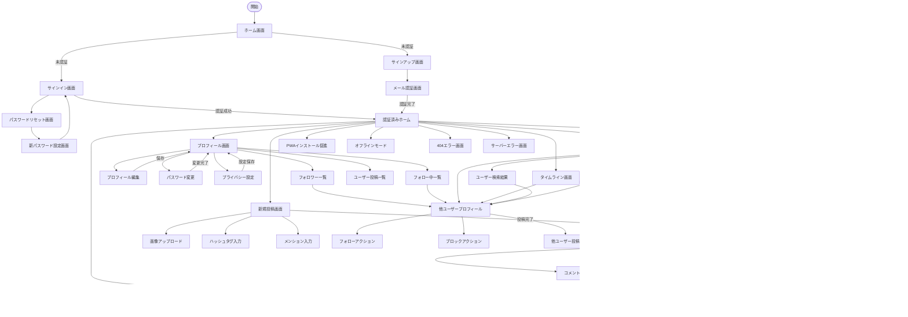
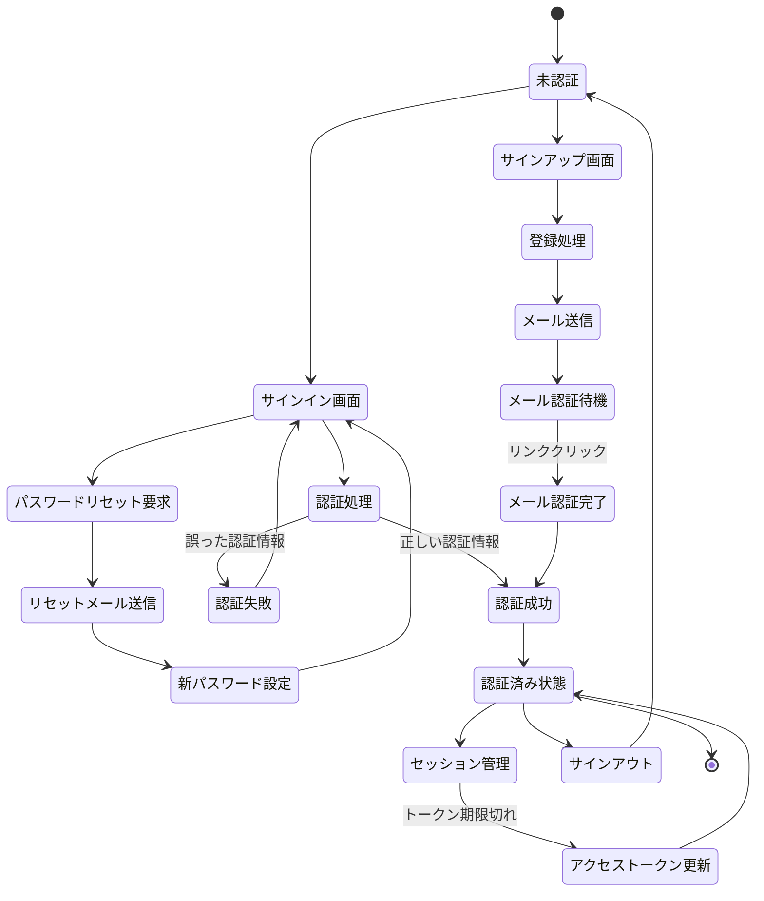
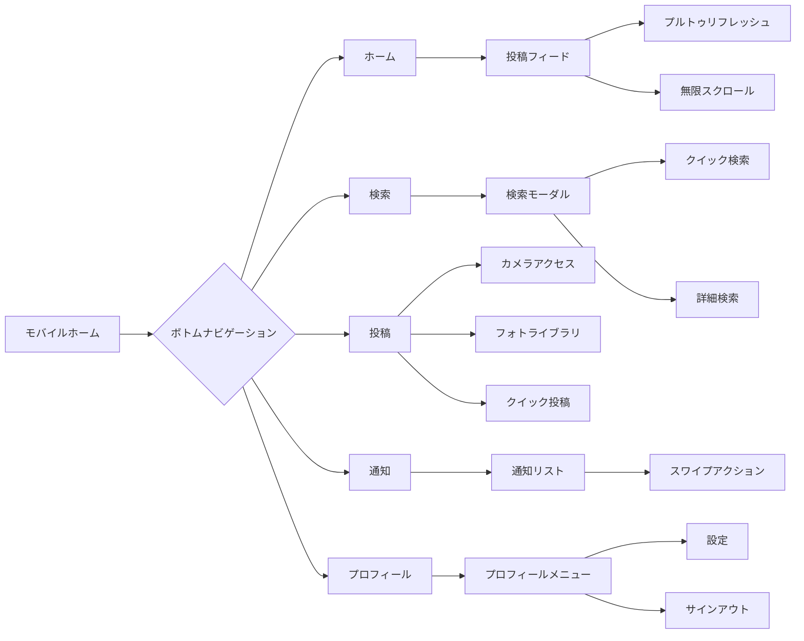
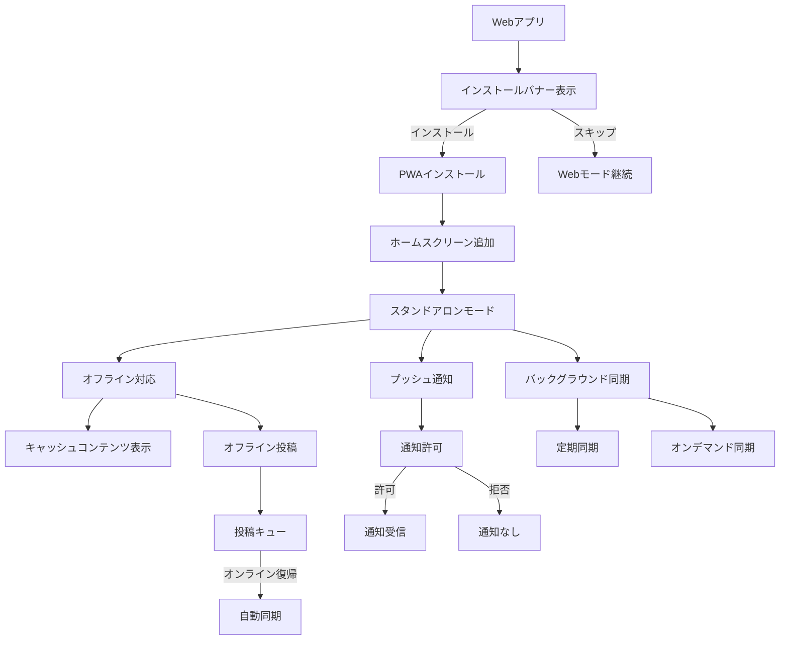
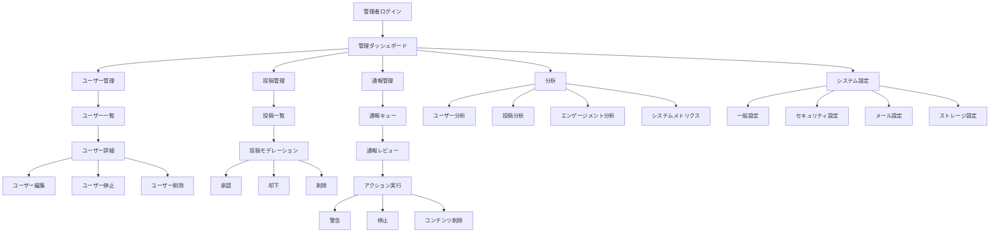

# 画面遷移図

## 全体画面遷移図

```mermaid
graph TB
    Start([開始]) --> HomePage[ホーム画面]
    
    %% 未認証ユーザーのフロー
    HomePage -->|未認証| SignIn[サインイン画面]
    HomePage -->|未認証| SignUp[サインアップ画面]
    
    SignIn --> ForgotPassword[パスワードリセット画面]
    SignIn -->|認証成功| AuthHome[認証済みホーム]
    
    SignUp --> EmailVerification[メール認証画面]
    EmailVerification -->|認証完了| AuthHome
    
    ForgotPassword --> NewPassword[新パスワード設定画面]
    NewPassword --> SignIn
    
    %% 認証済みユーザーのフロー
    AuthHome --> Timeline[タイムライン画面]
    AuthHome --> PostList[投稿一覧]
    AuthHome --> NewPost[新規投稿画面]
    AuthHome --> Search[検索画面]
    AuthHome --> Profile[プロフィール画面]
    AuthHome --> Notifications[通知画面]
    
    %% 投稿関連
    PostList --> PostDetail[投稿詳細画面]
    Timeline --> PostDetail
    Search --> PostDetail
    
    PostDetail --> EditPost[投稿編集画面]
    PostDetail --> CommentSection[コメントセクション]
    PostDetail --> LikeAction[いいねアクション]
    PostDetail --> ShareAction[共有アクション]
    
    NewPost --> ImageUpload[画像アップロード]
    NewPost --> HashtagInput[ハッシュタグ入力]
    NewPost --> MentionInput[メンション入力]
    NewPost -->|投稿完了| PostDetail
    
    EditPost -->|更新完了| PostDetail
    EditPost -->|削除| PostList
    
    %% プロフィール関連
    Profile --> EditProfile[プロフィール編集]
    Profile --> ChangePassword[パスワード変更]
    Profile --> PrivacySettings[プライバシー設定]
    Profile --> FollowersList[フォロワー一覧]
    Profile --> FollowingList[フォロー中一覧]
    Profile --> UserPosts[ユーザー投稿一覧]
    
    EditProfile -->|保存| Profile
    ChangePassword -->|変更完了| Profile
    PrivacySettings -->|設定保存| Profile
    
    %% フォロー関連
    FollowersList --> OtherUserProfile[他ユーザープロフィール]
    FollowingList --> OtherUserProfile
    Search --> OtherUserProfile
    Timeline --> OtherUserProfile
    
    OtherUserProfile --> FollowAction[フォローアクション]
    OtherUserProfile --> BlockAction[ブロックアクション]
    OtherUserProfile --> OtherUserPosts[他ユーザー投稿]
    
    %% 検索関連
    Search --> UserSearchResults[ユーザー検索結果]
    Search --> PostSearchResults[投稿検索結果]
    Search --> HashtagSearchResults[ハッシュタグ検索結果]
    
    UserSearchResults --> OtherUserProfile
    PostSearchResults --> PostDetail
    HashtagSearchResults --> HashtagPosts[ハッシュタグ投稿一覧]
    HashtagPosts --> PostDetail
    
    %% 通知関連
    Notifications --> NotificationDetail[通知詳細]
    NotificationDetail --> PostDetail
    NotificationDetail --> OtherUserProfile
    NotificationDetail --> CommentSection
    
    %% リアルタイム機能
    Timeline -.->|リアルタイム更新| NewPostNotification[新着投稿通知]
    PostDetail -.->|リアルタイム更新| NewCommentNotification[新着コメント通知]
    PostDetail -.->|リアルタイム更新| NewLikeNotification[新着いいね通知]
    
    %% PWA機能
    AuthHome --> InstallPrompt[PWAインストール促進]
    AuthHome --> OfflineMode[オフラインモード]
    
    %% エラー画面
    AuthHome --> NotFound[404エラー画面]
    AuthHome --> ServerError[サーバーエラー画面]
```

## 認証フロー詳細

```mermaid
stateDiagram-v2
    [*] --> 未認証
    
    未認証 --> サインイン画面
    未認証 --> サインアップ画面
    
    サインイン画面 --> 認証処理
    サインアップ画面 --> 登録処理
    
    認証処理 --> 認証成功: 正しい認証情報
    認証処理 --> 認証失敗: 誤った認証情報
    認証失敗 --> サインイン画面
    
    登録処理 --> メール送信
    メール送信 --> メール認証待機
    メール認証待機 --> メール認証完了: リンククリック
    メール認証完了 --> 認証成功
    
    サインイン画面 --> パスワードリセット要求
    パスワードリセット要求 --> リセットメール送信
    リセットメール送信 --> 新パスワード設定
    新パスワード設定 --> サインイン画面
    
    認証成功 --> 認証済み状態
    認証済み状態 --> セッション管理
    セッション管理 --> アクセストークン更新: トークン期限切れ
    アクセストークン更新 --> 認証済み状態
    
    認証済み状態 --> サインアウト
    サインアウト --> 未認証
    
    認証済み状態 --> [*]
```

## モバイル画面遷移（レスポンシブ）

```mermaid
graph LR
    MobileHome[モバイルホーム] --> BottomNav{ボトムナビゲーション}
    
    BottomNav --> Home[ホーム]
    BottomNav --> Search[検索]
    BottomNav --> NewPost[投稿]
    BottomNav --> Notifications[通知]
    BottomNav --> Profile[プロフィール]
    
    Home --> PostFeed[投稿フィード]
    PostFeed --> PullToRefresh[プルトゥリフレッシュ]
    PostFeed --> InfiniteScroll[無限スクロール]
    
    Search --> SearchModal[検索モーダル]
    SearchModal --> QuickSearch[クイック検索]
    SearchModal --> AdvancedSearch[詳細検索]
    
    NewPost --> CameraAccess[カメラアクセス]
    NewPost --> PhotoLibrary[フォトライブラリ]
    NewPost --> QuickPost[クイック投稿]
    
    Notifications --> NotificationList[通知リスト]
    NotificationList --> SwipeActions[スワイプアクション]
    
    Profile --> ProfileMenu[プロフィールメニュー]
    ProfileMenu --> Settings[設定]
    ProfileMenu --> SignOut[サインアウト]
```

## PWA画面遷移

```mermaid
graph TB
    WebApp[Webアプリ] --> InstallBanner[インストールバナー表示]
    
    InstallBanner -->|インストール| PWAInstall[PWAインストール]
    InstallBanner -->|スキップ| WebMode[Webモード継続]
    
    PWAInstall --> HomeScreen[ホームスクリーン追加]
    HomeScreen --> StandaloneMode[スタンドアロンモード]
    
    StandaloneMode --> OfflineCapable[オフライン対応]
    StandaloneMode --> PushNotifications[プッシュ通知]
    StandaloneMode --> BackgroundSync[バックグラウンド同期]
    
    OfflineCapable --> CachedContent[キャッシュコンテンツ表示]
    OfflineCapable --> OfflinePost[オフライン投稿]
    OfflinePost --> QueuedPosts[投稿キュー]
    QueuedPosts -->|オンライン復帰| AutoSync[自動同期]
    
    PushNotifications --> NotificationPermission[通知許可]
    NotificationPermission -->|許可| ReceiveNotifications[通知受信]
    NotificationPermission -->|拒否| NoNotifications[通知なし]
    
    BackgroundSync --> PeriodicSync[定期同期]
    BackgroundSync --> OnDemandSync[オンデマンド同期]
```

## 管理者画面遷移

```mermaid
graph TB
    AdminLogin[管理者ログイン] --> AdminDashboard[管理ダッシュボード]
    
    AdminDashboard --> UserManagement[ユーザー管理]
    AdminDashboard --> PostManagement[投稿管理]
    AdminDashboard --> ReportManagement[通報管理]
    AdminDashboard --> Analytics[分析]
    AdminDashboard --> SystemSettings[システム設定]
    
    UserManagement --> UserList[ユーザー一覧]
    UserList --> UserDetail[ユーザー詳細]
    UserDetail --> UserEdit[ユーザー編集]
    UserDetail --> UserSuspend[ユーザー停止]
    UserDetail --> UserDelete[ユーザー削除]
    
    PostManagement --> PostList[投稿一覧]
    PostList --> PostModeration[投稿モデレーション]
    PostModeration --> PostApprove[承認]
    PostModeration --> PostReject[却下]
    PostModeration --> PostDelete[削除]
    
    ReportManagement --> ReportQueue[通報キュー]
    ReportQueue --> ReportReview[通報レビュー]
    ReportReview --> TakeAction[アクション実行]
    TakeAction --> WarnUser[警告]
    TakeAction --> SuspendUser[停止]
    TakeAction --> DeleteContent[コンテンツ削除]
    
    Analytics --> UserAnalytics[ユーザー分析]
    Analytics --> PostAnalytics[投稿分析]
    Analytics --> EngagementAnalytics[エンゲージメント分析]
    Analytics --> SystemMetrics[システムメトリクス]
    
    SystemSettings --> GeneralSettings[一般設定]
    SystemSettings --> SecuritySettings[セキュリティ設定]
    SystemSettings --> EmailSettings[メール設定]
    SystemSettings --> StorageSettings[ストレージ設定]
```