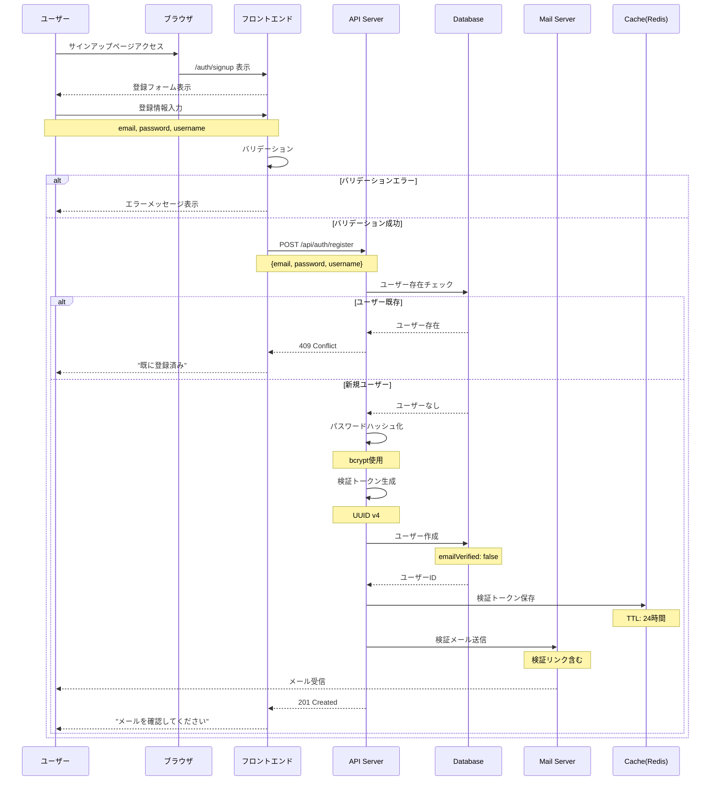
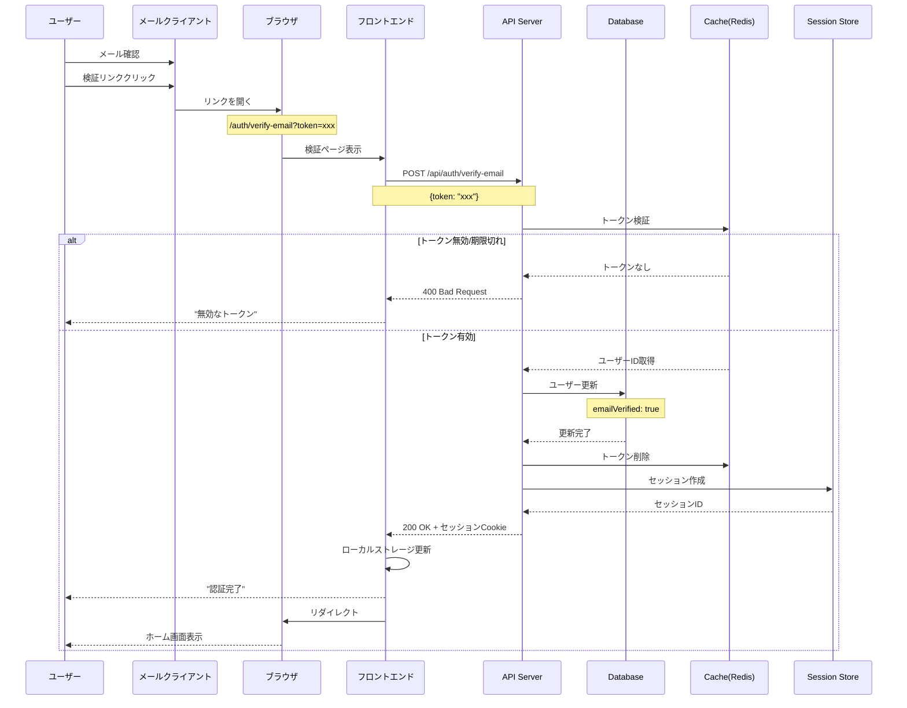
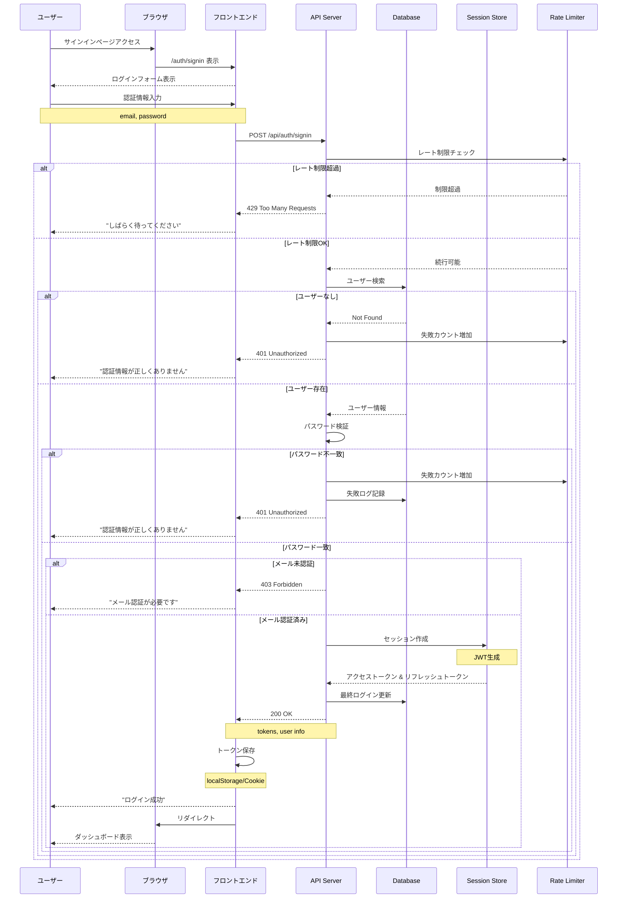
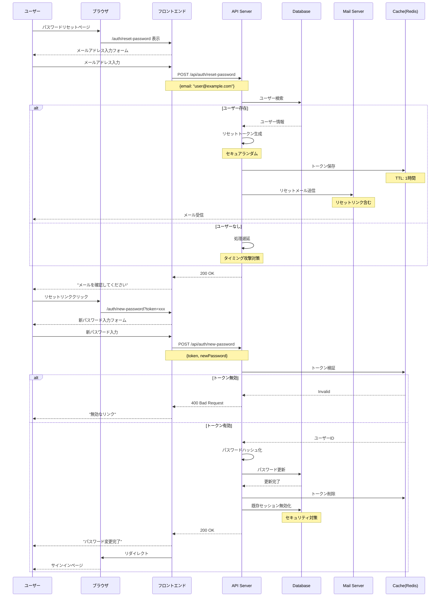
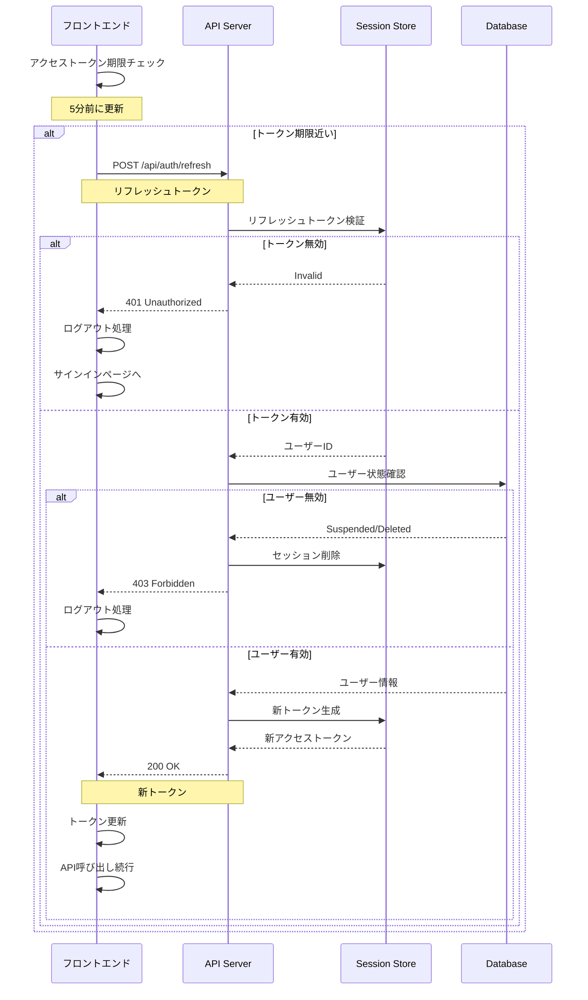
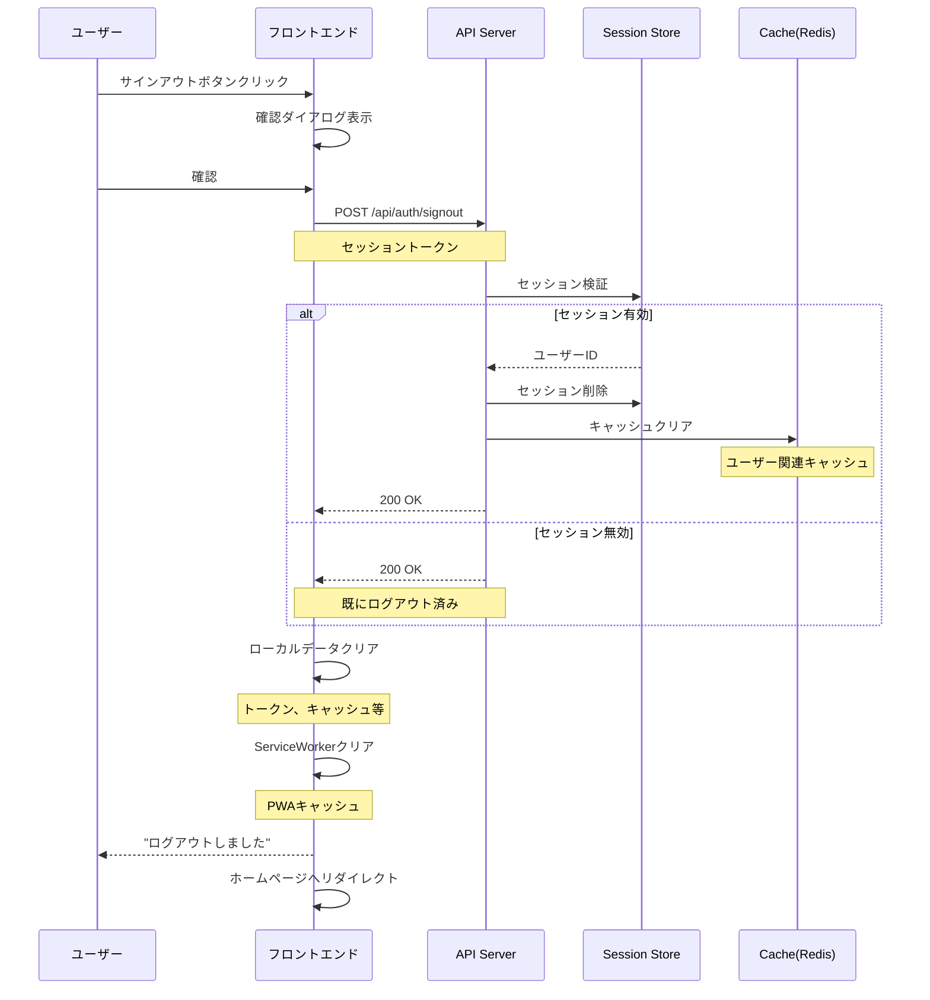
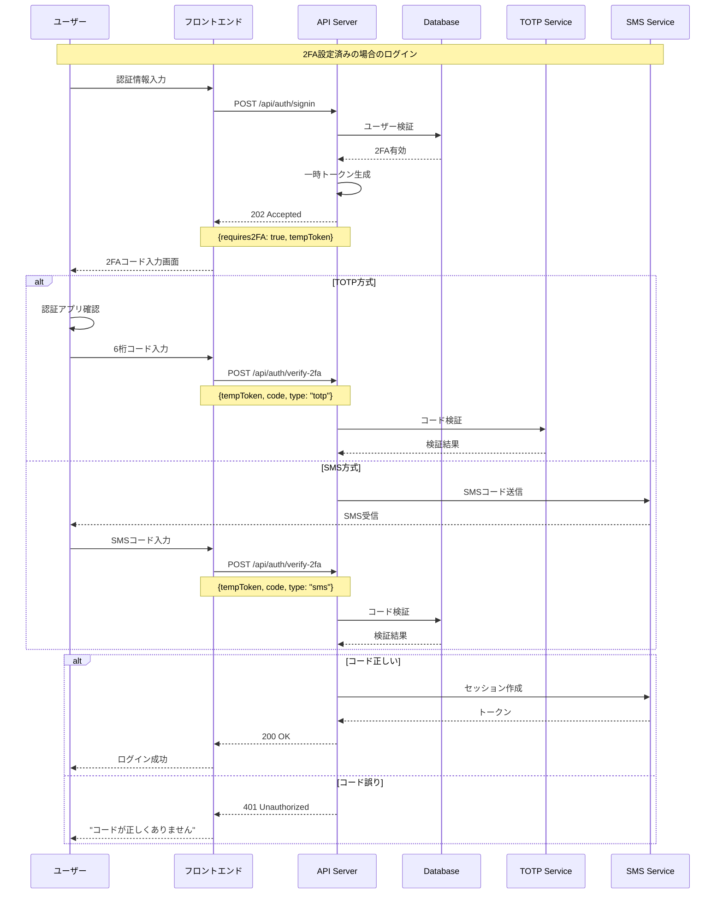
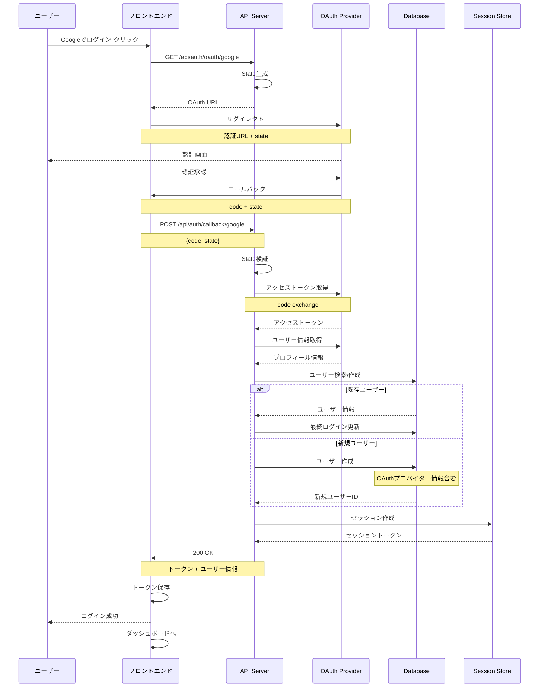

# 認証機能シーケンス図

## ユーザー登録（サインアップ）

```mermaid
sequenceDiagram
    participant U as ユーザー
    participant B as ブラウザ
    participant F as フロントエンド
    participant A as API Server
    participant D as Database
    participant M as Mail Server
    participant C as Cache(Redis)

    U->>B: サインアップページアクセス
    B->>F: /auth/signup 表示
    F-->>U: 登録フォーム表示
    
    U->>F: 登録情報入力
    Note over U,F: email, password, username
    
    F->>F: バリデーション
    alt バリデーションエラー
        F-->>U: エラーメッセージ表示
    else バリデーション成功
        F->>A: POST /api/auth/register
        Note over F,A: {email, password, username}
        
        A->>D: ユーザー存在チェック
        alt ユーザー既存
            D-->>A: ユーザー存在
            A-->>F: 409 Conflict
            F-->>U: "既に登録済み"
        else 新規ユーザー
            D-->>A: ユーザーなし
            
            A->>A: パスワードハッシュ化
            Note over A: bcrypt使用
            
            A->>A: 検証トークン生成
            Note over A: UUID v4
            
            A->>D: ユーザー作成
            Note over D: emailVerified: false
            D-->>A: ユーザーID
            
            A->>C: 検証トークン保存
            Note over C: TTL: 24時間
            
            A->>M: 検証メール送信
            Note over M: 検証リンク含む
            M-->>U: メール受信
            
            A-->>F: 201 Created
            F-->>U: "メールを確認してください"
        end
    end
```

## メール認証

```mermaid
sequenceDiagram
    participant U as ユーザー
    participant E as メールクライアント
    participant B as ブラウザ
    participant F as フロントエンド
    participant A as API Server
    participant D as Database
    participant C as Cache(Redis)
    participant S as Session Store

    U->>E: メール確認
    U->>E: 検証リンククリック
    E->>B: リンクを開く
    Note over B: /auth/verify-email?token=xxx
    
    B->>F: 検証ページ表示
    F->>A: POST /api/auth/verify-email
    Note over F,A: {token: "xxx"}
    
    A->>C: トークン検証
    alt トークン無効/期限切れ
        C-->>A: トークンなし
        A-->>F: 400 Bad Request
        F-->>U: "無効なトークン"
    else トークン有効
        C-->>A: ユーザーID取得
        
        A->>D: ユーザー更新
        Note over D: emailVerified: true
        D-->>A: 更新完了
        
        A->>C: トークン削除
        
        A->>S: セッション作成
        S-->>A: セッションID
        
        A-->>F: 200 OK + セッションCookie
        F->>F: ローカルストレージ更新
        F-->>U: "認証完了"
        F->>B: リダイレクト
        B-->>U: ホーム画面表示
    end
```

## サインイン

```mermaid
sequenceDiagram
    participant U as ユーザー
    participant B as ブラウザ
    participant F as フロントエンド
    participant A as API Server
    participant D as Database
    participant S as Session Store
    participant R as Rate Limiter

    U->>B: サインインページアクセス
    B->>F: /auth/signin 表示
    F-->>U: ログインフォーム表示
    
    U->>F: 認証情報入力
    Note over U,F: email, password
    
    F->>A: POST /api/auth/signin
    
    A->>R: レート制限チェック
    alt レート制限超過
        R-->>A: 制限超過
        A-->>F: 429 Too Many Requests
        F-->>U: "しばらく待ってください"
    else レート制限OK
        R-->>A: 続行可能
        
        A->>D: ユーザー検索
        alt ユーザーなし
            D-->>A: Not Found
            A->>R: 失敗カウント増加
            A-->>F: 401 Unauthorized
            F-->>U: "認証情報が正しくありません"
        else ユーザー存在
            D-->>A: ユーザー情報
            
            A->>A: パスワード検証
            alt パスワード不一致
                A->>R: 失敗カウント増加
                A->>D: 失敗ログ記録
                A-->>F: 401 Unauthorized
                F-->>U: "認証情報が正しくありません"
            else パスワード一致
                alt メール未認証
                    A-->>F: 403 Forbidden
                    F-->>U: "メール認証が必要です"
                else メール認証済み
                    A->>S: セッション作成
                    Note over S: JWT生成
                    S-->>A: アクセストークン & リフレッシュトークン
                    
                    A->>D: 最終ログイン更新
                    
                    A-->>F: 200 OK
                    Note over A,F: tokens, user info
                    
                    F->>F: トークン保存
                    Note over F: localStorage/Cookie
                    
                    F-->>U: "ログイン成功"
                    F->>B: リダイレクト
                    B-->>U: ダッシュボード表示
                end
            end
        end
    end
```

## パスワードリセット

```mermaid
sequenceDiagram
    participant U as ユーザー
    participant B as ブラウザ
    participant F as フロントエンド
    participant A as API Server
    participant D as Database
    participant M as Mail Server
    participant C as Cache(Redis)

    U->>B: パスワードリセットページ
    B->>F: /auth/reset-password 表示
    F-->>U: メールアドレス入力フォーム
    
    U->>F: メールアドレス入力
    F->>A: POST /api/auth/reset-password
    Note over F,A: {email: "user@example.com"}
    
    A->>D: ユーザー検索
    alt ユーザー存在
        D-->>A: ユーザー情報
        
        A->>A: リセットトークン生成
        Note over A: セキュアランダム
        
        A->>C: トークン保存
        Note over C: TTL: 1時間
        
        A->>M: リセットメール送信
        Note over M: リセットリンク含む
        M-->>U: メール受信
    else ユーザーなし
        A->>A: 処理遅延
        Note over A: タイミング攻撃対策
    end
    
    A-->>F: 200 OK
    F-->>U: "メールを確認してください"
    
    U->>B: リセットリンククリック
    B->>F: /auth/new-password?token=xxx
    F-->>U: 新パスワード入力フォーム
    
    U->>F: 新パスワード入力
    F->>A: POST /api/auth/new-password
    Note over F,A: {token, newPassword}
    
    A->>C: トークン検証
    alt トークン無効
        C-->>A: Invalid
        A-->>F: 400 Bad Request
        F-->>U: "無効なリンク"
    else トークン有効
        C-->>A: ユーザーID
        
        A->>A: パスワードハッシュ化
        
        A->>D: パスワード更新
        D-->>A: 更新完了
        
        A->>C: トークン削除
        
        A->>D: 既存セッション無効化
        Note over D: セキュリティ対策
        
        A-->>F: 200 OK
        F-->>U: "パスワード変更完了"
        F->>B: リダイレクト
        B-->>U: サインインページ
    end
```

## トークンリフレッシュ

```mermaid
sequenceDiagram
    participant F as フロントエンド
    participant A as API Server
    participant S as Session Store
    participant D as Database

    F->>F: アクセストークン期限チェック
    Note over F: 5分前に更新
    
    alt トークン期限近い
        F->>A: POST /api/auth/refresh
        Note over F,A: リフレッシュトークン
        
        A->>S: リフレッシュトークン検証
        alt トークン無効
            S-->>A: Invalid
            A-->>F: 401 Unauthorized
            F->>F: ログアウト処理
            F->>F: サインインページへ
        else トークン有効
            S-->>A: ユーザーID
            
            A->>D: ユーザー状態確認
            alt ユーザー無効
                D-->>A: Suspended/Deleted
                A->>S: セッション削除
                A-->>F: 403 Forbidden
                F->>F: ログアウト処理
            else ユーザー有効
                D-->>A: ユーザー情報
                
                A->>S: 新トークン生成
                S-->>A: 新アクセストークン
                
                A-->>F: 200 OK
                Note over A,F: 新トークン
                
                F->>F: トークン更新
                F->>F: API呼び出し続行
            end
        end
    end
```

## サインアウト

```mermaid
sequenceDiagram
    participant U as ユーザー
    participant F as フロントエンド
    participant A as API Server
    participant S as Session Store
    participant C as Cache(Redis)

    U->>F: サインアウトボタンクリック
    
    F->>F: 確認ダイアログ表示
    U->>F: 確認
    
    F->>A: POST /api/auth/signout
    Note over F,A: セッショントークン
    
    A->>S: セッション検証
    alt セッション有効
        S-->>A: ユーザーID
        
        A->>S: セッション削除
        A->>C: キャッシュクリア
        Note over C: ユーザー関連キャッシュ
        
        A-->>F: 200 OK
    else セッション無効
        A-->>F: 200 OK
        Note over A,F: 既にログアウト済み
    end
    
    F->>F: ローカルデータクリア
    Note over F: トークン、キャッシュ等
    
    F->>F: ServiceWorkerクリア
    Note over F: PWAキャッシュ
    
    F-->>U: "ログアウトしました"
    F->>F: ホームページへリダイレクト
```

## 2要素認証（2FA）

```mermaid
sequenceDiagram
    participant U as ユーザー
    participant F as フロントエンド
    participant A as API Server
    participant D as Database
    participant T as TOTP Service
    participant S as SMS Service

    Note over U,S: 2FA設定済みの場合のログイン
    
    U->>F: 認証情報入力
    F->>A: POST /api/auth/signin
    
    A->>D: ユーザー検証
    D-->>A: 2FA有効
    
    A->>A: 一時トークン生成
    A-->>F: 202 Accepted
    Note over A,F: {requires2FA: true, tempToken}
    
    F-->>U: 2FAコード入力画面
    
    alt TOTP方式
        U->>U: 認証アプリ確認
        U->>F: 6桁コード入力
        
        F->>A: POST /api/auth/verify-2fa
        Note over F,A: {tempToken, code, type: "totp"}
        
        A->>T: コード検証
        T-->>A: 検証結果
    else SMS方式
        A->>S: SMSコード送信
        S-->>U: SMS受信
        
        U->>F: SMSコード入力
        F->>A: POST /api/auth/verify-2fa
        Note over F,A: {tempToken, code, type: "sms"}
        
        A->>D: コード検証
        D-->>A: 検証結果
    end
    
    alt コード正しい
        A->>S: セッション作成
        S-->>A: トークン
        A-->>F: 200 OK
        F-->>U: ログイン成功
    else コード誤り
        A-->>F: 401 Unauthorized
        F-->>U: "コードが正しくありません"
    end
```

## OAuth認証（Google/GitHub）

```mermaid
sequenceDiagram
    participant U as ユーザー
    participant F as フロントエンド
    participant A as API Server
    participant O as OAuth Provider
    participant D as Database
    participant S as Session Store

    U->>F: "Googleでログイン"クリック
    
    F->>A: GET /api/auth/oauth/google
    A->>A: State生成
    A-->>F: OAuth URL
    
    F->>O: リダイレクト
    Note over F,O: 認証URL + state
    
    O-->>U: 認証画面
    U->>O: 認証承認
    
    O->>F: コールバック
    Note over O,F: code + state
    
    F->>A: POST /api/auth/callback/google
    Note over F,A: {code, state}
    
    A->>A: State検証
    
    A->>O: アクセストークン取得
    Note over A,O: code exchange
    O-->>A: アクセストークン
    
    A->>O: ユーザー情報取得
    O-->>A: プロフィール情報
    
    A->>D: ユーザー検索/作成
    alt 既存ユーザー
        D-->>A: ユーザー情報
        A->>D: 最終ログイン更新
    else 新規ユーザー
        A->>D: ユーザー作成
        Note over D: OAuthプロバイダー情報含む
        D-->>A: 新規ユーザーID
    end
    
    A->>S: セッション作成
    S-->>A: セッショントークン
    
    A-->>F: 200 OK
    Note over A,F: トークン + ユーザー情報
    
    F->>F: トークン保存
    F-->>U: ログイン成功
    F->>F: ダッシュボードへ
```