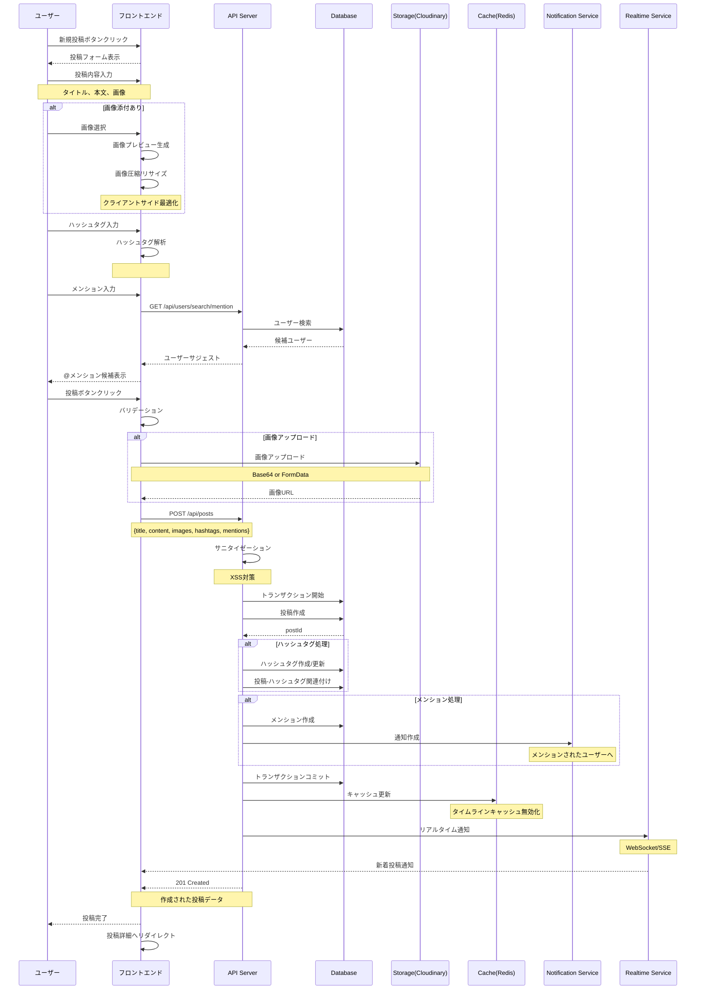
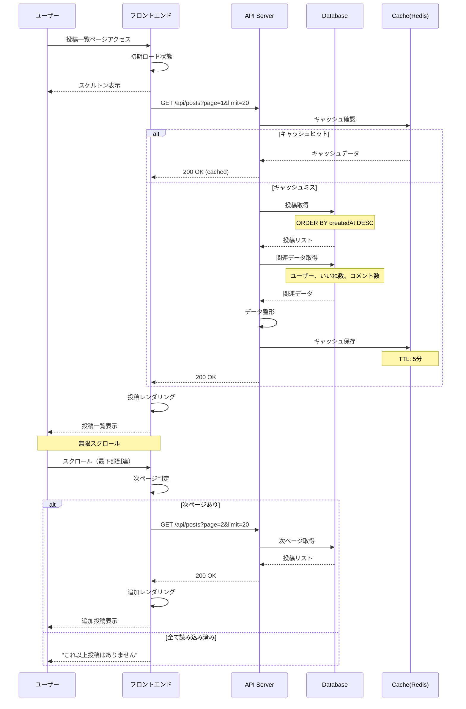
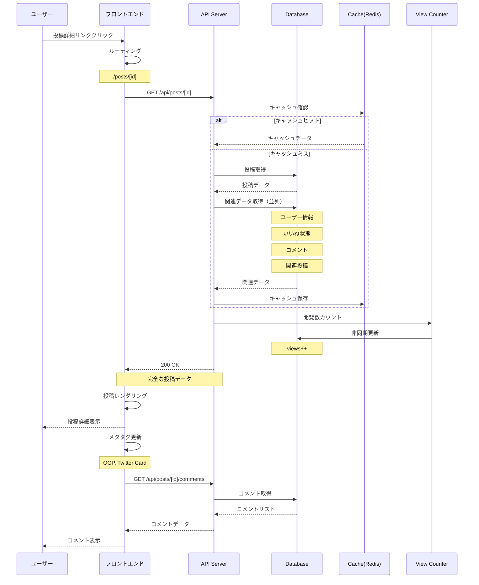
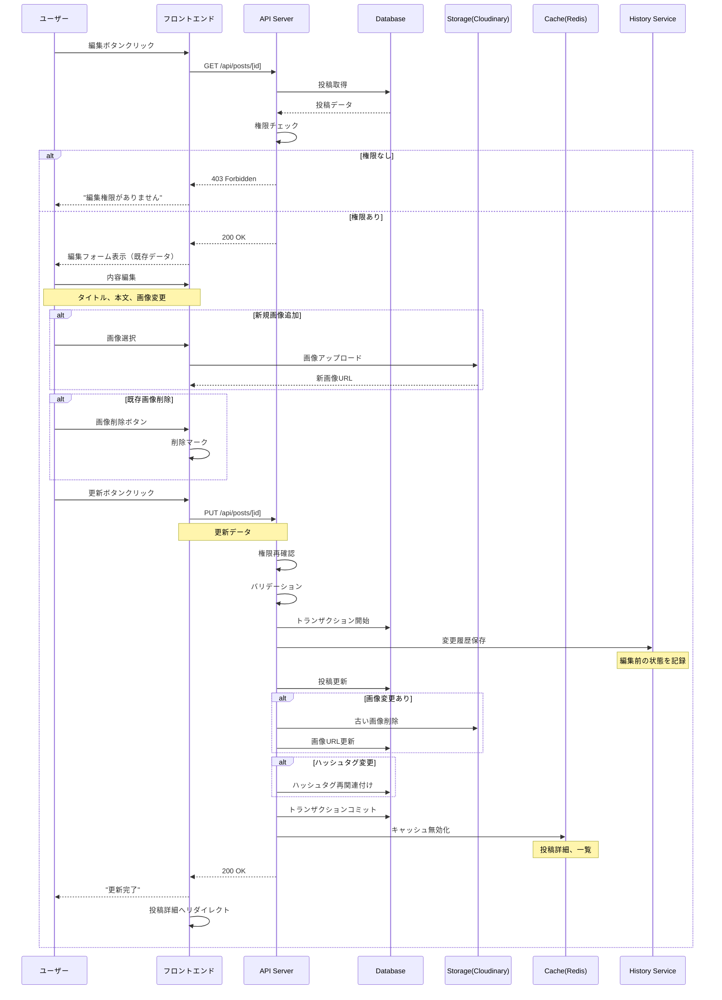
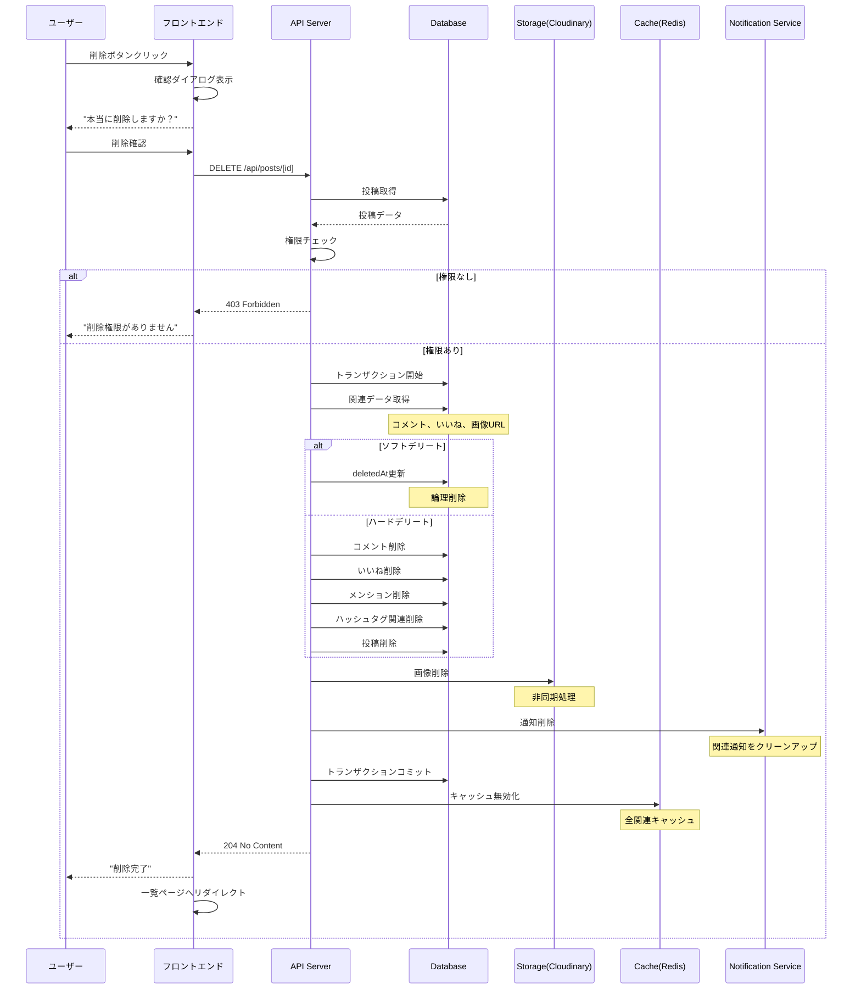
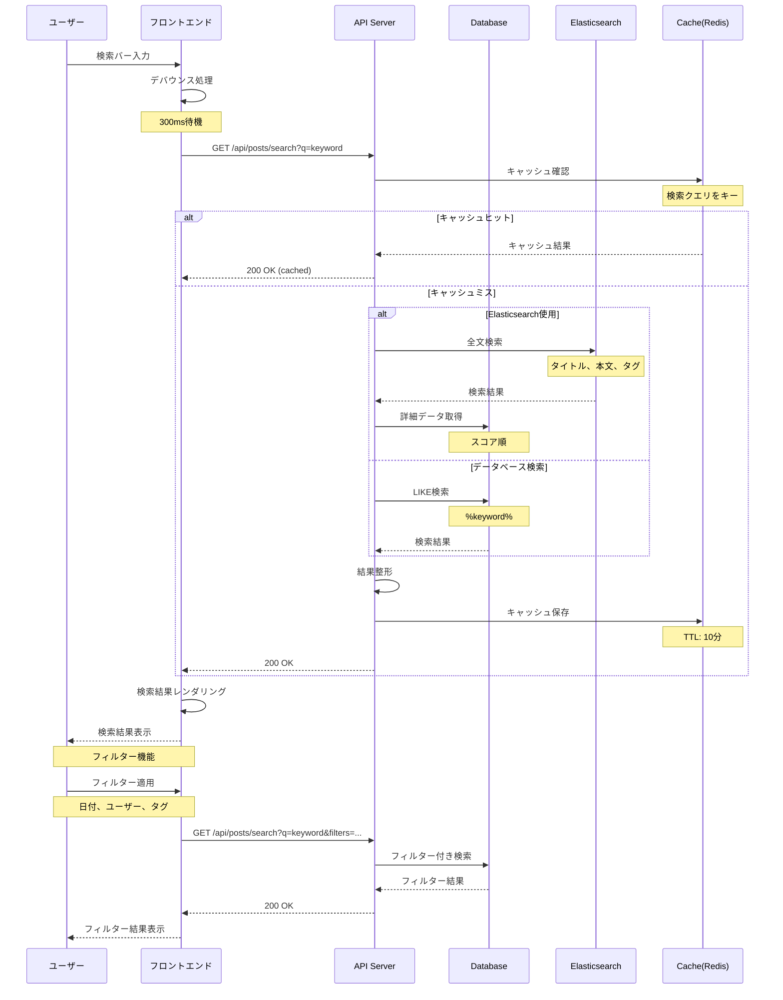
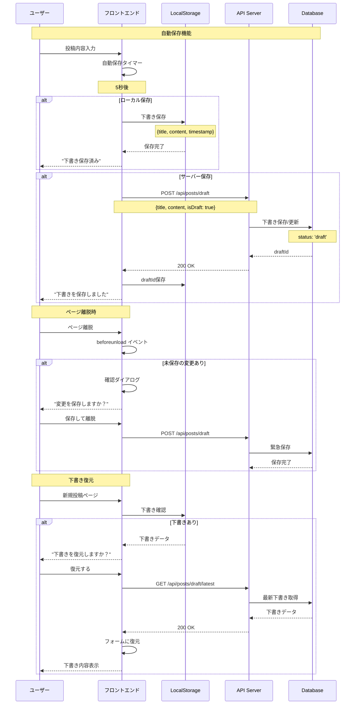
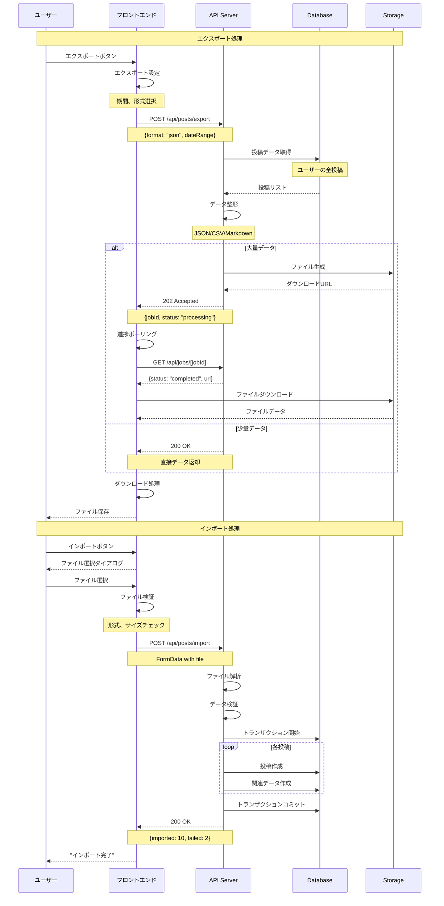

# 投稿機能シーケンス図

## 新規投稿作成

```mermaid
sequenceDiagram
    participant U as ユーザー
    participant F as フロントエンド
    participant A as API Server
    participant D as Database
    participant S as Storage(Cloudinary)
    participant C as Cache(Redis)
    participant N as Notification Service
    participant R as Realtime Service

    U->>F: 新規投稿ボタンクリック
    F-->>U: 投稿フォーム表示
    
    U->>F: 投稿内容入力
    Note over U,F: タイトル、本文、画像
    
    alt 画像添付あり
        U->>F: 画像選択
        F->>F: 画像プレビュー生成
        F->>F: 画像圧縮/リサイズ
        Note over F: クライアントサイド最適化
    end
    
    U->>F: ハッシュタグ入力
    F->>F: ハッシュタグ解析
    Note over F: #タグ を自動認識
    
    U->>F: メンション入力
    F->>A: GET /api/users/search/mention
    A->>D: ユーザー検索
    D-->>A: 候補ユーザー
    A-->>F: ユーザーサジェスト
    F-->>U: @メンション候補表示
    
    U->>F: 投稿ボタンクリック
    F->>F: バリデーション
    
    alt 画像アップロード
        F->>S: 画像アップロード
        Note over F,S: Base64 or FormData
        S-->>F: 画像URL
    end
    
    F->>A: POST /api/posts
    Note over F,A: {title, content, images, hashtags, mentions}
    
    A->>A: サニタイゼーション
    Note over A: XSS対策
    
    A->>D: トランザクション開始
    
    A->>D: 投稿作成
    D-->>A: postId
    
    alt ハッシュタグ処理
        A->>D: ハッシュタグ作成/更新
        A->>D: 投稿-ハッシュタグ関連付け
    end
    
    alt メンション処理
        A->>D: メンション作成
        A->>N: 通知作成
        Note over N: メンションされたユーザーへ
    end
    
    A->>D: トランザクションコミット
    
    A->>C: キャッシュ更新
    Note over C: タイムラインキャッシュ無効化
    
    A->>R: リアルタイム通知
    Note over R: WebSocket/SSE
    R-->>F: 新着投稿通知
    
    A-->>F: 201 Created
    Note over A,F: 作成された投稿データ
    
    F-->>U: 投稿完了
    F->>F: 投稿詳細へリダイレクト
```

## 投稿一覧取得（ページネーション）

```mermaid
sequenceDiagram
    participant U as ユーザー
    participant F as フロントエンド
    participant A as API Server
    participant D as Database
    participant C as Cache(Redis)

    U->>F: 投稿一覧ページアクセス
    
    F->>F: 初期ロード状態
    F-->>U: スケルトン表示
    
    F->>A: GET /api/posts?page=1&limit=20
    
    A->>C: キャッシュ確認
    alt キャッシュヒット
        C-->>A: キャッシュデータ
        A-->>F: 200 OK (cached)
    else キャッシュミス
        A->>D: 投稿取得
        Note over D: ORDER BY createdAt DESC
        D-->>A: 投稿リスト
        
        A->>D: 関連データ取得
        Note over D: ユーザー、いいね数、コメント数
        D-->>A: 関連データ
        
        A->>A: データ整形
        
        A->>C: キャッシュ保存
        Note over C: TTL: 5分
        
        A-->>F: 200 OK
    end
    
    F->>F: 投稿レンダリング
    F-->>U: 投稿一覧表示
    
    Note over U,F: 無限スクロール
    
    U->>F: スクロール（最下部到達）
    F->>F: 次ページ判定
    
    alt 次ページあり
        F->>A: GET /api/posts?page=2&limit=20
        A->>D: 次ページ取得
        D-->>A: 投稿リスト
        A-->>F: 200 OK
        F->>F: 追加レンダリング
        F-->>U: 追加投稿表示
    else 全て読み込み済み
        F-->>U: "これ以上投稿はありません"
    end
```

## 投稿詳細取得

```mermaid
sequenceDiagram
    participant U as ユーザー
    participant F as フロントエンド
    participant A as API Server
    participant D as Database
    participant C as Cache(Redis)
    participant V as View Counter

    U->>F: 投稿詳細リンククリック
    F->>F: ルーティング
    Note over F: /posts/[id]
    
    F->>A: GET /api/posts/[id]
    
    A->>C: キャッシュ確認
    alt キャッシュヒット
        C-->>A: キャッシュデータ
    else キャッシュミス
        A->>D: 投稿取得
        D-->>A: 投稿データ
        
        A->>D: 関連データ取得（並列）
        Note over D: ユーザー情報
        Note over D: いいね状態
        Note over D: コメント
        Note over D: 関連投稿
        D-->>A: 関連データ
        
        A->>C: キャッシュ保存
    end
    
    A->>V: 閲覧数カウント
    V->>D: 非同期更新
    Note over D: views++
    
    A-->>F: 200 OK
    Note over A,F: 完全な投稿データ
    
    F->>F: 投稿レンダリング
    F-->>U: 投稿詳細表示
    
    F->>F: メタタグ更新
    Note over F: OGP, Twitter Card
    
    F->>A: GET /api/posts/[id]/comments
    A->>D: コメント取得
    D-->>A: コメントリスト
    A-->>F: コメントデータ
    F-->>U: コメント表示
```

## 投稿更新

```mermaid
sequenceDiagram
    participant U as ユーザー
    participant F as フロントエンド
    participant A as API Server
    participant D as Database
    participant S as Storage(Cloudinary)
    participant C as Cache(Redis)
    participant H as History Service

    U->>F: 編集ボタンクリック
    
    F->>A: GET /api/posts/[id]
    A->>D: 投稿取得
    D-->>A: 投稿データ
    
    A->>A: 権限チェック
    alt 権限なし
        A-->>F: 403 Forbidden
        F-->>U: "編集権限がありません"
    else 権限あり
        A-->>F: 200 OK
        F-->>U: 編集フォーム表示（既存データ）
        
        U->>F: 内容編集
        Note over U,F: タイトル、本文、画像変更
        
        alt 新規画像追加
            U->>F: 画像選択
            F->>S: 画像アップロード
            S-->>F: 新画像URL
        end
        
        alt 既存画像削除
            U->>F: 画像削除ボタン
            F->>F: 削除マーク
        end
        
        U->>F: 更新ボタンクリック
        
        F->>A: PUT /api/posts/[id]
        Note over F,A: 更新データ
        
        A->>A: 権限再確認
        A->>A: バリデーション
        
        A->>D: トランザクション開始
        
        A->>H: 変更履歴保存
        Note over H: 編集前の状態を記録
        
        A->>D: 投稿更新
        
        alt 画像変更あり
            A->>S: 古い画像削除
            A->>D: 画像URL更新
        end
        
        alt ハッシュタグ変更
            A->>D: ハッシュタグ再関連付け
        end
        
        A->>D: トランザクションコミット
        
        A->>C: キャッシュ無効化
        Note over C: 投稿詳細、一覧
        
        A-->>F: 200 OK
        F-->>U: "更新完了"
        F->>F: 投稿詳細へリダイレクト
    end
```

## 投稿削除

```mermaid
sequenceDiagram
    participant U as ユーザー
    participant F as フロントエンド
    participant A as API Server
    participant D as Database
    participant S as Storage(Cloudinary)
    participant C as Cache(Redis)
    participant N as Notification Service

    U->>F: 削除ボタンクリック
    F->>F: 確認ダイアログ表示
    F-->>U: "本当に削除しますか？"
    
    U->>F: 削除確認
    
    F->>A: DELETE /api/posts/[id]
    
    A->>D: 投稿取得
    D-->>A: 投稿データ
    
    A->>A: 権限チェック
    alt 権限なし
        A-->>F: 403 Forbidden
        F-->>U: "削除権限がありません"
    else 権限あり
        A->>D: トランザクション開始
        
        A->>D: 関連データ取得
        Note over D: コメント、いいね、画像URL
        
        alt ソフトデリート
            A->>D: deletedAt更新
            Note over D: 論理削除
        else ハードデリート
            A->>D: コメント削除
            A->>D: いいね削除
            A->>D: メンション削除
            A->>D: ハッシュタグ関連削除
            A->>D: 投稿削除
        end
        
        A->>S: 画像削除
        Note over S: 非同期処理
        
        A->>N: 通知削除
        Note over N: 関連通知をクリーンアップ
        
        A->>D: トランザクションコミット
        
        A->>C: キャッシュ無効化
        Note over C: 全関連キャッシュ
        
        A-->>F: 204 No Content
        F-->>U: "削除完了"
        F->>F: 一覧ページへリダイレクト
    end
```

## 投稿検索

```mermaid
sequenceDiagram
    participant U as ユーザー
    participant F as フロントエンド
    participant A as API Server
    participant D as Database
    participant E as Elasticsearch
    participant C as Cache(Redis)

    U->>F: 検索バー入力
    F->>F: デバウンス処理
    Note over F: 300ms待機
    
    F->>A: GET /api/posts/search?q=keyword
    
    A->>C: キャッシュ確認
    Note over C: 検索クエリをキー
    
    alt キャッシュヒット
        C-->>A: キャッシュ結果
        A-->>F: 200 OK (cached)
    else キャッシュミス
        alt Elasticsearch使用
            A->>E: 全文検索
            Note over E: タイトル、本文、タグ
            E-->>A: 検索結果
            
            A->>D: 詳細データ取得
            Note over D: スコア順
        else データベース検索
            A->>D: LIKE検索
            Note over D: %keyword%
            D-->>A: 検索結果
        end
        
        A->>A: 結果整形
        
        A->>C: キャッシュ保存
        Note over C: TTL: 10分
        
        A-->>F: 200 OK
    end
    
    F->>F: 検索結果レンダリング
    F-->>U: 検索結果表示
    
    Note over U,F: フィルター機能
    
    U->>F: フィルター適用
    Note over U,F: 日付、ユーザー、タグ
    
    F->>A: GET /api/posts/search?q=keyword&filters=...
    A->>D: フィルター付き検索
    D-->>A: フィルター結果
    A-->>F: 200 OK
    F-->>U: フィルター結果表示
```

## 下書き保存

```mermaid
sequenceDiagram
    participant U as ユーザー
    participant F as フロントエンド
    participant L as LocalStorage
    participant A as API Server
    participant D as Database

    Note over U,D: 自動保存機能
    
    U->>F: 投稿内容入力
    
    F->>F: 自動保存タイマー
    Note over F: 5秒後
    
    alt ローカル保存
        F->>L: 下書き保存
        Note over L: {title, content, timestamp}
        L-->>F: 保存完了
        F-->>U: "下書き保存済み"
    end
    
    alt サーバー保存
        F->>A: POST /api/posts/draft
        Note over F,A: {title, content, isDraft: true}
        
        A->>D: 下書き保存/更新
        Note over D: status: 'draft'
        D-->>A: draftId
        
        A-->>F: 200 OK
        F->>L: draftId保存
        F-->>U: "下書きを保存しました"
    end
    
    Note over U,F: ページ離脱時
    
    U->>F: ページ離脱
    F->>F: beforeunload イベント
    
    alt 未保存の変更あり
        F->>F: 確認ダイアログ
        F-->>U: "変更を保存しますか？"
        
        U->>F: 保存して離脱
        F->>A: POST /api/posts/draft
        A->>D: 緊急保存
        D-->>A: 保存完了
    end
    
    Note over U,F: 下書き復元
    
    U->>F: 新規投稿ページ
    F->>L: 下書き確認
    
    alt 下書きあり
        L-->>F: 下書きデータ
        F-->>U: "下書きを復元しますか？"
        
        U->>F: 復元する
        F->>A: GET /api/posts/draft/latest
        A->>D: 最新下書き取得
        D-->>A: 下書きデータ
        A-->>F: 200 OK
        
        F->>F: フォームに復元
        F-->>U: 下書き内容表示
    end
```

## 投稿のエクスポート/インポート

```mermaid
sequenceDiagram
    participant U as ユーザー
    participant F as フロントエンド
    participant A as API Server
    participant D as Database
    participant S as Storage

    Note over U,S: エクスポート処理
    
    U->>F: エクスポートボタン
    F->>F: エクスポート設定
    Note over F: 期間、形式選択
    
    F->>A: POST /api/posts/export
    Note over F,A: {format: "json", dateRange}
    
    A->>D: 投稿データ取得
    Note over D: ユーザーの全投稿
    D-->>A: 投稿リスト
    
    A->>A: データ整形
    Note over A: JSON/CSV/Markdown
    
    alt 大量データ
        A->>S: ファイル生成
        S-->>A: ダウンロードURL
        
        A-->>F: 202 Accepted
        Note over A,F: {jobId, status: "processing"}
        
        F->>F: 進捗ポーリング
        F->>A: GET /api/jobs/[jobId]
        A-->>F: {status: "completed", url}
        
        F->>S: ファイルダウンロード
        S-->>F: ファイルデータ
    else 少量データ
        A-->>F: 200 OK
        Note over A,F: 直接データ返却
    end
    
    F->>F: ダウンロード処理
    F-->>U: ファイル保存
    
    Note over U,S: インポート処理
    
    U->>F: インポートボタン
    F-->>U: ファイル選択ダイアログ
    
    U->>F: ファイル選択
    F->>F: ファイル検証
    Note over F: 形式、サイズチェック
    
    F->>A: POST /api/posts/import
    Note over F,A: FormData with file
    
    A->>A: ファイル解析
    A->>A: データ検証
    
    A->>D: トランザクション開始
    
    loop 各投稿
        A->>D: 投稿作成
        A->>D: 関連データ作成
    end
    
    A->>D: トランザクションコミット
    
    A-->>F: 200 OK
    Note over A,F: {imported: 10, failed: 2}
    
    F-->>U: "インポート完了"
```