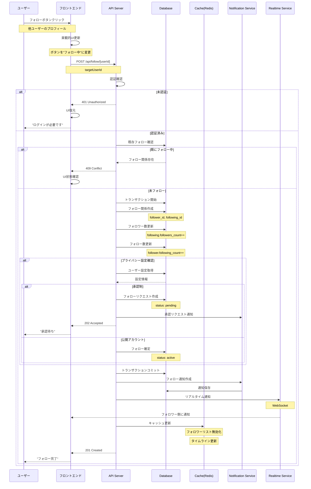
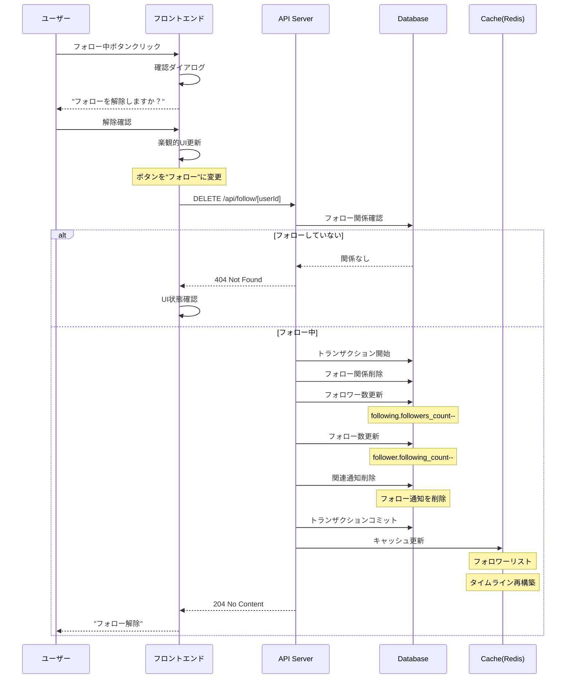
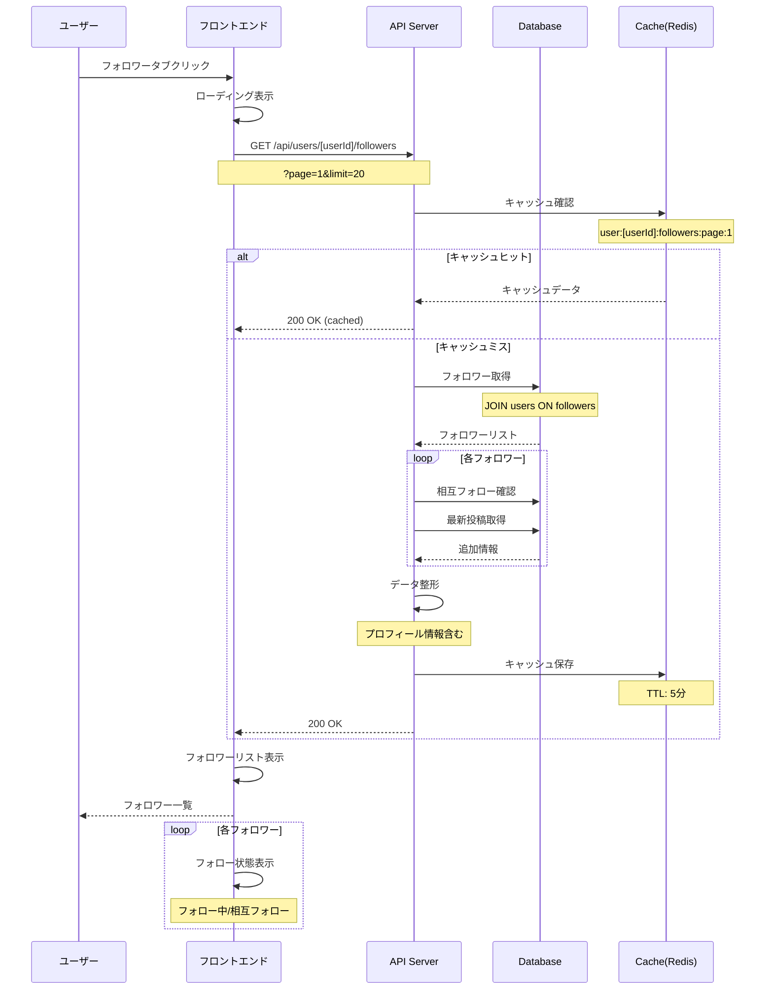
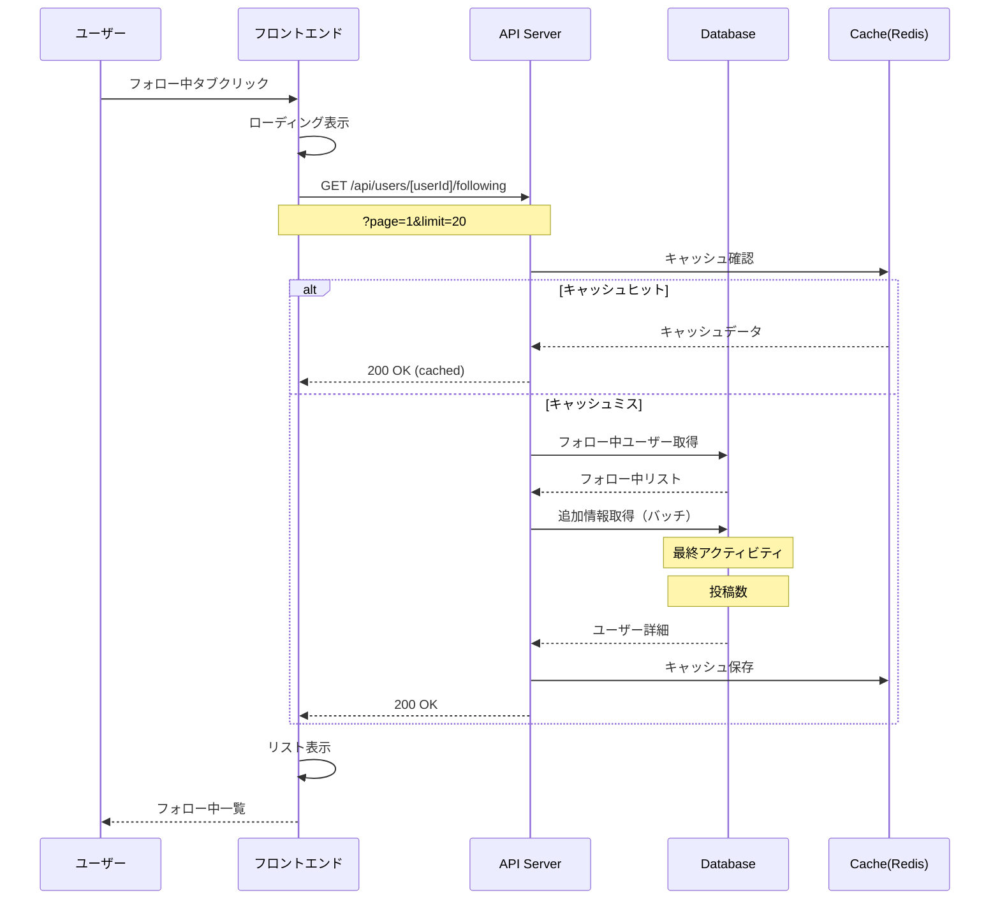
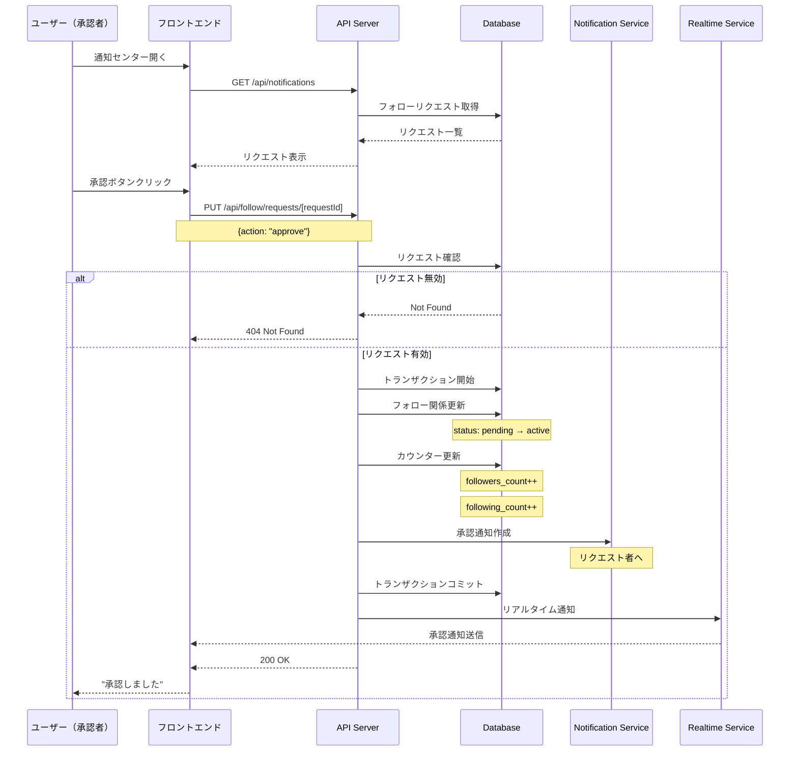
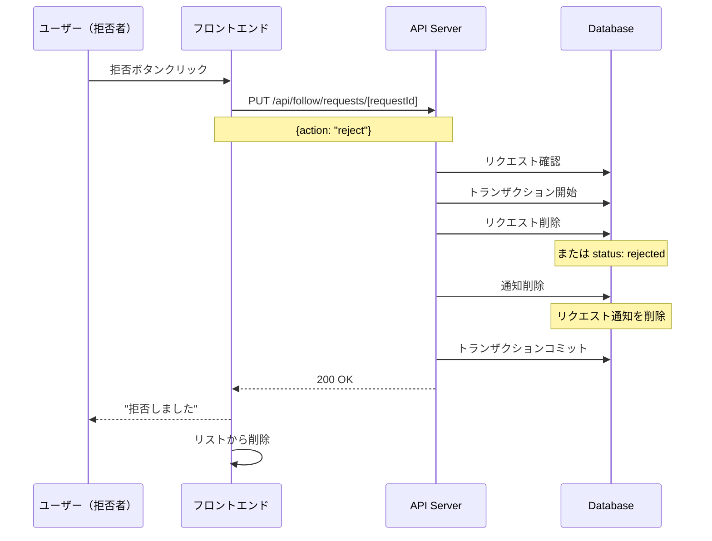
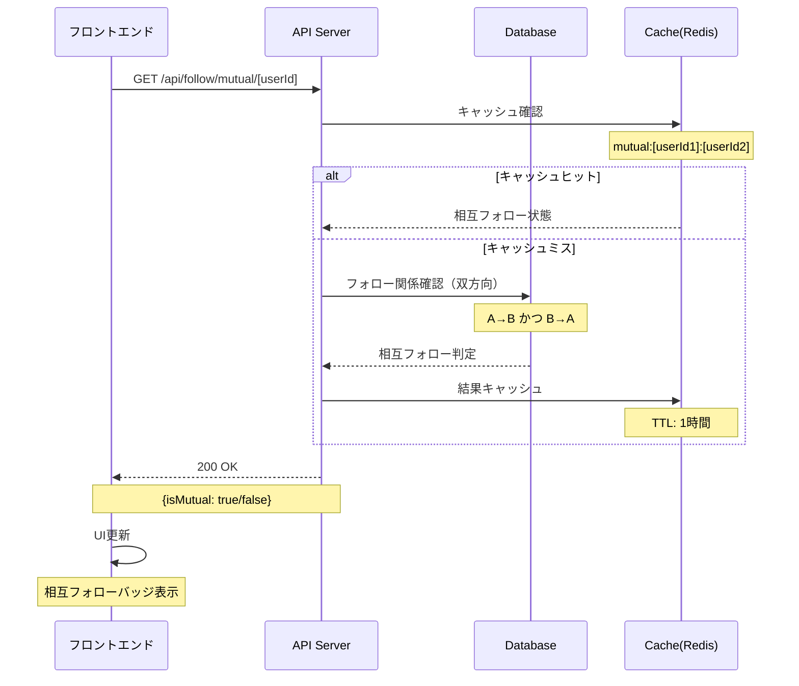
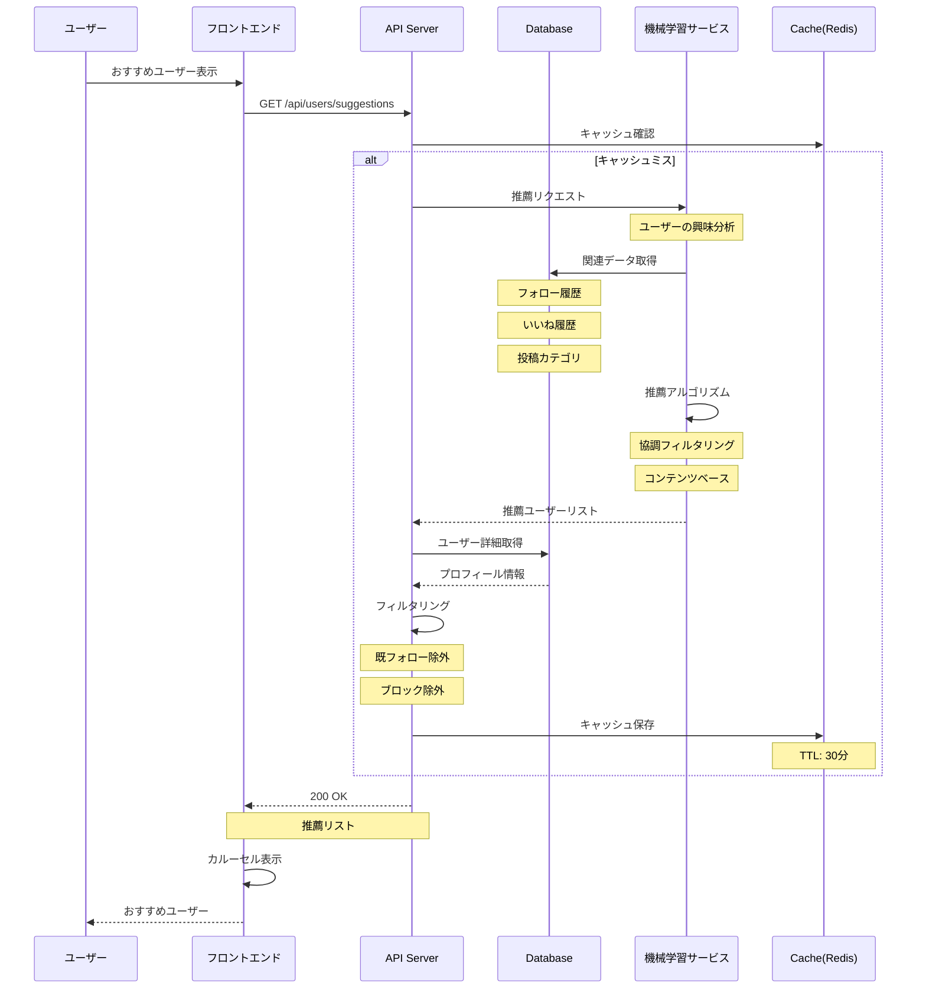
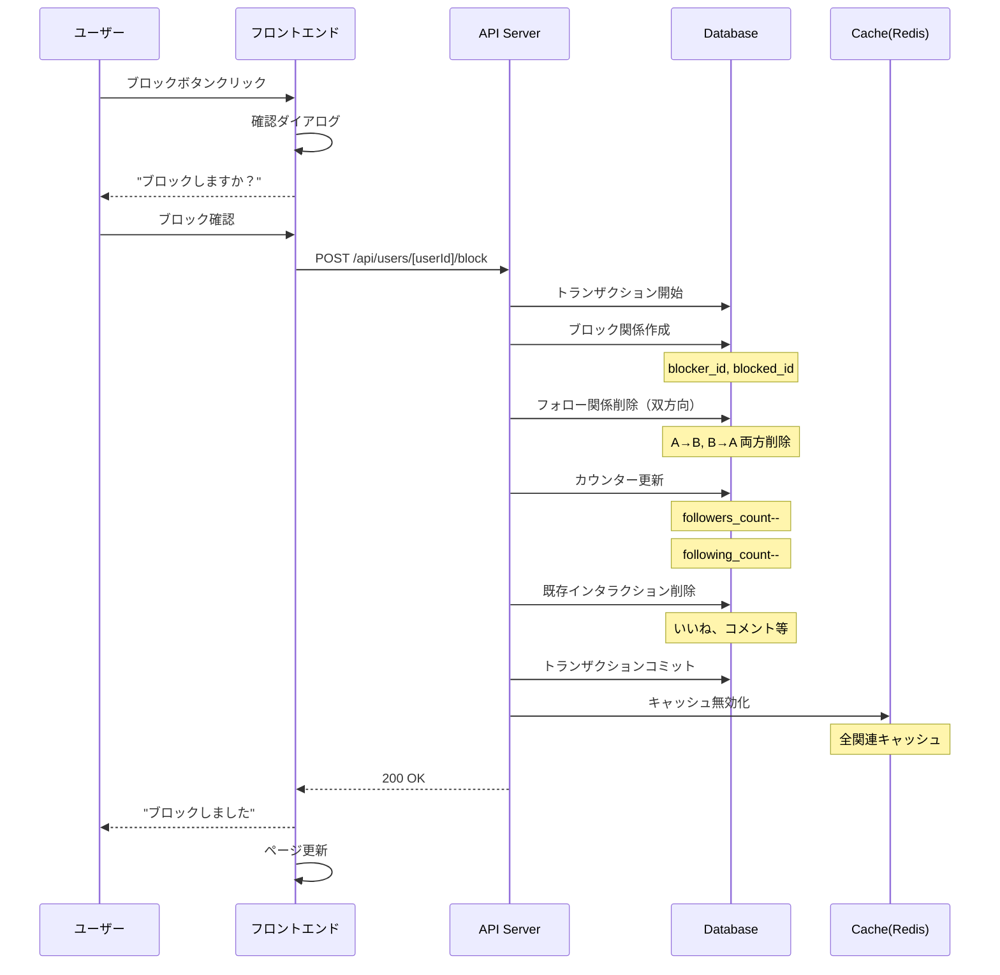
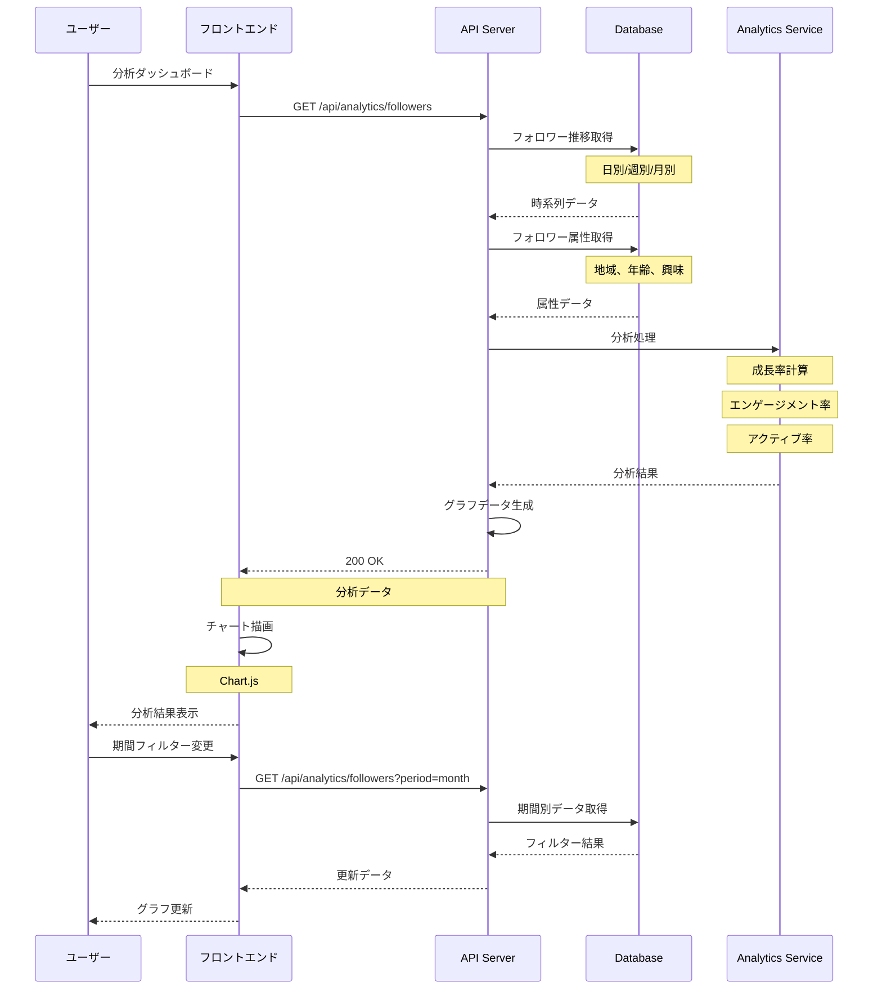

# フォロー機能シーケンス図

## フォロー処理

```mermaid
sequenceDiagram
    participant U as ユーザー
    participant F as フロントエンド
    participant A as API Server
    participant D as Database
    participant C as Cache(Redis)
    participant N as Notification Service
    participant R as Realtime Service

    U->>F: フォローボタンクリック
    Note over U,F: 他ユーザーのプロフィール
    
    F->>F: 楽観的UI更新
    Note over F: ボタンを"フォロー中"に変更
    
    F->>A: POST /api/follow/[userId]
    Note over F,A: targetUserId
    
    A->>A: 認証確認
    alt 未認証
        A-->>F: 401 Unauthorized
        F->>F: UI復元
        F-->>U: "ログインが必要です"
    else 認証済み
        A->>D: 既存フォロー確認
        
        alt 既にフォロー中
            D-->>A: フォロー関係存在
            A-->>F: 409 Conflict
            F->>F: UI状態確認
        else 未フォロー
            A->>D: トランザクション開始
            
            A->>D: フォロー関係作成
            Note over D: follower_id, following_id
            
            A->>D: フォロワー数更新
            Note over D: following.followers_count++
            
            A->>D: フォロー数更新
            Note over D: follower.following_count++
            
            alt プライバシー設定確認
                A->>D: ユーザー設定取得
                D-->>A: 設定情報
                
                alt 承認制
                    A->>D: フォローリクエスト作成
                    Note over D: status: pending
                    A->>N: 承認リクエスト通知
                    A-->>F: 202 Accepted
                    F-->>U: "承認待ち"
                else 公開アカウント
                    A->>D: フォロー確定
                    Note over D: status: active
                end
            end
            
            A->>D: トランザクションコミット
            
            A->>N: フォロー通知作成
            N->>D: 通知保存
            
            A->>R: リアルタイム通知
            Note over R: WebSocket
            R-->>F: フォロワー側に通知
            
            A->>C: キャッシュ更新
            Note over C: フォロワーリスト無効化
            Note over C: タイムライン更新
            
            A-->>F: 201 Created
            F-->>U: "フォロー完了"
        end
    end
```

## アンフォロー処理

```mermaid
sequenceDiagram
    participant U as ユーザー
    participant F as フロントエンド
    participant A as API Server
    participant D as Database
    participant C as Cache(Redis)

    U->>F: フォロー中ボタンクリック
    F->>F: 確認ダイアログ
    F-->>U: "フォローを解除しますか？"
    
    U->>F: 解除確認
    
    F->>F: 楽観的UI更新
    Note over F: ボタンを"フォロー"に変更
    
    F->>A: DELETE /api/follow/[userId]
    
    A->>D: フォロー関係確認
    
    alt フォローしていない
        D-->>A: 関係なし
        A-->>F: 404 Not Found
        F->>F: UI状態確認
    else フォロー中
        A->>D: トランザクション開始
        
        A->>D: フォロー関係削除
        
        A->>D: フォロワー数更新
        Note over D: following.followers_count--
        
        A->>D: フォロー数更新
        Note over D: follower.following_count--
        
        A->>D: 関連通知削除
        Note over D: フォロー通知を削除
        
        A->>D: トランザクションコミット
        
        A->>C: キャッシュ更新
        Note over C: フォロワーリスト
        Note over C: タイムライン再構築
        
        A-->>F: 204 No Content
        F-->>U: "フォロー解除"
    end
```

## フォロワー一覧取得

```mermaid
sequenceDiagram
    participant U as ユーザー
    participant F as フロントエンド
    participant A as API Server
    participant D as Database
    participant C as Cache(Redis)

    U->>F: フォロワータブクリック
    F->>F: ローディング表示
    
    F->>A: GET /api/users/[userId]/followers
    Note over F,A: ?page=1&limit=20
    
    A->>C: キャッシュ確認
    Note over C: user:[userId]:followers:page:1
    
    alt キャッシュヒット
        C-->>A: キャッシュデータ
        A-->>F: 200 OK (cached)
    else キャッシュミス
        A->>D: フォロワー取得
        Note over D: JOIN users ON followers
        D-->>A: フォロワーリスト
        
        loop 各フォロワー
            A->>D: 相互フォロー確認
            A->>D: 最新投稿取得
            D-->>A: 追加情報
        end
        
        A->>A: データ整形
        Note over A: プロフィール情報含む
        
        A->>C: キャッシュ保存
        Note over C: TTL: 5分
        
        A-->>F: 200 OK
    end
    
    F->>F: フォロワーリスト表示
    F-->>U: フォロワー一覧
    
    loop 各フォロワー
        F->>F: フォロー状態表示
        Note over F: フォロー中/相互フォロー
    end
```

## フォロー中一覧取得

```mermaid
sequenceDiagram
    participant U as ユーザー
    participant F as フロントエンド
    participant A as API Server
    participant D as Database
    participant C as Cache(Redis)

    U->>F: フォロー中タブクリック
    F->>F: ローディング表示
    
    F->>A: GET /api/users/[userId]/following
    Note over F,A: ?page=1&limit=20
    
    A->>C: キャッシュ確認
    
    alt キャッシュヒット
        C-->>A: キャッシュデータ
        A-->>F: 200 OK (cached)
    else キャッシュミス
        A->>D: フォロー中ユーザー取得
        D-->>A: フォロー中リスト
        
        A->>D: 追加情報取得（バッチ）
        Note over D: 最終アクティビティ
        Note over D: 投稿数
        D-->>A: ユーザー詳細
        
        A->>C: キャッシュ保存
        
        A-->>F: 200 OK
    end
    
    F->>F: リスト表示
    F-->>U: フォロー中一覧
```

## フォローリクエスト承認（承認制アカウント）

```mermaid
sequenceDiagram
    participant U as ユーザー（承認者）
    participant F as フロントエンド
    participant A as API Server
    participant D as Database
    participant N as Notification Service
    participant R as Realtime Service

    U->>F: 通知センター開く
    F->>A: GET /api/notifications
    A->>D: フォローリクエスト取得
    D-->>A: リクエスト一覧
    A-->>F: リクエスト表示
    
    U->>F: 承認ボタンクリック
    
    F->>A: PUT /api/follow/requests/[requestId]
    Note over F,A: {action: "approve"}
    
    A->>D: リクエスト確認
    
    alt リクエスト無効
        D-->>A: Not Found
        A-->>F: 404 Not Found
    else リクエスト有効
        A->>D: トランザクション開始
        
        A->>D: フォロー関係更新
        Note over D: status: pending → active
        
        A->>D: カウンター更新
        Note over D: followers_count++
        Note over D: following_count++
        
        A->>N: 承認通知作成
        Note over N: リクエスト者へ
        
        A->>D: トランザクションコミット
        
        A->>R: リアルタイム通知
        R-->>F: 承認通知送信
        
        A-->>F: 200 OK
        F-->>U: "承認しました"
    end
```

## フォローリクエスト拒否

```mermaid
sequenceDiagram
    participant U as ユーザー（拒否者）
    participant F as フロントエンド
    participant A as API Server
    participant D as Database

    U->>F: 拒否ボタンクリック
    
    F->>A: PUT /api/follow/requests/[requestId]
    Note over F,A: {action: "reject"}
    
    A->>D: リクエスト確認
    
    A->>D: トランザクション開始
    
    A->>D: リクエスト削除
    Note over D: または status: rejected
    
    A->>D: 通知削除
    Note over D: リクエスト通知を削除
    
    A->>D: トランザクションコミット
    
    A-->>F: 200 OK
    F-->>U: "拒否しました"
    F->>F: リストから削除
```

## 相互フォロー確認

```mermaid
sequenceDiagram
    participant F as フロントエンド
    participant A as API Server
    participant D as Database
    participant C as Cache(Redis)

    F->>A: GET /api/follow/mutual/[userId]
    
    A->>C: キャッシュ確認
    Note over C: mutual:[userId1]:[userId2]
    
    alt キャッシュヒット
        C-->>A: 相互フォロー状態
    else キャッシュミス
        A->>D: フォロー関係確認（双方向）
        Note over D: A→B かつ B→A
        D-->>A: 相互フォロー判定
        
        A->>C: 結果キャッシュ
        Note over C: TTL: 1時間
    end
    
    A-->>F: 200 OK
    Note over A,F: {isMutual: true/false}
    
    F->>F: UI更新
    Note over F: 相互フォローバッジ表示
```

## フォロー推薦

```mermaid
sequenceDiagram
    participant U as ユーザー
    participant F as フロントエンド
    participant A as API Server
    participant D as Database
    participant ML as 機械学習サービス
    participant C as Cache(Redis)

    U->>F: おすすめユーザー表示
    
    F->>A: GET /api/users/suggestions
    
    A->>C: キャッシュ確認
    
    alt キャッシュミス
        A->>ML: 推薦リクエスト
        Note over ML: ユーザーの興味分析
        
        ML->>D: 関連データ取得
        Note over D: フォロー履歴
        Note over D: いいね履歴
        Note over D: 投稿カテゴリ
        
        ML->>ML: 推薦アルゴリズム
        Note over ML: 協調フィルタリング
        Note over ML: コンテンツベース
        
        ML-->>A: 推薦ユーザーリスト
        
        A->>D: ユーザー詳細取得
        D-->>A: プロフィール情報
        
        A->>A: フィルタリング
        Note over A: 既フォロー除外
        Note over A: ブロック除外
        
        A->>C: キャッシュ保存
        Note over C: TTL: 30分
    end
    
    A-->>F: 200 OK
    Note over A,F: 推薦リスト
    
    F->>F: カルーセル表示
    F-->>U: おすすめユーザー
```

## ブロック処理

```mermaid
sequenceDiagram
    participant U as ユーザー
    participant F as フロントエンド
    participant A as API Server
    participant D as Database
    participant C as Cache(Redis)

    U->>F: ブロックボタンクリック
    F->>F: 確認ダイアログ
    F-->>U: "ブロックしますか？"
    
    U->>F: ブロック確認
    
    F->>A: POST /api/users/[userId]/block
    
    A->>D: トランザクション開始
    
    A->>D: ブロック関係作成
    Note over D: blocker_id, blocked_id
    
    A->>D: フォロー関係削除（双方向）
    Note over D: A→B, B→A 両方削除
    
    A->>D: カウンター更新
    Note over D: followers_count--
    Note over D: following_count--
    
    A->>D: 既存インタラクション削除
    Note over D: いいね、コメント等
    
    A->>D: トランザクションコミット
    
    A->>C: キャッシュ無効化
    Note over C: 全関連キャッシュ
    
    A-->>F: 200 OK
    F-->>U: "ブロックしました"
    F->>F: ページ更新
```

## フォロー/フォロワー分析

```mermaid
sequenceDiagram
    participant U as ユーザー
    participant F as フロントエンド
    participant A as API Server
    participant D as Database
    participant An as Analytics Service

    U->>F: 分析ダッシュボード
    
    F->>A: GET /api/analytics/followers
    
    A->>D: フォロワー推移取得
    Note over D: 日別/週別/月別
    D-->>A: 時系列データ
    
    A->>D: フォロワー属性取得
    Note over D: 地域、年齢、興味
    D-->>A: 属性データ
    
    A->>An: 分析処理
    Note over An: 成長率計算
    Note over An: エンゲージメント率
    Note over An: アクティブ率
    
    An-->>A: 分析結果
    
    A->>A: グラフデータ生成
    
    A-->>F: 200 OK
    Note over A,F: 分析データ
    
    F->>F: チャート描画
    Note over F: Chart.js
    
    F-->>U: 分析結果表示
    
    U->>F: 期間フィルター変更
    F->>A: GET /api/analytics/followers?period=month
    A->>D: 期間別データ取得
    D-->>A: フィルター結果
    A-->>F: 更新データ
    F-->>U: グラフ更新
```