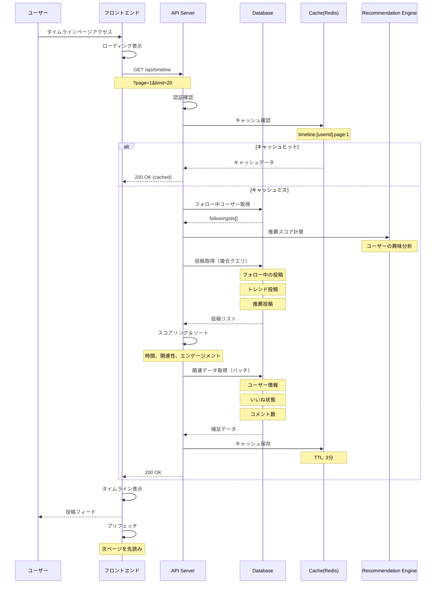
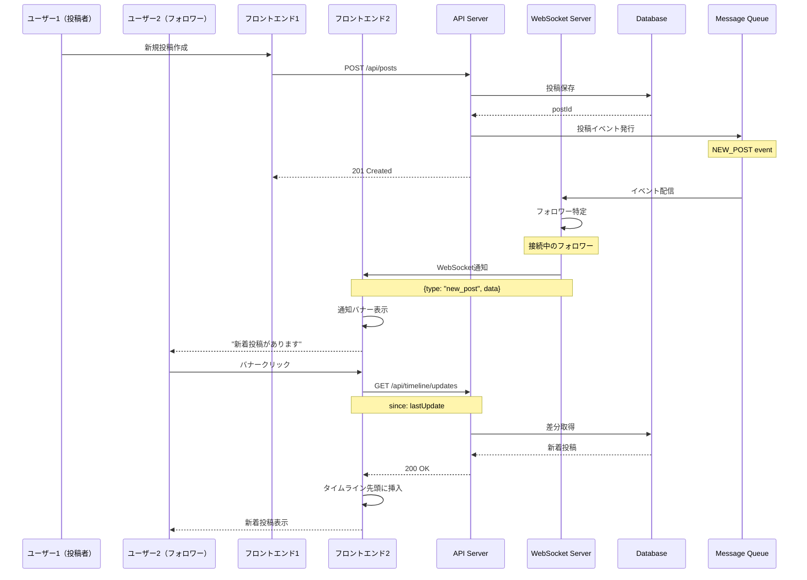
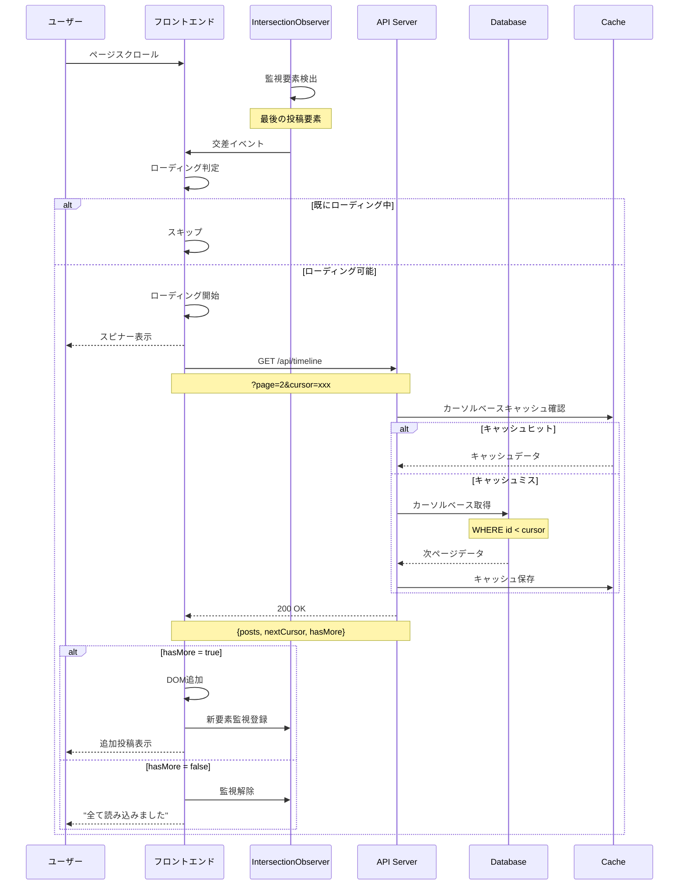
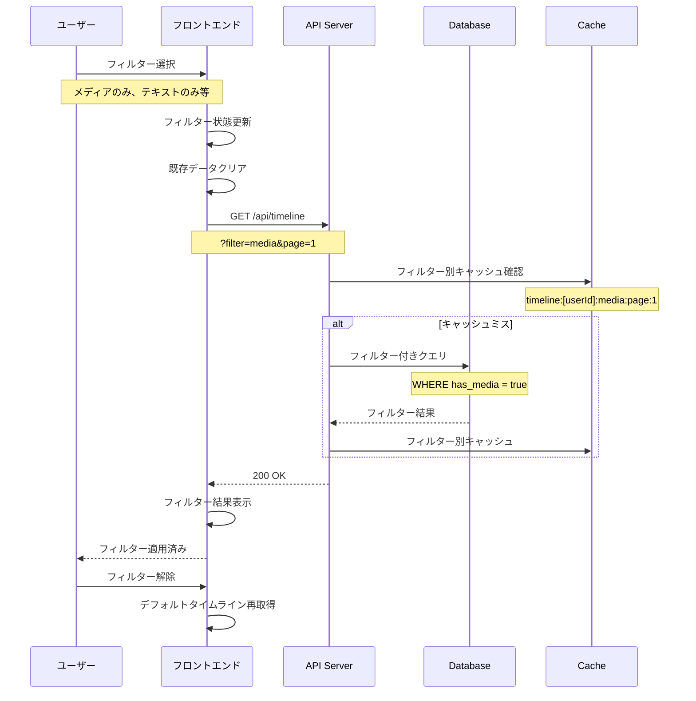
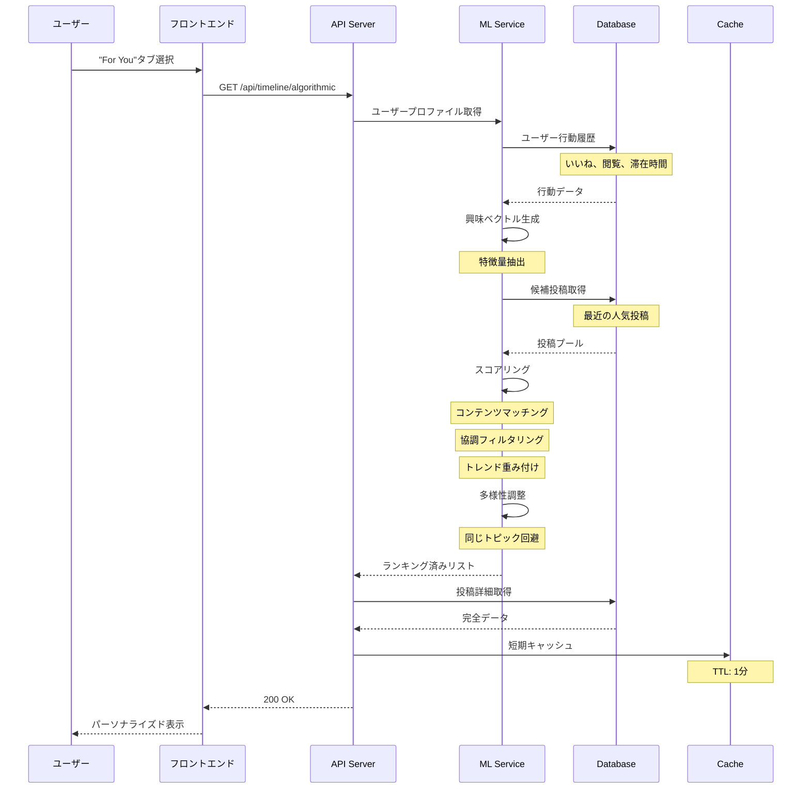
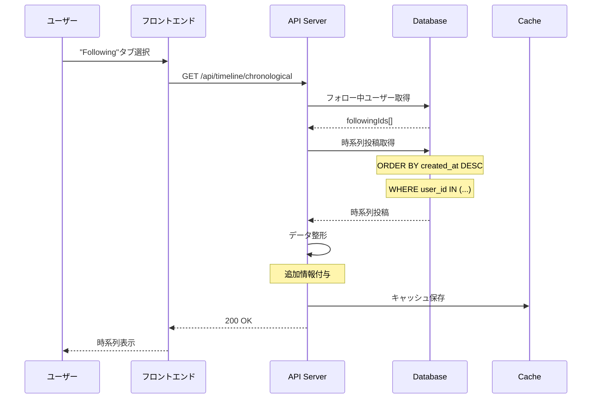
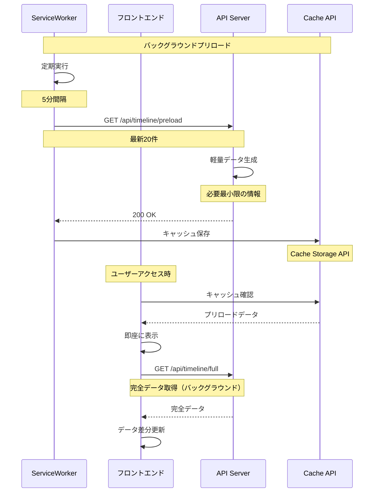
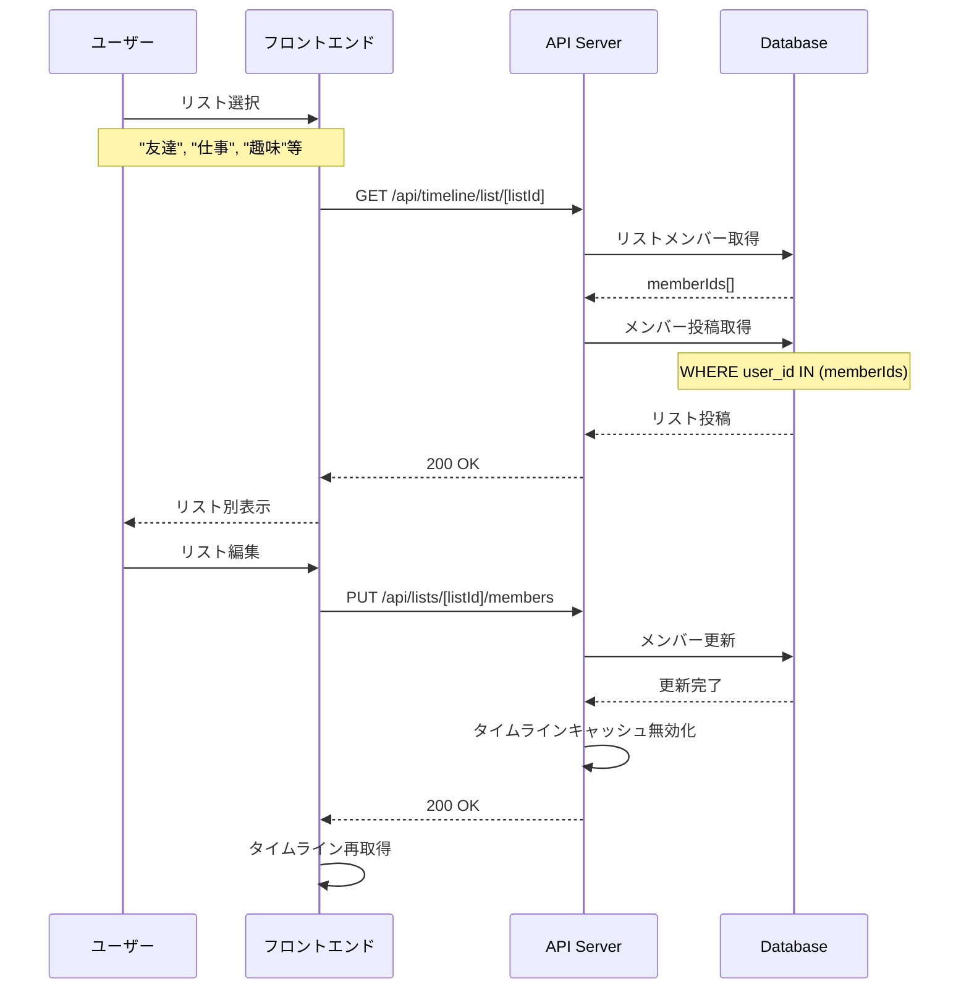
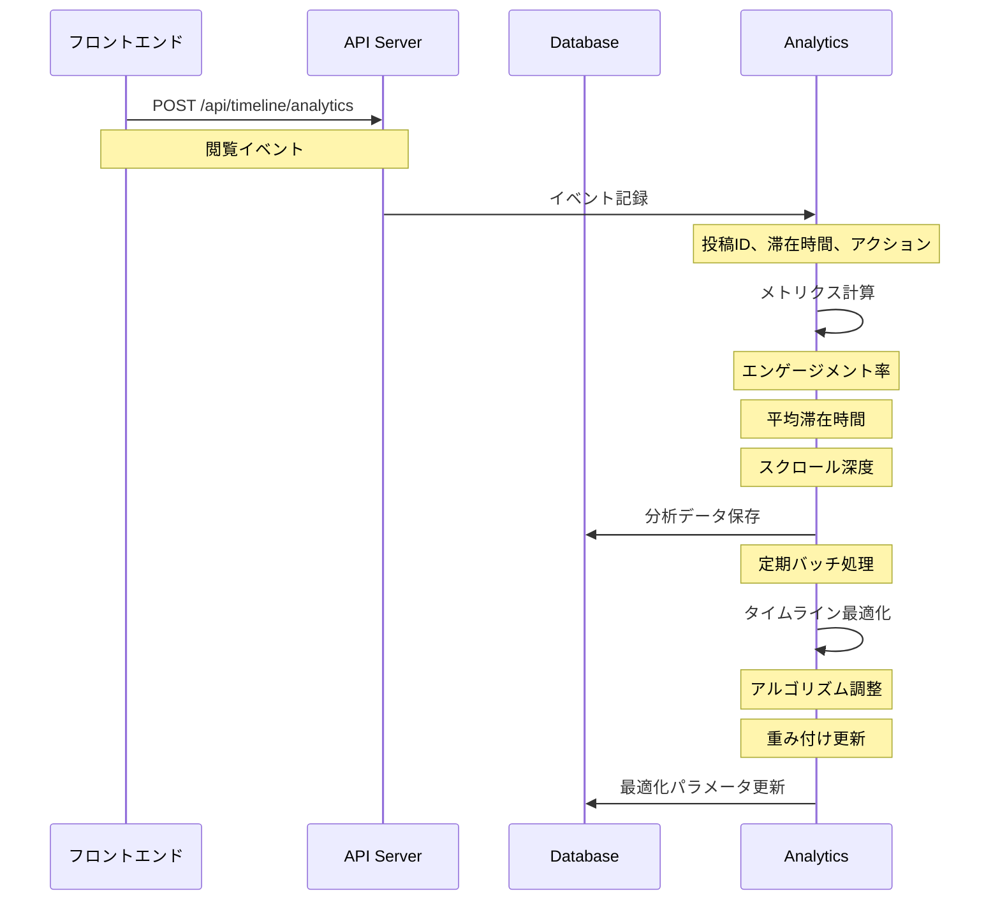
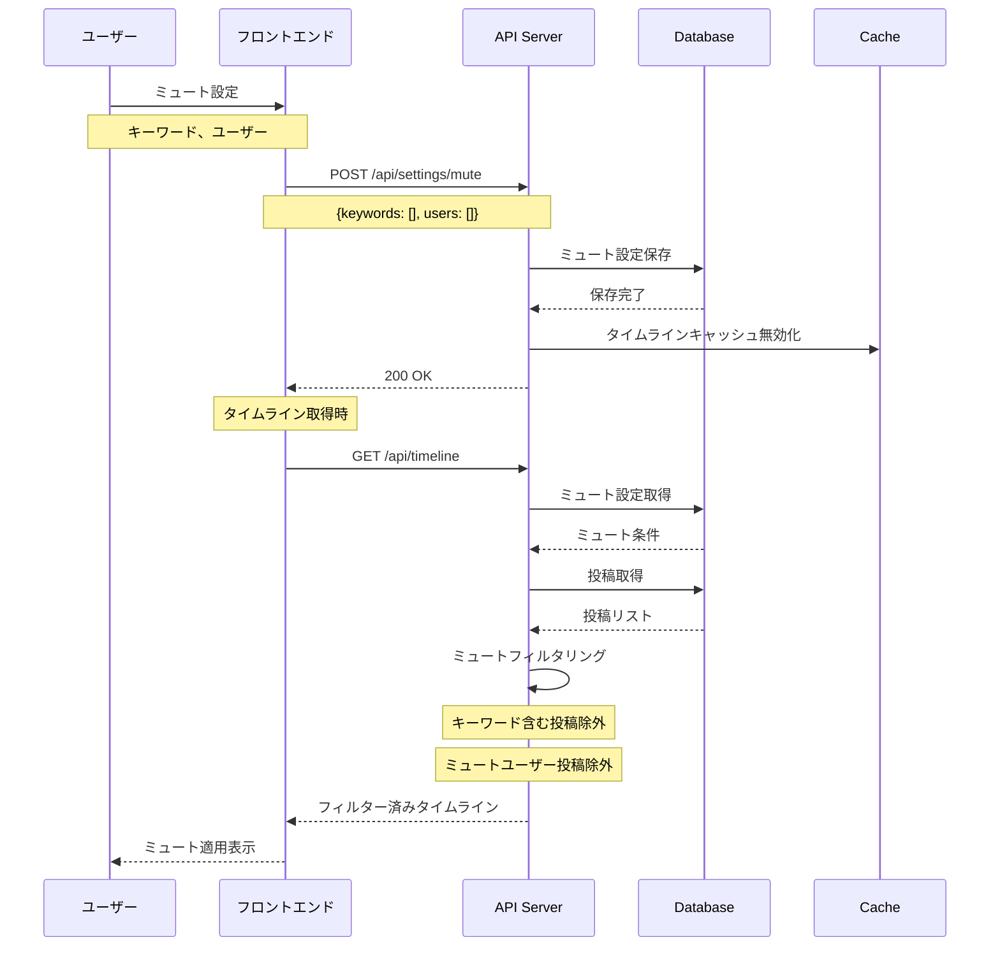

# タイムライン機能シーケンス図

## パーソナライズドタイムライン取得

```mermaid
sequenceDiagram
    participant U as ユーザー
    participant F as フロントエンド
    participant A as API Server
    participant D as Database
    participant C as Cache(Redis)
    participant R as Recommendation Engine

    U->>F: タイムラインページアクセス
    F->>F: ローディング表示
    
    F->>A: GET /api/timeline
    Note over F,A: ?page=1&limit=20
    
    A->>A: 認証確認
    
    A->>C: キャッシュ確認
    Note over C: timeline:[userId]:page:1
    
    alt キャッシュヒット
        C-->>A: キャッシュデータ
        A-->>F: 200 OK (cached)
    else キャッシュミス
        A->>D: フォロー中ユーザー取得
        D-->>A: followingIds[]
        
        A->>R: 推薦スコア計算
        Note over R: ユーザーの興味分析
        
        A->>D: 投稿取得（複合クエリ）
        Note over D: フォロー中の投稿
        Note over D: トレンド投稿
        Note over D: 推薦投稿
        D-->>A: 投稿リスト
        
        A->>A: スコアリング＆ソート
        Note over A: 時間、関連性、エンゲージメント
        
        A->>D: 関連データ取得（バッチ）
        Note over D: ユーザー情報
        Note over D: いいね状態
        Note over D: コメント数
        D-->>A: 補足データ
        
        A->>C: キャッシュ保存
        Note over C: TTL: 3分
        
        A-->>F: 200 OK
    end
    
    F->>F: タイムライン表示
    F-->>U: 投稿フィード
    
    F->>F: プリフェッチ
    Note over F: 次ページを先読み
```

## リアルタイムタイムライン更新

```mermaid
sequenceDiagram
    participant U1 as ユーザー1（投稿者）
    participant U2 as ユーザー2（フォロワー）
    participant F1 as フロントエンド1
    participant F2 as フロントエンド2
    participant A as API Server
    participant W as WebSocket Server
    participant D as Database
    participant Q as Message Queue

    U1->>F1: 新規投稿作成
    F1->>A: POST /api/posts
    
    A->>D: 投稿保存
    D-->>A: postId
    
    A->>Q: 投稿イベント発行
    Note over Q: NEW_POST event
    
    A-->>F1: 201 Created
    
    Q->>W: イベント配信
    
    W->>W: フォロワー特定
    Note over W: 接続中のフォロワー
    
    W->>F2: WebSocket通知
    Note over W,F2: {type: "new_post", data}
    
    F2->>F2: 通知バナー表示
    F2-->>U2: "新着投稿があります"
    
    U2->>F2: バナークリック
    
    F2->>A: GET /api/timeline/updates
    Note over F2,A: since: lastUpdate
    
    A->>D: 差分取得
    D-->>A: 新着投稿
    
    A-->>F2: 200 OK
    F2->>F2: タイムライン先頭に挿入
    F2-->>U2: 新着投稿表示
```

## 無限スクロール実装

```mermaid
sequenceDiagram
    participant U as ユーザー
    participant F as フロントエンド
    participant IO as IntersectionObserver
    participant A as API Server
    participant D as Database
    participant C as Cache

    U->>F: ページスクロール
    
    IO->>IO: 監視要素検出
    Note over IO: 最後の投稿要素
    
    IO->>F: 交差イベント
    
    F->>F: ローディング判定
    alt 既にローディング中
        F->>F: スキップ
    else ローディング可能
        F->>F: ローディング開始
        F-->>U: スピナー表示
        
        F->>A: GET /api/timeline
        Note over F,A: ?page=2&cursor=xxx
        
        A->>C: カーソルベースキャッシュ確認
        
        alt キャッシュヒット
            C-->>A: キャッシュデータ
        else キャッシュミス
            A->>D: カーソルベース取得
            Note over D: WHERE id < cursor
            D-->>A: 次ページデータ
            
            A->>C: キャッシュ保存
        end
        
        A-->>F: 200 OK
        Note over A,F: {posts, nextCursor, hasMore}
        
        alt hasMore = true
            F->>F: DOM追加
            F->>IO: 新要素監視登録
            F-->>U: 追加投稿表示
        else hasMore = false
            F->>IO: 監視解除
            F-->>U: "全て読み込みました"
        end
    end
```

## タイムラインフィルタリング

```mermaid
sequenceDiagram
    participant U as ユーザー
    participant F as フロントエンド
    participant A as API Server
    participant D as Database
    participant C as Cache

    U->>F: フィルター選択
    Note over U,F: メディアのみ、テキストのみ等
    
    F->>F: フィルター状態更新
    F->>F: 既存データクリア
    
    F->>A: GET /api/timeline
    Note over F,A: ?filter=media&page=1
    
    A->>C: フィルター別キャッシュ確認
    Note over C: timeline:[userId]:media:page:1
    
    alt キャッシュミス
        A->>D: フィルター付きクエリ
        Note over D: WHERE has_media = true
        D-->>A: フィルター結果
        
        A->>C: フィルター別キャッシュ
    end
    
    A-->>F: 200 OK
    F->>F: フィルター結果表示
    F-->>U: フィルター適用済み
    
    U->>F: フィルター解除
    F->>F: デフォルトタイムライン再取得
```

## アルゴリズムタイムライン

```mermaid
sequenceDiagram
    participant U as ユーザー
    participant F as フロントエンド
    participant A as API Server
    participant ML as ML Service
    participant D as Database
    participant C as Cache

    U->>F: "For You"タブ選択
    
    F->>A: GET /api/timeline/algorithmic
    
    A->>ML: ユーザープロファイル取得
    ML->>D: ユーザー行動履歴
    Note over D: いいね、閲覧、滞在時間
    D-->>ML: 行動データ
    
    ML->>ML: 興味ベクトル生成
    Note over ML: 特徴量抽出
    
    ML->>D: 候補投稿取得
    Note over D: 最近の人気投稿
    D-->>ML: 投稿プール
    
    ML->>ML: スコアリング
    Note over ML: コンテンツマッチング
    Note over ML: 協調フィルタリング
    Note over ML: トレンド重み付け
    
    ML->>ML: 多様性調整
    Note over ML: 同じトピック回避
    
    ML-->>A: ランキング済みリスト
    
    A->>D: 投稿詳細取得
    D-->>A: 完全データ
    
    A->>C: 短期キャッシュ
    Note over C: TTL: 1分
    
    A-->>F: 200 OK
    F-->>U: パーソナライズド表示
```

## クロノロジカルタイムライン

```mermaid
sequenceDiagram
    participant U as ユーザー
    participant F as フロントエンド
    participant A as API Server
    participant D as Database
    participant C as Cache

    U->>F: "Following"タブ選択
    
    F->>A: GET /api/timeline/chronological
    
    A->>D: フォロー中ユーザー取得
    D-->>A: followingIds[]
    
    A->>D: 時系列投稿取得
    Note over D: ORDER BY created_at DESC
    Note over D: WHERE user_id IN (...)
    D-->>A: 時系列投稿
    
    A->>A: データ整形
    Note over A: 追加情報付与
    
    A->>C: キャッシュ保存
    
    A-->>F: 200 OK
    F-->>U: 時系列表示
```

## タイムラインプリロード

```mermaid
sequenceDiagram
    participant SW as ServiceWorker
    participant F as フロントエンド
    participant A as API Server
    participant C as Cache API

    Note over SW,C: バックグラウンドプリロード
    
    SW->>SW: 定期実行
    Note over SW: 5分間隔
    
    SW->>A: GET /api/timeline/preload
    Note over SW,A: 最新20件
    
    A->>A: 軽量データ生成
    Note over A: 必要最小限の情報
    
    A-->>SW: 200 OK
    
    SW->>C: キャッシュ保存
    Note over C: Cache Storage API
    
    Note over F: ユーザーアクセス時
    
    F->>C: キャッシュ確認
    C-->>F: プリロードデータ
    
    F->>F: 即座に表示
    F->>A: GET /api/timeline/full
    Note over F,A: 完全データ取得（バックグラウンド）
    
    A-->>F: 完全データ
    F->>F: データ差分更新
```

## リスト別タイムライン

```mermaid
sequenceDiagram
    participant U as ユーザー
    participant F as フロントエンド
    participant A as API Server
    participant D as Database

    U->>F: リスト選択
    Note over U,F: "友達", "仕事", "趣味"等
    
    F->>A: GET /api/timeline/list/[listId]
    
    A->>D: リストメンバー取得
    D-->>A: memberIds[]
    
    A->>D: メンバー投稿取得
    Note over D: WHERE user_id IN (memberIds)
    D-->>A: リスト投稿
    
    A-->>F: 200 OK
    F-->>U: リスト別表示
    
    U->>F: リスト編集
    F->>A: PUT /api/lists/[listId]/members
    A->>D: メンバー更新
    D-->>A: 更新完了
    
    A->>A: タイムラインキャッシュ無効化
    A-->>F: 200 OK
    F->>F: タイムライン再取得
```

## タイムライン分析

```mermaid
sequenceDiagram
    participant F as フロントエンド
    participant A as API Server
    participant D as Database
    participant An as Analytics

    F->>A: POST /api/timeline/analytics
    Note over F,A: 閲覧イベント
    
    A->>An: イベント記録
    Note over An: 投稿ID、滞在時間、アクション
    
    An->>An: メトリクス計算
    Note over An: エンゲージメント率
    Note over An: 平均滞在時間
    Note over An: スクロール深度
    
    An->>D: 分析データ保存
    
    Note over An: 定期バッチ処理
    
    An->>An: タイムライン最適化
    Note over An: アルゴリズム調整
    Note over An: 重み付け更新
    
    An->>D: 最適化パラメータ更新
```

## タイムラインのミュート機能

```mermaid
sequenceDiagram
    participant U as ユーザー
    participant F as フロントエンド
    participant A as API Server
    participant D as Database
    participant C as Cache

    U->>F: ミュート設定
    Note over U,F: キーワード、ユーザー
    
    F->>A: POST /api/settings/mute
    Note over F,A: {keywords: [], users: []}
    
    A->>D: ミュート設定保存
    D-->>A: 保存完了
    
    A->>C: タイムラインキャッシュ無効化
    
    A-->>F: 200 OK
    
    Note over F: タイムライン取得時
    
    F->>A: GET /api/timeline
    
    A->>D: ミュート設定取得
    D-->>A: ミュート条件
    
    A->>D: 投稿取得
    D-->>A: 投稿リスト
    
    A->>A: ミュートフィルタリング
    Note over A: キーワード含む投稿除外
    Note over A: ミュートユーザー投稿除外
    
    A-->>F: フィルター済みタイムライン
    F-->>U: ミュート適用表示
```