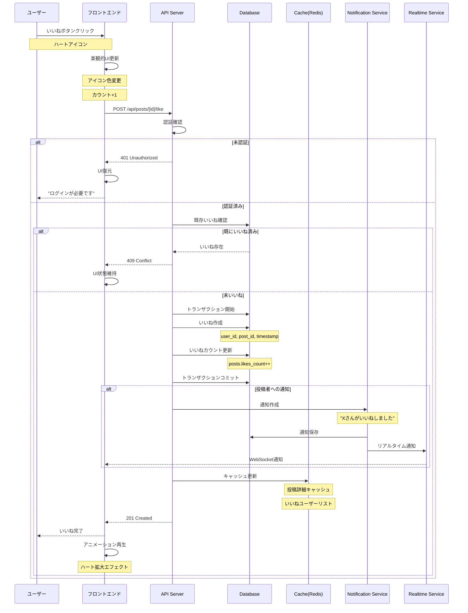
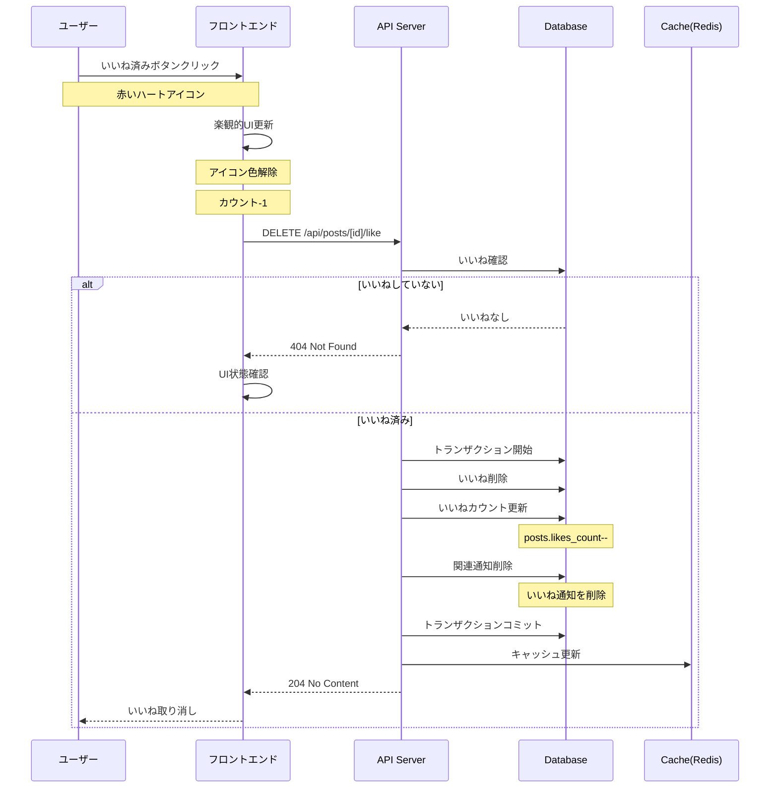
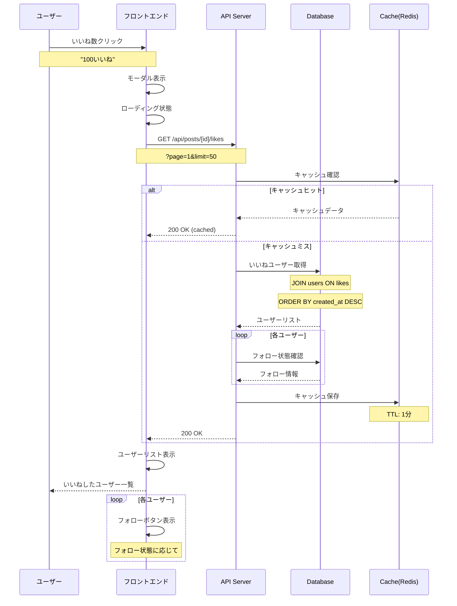
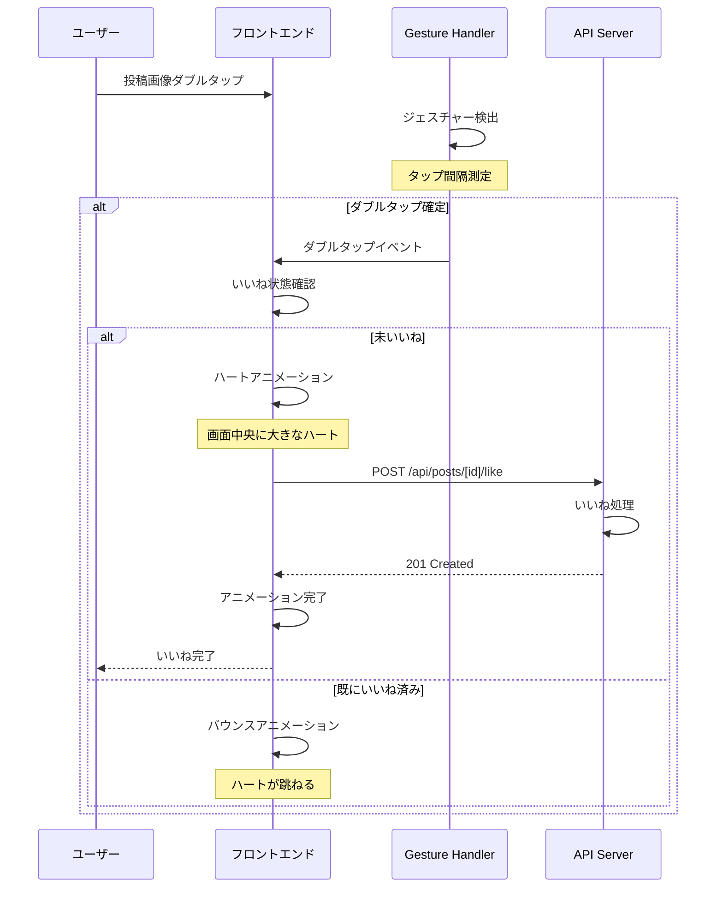
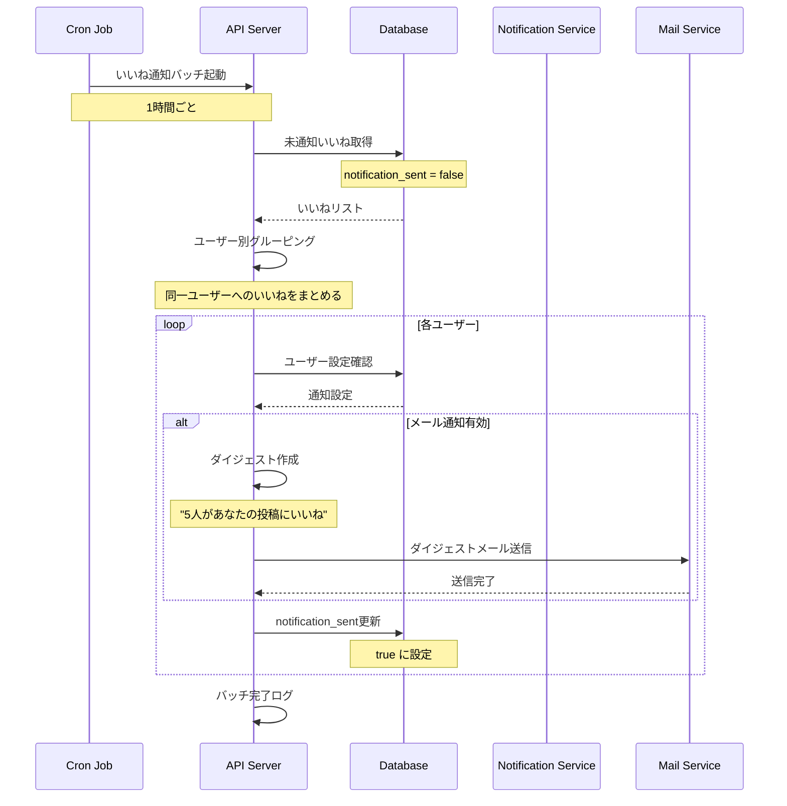
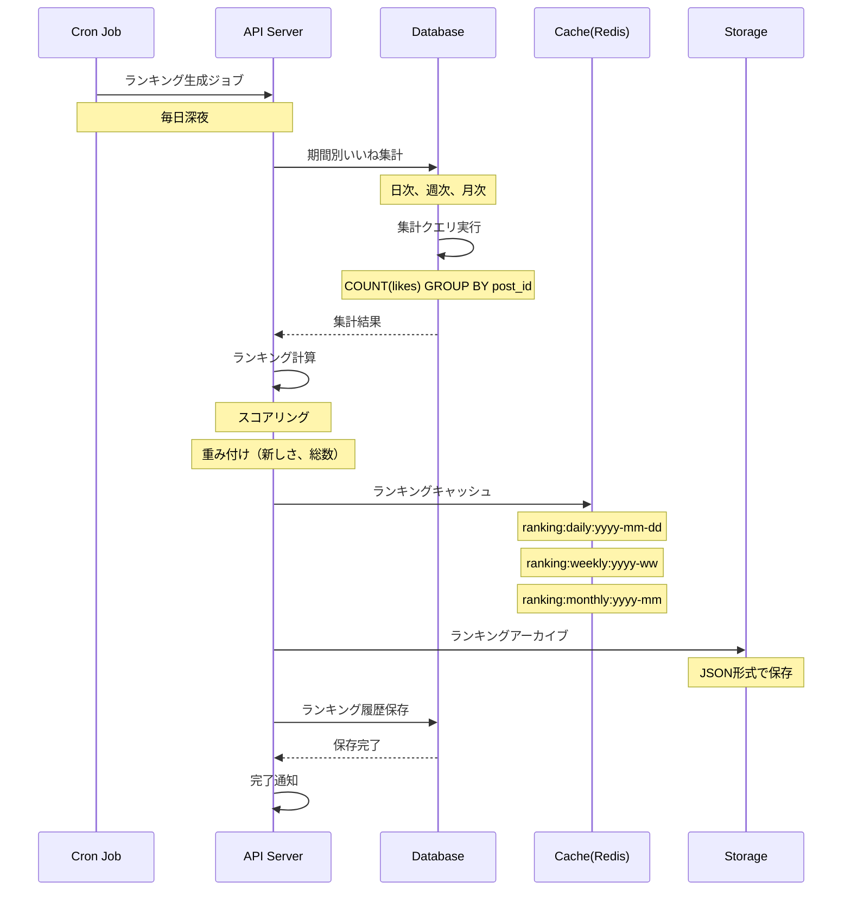
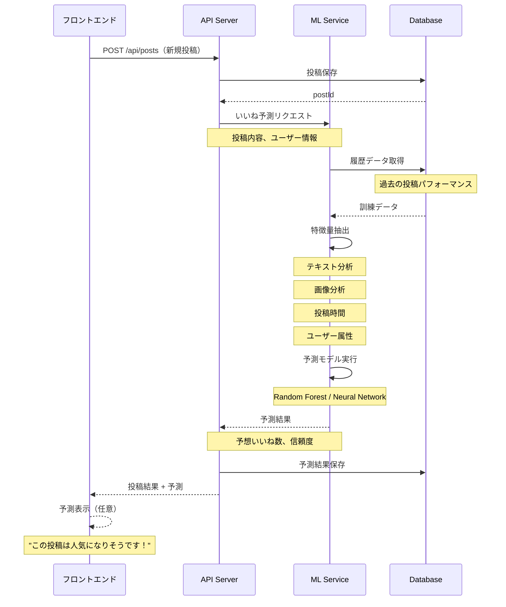
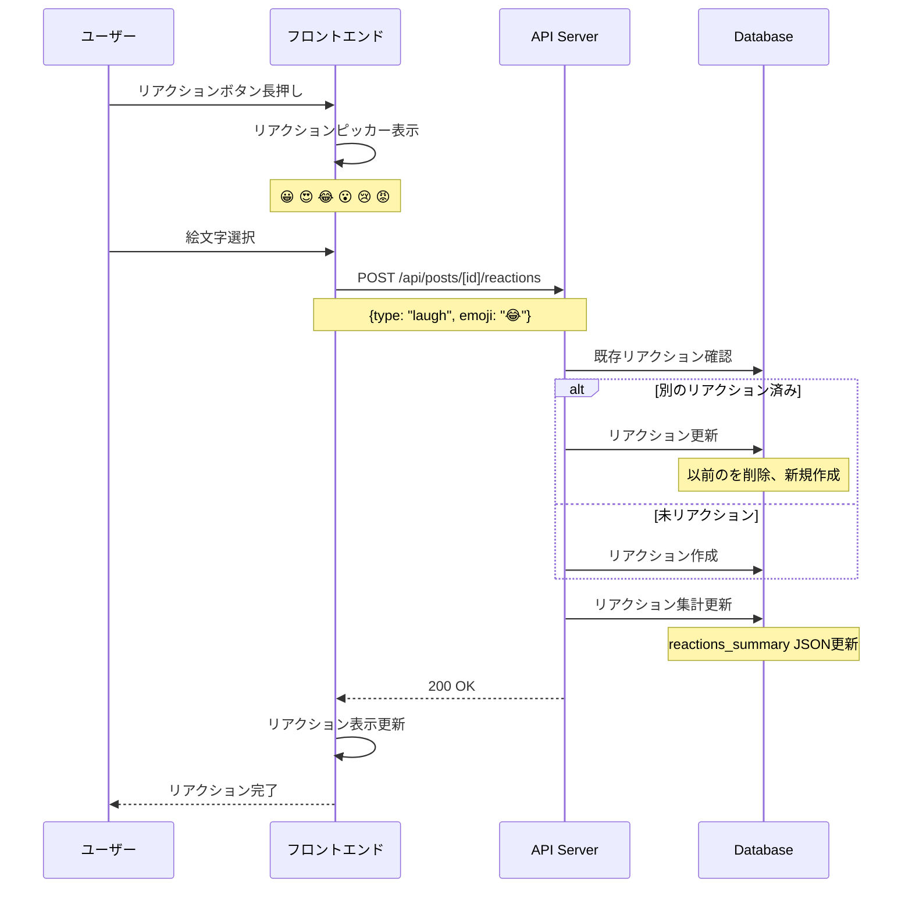
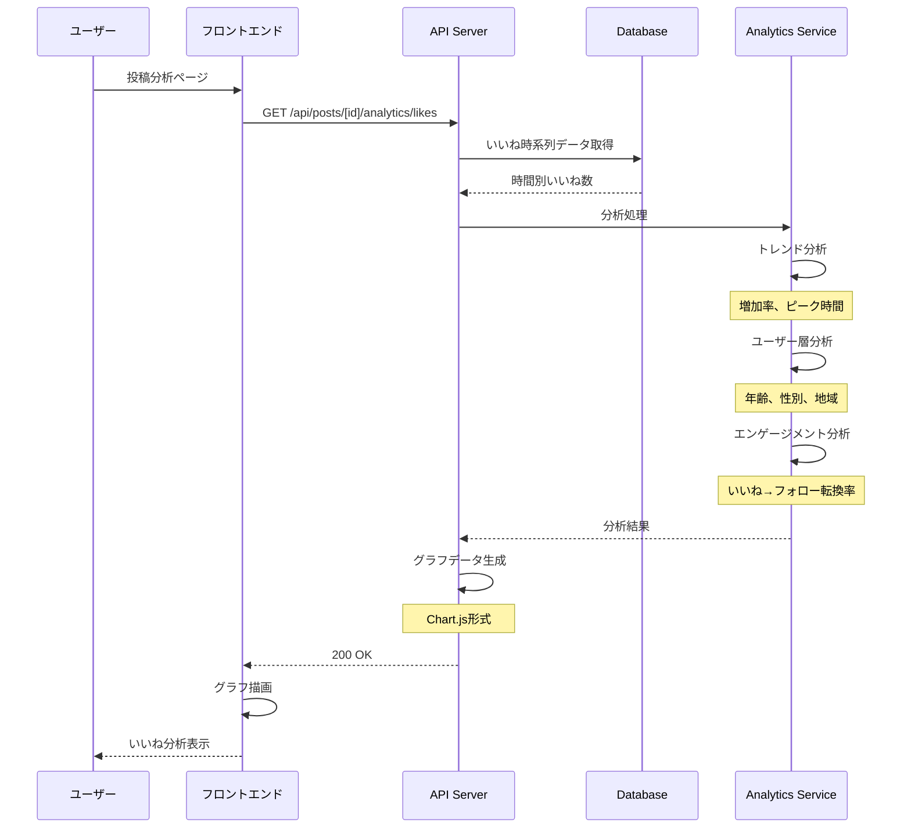
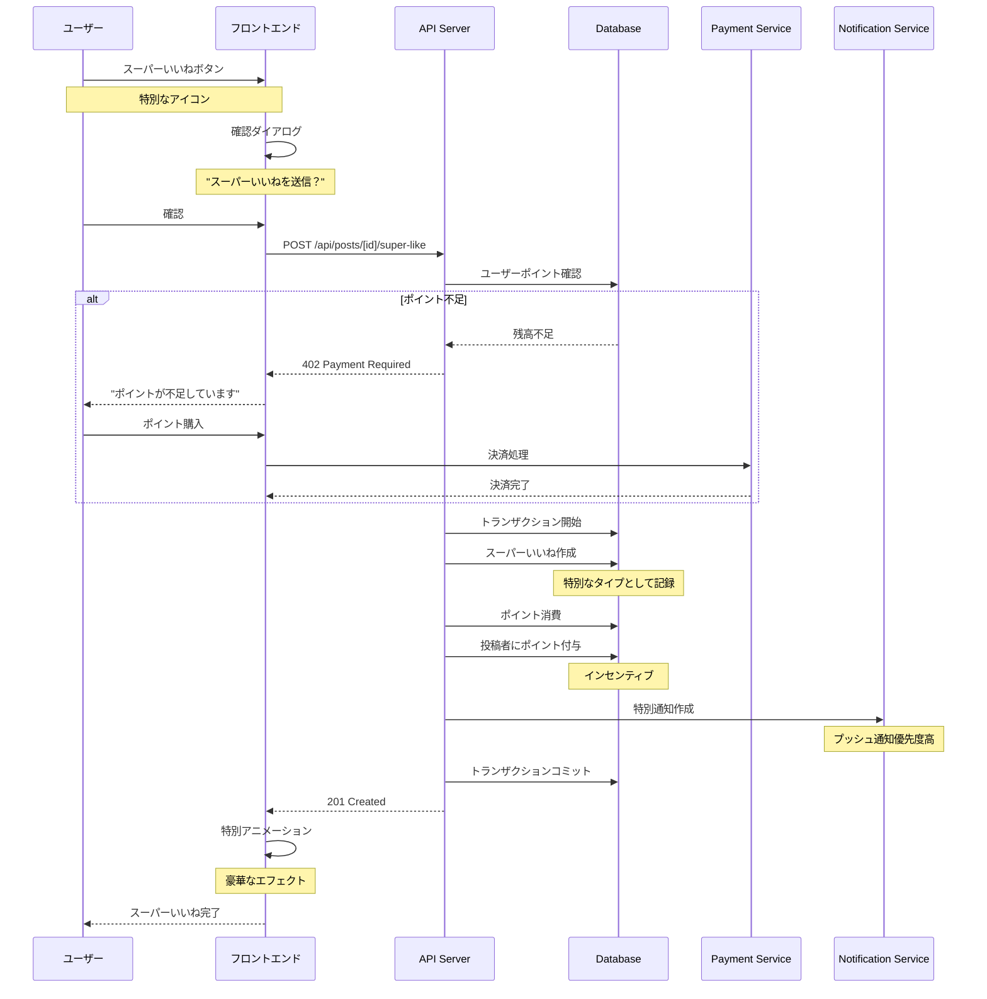

# いいね機能シーケンス図

## いいね追加処理

```mermaid
sequenceDiagram
    participant U as ユーザー
    participant F as フロントエンド
    participant A as API Server
    participant D as Database
    participant C as Cache(Redis)
    participant N as Notification Service
    participant R as Realtime Service

    U->>F: いいねボタンクリック
    Note over U,F: ハートアイコン
    
    F->>F: 楽観的UI更新
    Note over F: アイコン色変更
    Note over F: カウント+1
    
    F->>A: POST /api/posts/[id]/like
    
    A->>A: 認証確認
    alt 未認証
        A-->>F: 401 Unauthorized
        F->>F: UI復元
        F-->>U: "ログインが必要です"
    else 認証済み
        A->>D: 既存いいね確認
        
        alt 既にいいね済み
            D-->>A: いいね存在
            A-->>F: 409 Conflict
            F->>F: UI状態維持
        else 未いいね
            A->>D: トランザクション開始
            
            A->>D: いいね作成
            Note over D: user_id, post_id, timestamp
            
            A->>D: いいねカウント更新
            Note over D: posts.likes_count++
            
            A->>D: トランザクションコミット
            
            alt 投稿者への通知
                A->>N: 通知作成
                Note over N: "Xさんがいいねしました"
                N->>D: 通知保存
                
                N->>R: リアルタイム通知
                R-->>F: WebSocket通知
            end
            
            A->>C: キャッシュ更新
            Note over C: 投稿詳細キャッシュ
            Note over C: いいねユーザーリスト
            
            A-->>F: 201 Created
            F-->>U: いいね完了
            
            F->>F: アニメーション再生
            Note over F: ハート拡大エフェクト
        end
    end
```

## いいね取り消し処理

```mermaid
sequenceDiagram
    participant U as ユーザー
    participant F as フロントエンド
    participant A as API Server
    participant D as Database
    participant C as Cache(Redis)

    U->>F: いいね済みボタンクリック
    Note over U,F: 赤いハートアイコン
    
    F->>F: 楽観的UI更新
    Note over F: アイコン色解除
    Note over F: カウント-1
    
    F->>A: DELETE /api/posts/[id]/like
    
    A->>D: いいね確認
    
    alt いいねしていない
        D-->>A: いいねなし
        A-->>F: 404 Not Found
        F->>F: UI状態確認
    else いいね済み
        A->>D: トランザクション開始
        
        A->>D: いいね削除
        
        A->>D: いいねカウント更新
        Note over D: posts.likes_count--
        
        A->>D: 関連通知削除
        Note over D: いいね通知を削除
        
        A->>D: トランザクションコミット
        
        A->>C: キャッシュ更新
        
        A-->>F: 204 No Content
        F-->>U: いいね取り消し
    end
```

## いいねユーザー一覧取得

```mermaid
sequenceDiagram
    participant U as ユーザー
    participant F as フロントエンド
    participant A as API Server
    participant D as Database
    participant C as Cache(Redis)

    U->>F: いいね数クリック
    Note over U,F: "100いいね"
    
    F->>F: モーダル表示
    F->>F: ローディング状態
    
    F->>A: GET /api/posts/[id]/likes
    Note over F,A: ?page=1&limit=50
    
    A->>C: キャッシュ確認
    
    alt キャッシュヒット
        C-->>A: キャッシュデータ
        A-->>F: 200 OK (cached)
    else キャッシュミス
        A->>D: いいねユーザー取得
        Note over D: JOIN users ON likes
        Note over D: ORDER BY created_at DESC
        D-->>A: ユーザーリスト
        
        loop 各ユーザー
            A->>D: フォロー状態確認
            D-->>A: フォロー情報
        end
        
        A->>C: キャッシュ保存
        Note over C: TTL: 1分
        
        A-->>F: 200 OK
    end
    
    F->>F: ユーザーリスト表示
    F-->>U: いいねしたユーザー一覧
    
    loop 各ユーザー
        F->>F: フォローボタン表示
        Note over F: フォロー状態に応じて
    end
```

## ダブルタップいいね（モバイル）

```mermaid
sequenceDiagram
    participant U as ユーザー
    participant F as フロントエンド
    participant G as Gesture Handler
    participant A as API Server

    U->>F: 投稿画像ダブルタップ
    
    G->>G: ジェスチャー検出
    Note over G: タップ間隔測定
    
    alt ダブルタップ確定
        G->>F: ダブルタップイベント
        
        F->>F: いいね状態確認
        alt 未いいね
            F->>F: ハートアニメーション
            Note over F: 画面中央に大きなハート
            
            F->>A: POST /api/posts/[id]/like
            A->>A: いいね処理
            A-->>F: 201 Created
            
            F->>F: アニメーション完了
            F-->>U: いいね完了
        else 既にいいね済み
            F->>F: バウンスアニメーション
            Note over F: ハートが跳ねる
        end
    end
```

## いいね通知バッチ処理

```mermaid
sequenceDiagram
    participant Cron as Cron Job
    participant A as API Server
    participant D as Database
    participant N as Notification Service
    participant M as Mail Service

    Cron->>A: いいね通知バッチ起動
    Note over Cron,A: 1時間ごと
    
    A->>D: 未通知いいね取得
    Note over D: notification_sent = false
    D-->>A: いいねリスト
    
    A->>A: ユーザー別グルーピング
    Note over A: 同一ユーザーへのいいねをまとめる
    
    loop 各ユーザー
        A->>D: ユーザー設定確認
        D-->>A: 通知設定
        
        alt メール通知有効
            A->>A: ダイジェスト作成
            Note over A: "5人があなたの投稿にいいね"
            
            A->>M: ダイジェストメール送信
            M-->>A: 送信完了
        end
        
        A->>D: notification_sent更新
        Note over D: true に設定
    end
    
    A->>A: バッチ完了ログ
```

## いいねランキング生成

```mermaid
sequenceDiagram
    participant Cron as Cron Job
    participant A as API Server
    participant D as Database
    participant C as Cache(Redis)
    participant S as Storage

    Cron->>A: ランキング生成ジョブ
    Note over Cron,A: 毎日深夜
    
    A->>D: 期間別いいね集計
    Note over D: 日次、週次、月次
    
    D->>D: 集計クエリ実行
    Note over D: COUNT(likes) GROUP BY post_id
    D-->>A: 集計結果
    
    A->>A: ランキング計算
    Note over A: スコアリング
    Note over A: 重み付け（新しさ、総数）
    
    A->>C: ランキングキャッシュ
    Note over C: ranking:daily:yyyy-mm-dd
    Note over C: ranking:weekly:yyyy-ww
    Note over C: ranking:monthly:yyyy-mm
    
    A->>S: ランキングアーカイブ
    Note over S: JSON形式で保存
    
    A->>D: ランキング履歴保存
    D-->>A: 保存完了
    
    A->>A: 完了通知
```

## いいね予測（機械学習）

```mermaid
sequenceDiagram
    participant F as フロントエンド
    participant A as API Server
    participant ML as ML Service
    participant D as Database

    F->>A: POST /api/posts（新規投稿）
    
    A->>D: 投稿保存
    D-->>A: postId
    
    A->>ML: いいね予測リクエスト
    Note over A,ML: 投稿内容、ユーザー情報
    
    ML->>D: 履歴データ取得
    Note over D: 過去の投稿パフォーマンス
    D-->>ML: 訓練データ
    
    ML->>ML: 特徴量抽出
    Note over ML: テキスト分析
    Note over ML: 画像分析
    Note over ML: 投稿時間
    Note over ML: ユーザー属性
    
    ML->>ML: 予測モデル実行
    Note over ML: Random Forest / Neural Network
    
    ML-->>A: 予測結果
    Note over ML,A: 予想いいね数、信頼度
    
    A->>D: 予測結果保存
    
    A-->>F: 投稿結果 + 予測
    F-->>F: 予測表示（任意）
    Note over F: "この投稿は人気になりそうです！"
```

## リアクション拡張（絵文字リアクション）

```mermaid
sequenceDiagram
    participant U as ユーザー
    participant F as フロントエンド
    participant A as API Server
    participant D as Database

    U->>F: リアクションボタン長押し
    F->>F: リアクションピッカー表示
    Note over F: 😀 😍 😂 😮 😢 😡
    
    U->>F: 絵文字選択
    
    F->>A: POST /api/posts/[id]/reactions
    Note over F,A: {type: "laugh", emoji: "😂"}
    
    A->>D: 既存リアクション確認
    
    alt 別のリアクション済み
        A->>D: リアクション更新
        Note over D: 以前のを削除、新規作成
    else 未リアクション
        A->>D: リアクション作成
    end
    
    A->>D: リアクション集計更新
    Note over D: reactions_summary JSON更新
    
    A-->>F: 200 OK
    F->>F: リアクション表示更新
    F-->>U: リアクション完了
```

## いいねアナリティクス

```mermaid
sequenceDiagram
    participant U as ユーザー
    participant F as フロントエンド
    participant A as API Server
    participant D as Database
    participant An as Analytics Service

    U->>F: 投稿分析ページ
    
    F->>A: GET /api/posts/[id]/analytics/likes
    
    A->>D: いいね時系列データ取得
    D-->>A: 時間別いいね数
    
    A->>An: 分析処理
    
    An->>An: トレンド分析
    Note over An: 増加率、ピーク時間
    
    An->>An: ユーザー層分析
    Note over An: 年齢、性別、地域
    
    An->>An: エンゲージメント分析
    Note over An: いいね→フォロー転換率
    
    An-->>A: 分析結果
    
    A->>A: グラフデータ生成
    Note over A: Chart.js形式
    
    A-->>F: 200 OK
    F->>F: グラフ描画
    F-->>U: いいね分析表示
```

## スーパーいいね（特別なリアクション）

```mermaid
sequenceDiagram
    participant U as ユーザー
    participant F as フロントエンド
    participant A as API Server
    participant D as Database
    participant P as Payment Service
    participant N as Notification Service

    U->>F: スーパーいいねボタン
    Note over U,F: 特別なアイコン
    
    F->>F: 確認ダイアログ
    Note over F: "スーパーいいねを送信？"
    
    U->>F: 確認
    
    F->>A: POST /api/posts/[id]/super-like
    
    A->>D: ユーザーポイント確認
    
    alt ポイント不足
        D-->>A: 残高不足
        A-->>F: 402 Payment Required
        F-->>U: "ポイントが不足しています"
        
        U->>F: ポイント購入
        F->>P: 決済処理
        P-->>F: 決済完了
    end
    
    A->>D: トランザクション開始
    
    A->>D: スーパーいいね作成
    Note over D: 特別なタイプとして記録
    
    A->>D: ポイント消費
    
    A->>D: 投稿者にポイント付与
    Note over D: インセンティブ
    
    A->>N: 特別通知作成
    Note over N: プッシュ通知優先度高
    
    A->>D: トランザクションコミット
    
    A-->>F: 201 Created
    F->>F: 特別アニメーション
    Note over F: 豪華なエフェクト
    F-->>U: スーパーいいね完了
```