# コメント機能シーケンス図

## コメント投稿

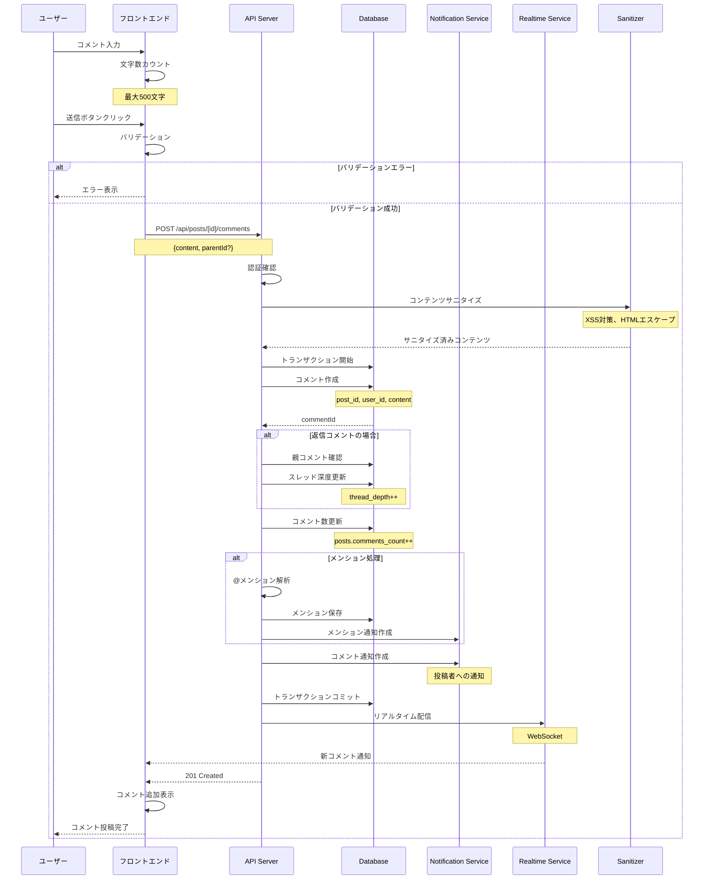
```mermaid
sequenceDiagram
    participant U as ユーザー
    participant F as フロントエンド
    participant A as API Server
    participant D as Database
    participant N as Notification Service
    participant R as Realtime Service
    participant S as Sanitizer

    U->>F: コメント入力
    F->>F: 文字数カウント
    Note over F: 最大500文字
    
    U->>F: 送信ボタンクリック
    
    F->>F: バリデーション
    alt バリデーションエラー
        F-->>U: エラー表示
    else バリデーション成功
        F->>A: POST /api/posts/[id]/comments
        Note over F,A: {content, parentId?}
        
        A->>A: 認証確認
        
        A->>S: コンテンツサニタイズ
        Note over S: XSS対策、HTMLエスケープ
        S-->>A: サニタイズ済みコンテンツ
        
        A->>D: トランザクション開始
        
        A->>D: コメント作成
        Note over D: post_id, user_id, content
        D-->>A: commentId
        
        alt 返信コメントの場合
            A->>D: 親コメント確認
            A->>D: スレッド深度更新
            Note over D: thread_depth++
        end
        
        A->>D: コメント数更新
        Note over D: posts.comments_count++
        
        alt メンション処理
            A->>A: @メンション解析
            A->>D: メンション保存
            A->>N: メンション通知作成
        end
        
        A->>N: コメント通知作成
        Note over N: 投稿者への通知
        
        A->>D: トランザクションコミット
        
        A->>R: リアルタイム配信
        Note over R: WebSocket
        R-->>F: 新コメント通知
        
        A-->>F: 201 Created
        F->>F: コメント追加表示
        F-->>U: コメント投稿完了
    end
```

## コメント一覧取得

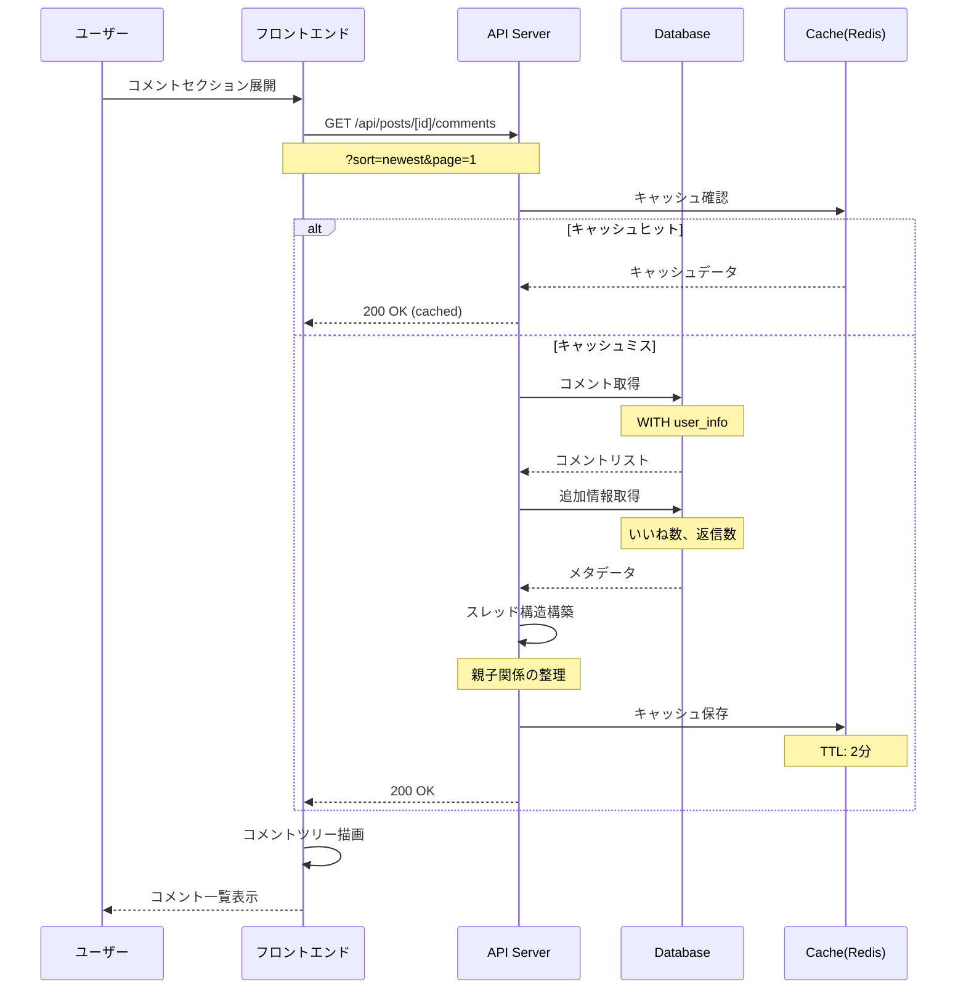
```mermaid
sequenceDiagram
    participant U as ユーザー
    participant F as フロントエンド
    participant A as API Server
    participant D as Database
    participant C as Cache(Redis)

    U->>F: コメントセクション展開
    
    F->>A: GET /api/posts/[id]/comments
    Note over F,A: ?sort=newest&page=1
    
    A->>C: キャッシュ確認
    
    alt キャッシュヒット
        C-->>A: キャッシュデータ
        A-->>F: 200 OK (cached)
    else キャッシュミス
        A->>D: コメント取得
        Note over D: WITH user_info
        D-->>A: コメントリスト
        
        A->>D: 追加情報取得
        Note over D: いいね数、返信数
        D-->>A: メタデータ
        
        A->>A: スレッド構造構築
        Note over A: 親子関係の整理
        
        A->>C: キャッシュ保存
        Note over C: TTL: 2分
        
        A-->>F: 200 OK
    end
    
    F->>F: コメントツリー描画
    F-->>U: コメント一覧表示
```

## コメント返信

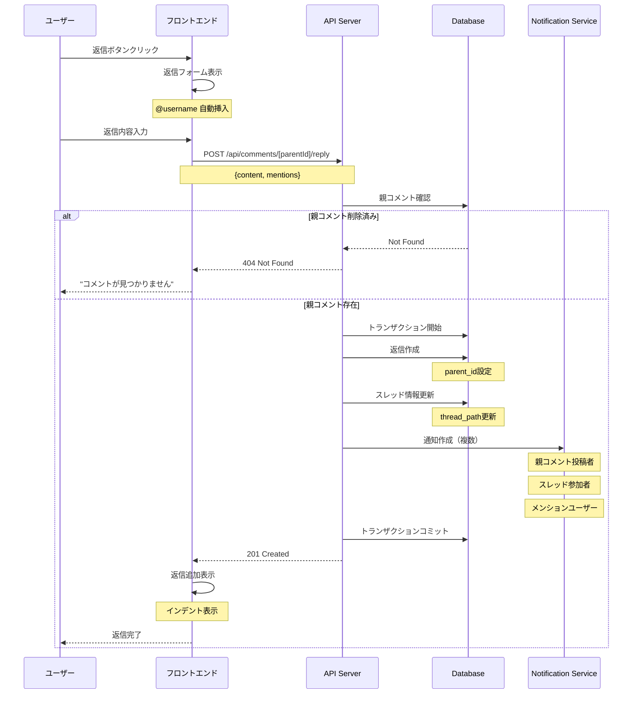
```mermaid
sequenceDiagram
    participant U as ユーザー
    participant F as フロントエンド
    participant A as API Server
    participant D as Database
    participant N as Notification Service

    U->>F: 返信ボタンクリック
    F->>F: 返信フォーム表示
    Note over F: @username 自動挿入
    
    U->>F: 返信内容入力
    
    F->>A: POST /api/comments/[parentId]/reply
    Note over F,A: {content, mentions}
    
    A->>D: 親コメント確認
    
    alt 親コメント削除済み
        D-->>A: Not Found
        A-->>F: 404 Not Found
        F-->>U: "コメントが見つかりません"
    else 親コメント存在
        A->>D: トランザクション開始
        
        A->>D: 返信作成
        Note over D: parent_id設定
        
        A->>D: スレッド情報更新
        Note over D: thread_path更新
        
        A->>N: 通知作成（複数）
        Note over N: 親コメント投稿者
        Note over N: スレッド参加者
        Note over N: メンションユーザー
        
        A->>D: トランザクションコミット
        
        A-->>F: 201 Created
        F->>F: 返信追加表示
        Note over F: インデント表示
        F-->>U: 返信完了
    end
```

## コメント編集

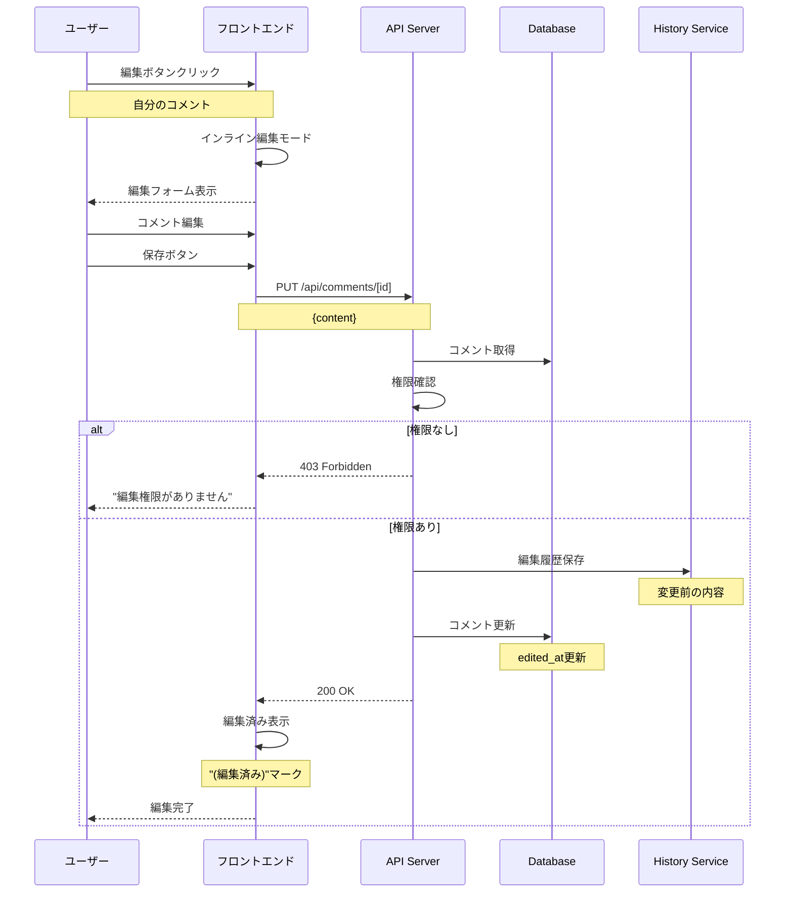
```mermaid
sequenceDiagram
    participant U as ユーザー
    participant F as フロントエンド
    participant A as API Server
    participant D as Database
    participant H as History Service

    U->>F: 編集ボタンクリック
    Note over U,F: 自分のコメント
    
    F->>F: インライン編集モード
    F-->>U: 編集フォーム表示
    
    U->>F: コメント編集
    U->>F: 保存ボタン
    
    F->>A: PUT /api/comments/[id]
    Note over F,A: {content}
    
    A->>D: コメント取得
    A->>A: 権限確認
    
    alt 権限なし
        A-->>F: 403 Forbidden
        F-->>U: "編集権限がありません"
    else 権限あり
        A->>H: 編集履歴保存
        Note over H: 変更前の内容
        
        A->>D: コメント更新
        Note over D: edited_at更新
        
        A-->>F: 200 OK
        F->>F: 編集済み表示
        Note over F: "(編集済み)"マーク
        F-->>U: 編集完了
    end
```

## コメント削除

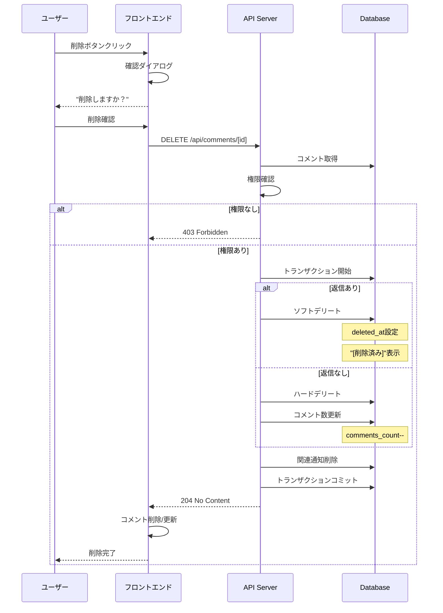
```mermaid
sequenceDiagram
    participant U as ユーザー
    participant F as フロントエンド
    participant A as API Server
    participant D as Database

    U->>F: 削除ボタンクリック
    F->>F: 確認ダイアログ
    F-->>U: "削除しますか？"
    
    U->>F: 削除確認
    
    F->>A: DELETE /api/comments/[id]
    
    A->>D: コメント取得
    A->>A: 権限確認
    
    alt 権限なし
        A-->>F: 403 Forbidden
    else 権限あり
        A->>D: トランザクション開始
        
        alt 返信あり
            A->>D: ソフトデリート
            Note over D: deleted_at設定
            Note over D: "[削除済み]"表示
        else 返信なし
            A->>D: ハードデリート
            A->>D: コメント数更新
            Note over D: comments_count--
        end
        
        A->>D: 関連通知削除
        
        A->>D: トランザクションコミット
        
        A-->>F: 204 No Content
        F->>F: コメント削除/更新
        F-->>U: 削除完了
    end
```

## コメントへのいいね

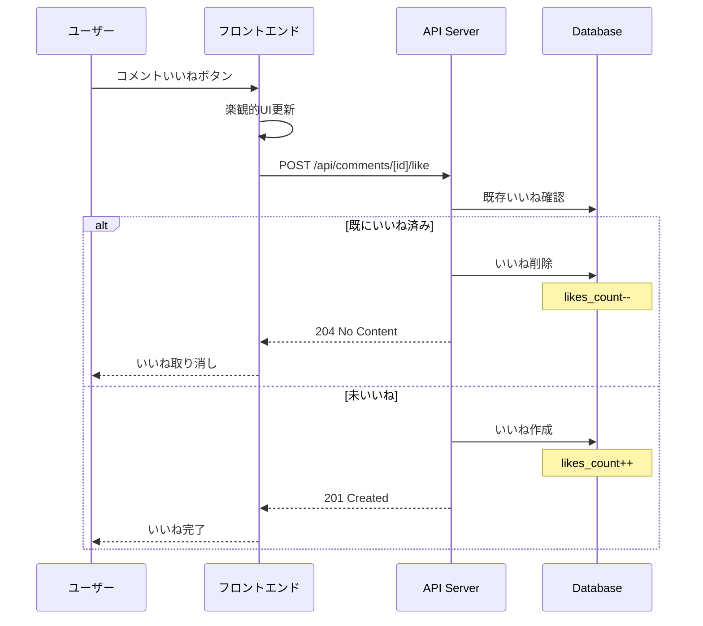
```mermaid
sequenceDiagram
    participant U as ユーザー
    participant F as フロントエンド
    participant A as API Server
    participant D as Database

    U->>F: コメントいいねボタン
    
    F->>F: 楽観的UI更新
    
    F->>A: POST /api/comments/[id]/like
    
    A->>D: 既存いいね確認
    
    alt 既にいいね済み
        A->>D: いいね削除
        Note over D: likes_count--
        A-->>F: 204 No Content
        F-->>U: いいね取り消し
    else 未いいね
        A->>D: いいね作成
        Note over D: likes_count++
        A-->>F: 201 Created
        F-->>U: いいね完了
    end
```

## コメントのモデレーション

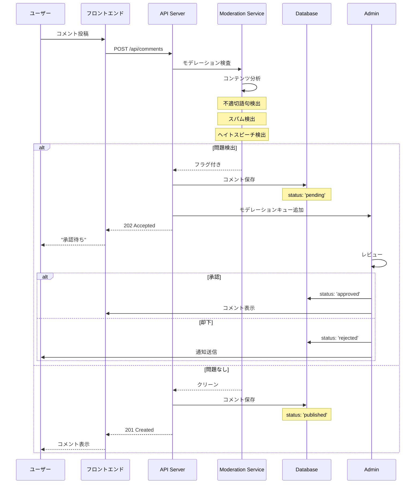
```mermaid
sequenceDiagram
    participant U as ユーザー
    participant F as フロントエンド
    participant A as API Server
    participant M as Moderation Service
    participant D as Database
    participant Ad as Admin

    U->>F: コメント投稿
    F->>A: POST /api/comments
    
    A->>M: モデレーション検査
    
    M->>M: コンテンツ分析
    Note over M: 不適切語句検出
    Note over M: スパム検出
    Note over M: ヘイトスピーチ検出
    
    alt 問題検出
        M-->>A: フラグ付き
        
        A->>D: コメント保存
        Note over D: status: 'pending'
        
        A->>Ad: モデレーションキュー追加
        
        A-->>F: 202 Accepted
        F-->>U: "承認待ち"
        
        Ad->>Ad: レビュー
        alt 承認
            Ad->>D: status: 'approved'
            Ad->>F: コメント表示
        else 却下
            Ad->>D: status: 'rejected'
            Ad->>U: 通知送信
        end
    else 問題なし
        M-->>A: クリーン
        A->>D: コメント保存
        Note over D: status: 'published'
        A-->>F: 201 Created
        F-->>U: コメント表示
    end
```

## リアルタイムコメント更新

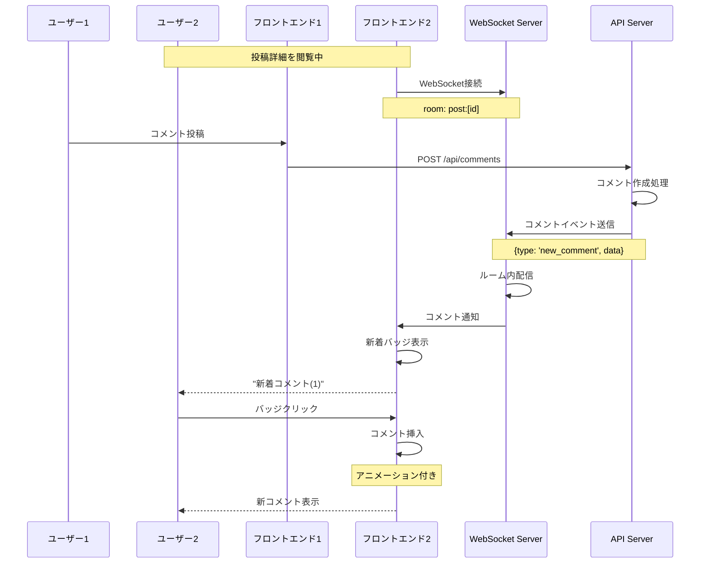
```mermaid
sequenceDiagram
    participant U1 as ユーザー1
    participant U2 as ユーザー2
    participant F1 as フロントエンド1
    participant F2 as フロントエンド2
    participant W as WebSocket Server
    participant A as API Server

    Note over U2,F2: 投稿詳細を閲覧中
    
    F2->>W: WebSocket接続
    Note over F2,W: room: post:[id]
    
    U1->>F1: コメント投稿
    F1->>A: POST /api/comments
    
    A->>A: コメント作成処理
    
    A->>W: コメントイベント送信
    Note over A,W: {type: 'new_comment', data}
    
    W->>W: ルーム内配信
    
    W->>F2: コメント通知
    
    F2->>F2: 新着バッジ表示
    F2-->>U2: "新着コメント(1)"
    
    U2->>F2: バッジクリック
    F2->>F2: コメント挿入
    Note over F2: アニメーション付き
    F2-->>U2: 新コメント表示
```

## コメント検索

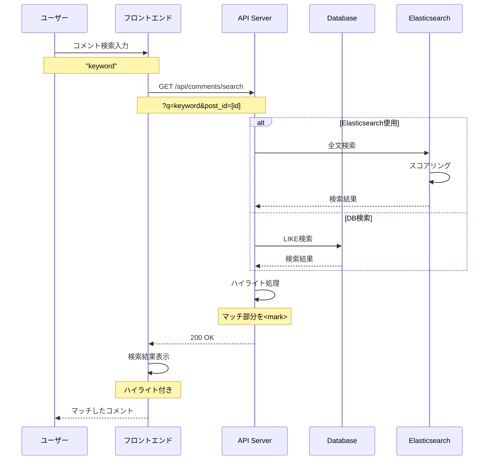
```mermaid
sequenceDiagram
    participant U as ユーザー
    participant F as フロントエンド
    participant A as API Server
    participant D as Database
    participant E as Elasticsearch

    U->>F: コメント検索入力
    Note over U,F: "keyword"
    
    F->>A: GET /api/comments/search
    Note over F,A: ?q=keyword&post_id=[id]
    
    alt Elasticsearch使用
        A->>E: 全文検索
        E->>E: スコアリング
        E-->>A: 検索結果
    else DB検索
        A->>D: LIKE検索
        D-->>A: 検索結果
    end
    
    A->>A: ハイライト処理
    Note over A: マッチ部分を<mark>
    
    A-->>F: 200 OK
    F->>F: 検索結果表示
    Note over F: ハイライト付き
    F-->>U: マッチしたコメント
```

## コメントのエクスポート

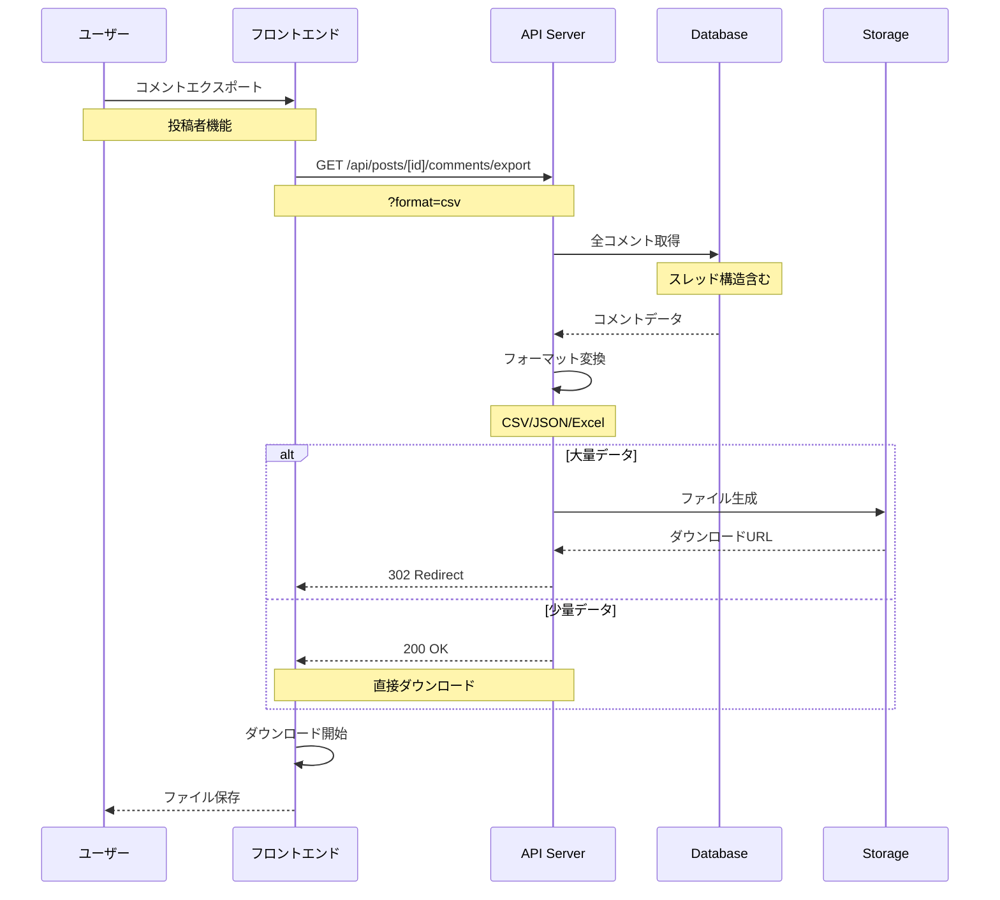
```mermaid
sequenceDiagram
    participant U as ユーザー
    participant F as フロントエンド
    participant A as API Server
    participant D as Database
    participant S as Storage

    U->>F: コメントエクスポート
    Note over U,F: 投稿者機能
    
    F->>A: GET /api/posts/[id]/comments/export
    Note over F,A: ?format=csv
    
    A->>D: 全コメント取得
    Note over D: スレッド構造含む
    D-->>A: コメントデータ
    
    A->>A: フォーマット変換
    Note over A: CSV/JSON/Excel
    
    alt 大量データ
        A->>S: ファイル生成
        S-->>A: ダウンロードURL
        A-->>F: 302 Redirect
    else 少量データ
        A-->>F: 200 OK
        Note over A,F: 直接ダウンロード
    end
    
    F->>F: ダウンロード開始
    F-->>U: ファイル保存
```

## スマートリプライ（AI提案）

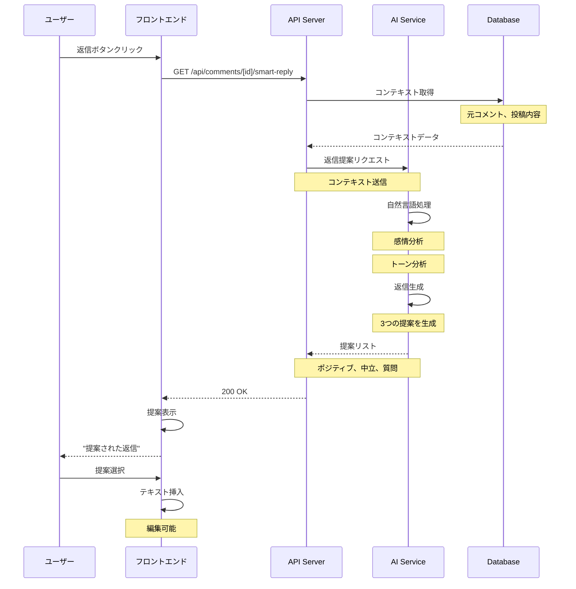
```mermaid
sequenceDiagram
    participant U as ユーザー
    participant F as フロントエンド
    participant A as API Server
    participant AI as AI Service
    participant D as Database

    U->>F: 返信ボタンクリック
    
    F->>A: GET /api/comments/[id]/smart-reply
    
    A->>D: コンテキスト取得
    Note over D: 元コメント、投稿内容
    D-->>A: コンテキストデータ
    
    A->>AI: 返信提案リクエスト
    Note over A,AI: コンテキスト送信
    
    AI->>AI: 自然言語処理
    Note over AI: 感情分析
    Note over AI: トーン分析
    
    AI->>AI: 返信生成
    Note over AI: 3つの提案を生成
    
    AI-->>A: 提案リスト
    Note over AI,A: ポジティブ、中立、質問
    
    A-->>F: 200 OK
    F->>F: 提案表示
    F-->>U: "提案された返信"
    
    U->>F: 提案選択
    F->>F: テキスト挿入
    Note over F: 編集可能
```