# 通知機能シーケンス図

## プッシュ通知購読

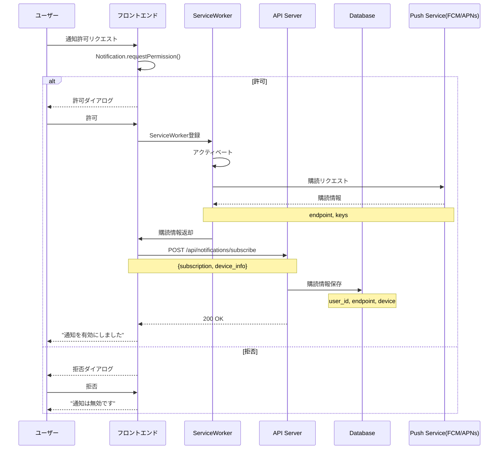
```mermaid
sequenceDiagram
    participant U as ユーザー
    participant F as フロントエンド
    participant SW as ServiceWorker
    participant A as API Server
    participant D as Database
    participant P as Push Service(FCM/APNs)

    U->>F: 通知許可リクエスト
    F->>F: Notification.requestPermission()
    
    alt 許可
        F-->>U: 許可ダイアログ
        U->>F: 許可
        
        F->>SW: ServiceWorker登録
        SW->>SW: アクティベート
        
        SW->>P: 購読リクエスト
        P-->>SW: 購読情報
        Note over P,SW: endpoint, keys
        
        SW->>F: 購読情報返却
        
        F->>A: POST /api/notifications/subscribe
        Note over F,A: {subscription, device_info}
        
        A->>D: 購読情報保存
        Note over D: user_id, endpoint, device
        
        A-->>F: 200 OK
        F-->>U: "通知を有効にしました"
    else 拒否
        F-->>U: 拒否ダイアログ
        U->>F: 拒否
        F-->>U: "通知は無効です"
    end
```

## 通知作成と配信

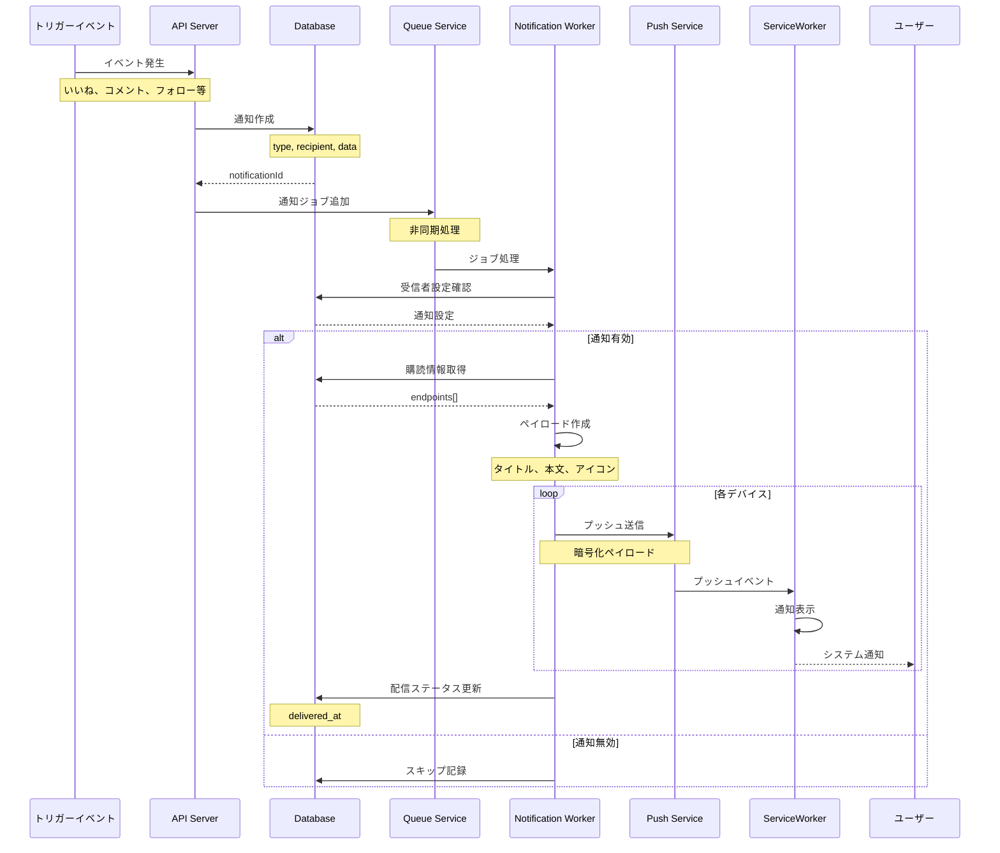
```mermaid
sequenceDiagram
    participant T as トリガーイベント
    participant A as API Server
    participant D as Database
    participant Q as Queue Service
    participant N as Notification Worker
    participant P as Push Service
    participant SW as ServiceWorker
    participant U as ユーザー

    T->>A: イベント発生
    Note over T,A: いいね、コメント、フォロー等
    
    A->>D: 通知作成
    Note over D: type, recipient, data
    D-->>A: notificationId
    
    A->>Q: 通知ジョブ追加
    Note over Q: 非同期処理
    
    Q->>N: ジョブ処理
    
    N->>D: 受信者設定確認
    D-->>N: 通知設定
    
    alt 通知有効
        N->>D: 購読情報取得
        D-->>N: endpoints[]
        
        N->>N: ペイロード作成
        Note over N: タイトル、本文、アイコン
        
        loop 各デバイス
            N->>P: プッシュ送信
            Note over N,P: 暗号化ペイロード
            
            P->>SW: プッシュイベント
            SW->>SW: 通知表示
            SW-->>U: システム通知
        end
        
        N->>D: 配信ステータス更新
        Note over D: delivered_at
    else 通知無効
        N->>D: スキップ記録
    end
```

## リアルタイム通知（SSE）

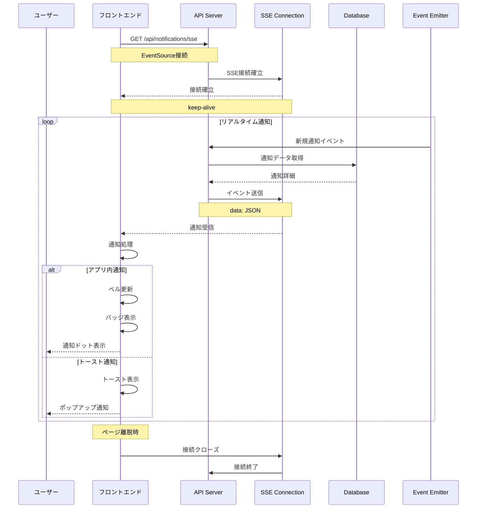
```mermaid
sequenceDiagram
    participant U as ユーザー
    participant F as フロントエンド
    participant A as API Server
    participant SSE as SSE Connection
    participant D as Database
    participant E as Event Emitter

    F->>A: GET /api/notifications/sse
    Note over F,A: EventSource接続
    
    A->>SSE: SSE接続確立
    SSE-->>F: 接続確立
    Note over SSE,F: keep-alive
    
    loop リアルタイム通知
        E->>A: 新規通知イベント
        
        A->>D: 通知データ取得
        D-->>A: 通知詳細
        
        A->>SSE: イベント送信
        Note over A,SSE: data: JSON
        
        SSE-->>F: 通知受信
        
        F->>F: 通知処理
        alt アプリ内通知
            F->>F: ベル更新
            F->>F: バッジ表示
            F-->>U: 通知ドット表示
        else トースト通知
            F->>F: トースト表示
            F-->>U: ポップアップ通知
        end
    end
    
    Note over F: ページ離脱時
    F->>SSE: 接続クローズ
    SSE->>A: 接続終了
```

## WebSocket通知

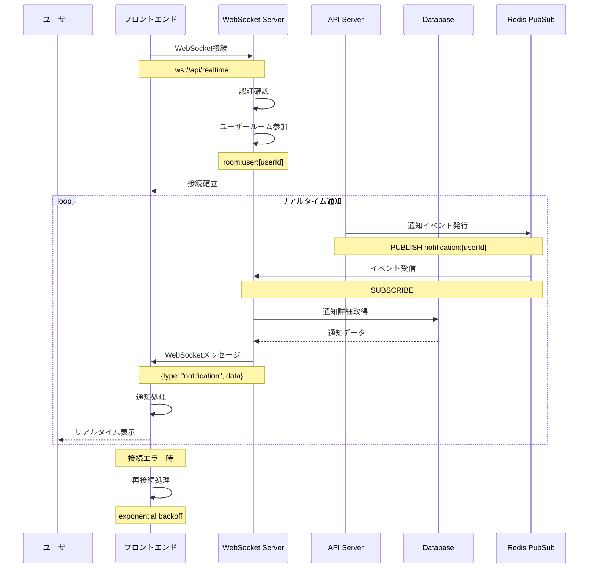
```mermaid
sequenceDiagram
    participant U as ユーザー
    participant F as フロントエンド
    participant W as WebSocket Server
    participant A as API Server
    participant D as Database
    participant R as Redis PubSub

    F->>W: WebSocket接続
    Note over F,W: ws://api/realtime
    
    W->>W: 認証確認
    W->>W: ユーザールーム参加
    Note over W: room:user:[userId]
    
    W-->>F: 接続確立
    
    loop リアルタイム通知
        A->>R: 通知イベント発行
        Note over A,R: PUBLISH notification:[userId]
        
        R->>W: イベント受信
        Note over R,W: SUBSCRIBE
        
        W->>D: 通知詳細取得
        D-->>W: 通知データ
        
        W->>F: WebSocketメッセージ
        Note over W,F: {type: "notification", data}
        
        F->>F: 通知処理
        F-->>U: リアルタイム表示
    end
    
    Note over F: 接続エラー時
    F->>F: 再接続処理
    Note over F: exponential backoff
```

## 通知一覧取得

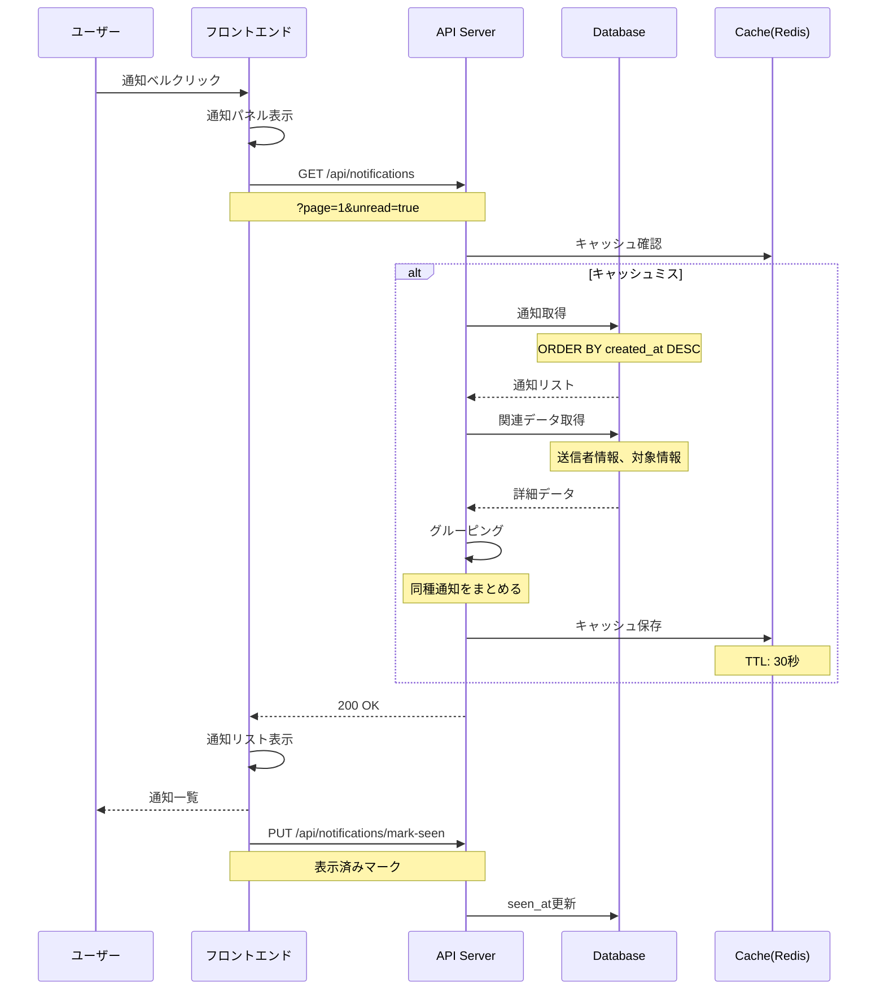
```mermaid
sequenceDiagram
    participant U as ユーザー
    participant F as フロントエンド
    participant A as API Server
    participant D as Database
    participant C as Cache(Redis)

    U->>F: 通知ベルクリック
    F->>F: 通知パネル表示
    
    F->>A: GET /api/notifications
    Note over F,A: ?page=1&unread=true
    
    A->>C: キャッシュ確認
    
    alt キャッシュミス
        A->>D: 通知取得
        Note over D: ORDER BY created_at DESC
        D-->>A: 通知リスト
        
        A->>D: 関連データ取得
        Note over D: 送信者情報、対象情報
        D-->>A: 詳細データ
        
        A->>A: グルーピング
        Note over A: 同種通知をまとめる
        
        A->>C: キャッシュ保存
        Note over C: TTL: 30秒
    end
    
    A-->>F: 200 OK
    F->>F: 通知リスト表示
    F-->>U: 通知一覧
    
    F->>A: PUT /api/notifications/mark-seen
    Note over F,A: 表示済みマーク
    A->>D: seen_at更新
```

## 通知既読処理

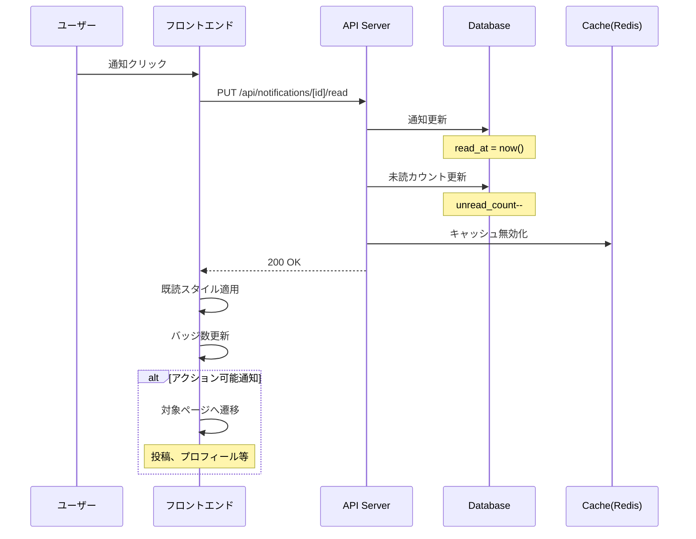
```mermaid
sequenceDiagram
    participant U as ユーザー
    participant F as フロントエンド
    participant A as API Server
    participant D as Database
    participant C as Cache(Redis)

    U->>F: 通知クリック
    
    F->>A: PUT /api/notifications/[id]/read
    
    A->>D: 通知更新
    Note over D: read_at = now()
    
    A->>D: 未読カウント更新
    Note over D: unread_count--
    
    A->>C: キャッシュ無効化
    
    A-->>F: 200 OK
    F->>F: 既読スタイル適用
    F->>F: バッジ数更新
    
    alt アクション可能通知
        F->>F: 対象ページへ遷移
        Note over F: 投稿、プロフィール等
    end
```

## 通知設定管理

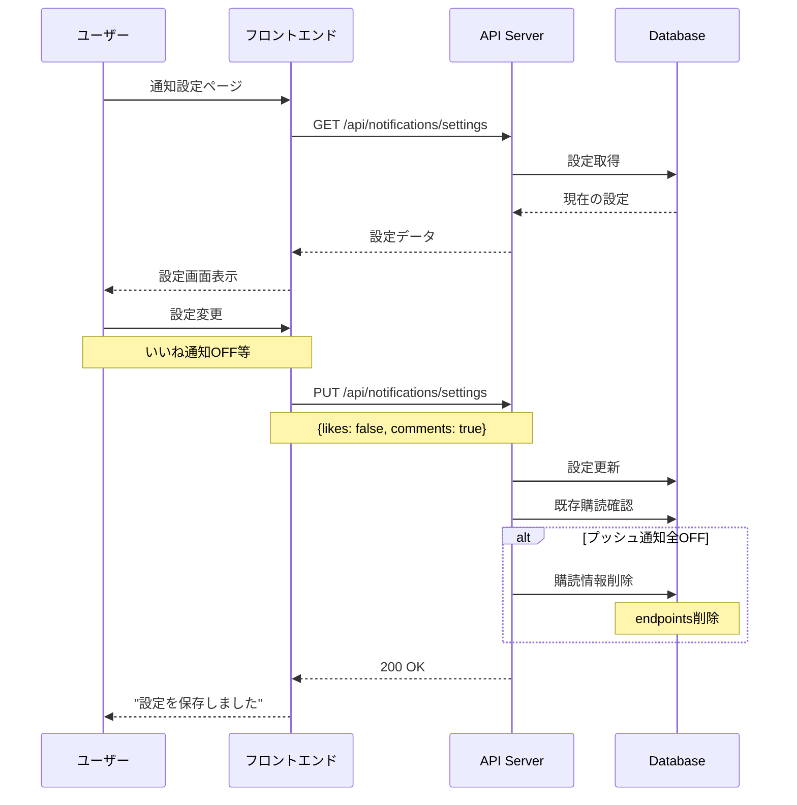
```mermaid
sequenceDiagram
    participant U as ユーザー
    participant F as フロントエンド
    participant A as API Server
    participant D as Database

    U->>F: 通知設定ページ
    
    F->>A: GET /api/notifications/settings
    A->>D: 設定取得
    D-->>A: 現在の設定
    A-->>F: 設定データ
    
    F-->>U: 設定画面表示
    
    U->>F: 設定変更
    Note over U,F: いいね通知OFF等
    
    F->>A: PUT /api/notifications/settings
    Note over F,A: {likes: false, comments: true}
    
    A->>D: 設定更新
    
    A->>D: 既存購読確認
    alt プッシュ通知全OFF
        A->>D: 購読情報削除
        Note over D: endpoints削除
    end
    
    A-->>F: 200 OK
    F-->>U: "設定を保存しました"
```

## メール通知

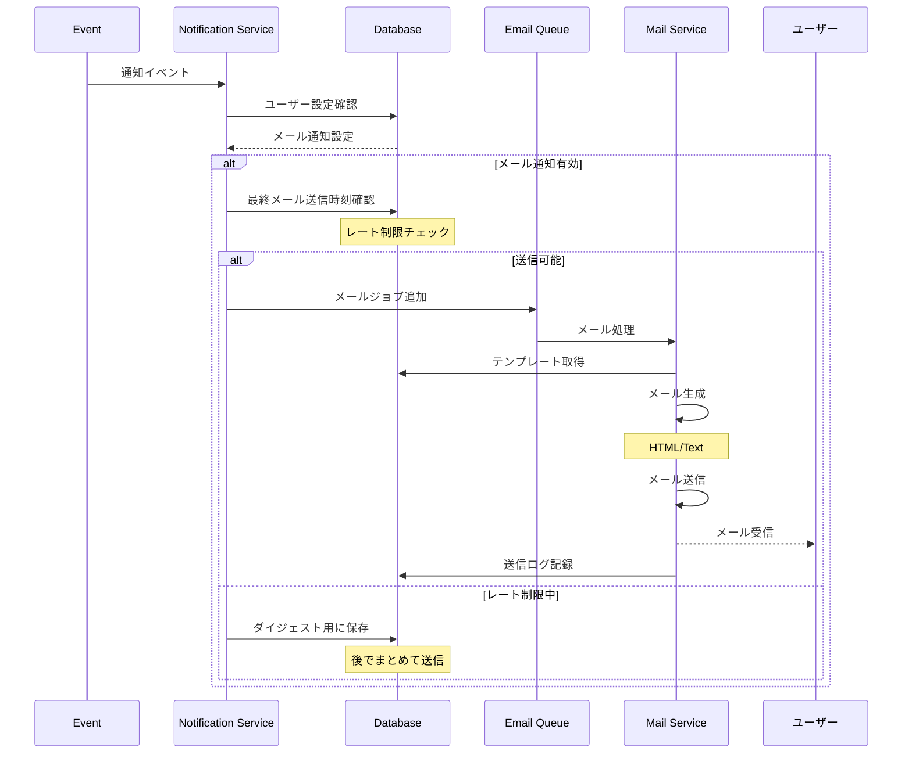
```mermaid
sequenceDiagram
    participant E as Event
    participant N as Notification Service
    participant D as Database
    participant Q as Email Queue
    participant M as Mail Service
    participant U as ユーザー

    E->>N: 通知イベント
    
    N->>D: ユーザー設定確認
    D-->>N: メール通知設定
    
    alt メール通知有効
        N->>D: 最終メール送信時刻確認
        Note over D: レート制限チェック
        
        alt 送信可能
            N->>Q: メールジョブ追加
            
            Q->>M: メール処理
            
            M->>D: テンプレート取得
            M->>M: メール生成
            Note over M: HTML/Text
            
            M->>M: メール送信
            M-->>U: メール受信
            
            M->>D: 送信ログ記録
        else レート制限中
            N->>D: ダイジェスト用に保存
            Note over D: 後でまとめて送信
        end
    end
```

## 通知ダイジェスト

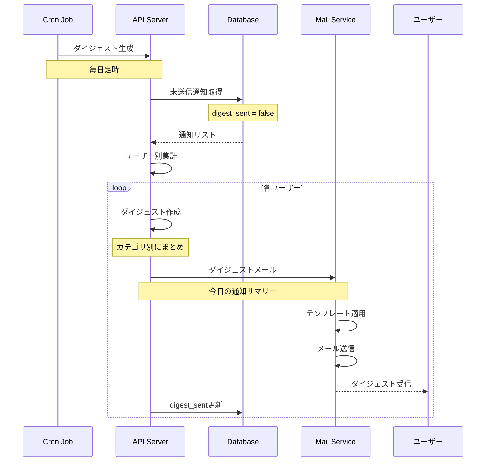
```mermaid
sequenceDiagram
    participant Cron as Cron Job
    participant A as API Server
    participant D as Database
    participant M as Mail Service
    participant U as ユーザー

    Cron->>A: ダイジェスト生成
    Note over Cron,A: 毎日定時
    
    A->>D: 未送信通知取得
    Note over D: digest_sent = false
    D-->>A: 通知リスト
    
    A->>A: ユーザー別集計
    
    loop 各ユーザー
        A->>A: ダイジェスト作成
        Note over A: カテゴリ別にまとめ
        
        A->>M: ダイジェストメール
        Note over A,M: 今日の通知サマリー
        
        M->>M: テンプレート適用
        M->>M: メール送信
        M-->>U: ダイジェスト受信
        
        A->>D: digest_sent更新
    end
```

## アプリ内通知カウンター

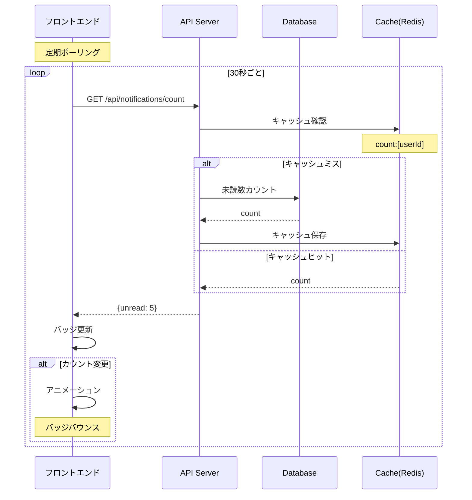
```mermaid
sequenceDiagram
    participant F as フロントエンド
    participant A as API Server
    participant D as Database
    participant C as Cache(Redis)

    Note over F: 定期ポーリング
    
    loop 30秒ごと
        F->>A: GET /api/notifications/count
        
        A->>C: キャッシュ確認
        Note over C: count:[userId]
        
        alt キャッシュミス
            A->>D: 未読数カウント
            D-->>A: count
            A->>C: キャッシュ保存
        else キャッシュヒット
            C-->>A: count
        end
        
        A-->>F: {unread: 5}
        
        F->>F: バッジ更新
        alt カウント変更
            F->>F: アニメーション
            Note over F: バッジバウンス
        end
    end
```

## 通知の優先度管理

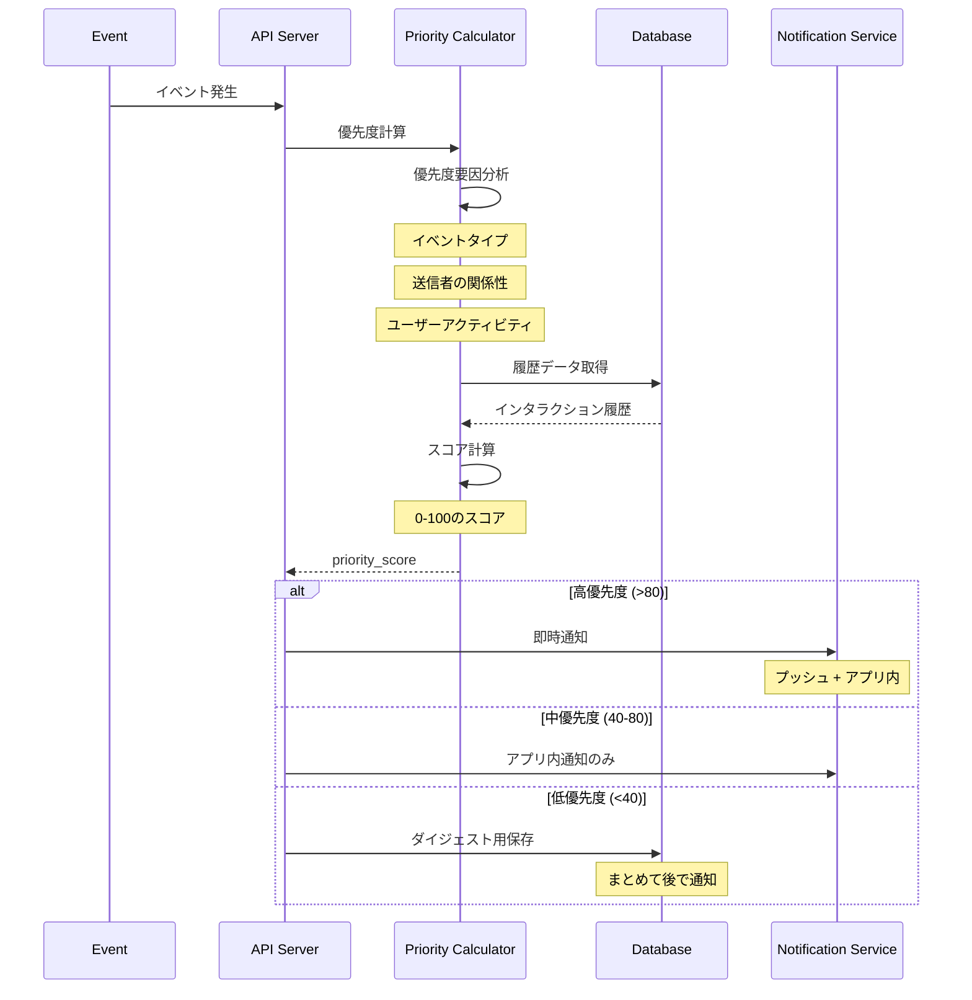
```mermaid
sequenceDiagram
    participant E as Event
    participant A as API Server
    participant P as Priority Calculator
    participant D as Database
    participant N as Notification Service

    E->>A: イベント発生
    
    A->>P: 優先度計算
    
    P->>P: 優先度要因分析
    Note over P: イベントタイプ
    Note over P: 送信者の関係性
    Note over P: ユーザーアクティビティ
    
    P->>D: 履歴データ取得
    D-->>P: インタラクション履歴
    
    P->>P: スコア計算
    Note over P: 0-100のスコア
    
    P-->>A: priority_score
    
    alt 高優先度 (>80)
        A->>N: 即時通知
        Note over N: プッシュ + アプリ内
    else 中優先度 (40-80)
        A->>N: アプリ内通知のみ
    else 低優先度 (<40)
        A->>D: ダイジェスト用保存
        Note over D: まとめて後で通知
    end
```

## 通知のスヌーズ機能

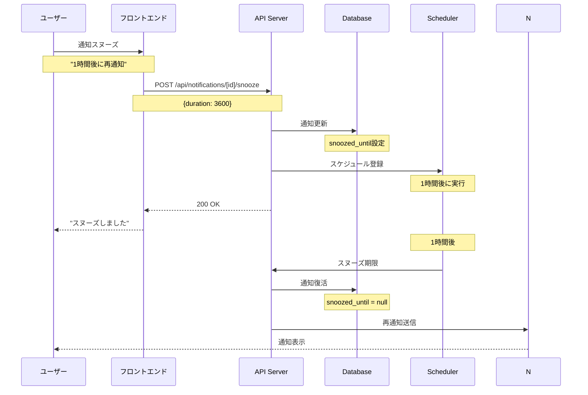
```mermaid
sequenceDiagram
    participant U as ユーザー
    participant F as フロントエンド
    participant A as API Server
    participant D as Database
    participant S as Scheduler

    U->>F: 通知スヌーズ
    Note over U,F: "1時間後に再通知"
    
    F->>A: POST /api/notifications/[id]/snooze
    Note over F,A: {duration: 3600}
    
    A->>D: 通知更新
    Note over D: snoozed_until設定
    
    A->>S: スケジュール登録
    Note over S: 1時間後に実行
    
    A-->>F: 200 OK
    F-->>U: "スヌーズしました"
    
    Note over S: 1時間後
    
    S->>A: スヌーズ期限
    A->>D: 通知復活
    Note over D: snoozed_until = null
    
    A->>N: 再通知送信
    N-->>U: 通知表示
```