# 検索機能シーケンス図

## 統合検索

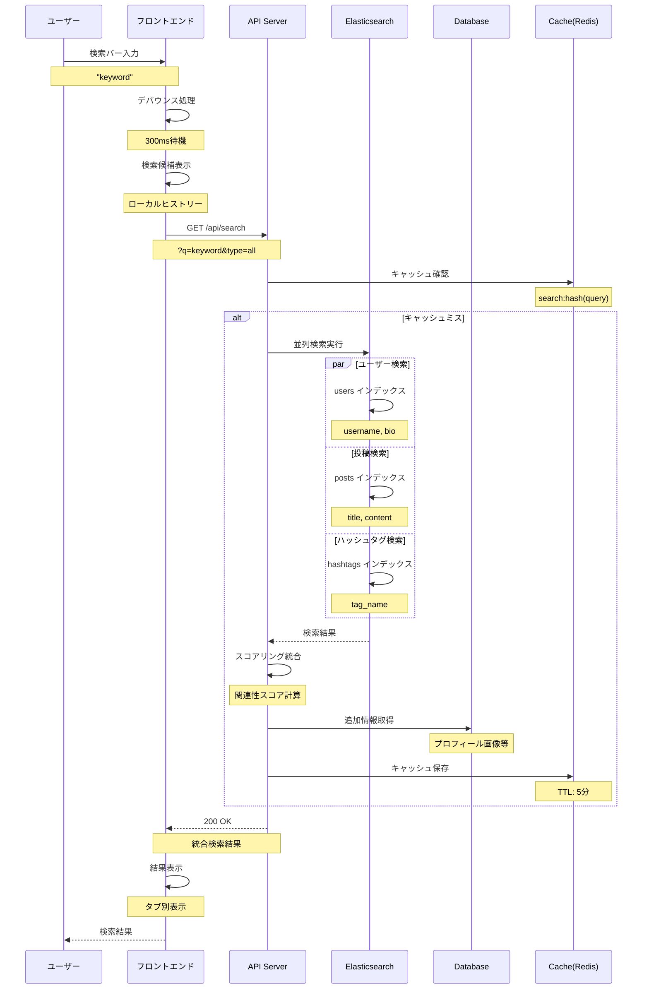
```mermaid
sequenceDiagram
    participant U as ユーザー
    participant F as フロントエンド
    participant A as API Server
    participant E as Elasticsearch
    participant D as Database
    participant C as Cache(Redis)

    U->>F: 検索バー入力
    Note over U,F: "keyword"
    
    F->>F: デバウンス処理
    Note over F: 300ms待機
    
    F->>F: 検索候補表示
    Note over F: ローカルヒストリー
    
    F->>A: GET /api/search
    Note over F,A: ?q=keyword&type=all
    
    A->>C: キャッシュ確認
    Note over C: search:hash(query)
    
    alt キャッシュミス
        A->>E: 並列検索実行
        
        par ユーザー検索
            E->>E: users インデックス
            Note over E: username, bio
        and 投稿検索
            E->>E: posts インデックス
            Note over E: title, content
        and ハッシュタグ検索
            E->>E: hashtags インデックス
            Note over E: tag_name
        end
        
        E-->>A: 検索結果
        
        A->>A: スコアリング統合
        Note over A: 関連性スコア計算
        
        A->>D: 追加情報取得
        Note over D: プロフィール画像等
        
        A->>C: キャッシュ保存
        Note over C: TTL: 5分
    end
    
    A-->>F: 200 OK
    Note over A,F: 統合検索結果
    
    F->>F: 結果表示
    Note over F: タブ別表示
    F-->>U: 検索結果
```

## ユーザー検索

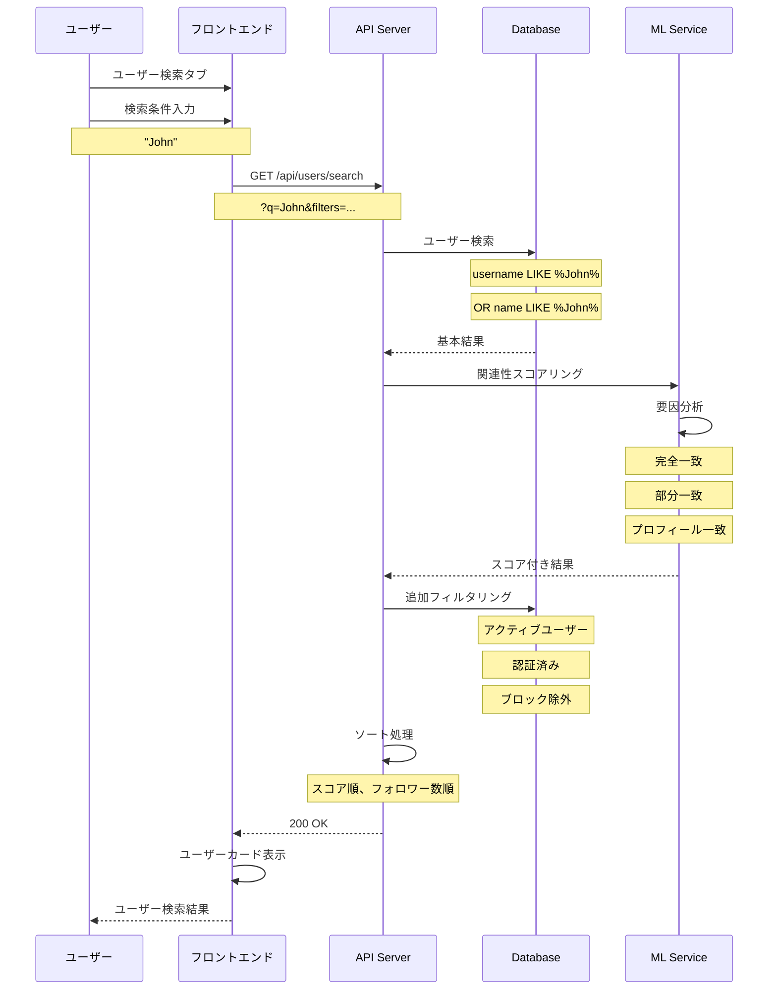
```mermaid
sequenceDiagram
    participant U as ユーザー
    participant F as フロントエンド
    participant A as API Server
    participant D as Database
    participant ML as ML Service

    U->>F: ユーザー検索タブ
    U->>F: 検索条件入力
    Note over U,F: "John"
    
    F->>A: GET /api/users/search
    Note over F,A: ?q=John&filters=...
    
    A->>D: ユーザー検索
    Note over D: username LIKE %John%
    Note over D: OR name LIKE %John%
    D-->>A: 基本結果
    
    A->>ML: 関連性スコアリング
    ML->>ML: 要因分析
    Note over ML: 完全一致
    Note over ML: 部分一致
    Note over ML: プロフィール一致
    ML-->>A: スコア付き結果
    
    A->>D: 追加フィルタリング
    Note over D: アクティブユーザー
    Note over D: 認証済み
    Note over D: ブロック除外
    
    A->>A: ソート処理
    Note over A: スコア順、フォロワー数順
    
    A-->>F: 200 OK
    F->>F: ユーザーカード表示
    F-->>U: ユーザー検索結果
```

## 投稿全文検索

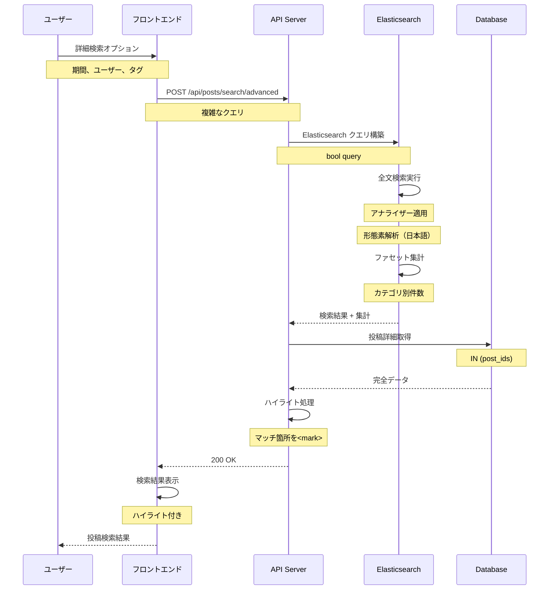
```mermaid
sequenceDiagram
    participant U as ユーザー
    participant F as フロントエンド
    participant A as API Server
    participant E as Elasticsearch
    participant D as Database

    U->>F: 詳細検索オプション
    Note over U,F: 期間、ユーザー、タグ
    
    F->>A: POST /api/posts/search/advanced
    Note over F,A: 複雑なクエリ
    
    A->>E: Elasticsearch クエリ構築
    Note over A,E: bool query
    
    E->>E: 全文検索実行
    Note over E: アナライザー適用
    Note over E: 形態素解析（日本語）
    
    E->>E: ファセット集計
    Note over E: カテゴリ別件数
    
    E-->>A: 検索結果 + 集計
    
    A->>D: 投稿詳細取得
    Note over D: IN (post_ids)
    D-->>A: 完全データ
    
    A->>A: ハイライト処理
    Note over A: マッチ箇所を<mark>
    
    A-->>F: 200 OK
    F->>F: 検索結果表示
    Note over F: ハイライト付き
    F-->>U: 投稿検索結果
```

## オートコンプリート

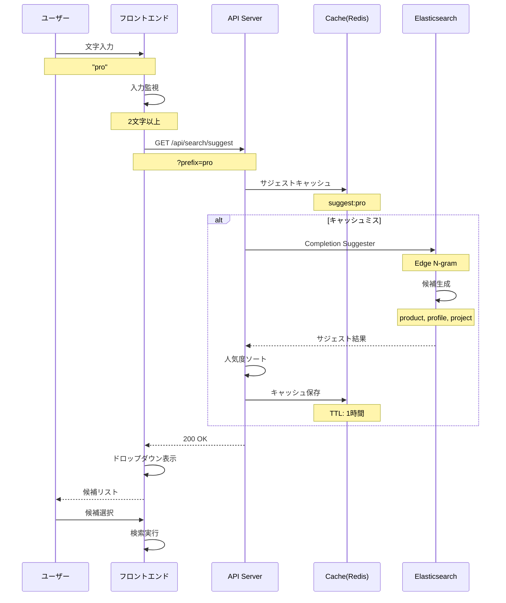
```mermaid
sequenceDiagram
    participant U as ユーザー
    participant F as フロントエンド
    participant A as API Server
    participant C as Cache(Redis)
    participant E as Elasticsearch

    U->>F: 文字入力
    Note over U,F: "pro"
    
    F->>F: 入力監視
    Note over F: 2文字以上
    
    F->>A: GET /api/search/suggest
    Note over F,A: ?prefix=pro
    
    A->>C: サジェストキャッシュ
    Note over C: suggest:pro
    
    alt キャッシュミス
        A->>E: Completion Suggester
        Note over E: Edge N-gram
        
        E->>E: 候補生成
        Note over E: product, profile, project
        
        E-->>A: サジェスト結果
        
        A->>A: 人気度ソート
        
        A->>C: キャッシュ保存
        Note over C: TTL: 1時間
    end
    
    A-->>F: 200 OK
    F->>F: ドロップダウン表示
    F-->>U: 候補リスト
    
    U->>F: 候補選択
    F->>F: 検索実行
```

## ハッシュタグ検索

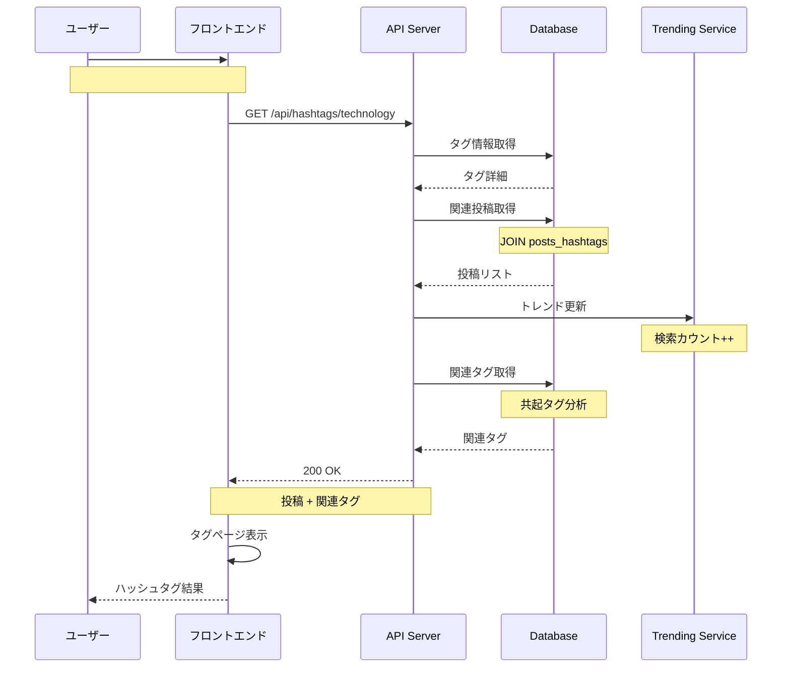
```mermaid
sequenceDiagram
    participant U as ユーザー
    participant F as フロントエンド
    participant A as API Server
    participant D as Database
    participant T as Trending Service

    U->>F: #タグクリック
    Note over U,F: #technology
    
    F->>A: GET /api/hashtags/technology
    
    A->>D: タグ情報取得
    D-->>A: タグ詳細
    
    A->>D: 関連投稿取得
    Note over D: JOIN posts_hashtags
    D-->>A: 投稿リスト
    
    A->>T: トレンド更新
    Note over T: 検索カウント++
    
    A->>D: 関連タグ取得
    Note over D: 共起タグ分析
    D-->>A: 関連タグ
    
    A-->>F: 200 OK
    Note over A,F: 投稿 + 関連タグ
    
    F->>F: タグページ表示
    F-->>U: ハッシュタグ結果
```

## 検索履歴管理

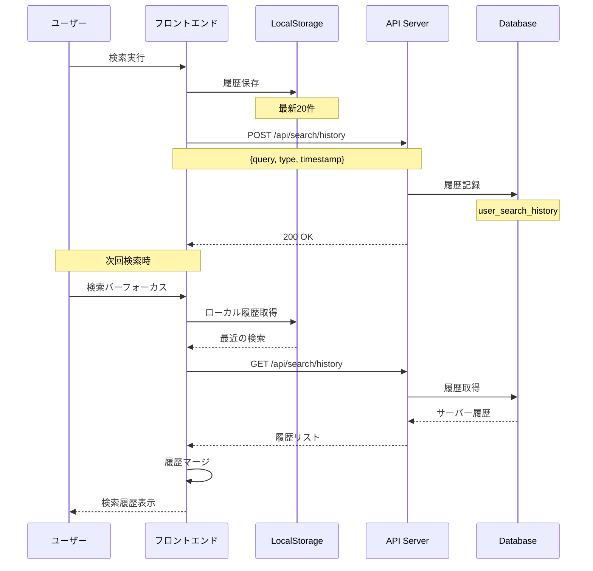
```mermaid
sequenceDiagram
    participant U as ユーザー
    participant F as フロントエンド
    participant L as LocalStorage
    participant A as API Server
    participant D as Database

    U->>F: 検索実行
    
    F->>L: 履歴保存
    Note over L: 最新20件
    
    F->>A: POST /api/search/history
    Note over F,A: {query, type, timestamp}
    
    A->>D: 履歴記録
    Note over D: user_search_history
    
    A-->>F: 200 OK
    
    Note over U,F: 次回検索時
    
    U->>F: 検索バーフォーカス
    
    F->>L: ローカル履歴取得
    L-->>F: 最近の検索
    
    F->>A: GET /api/search/history
    A->>D: 履歴取得
    D-->>A: サーバー履歴
    
    A-->>F: 履歴リスト
    F->>F: 履歴マージ
    F-->>U: 検索履歴表示
```

## トレンド検索

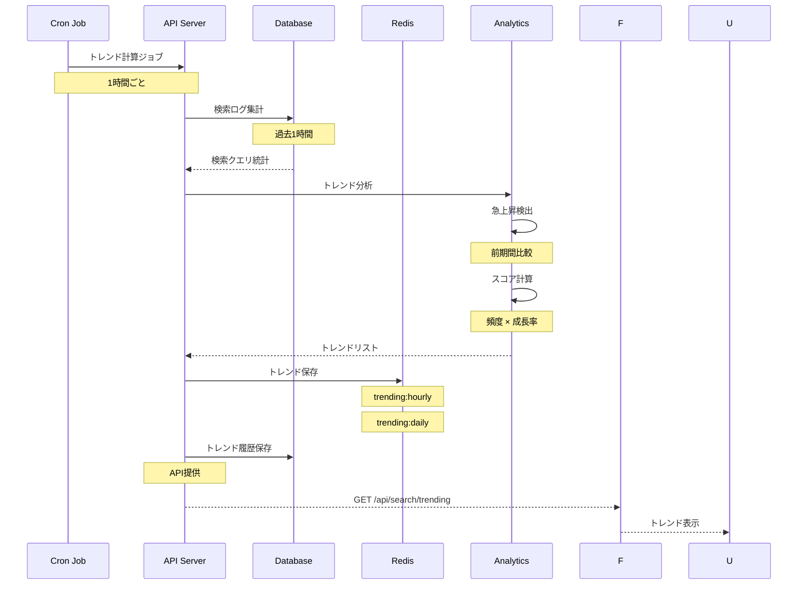
```mermaid
sequenceDiagram
    participant Cron as Cron Job
    participant A as API Server
    participant D as Database
    participant R as Redis
    participant An as Analytics

    Cron->>A: トレンド計算ジョブ
    Note over Cron,A: 1時間ごと
    
    A->>D: 検索ログ集計
    Note over D: 過去1時間
    D-->>A: 検索クエリ統計
    
    A->>An: トレンド分析
    
    An->>An: 急上昇検出
    Note over An: 前期間比較
    
    An->>An: スコア計算
    Note over An: 頻度 × 成長率
    
    An-->>A: トレンドリスト
    
    A->>R: トレンド保存
    Note over R: trending:hourly
    Note over R: trending:daily
    
    A->>D: トレンド履歴保存
    
    Note over A: API提供
    
    A-->>F: GET /api/search/trending
    F-->>U: トレンド表示
```

## 検索フィルター

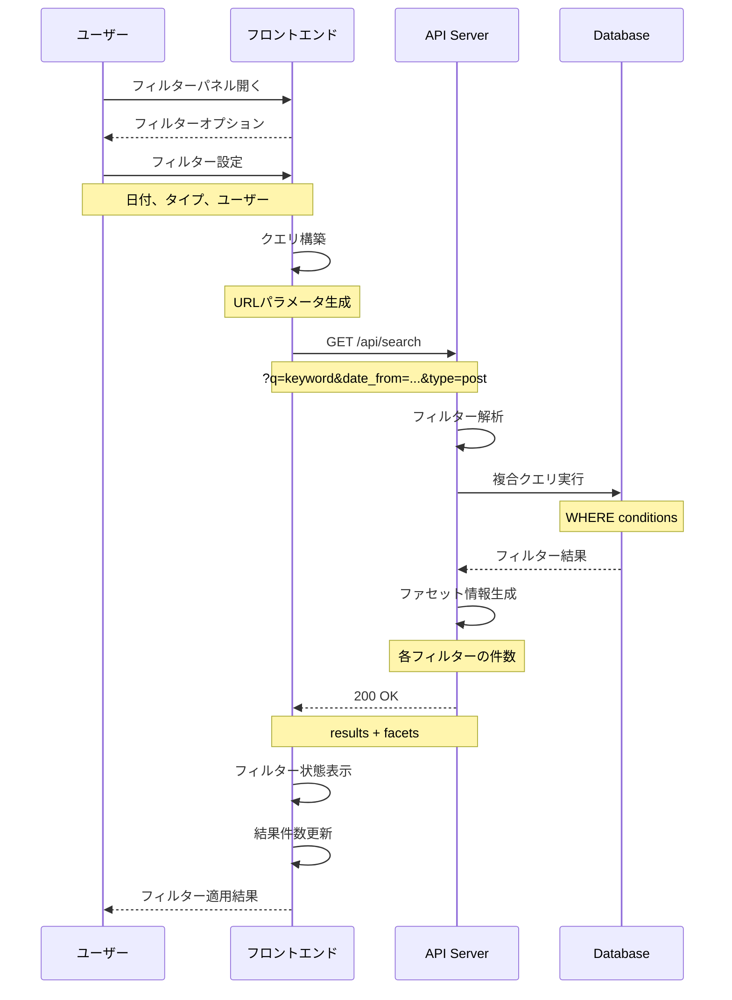
```mermaid
sequenceDiagram
    participant U as ユーザー
    participant F as フロントエンド
    participant A as API Server
    participant D as Database

    U->>F: フィルターパネル開く
    F-->>U: フィルターオプション
    
    U->>F: フィルター設定
    Note over U,F: 日付、タイプ、ユーザー
    
    F->>F: クエリ構築
    Note over F: URLパラメータ生成
    
    F->>A: GET /api/search
    Note over F,A: ?q=keyword&date_from=...&type=post
    
    A->>A: フィルター解析
    
    A->>D: 複合クエリ実行
    Note over D: WHERE conditions
    
    D-->>A: フィルター結果
    
    A->>A: ファセット情報生成
    Note over A: 各フィルターの件数
    
    A-->>F: 200 OK
    Note over A,F: results + facets
    
    F->>F: フィルター状態表示
    F->>F: 結果件数更新
    F-->>U: フィルター適用結果
```

## 保存検索

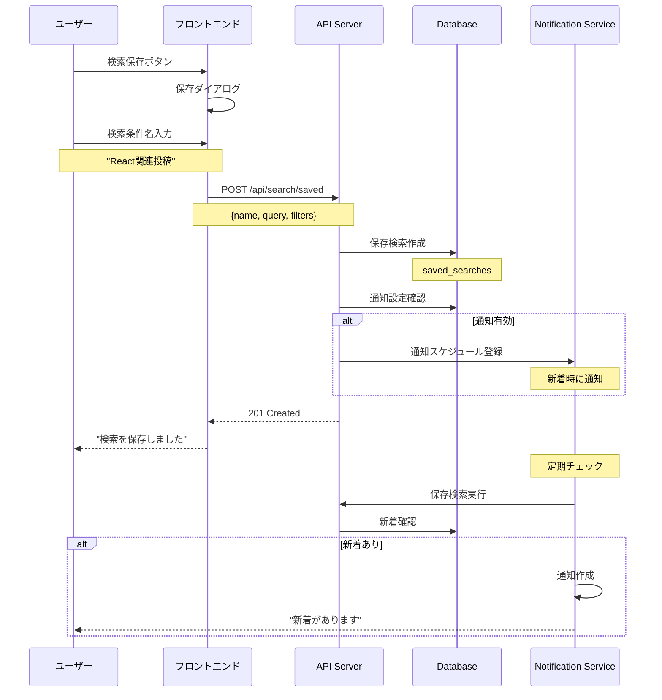
```mermaid
sequenceDiagram
    participant U as ユーザー
    participant F as フロントエンド
    participant A as API Server
    participant D as Database
    participant N as Notification Service

    U->>F: 検索保存ボタン
    F->>F: 保存ダイアログ
    
    U->>F: 検索条件名入力
    Note over U,F: "React関連投稿"
    
    F->>A: POST /api/search/saved
    Note over F,A: {name, query, filters}
    
    A->>D: 保存検索作成
    Note over D: saved_searches
    
    A->>D: 通知設定確認
    alt 通知有効
        A->>N: 通知スケジュール登録
        Note over N: 新着時に通知
    end
    
    A-->>F: 201 Created
    F-->>U: "検索を保存しました"
    
    Note over N: 定期チェック
    
    N->>A: 保存検索実行
    A->>D: 新着確認
    
    alt 新着あり
        N->>N: 通知作成
        N-->>U: "新着があります"
    end
```

## セマンティック検索

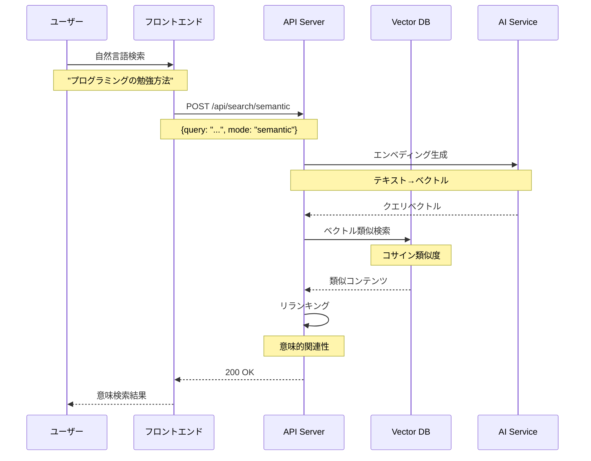
```mermaid
sequenceDiagram
    participant U as ユーザー
    participant F as フロントエンド
    participant A as API Server
    participant V as Vector DB
    participant AI as AI Service

    U->>F: 自然言語検索
    Note over U,F: "プログラミングの勉強方法"
    
    F->>A: POST /api/search/semantic
    Note over F,A: {query: "...", mode: "semantic"}
    
    A->>AI: エンベディング生成
    Note over A,AI: テキスト→ベクトル
    AI-->>A: クエリベクトル
    
    A->>V: ベクトル類似検索
    Note over V: コサイン類似度
    V-->>A: 類似コンテンツ
    
    A->>A: リランキング
    Note over A: 意味的関連性
    
    A-->>F: 200 OK
    F-->>U: 意味検索結果
```

## 音声検索

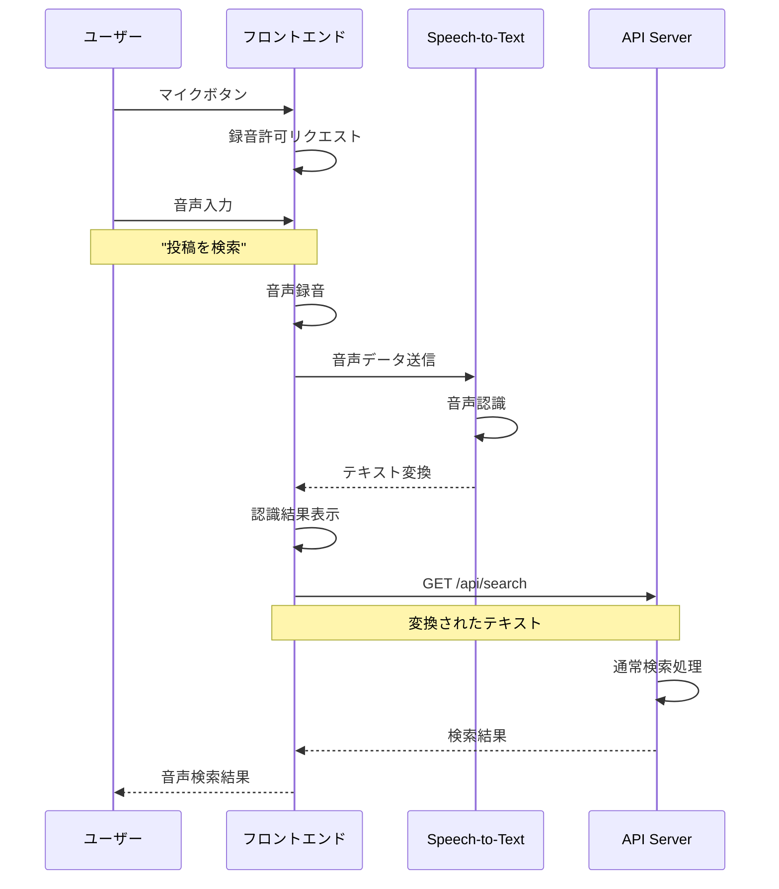
```mermaid
sequenceDiagram
    participant U as ユーザー
    participant F as フロントエンド
    participant STT as Speech-to-Text
    participant A as API Server

    U->>F: マイクボタン
    F->>F: 録音許可リクエスト
    
    U->>F: 音声入力
    Note over U,F: "投稿を検索"
    
    F->>F: 音声録音
    F->>STT: 音声データ送信
    
    STT->>STT: 音声認識
    STT-->>F: テキスト変換
    
    F->>F: 認識結果表示
    F->>A: GET /api/search
    Note over F,A: 変換されたテキスト
    
    A->>A: 通常検索処理
    A-->>F: 検索結果
    F-->>U: 音声検索結果
```

## 画像検索

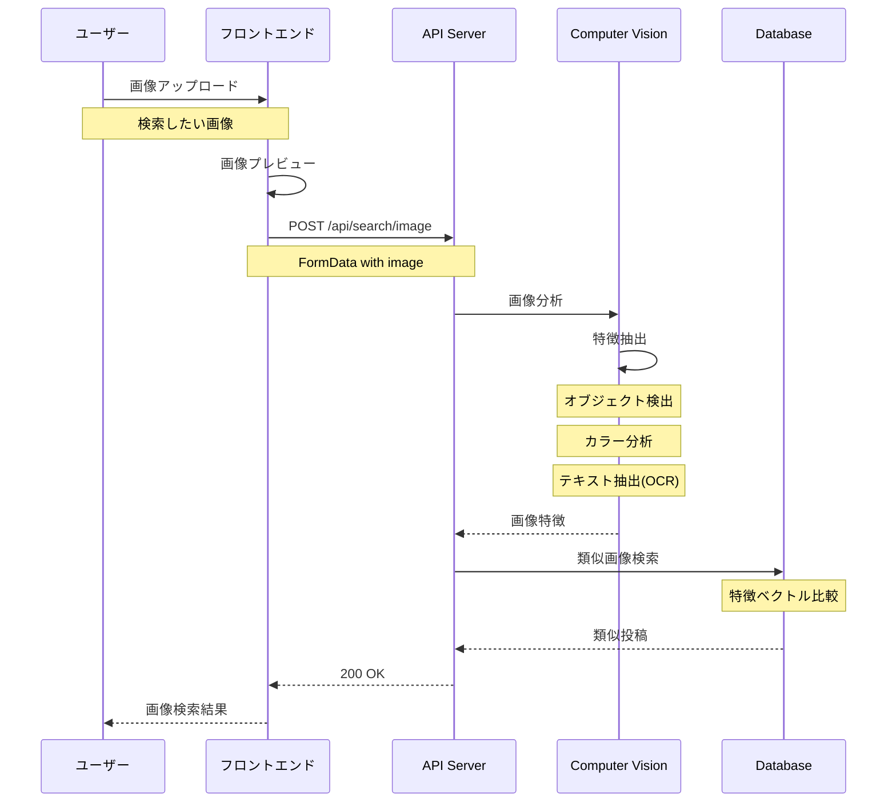
```mermaid
sequenceDiagram
    participant U as ユーザー
    participant F as フロントエンド
    participant A as API Server
    participant CV as Computer Vision
    participant D as Database

    U->>F: 画像アップロード
    Note over U,F: 検索したい画像
    
    F->>F: 画像プレビュー
    
    F->>A: POST /api/search/image
    Note over F,A: FormData with image
    
    A->>CV: 画像分析
    
    CV->>CV: 特徴抽出
    Note over CV: オブジェクト検出
    Note over CV: カラー分析
    Note over CV: テキスト抽出(OCR)
    
    CV-->>A: 画像特徴
    
    A->>D: 類似画像検索
    Note over D: 特徴ベクトル比較
    D-->>A: 類似投稿
    
    A-->>F: 200 OK
    F-->>U: 画像検索結果
```