# 画像アップロード機能シーケンス図

## 画像アップロード（Cloudinary）

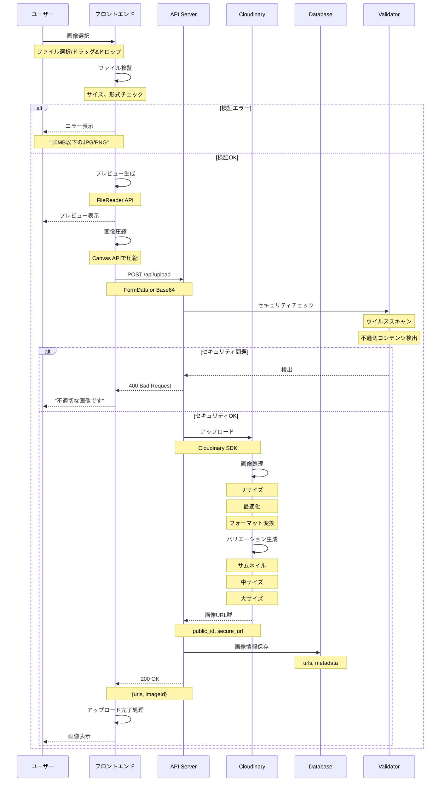

## 複数画像アップロード

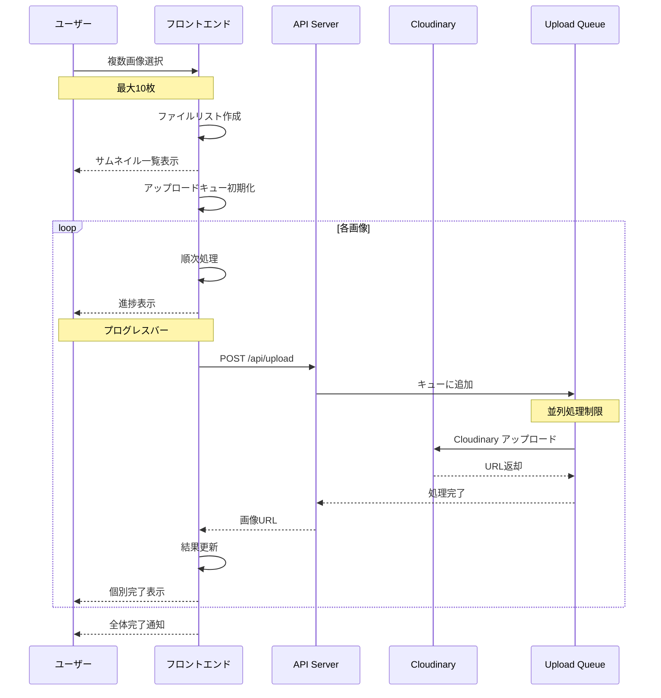

## 画像クロップ・編集

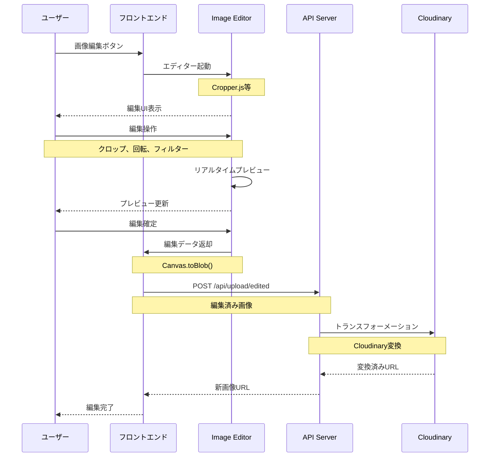

## ドラッグ&ドロップアップロード

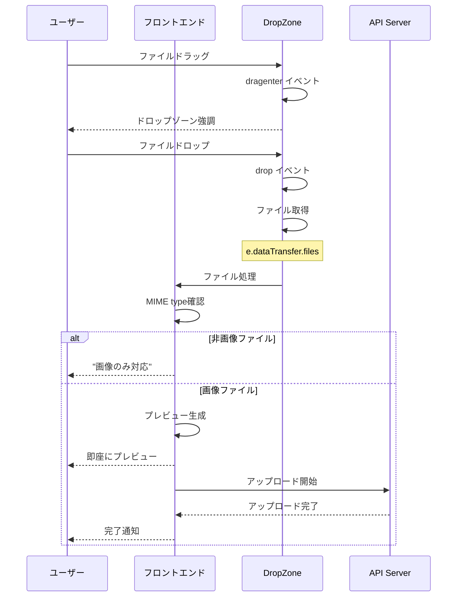

## 画像URL取得（ダイレクトアップロード）

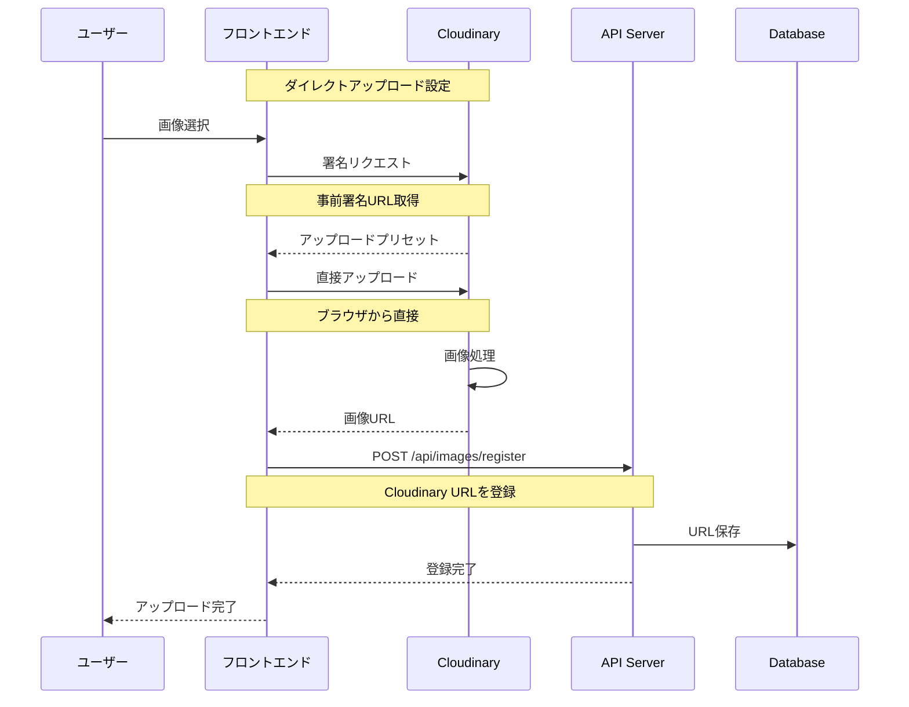

## 画像最適化配信

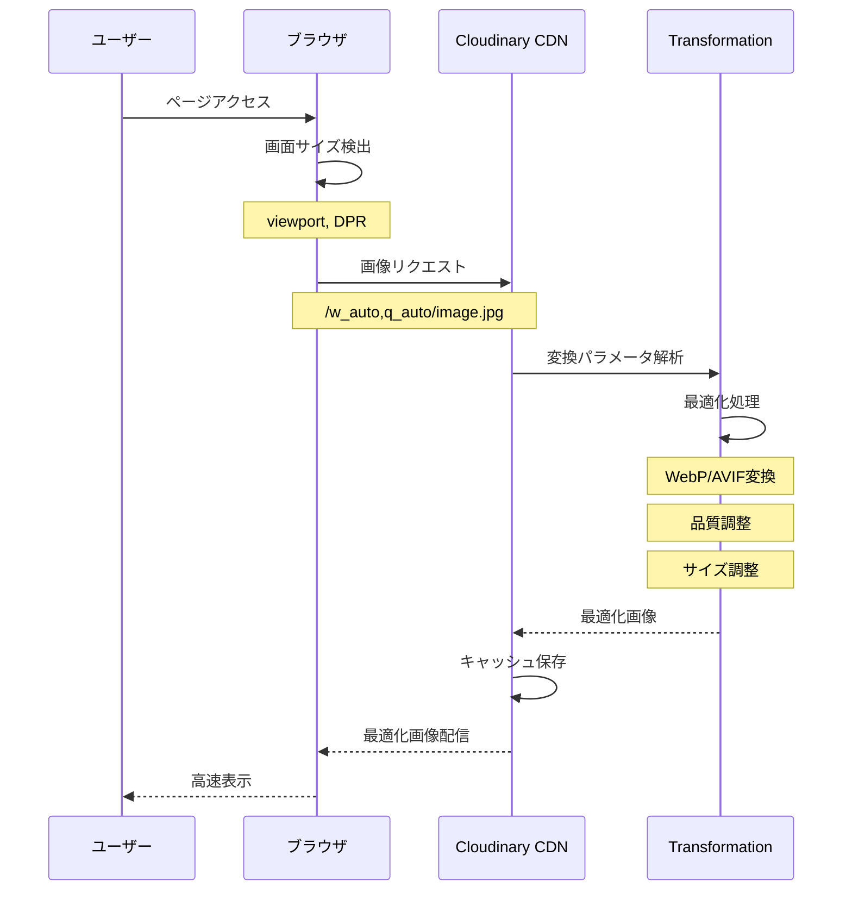

## 画像削除

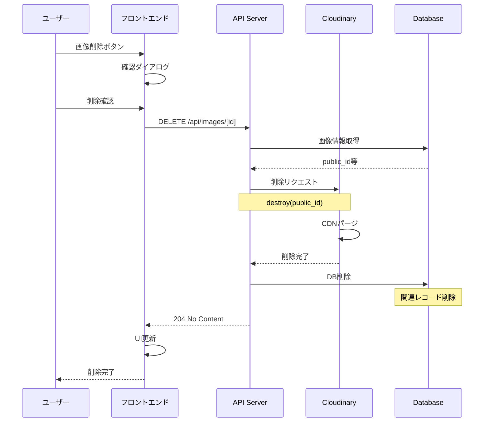

## 画像圧縮（クライアントサイド）

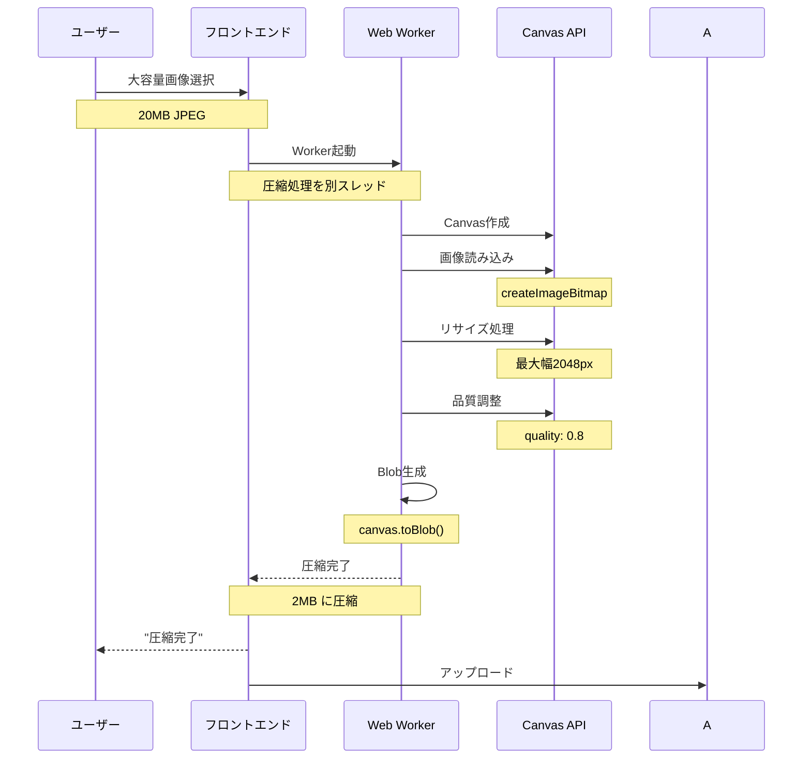

## 画像の遅延読み込み

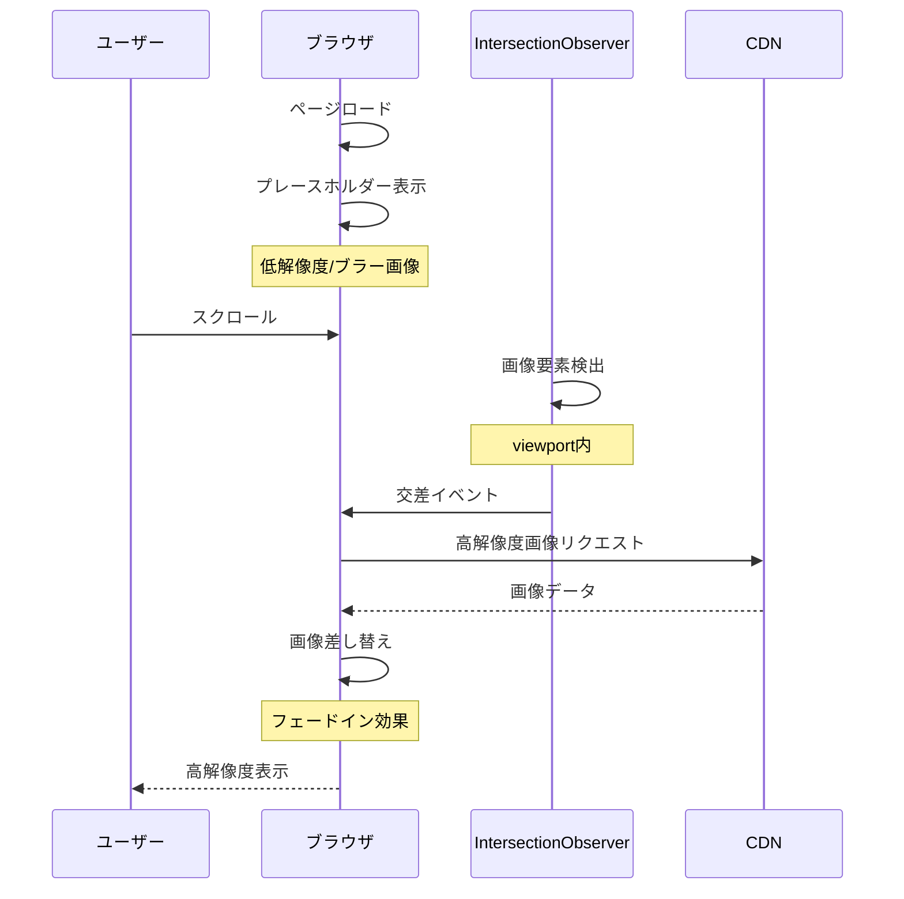

## 画像メタデータ処理

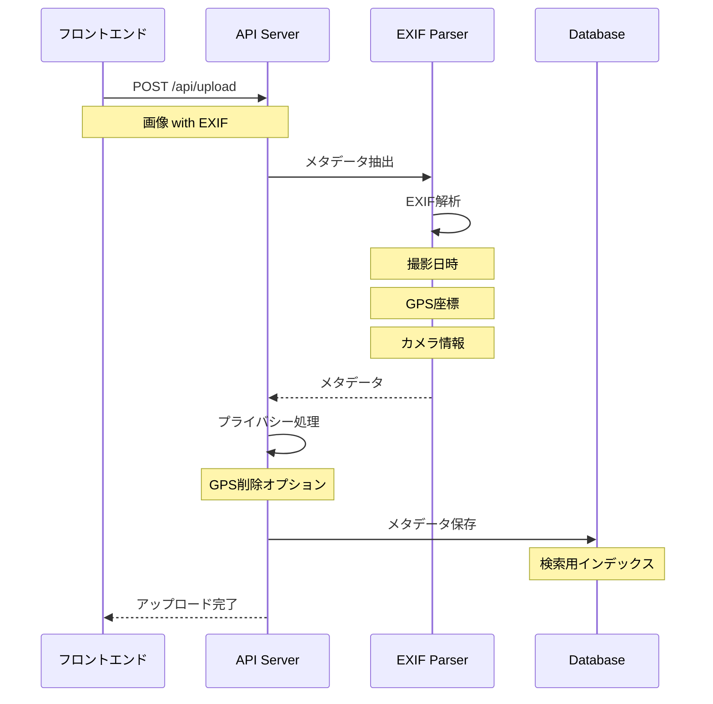

## 画像ギャラリー表示

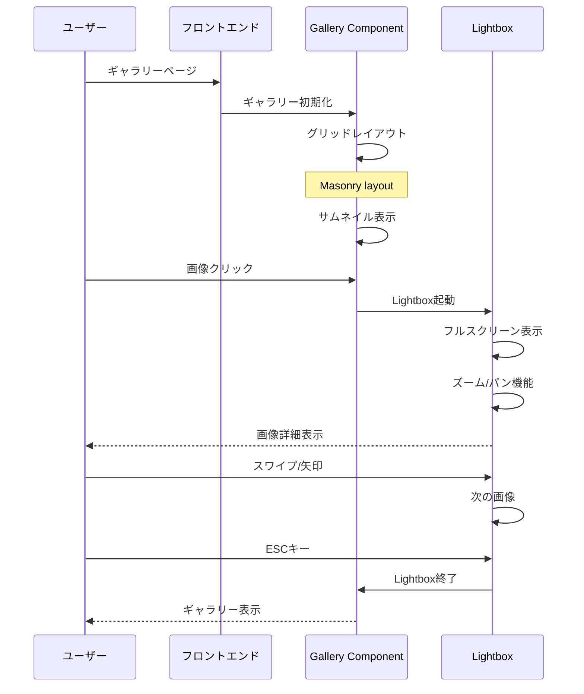

## 画像のウォーターマーク

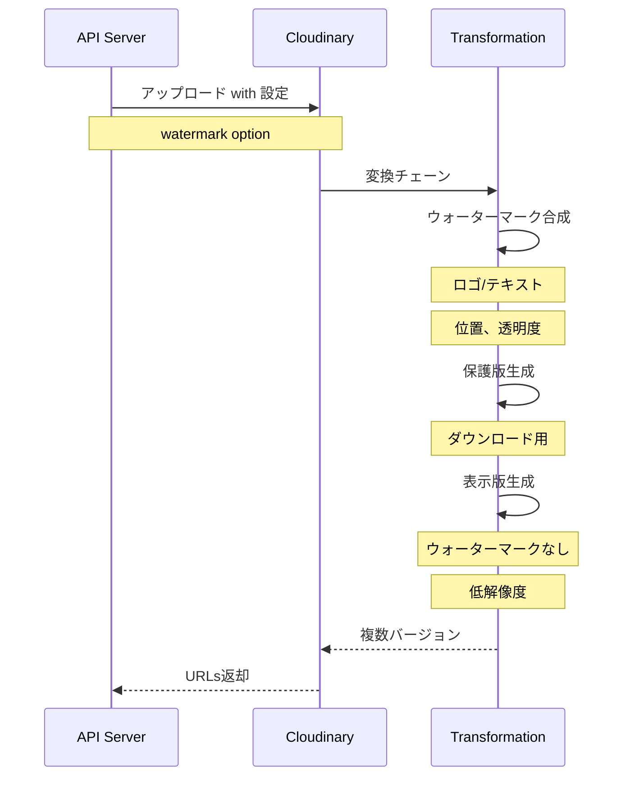