# ハッシュタグ機能シーケンス図

## ハッシュタグ解析と保存

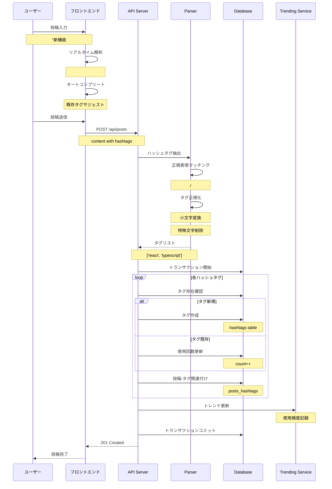

## ハッシュタグ検索

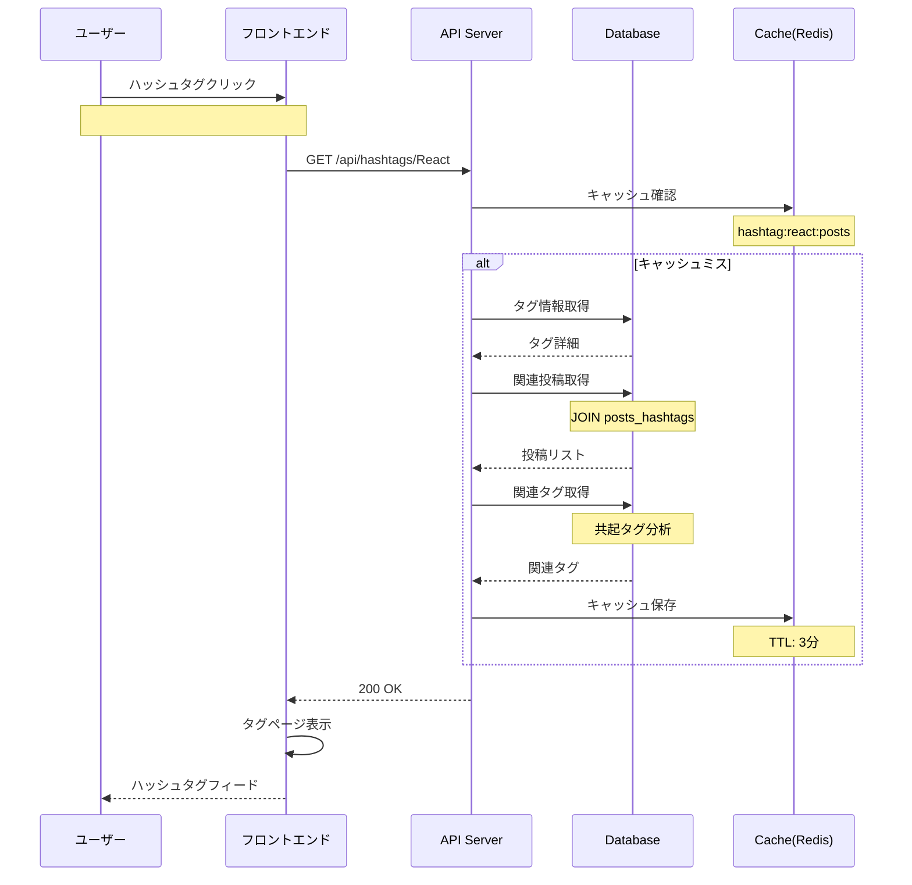

## トレンディングハッシュタグ

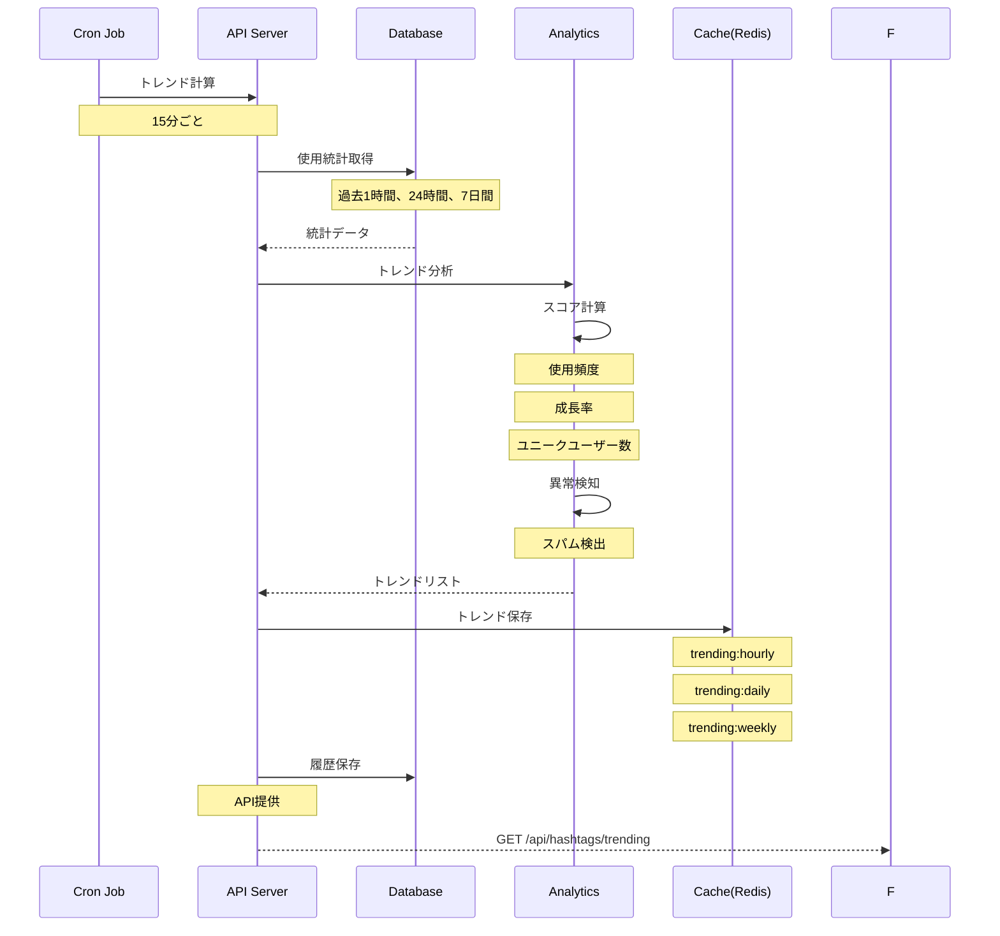

## ハッシュタグサジェスト

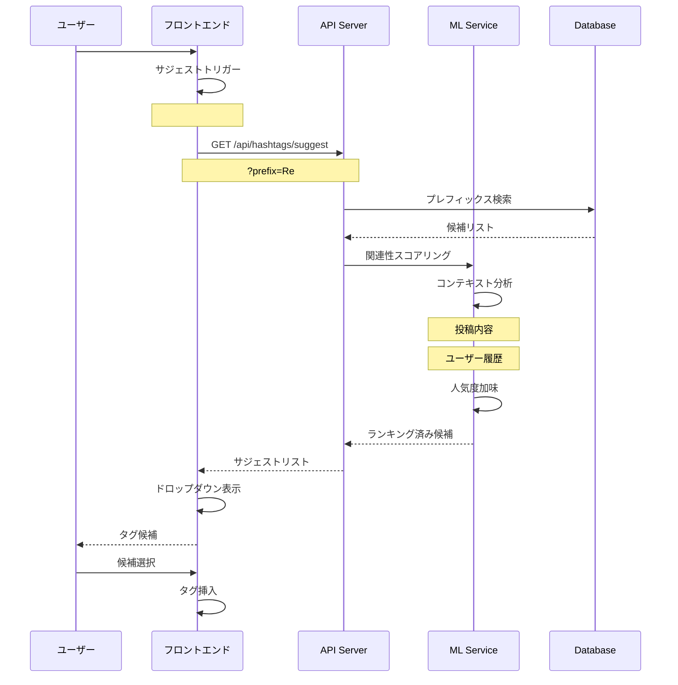

## ハッシュタグフォロー

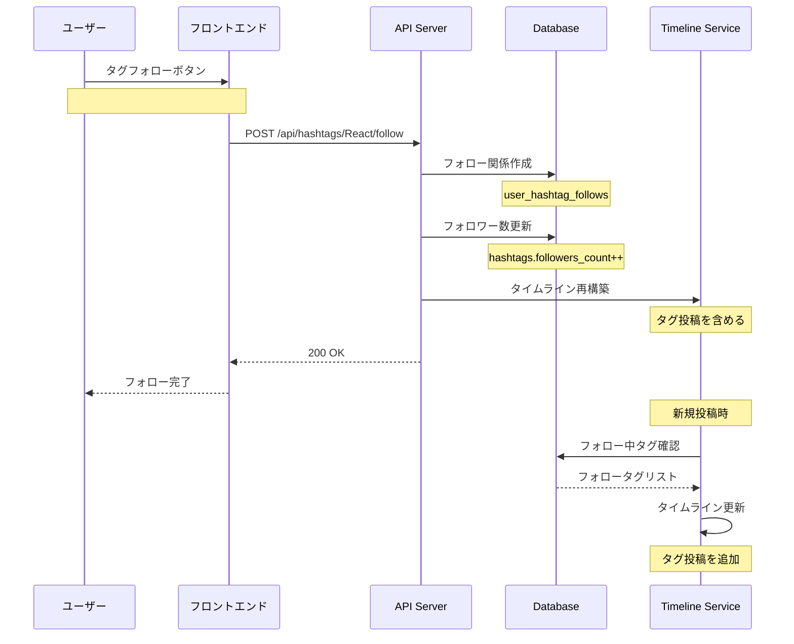

## ハッシュタグ統計

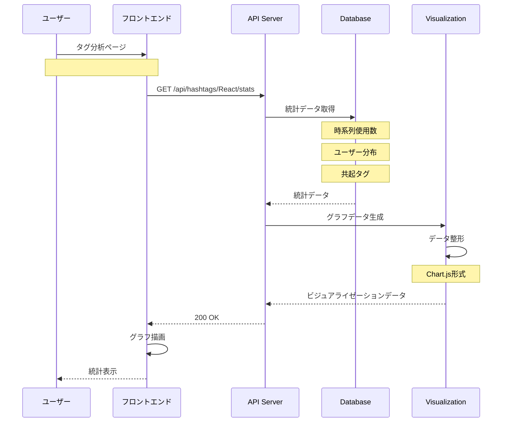

## ハッシュタグマージ（管理機能）

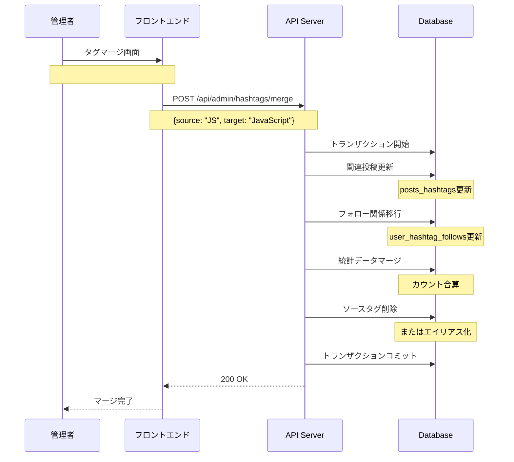

## ハッシュタグクラウド

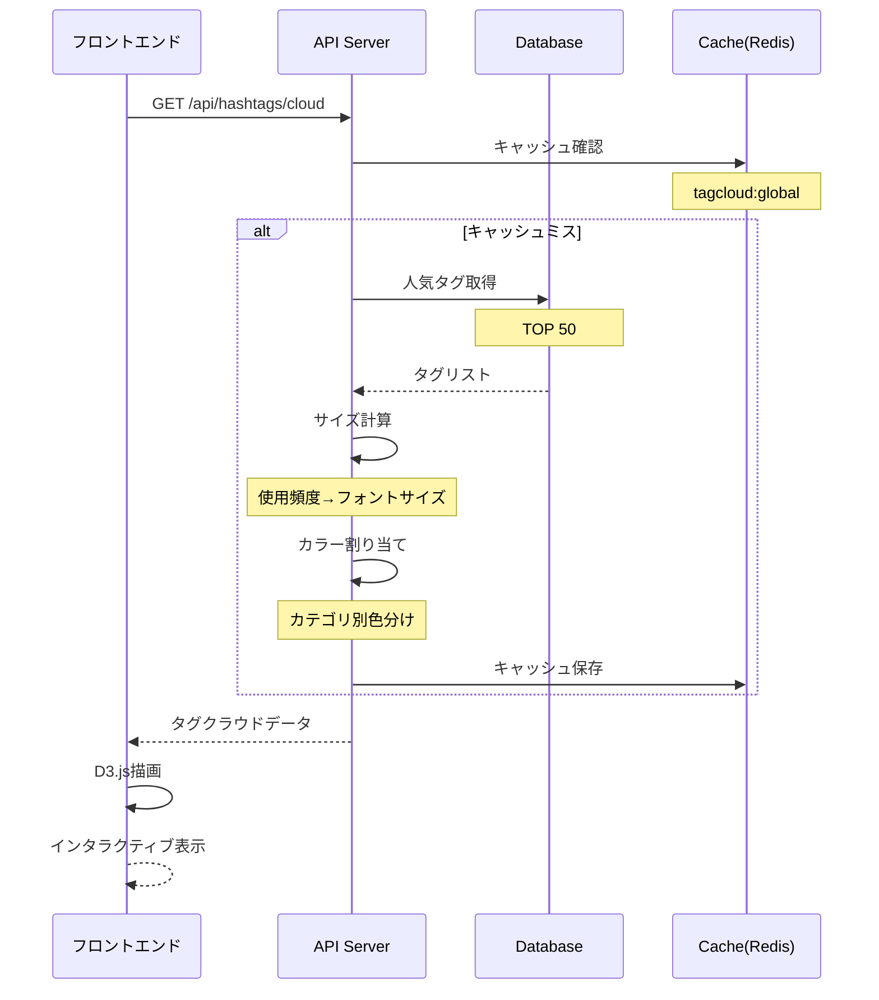

## ハッシュタグ自動補完

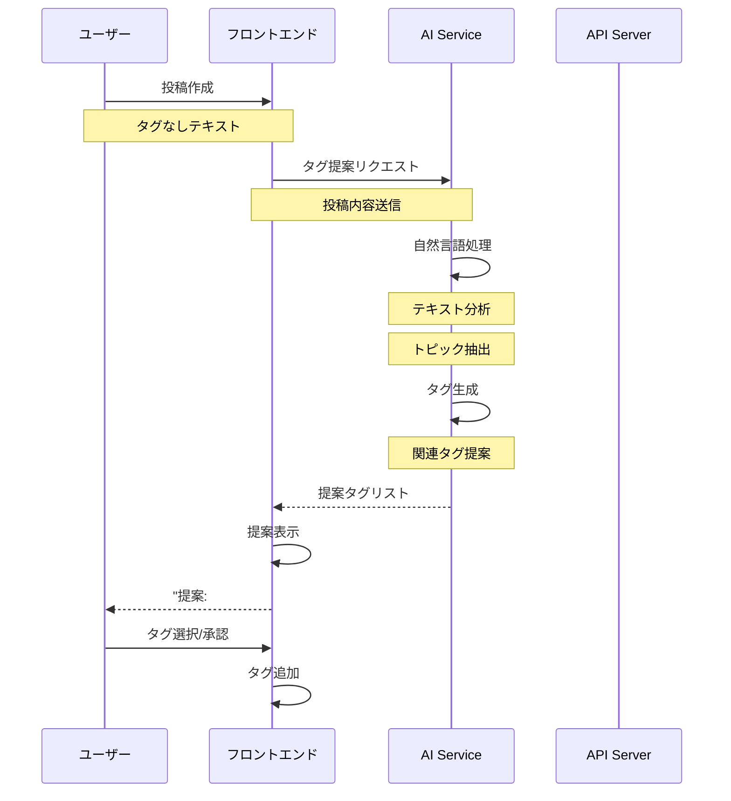

## ハッシュタグブラックリスト

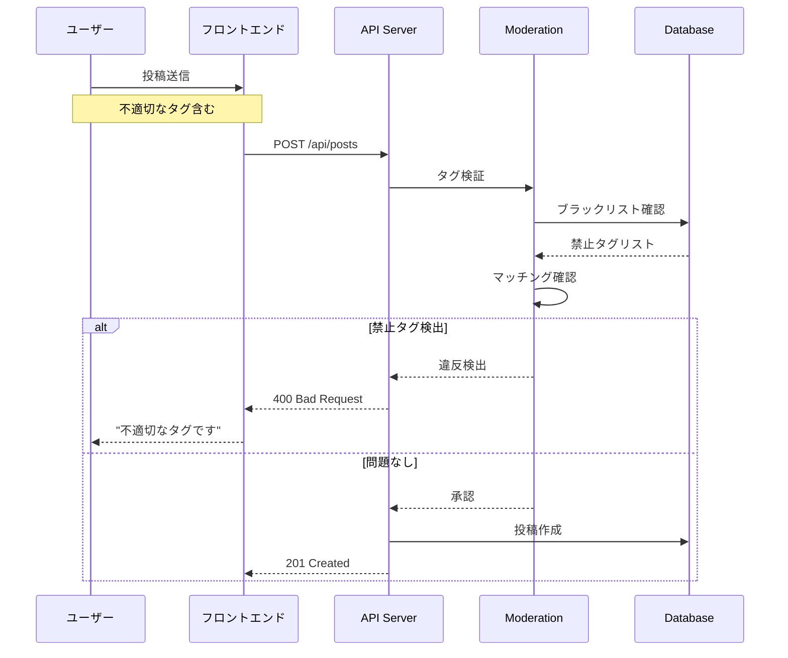

## ハッシュタグランキング

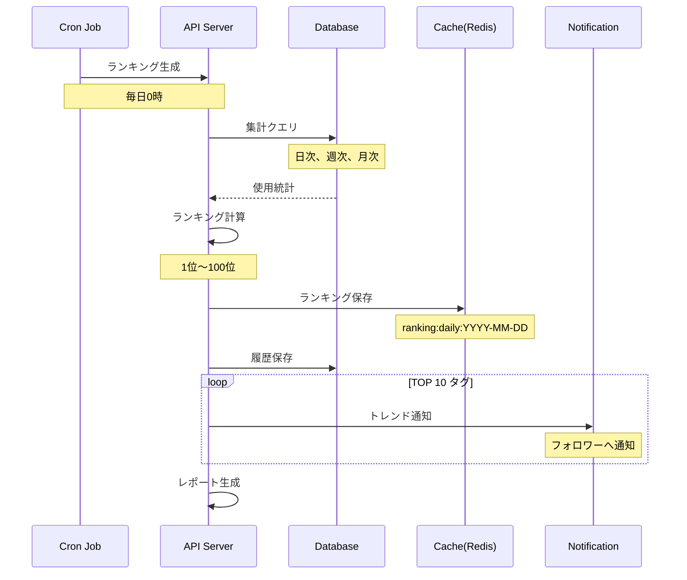

## ハッシュタグのインポート/エクスポート

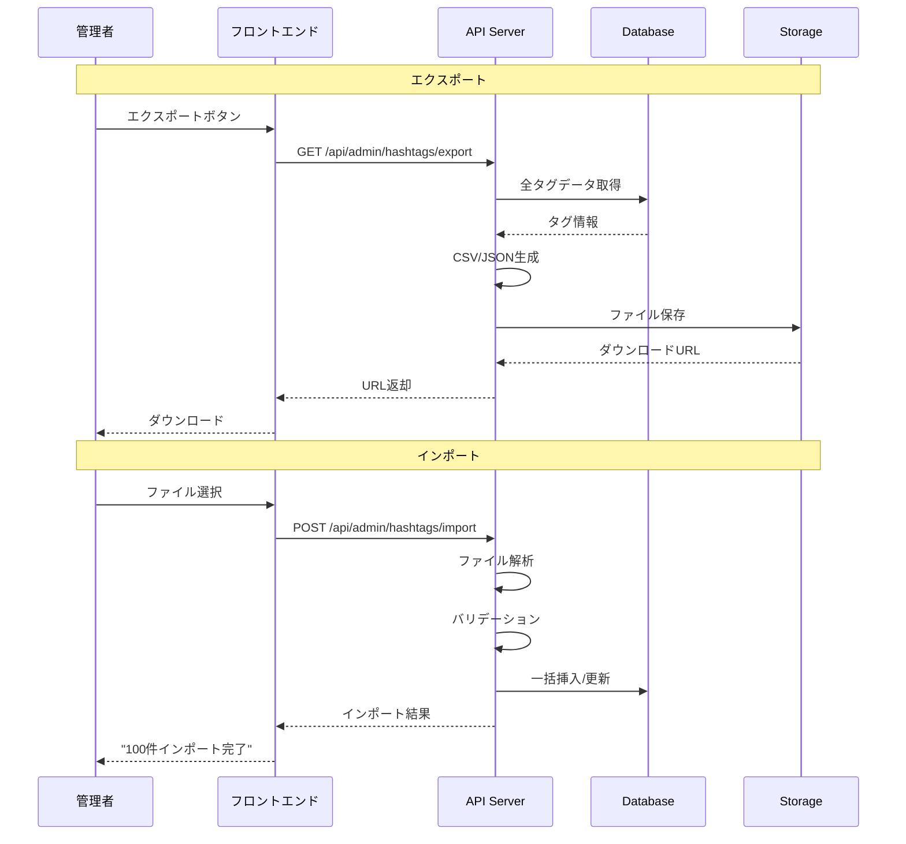