# メンション機能シーケンス図

## メンション入力と解析

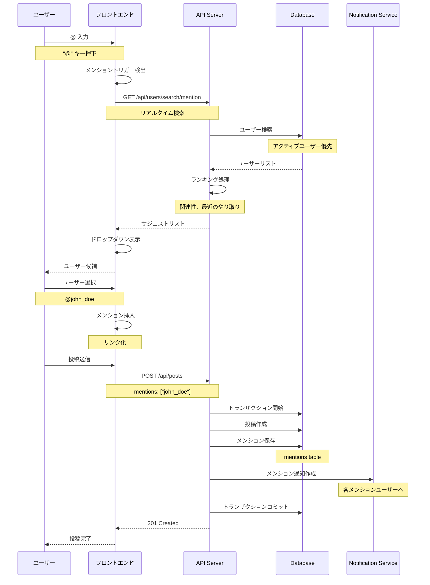

## メンションオートコンプリート

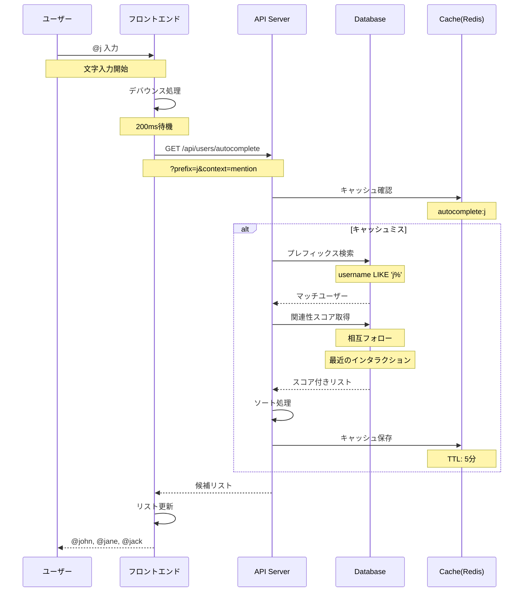

## コメント内メンション

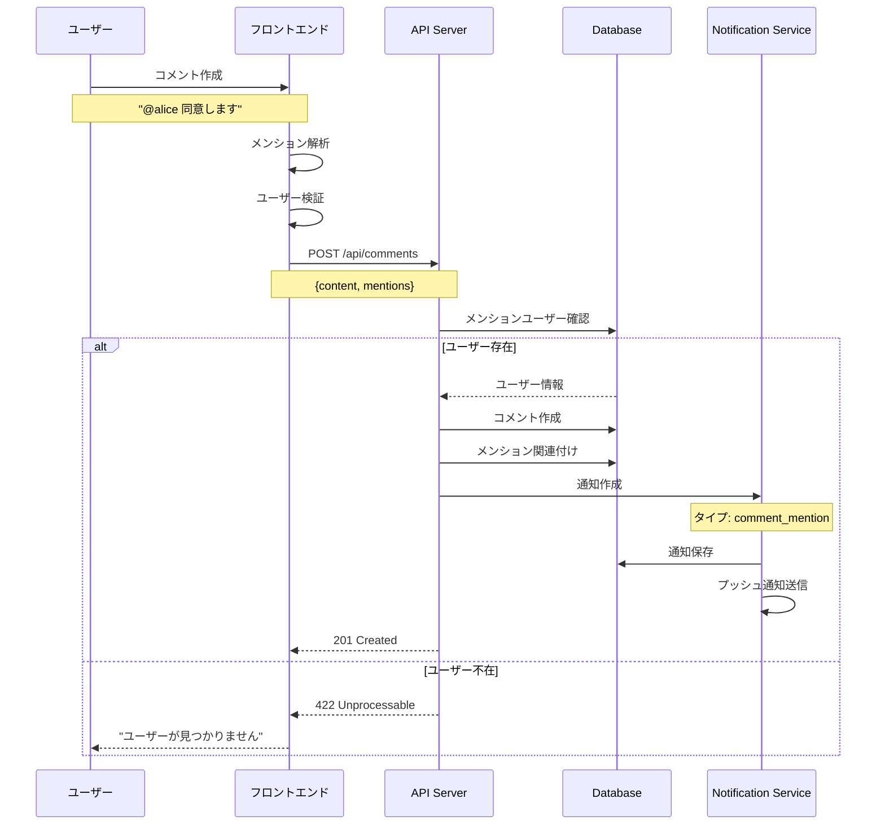

## メンション通知

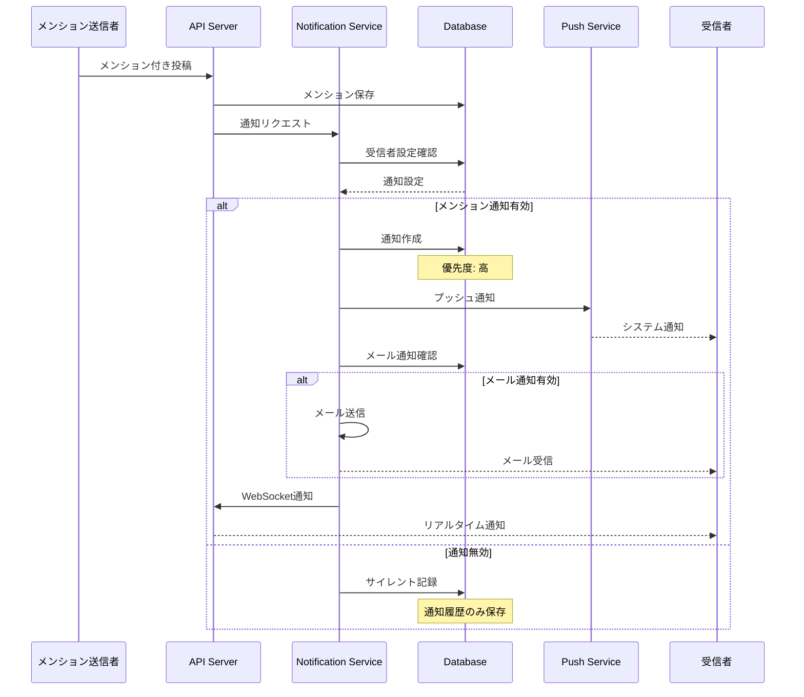

## グループメンション

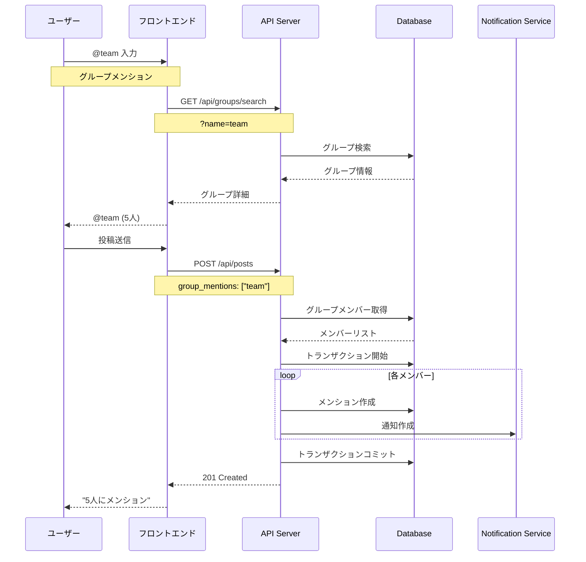

## メンション権限管理

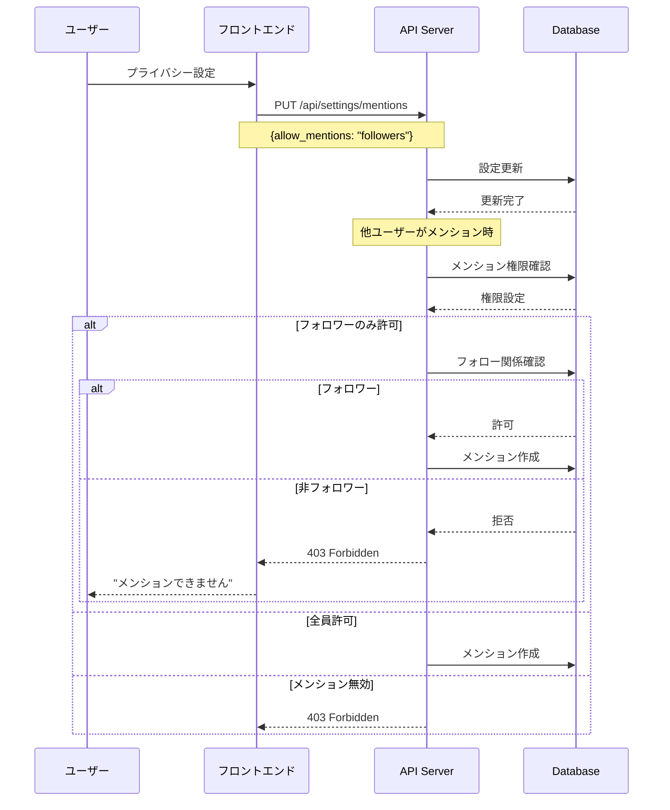

## メンション履歴

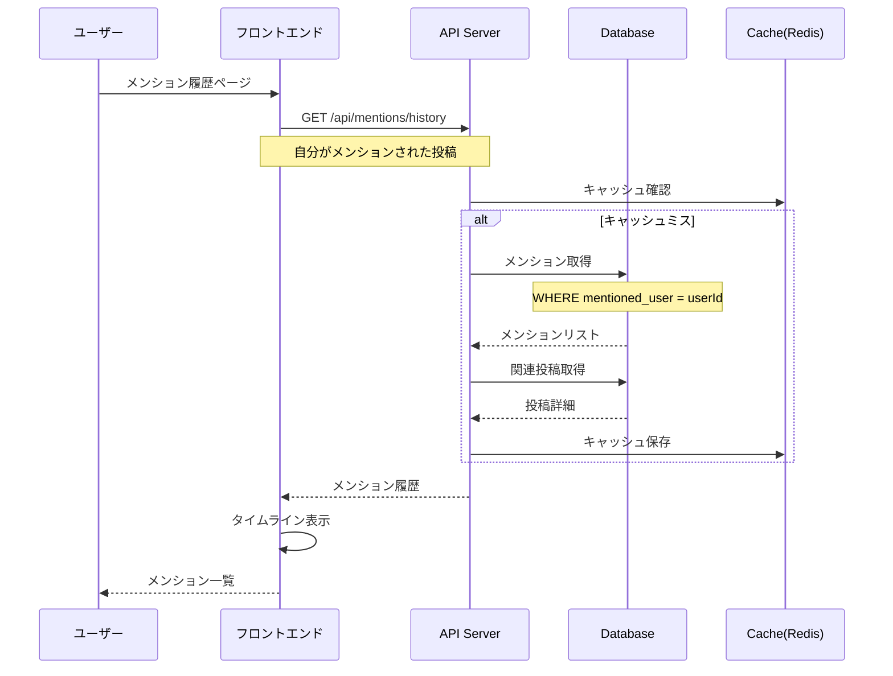

## スマートメンション提案

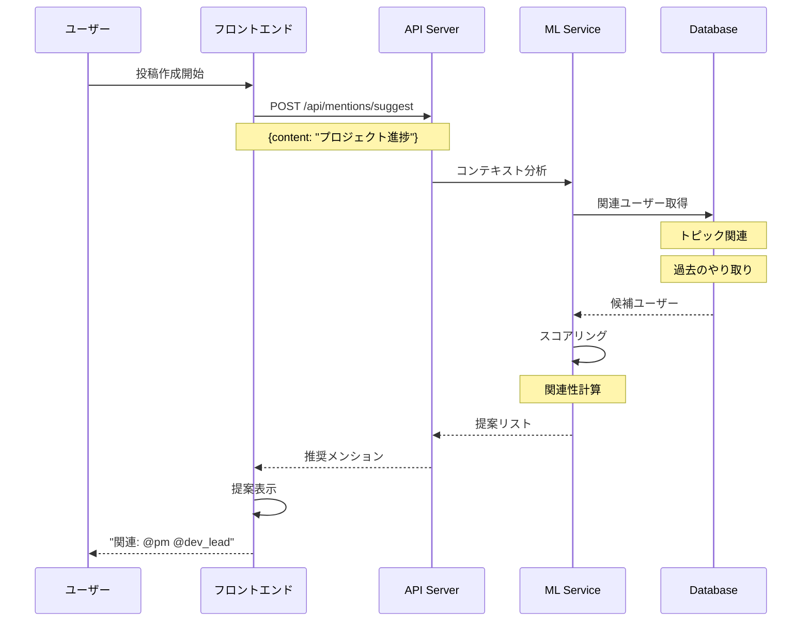

## メンションのエスケープ

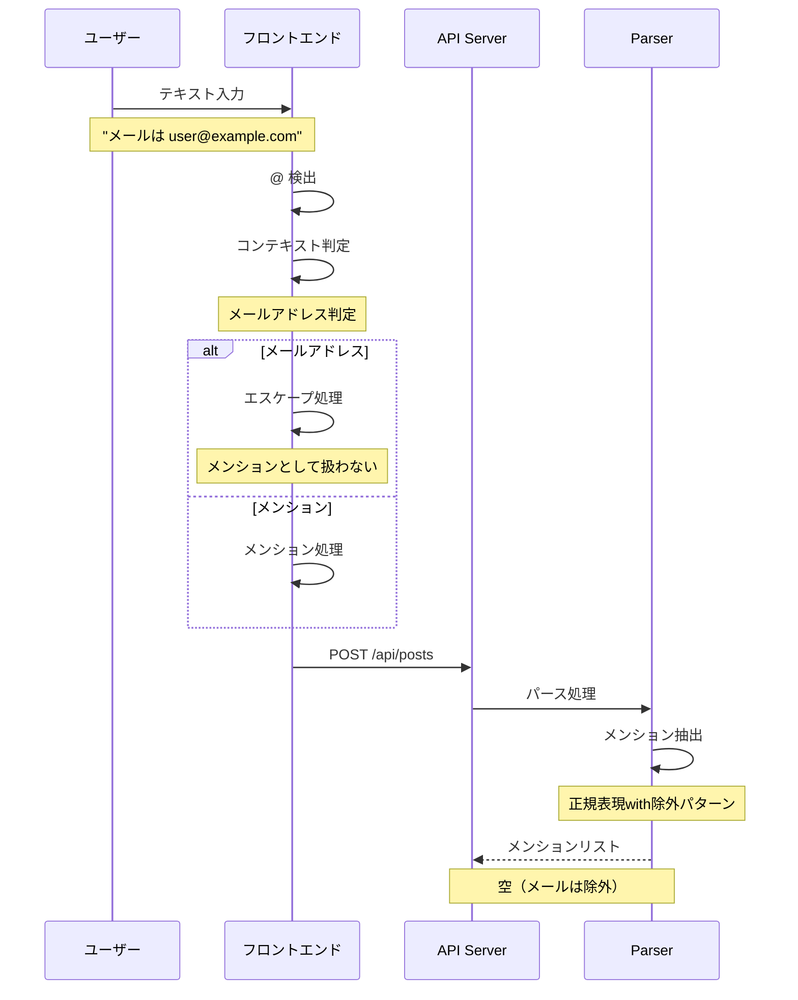

## メンション検索

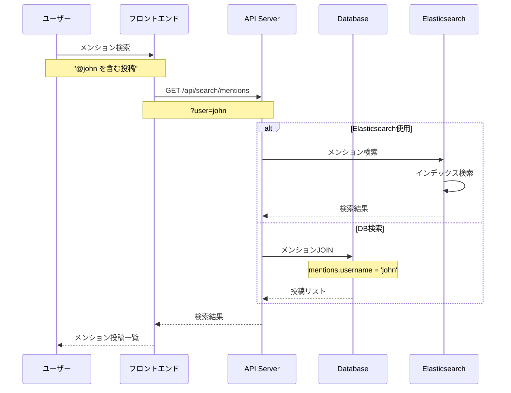

## メンション統計

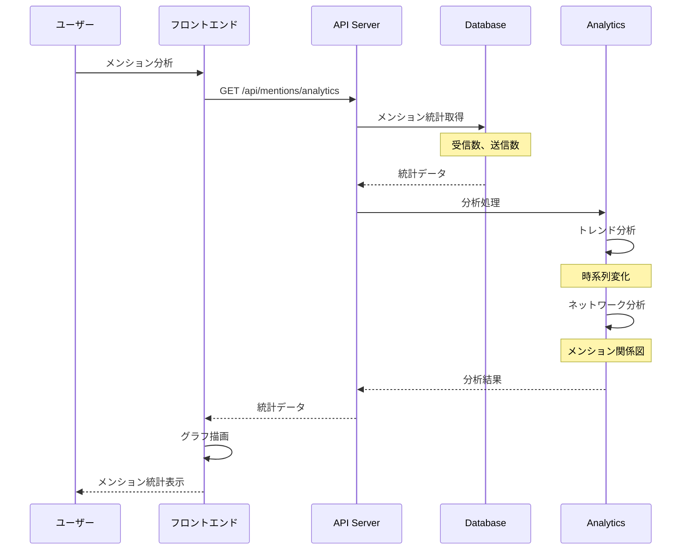

## リアルタイムメンション更新

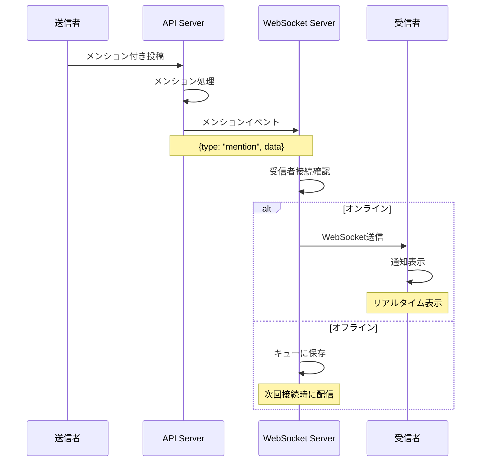