# リアルタイム更新機能シーケンス図

## WebSocket接続確立

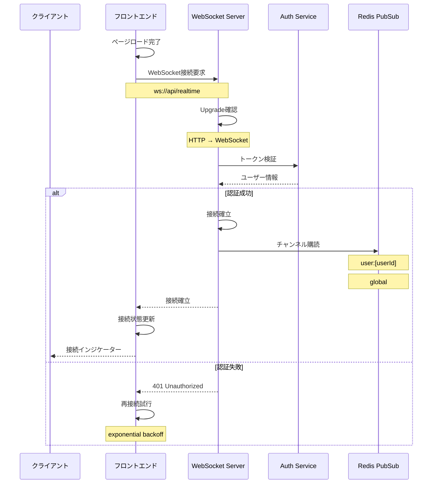
```mermaid
sequenceDiagram
    participant C as クライアント
    participant F as フロントエンド
    participant W as WebSocket Server
    participant A as Auth Service
    participant R as Redis PubSub

    F->>F: ページロード完了
    
    F->>W: WebSocket接続要求
    Note over F,W: ws://api/realtime
    
    W->>W: Upgrade確認
    Note over W: HTTP → WebSocket
    
    W->>A: トークン検証
    A-->>W: ユーザー情報
    
    alt 認証成功
        W->>W: 接続確立
        W->>R: チャンネル購読
        Note over R: user:[userId]
        Note over R: global
        
        W-->>F: 接続確立
        F->>F: 接続状態更新
        F-->>C: 接続インジケーター
    else 認証失敗
        W-->>F: 401 Unauthorized
        F->>F: 再接続試行
        Note over F: exponential backoff
    end
```

## リアルタイム投稿更新

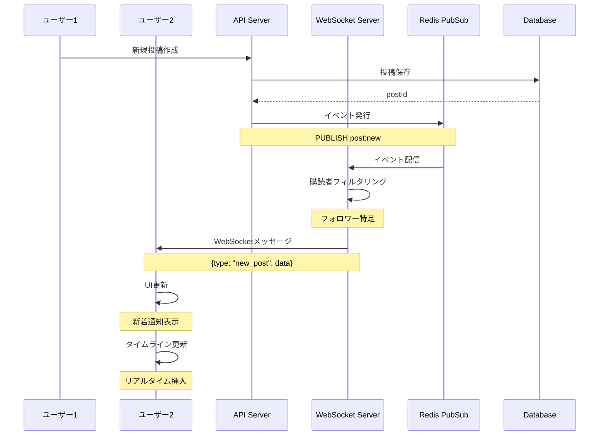
```mermaid
sequenceDiagram
    participant U1 as ユーザー1
    participant U2 as ユーザー2
    participant A as API Server
    participant W as WebSocket Server
    participant R as Redis PubSub
    participant D as Database

    U1->>A: 新規投稿作成
    
    A->>D: 投稿保存
    D-->>A: postId
    
    A->>R: イベント発行
    Note over A,R: PUBLISH post:new
    
    R->>W: イベント配信
    
    W->>W: 購読者フィルタリング
    Note over W: フォロワー特定
    
    W->>U2: WebSocketメッセージ
    Note over W,U2: {type: "new_post", data}
    
    U2->>U2: UI更新
    Note over U2: 新着通知表示
    
    U2->>U2: タイムライン更新
    Note over U2: リアルタイム挿入
```

## Server-Sent Events (SSE)

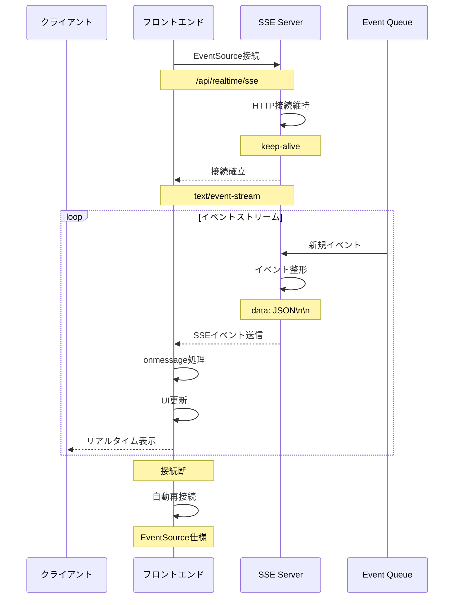
```mermaid
sequenceDiagram
    participant C as クライアント
    participant F as フロントエンド
    participant S as SSE Server
    participant Q as Event Queue

    F->>S: EventSource接続
    Note over F,S: /api/realtime/sse
    
    S->>S: HTTP接続維持
    Note over S: keep-alive
    
    S-->>F: 接続確立
    Note over S,F: text/event-stream
    
    loop イベントストリーム
        Q->>S: 新規イベント
        
        S->>S: イベント整形
        Note over S: data: JSON\n\n
        
        S-->>F: SSEイベント送信
        
        F->>F: onmessage処理
        F->>F: UI更新
        F-->>C: リアルタイム表示
    end
    
    Note over F: 接続断
    F->>F: 自動再接続
    Note over F: EventSource仕様
```

## リアルタイムコメント

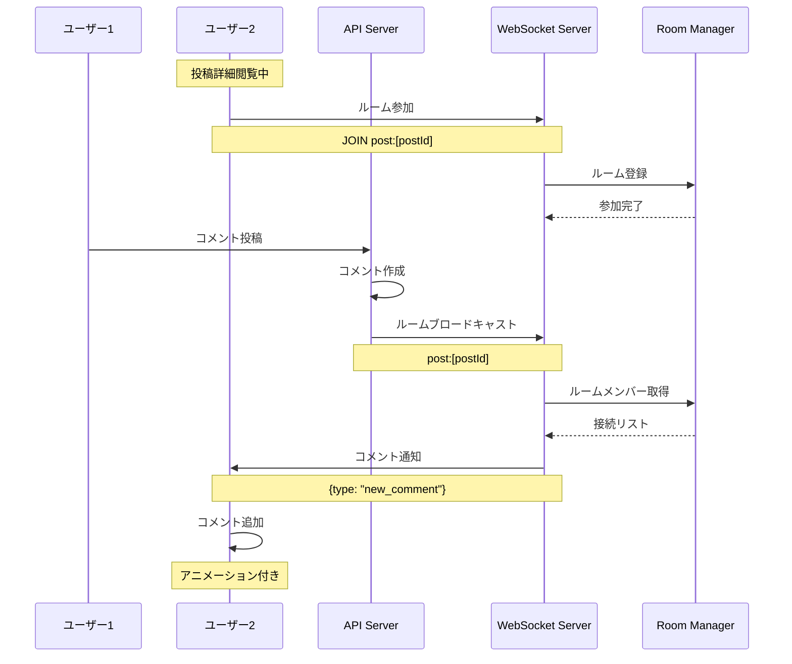
```mermaid
sequenceDiagram
    participant U1 as ユーザー1
    participant U2 as ユーザー2
    participant A as API Server
    participant W as WebSocket Server
    participant R as Room Manager

    Note over U2: 投稿詳細閲覧中
    
    U2->>W: ルーム参加
    Note over U2,W: JOIN post:[postId]
    
    W->>R: ルーム登録
    R-->>W: 参加完了
    
    U1->>A: コメント投稿
    
    A->>A: コメント作成
    
    A->>W: ルームブロードキャスト
    Note over A,W: post:[postId]
    
    W->>R: ルームメンバー取得
    R-->>W: 接続リスト
    
    W->>U2: コメント通知
    Note over W,U2: {type: "new_comment"}
    
    U2->>U2: コメント追加
    Note over U2: アニメーション付き
```

## リアルタイムいいね

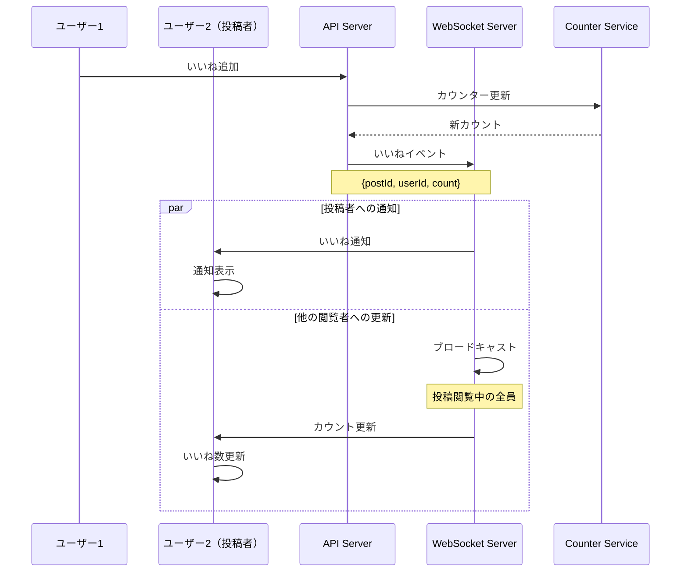
```mermaid
sequenceDiagram
    participant U1 as ユーザー1
    participant U2 as ユーザー2（投稿者）
    participant A as API Server
    participant W as WebSocket Server
    participant C as Counter Service

    U1->>A: いいね追加
    
    A->>C: カウンター更新
    C-->>A: 新カウント
    
    A->>W: いいねイベント
    Note over A,W: {postId, userId, count}
    
    par 投稿者への通知
        W->>U2: いいね通知
        U2->>U2: 通知表示
    and 他の閲覧者への更新
        W->>W: ブロードキャスト
        Note over W: 投稿閲覧中の全員
        W->>U2: カウント更新
        U2->>U2: いいね数更新
    end
```

## リアルタイムタイピングインジケーター

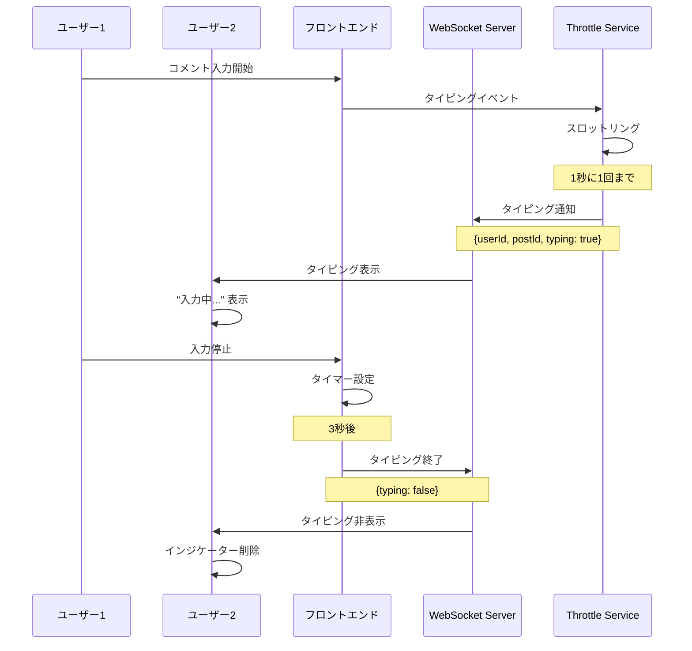
```mermaid
sequenceDiagram
    participant U1 as ユーザー1
    participant U2 as ユーザー2
    participant F as フロントエンド
    participant W as WebSocket Server
    participant T as Throttle Service

    U1->>F: コメント入力開始
    
    F->>T: タイピングイベント
    
    T->>T: スロットリング
    Note over T: 1秒に1回まで
    
    T->>W: タイピング通知
    Note over T,W: {userId, postId, typing: true}
    
    W->>U2: タイピング表示
    U2->>U2: "入力中..." 表示
    
    U1->>F: 入力停止
    
    F->>F: タイマー設定
    Note over F: 3秒後
    
    F->>W: タイピング終了
    Note over F,W: {typing: false}
    
    W->>U2: タイピング非表示
    U2->>U2: インジケーター削除
```

## オンラインステータス

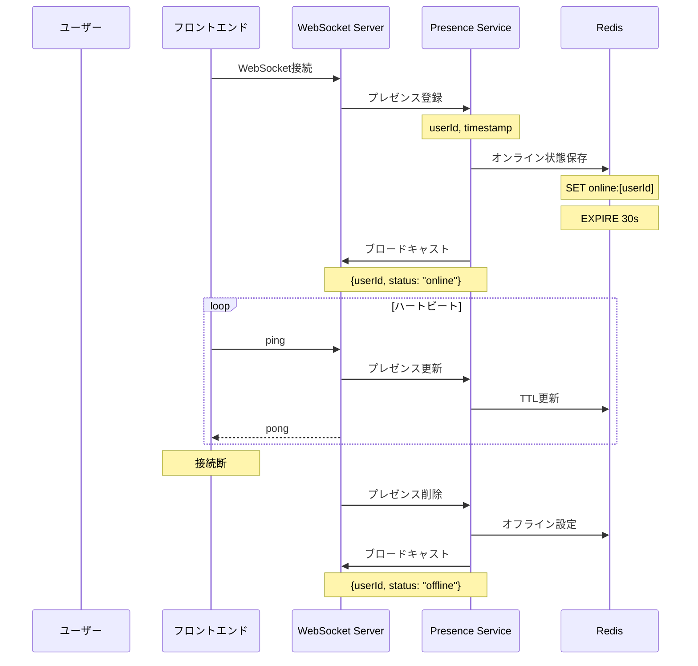
```mermaid
sequenceDiagram
    participant U as ユーザー
    participant F as フロントエンド
    participant W as WebSocket Server
    participant P as Presence Service
    participant R as Redis

    F->>W: WebSocket接続
    
    W->>P: プレゼンス登録
    Note over P: userId, timestamp
    
    P->>R: オンライン状態保存
    Note over R: SET online:[userId]
    Note over R: EXPIRE 30s
    
    P->>W: ブロードキャスト
    Note over P,W: {userId, status: "online"}
    
    loop ハートビート
        F->>W: ping
        W->>P: プレゼンス更新
        P->>R: TTL更新
        W-->>F: pong
    end
    
    Note over F: 接続断
    
    W->>P: プレゼンス削除
    P->>R: オフライン設定
    
    P->>W: ブロードキャスト
    Note over P,W: {userId, status: "offline"}
```

## リアルタイム通知バッジ

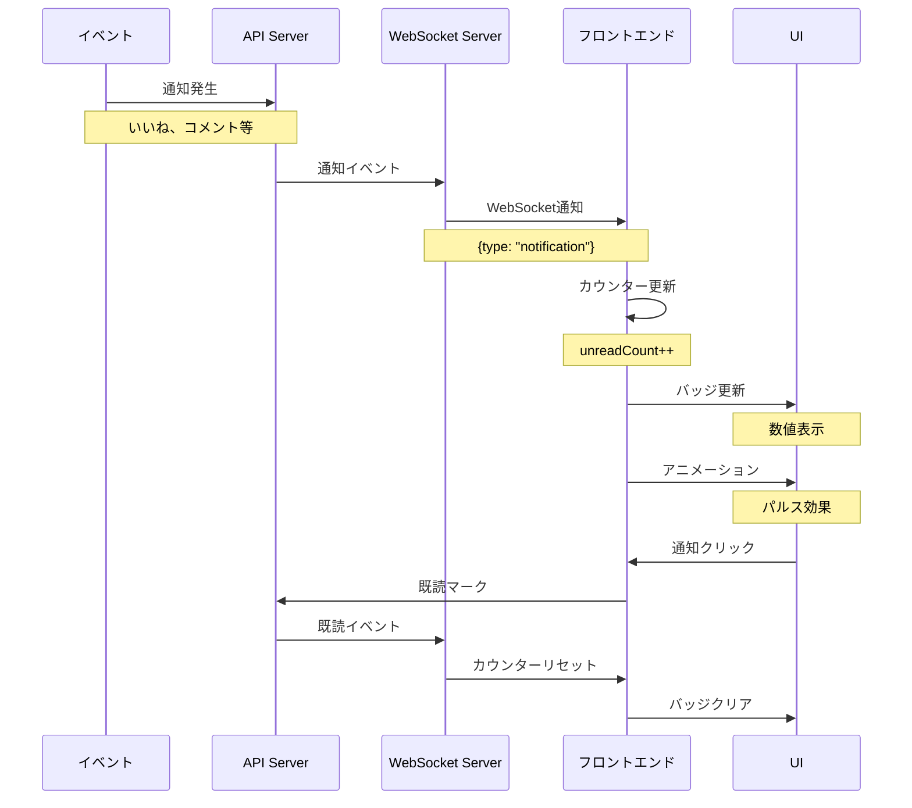
```mermaid
sequenceDiagram
    participant E as イベント
    participant A as API Server
    participant W as WebSocket Server
    participant F as フロントエンド
    participant U as UI

    E->>A: 通知発生
    Note over E,A: いいね、コメント等
    
    A->>W: 通知イベント
    
    W->>F: WebSocket通知
    Note over W,F: {type: "notification"}
    
    F->>F: カウンター更新
    Note over F: unreadCount++
    
    F->>U: バッジ更新
    Note over U: 数値表示
    
    F->>U: アニメーション
    Note over U: パルス効果
    
    U->>F: 通知クリック
    
    F->>A: 既読マーク
    A->>W: 既読イベント
    
    W->>F: カウンターリセット
    F->>U: バッジクリア
```

## リアルタイム検索結果

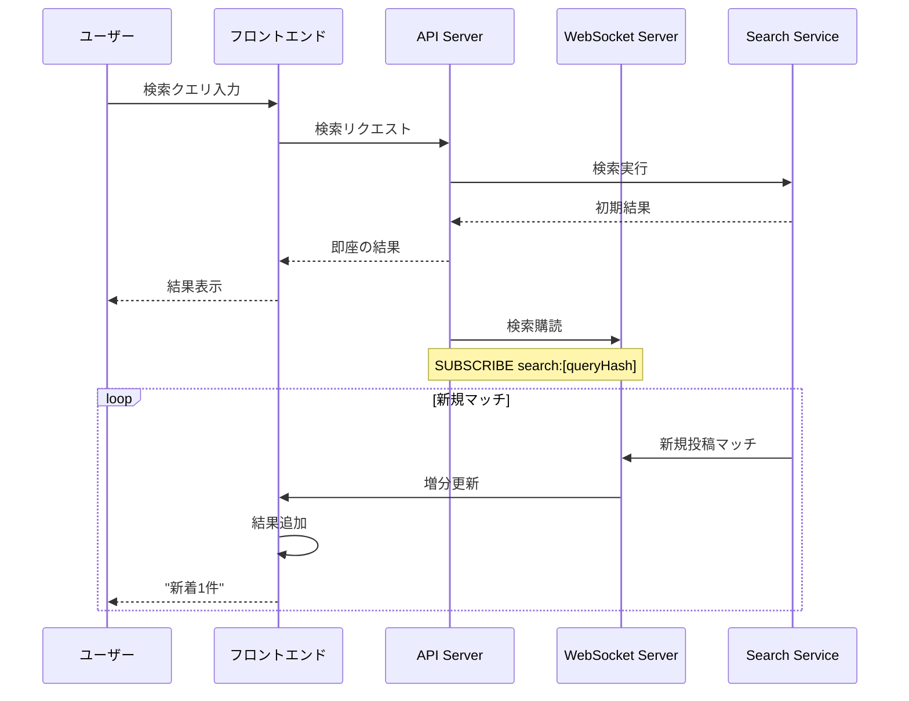
```mermaid
sequenceDiagram
    participant U as ユーザー
    participant F as フロントエンド
    participant A as API Server
    participant W as WebSocket Server
    participant S as Search Service

    U->>F: 検索クエリ入力
    
    F->>A: 検索リクエスト
    
    A->>S: 検索実行
    S-->>A: 初期結果
    
    A-->>F: 即座の結果
    F-->>U: 結果表示
    
    A->>W: 検索購読
    Note over A,W: SUBSCRIBE search:[queryHash]
    
    loop 新規マッチ
        S->>W: 新規投稿マッチ
        W->>F: 増分更新
        F->>F: 結果追加
        F-->>U: "新着1件"
    end
```

## リアルタイム同期（楽観的更新）

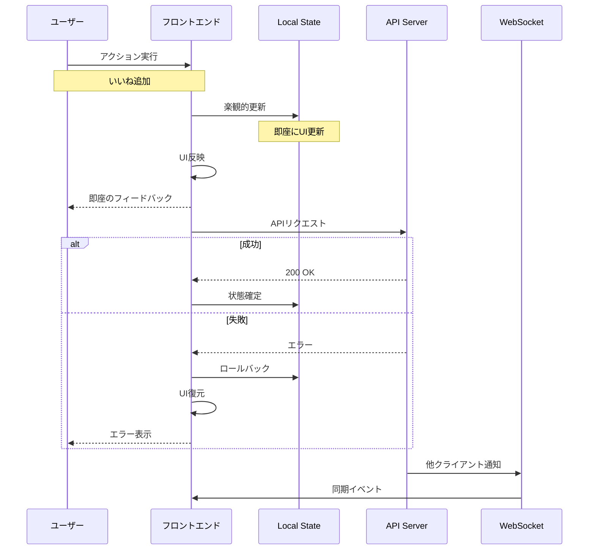
```mermaid
sequenceDiagram
    participant U as ユーザー
    participant F as フロントエンド
    participant L as Local State
    participant A as API Server
    participant W as WebSocket

    U->>F: アクション実行
    Note over U,F: いいね追加
    
    F->>L: 楽観的更新
    Note over L: 即座にUI更新
    
    F->>F: UI反映
    F-->>U: 即座のフィードバック
    
    F->>A: APIリクエスト
    
    alt 成功
        A-->>F: 200 OK
        F->>L: 状態確定
    else 失敗
        A-->>F: エラー
        F->>L: ロールバック
        F->>F: UI復元
        F-->>U: エラー表示
    end
    
    A->>W: 他クライアント通知
    W->>F: 同期イベント
```

## リアルタイムコラボレーション

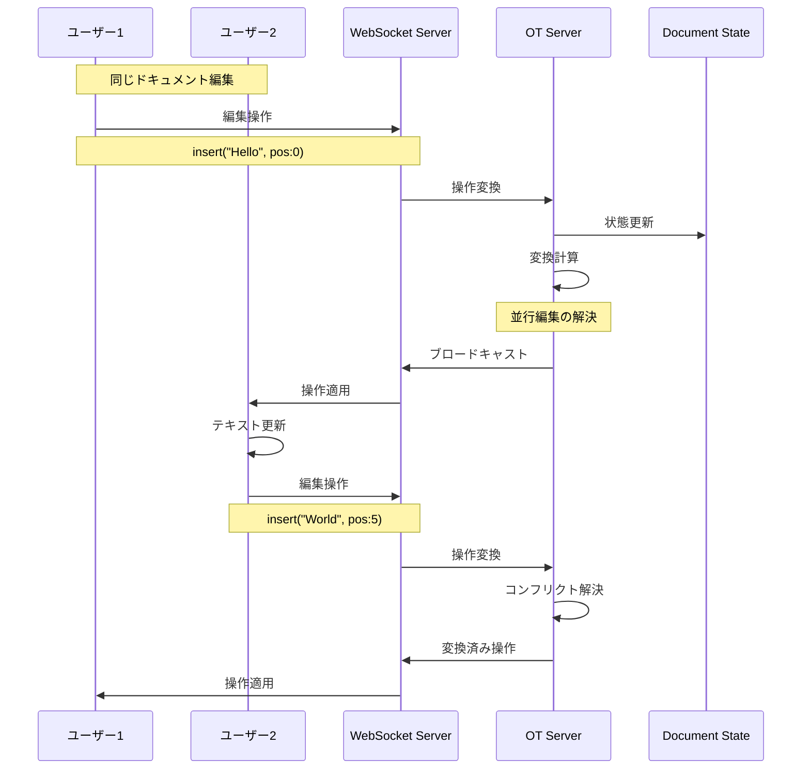
```mermaid
sequenceDiagram
    participant U1 as ユーザー1
    participant U2 as ユーザー2
    participant W as WebSocket Server
    participant O as OT Server
    participant D as Document State

    Note over U1,U2: 同じドキュメント編集
    
    U1->>W: 編集操作
    Note over U1,W: insert("Hello", pos:0)
    
    W->>O: 操作変換
    
    O->>D: 状態更新
    
    O->>O: 変換計算
    Note over O: 並行編集の解決
    
    O->>W: ブロードキャスト
    
    W->>U2: 操作適用
    U2->>U2: テキスト更新
    
    U2->>W: 編集操作
    Note over U2,W: insert("World", pos:5)
    
    W->>O: 操作変換
    O->>O: コンフリクト解決
    
    O->>W: 変換済み操作
    W->>U1: 操作適用
```

## 接続管理とフォールバック

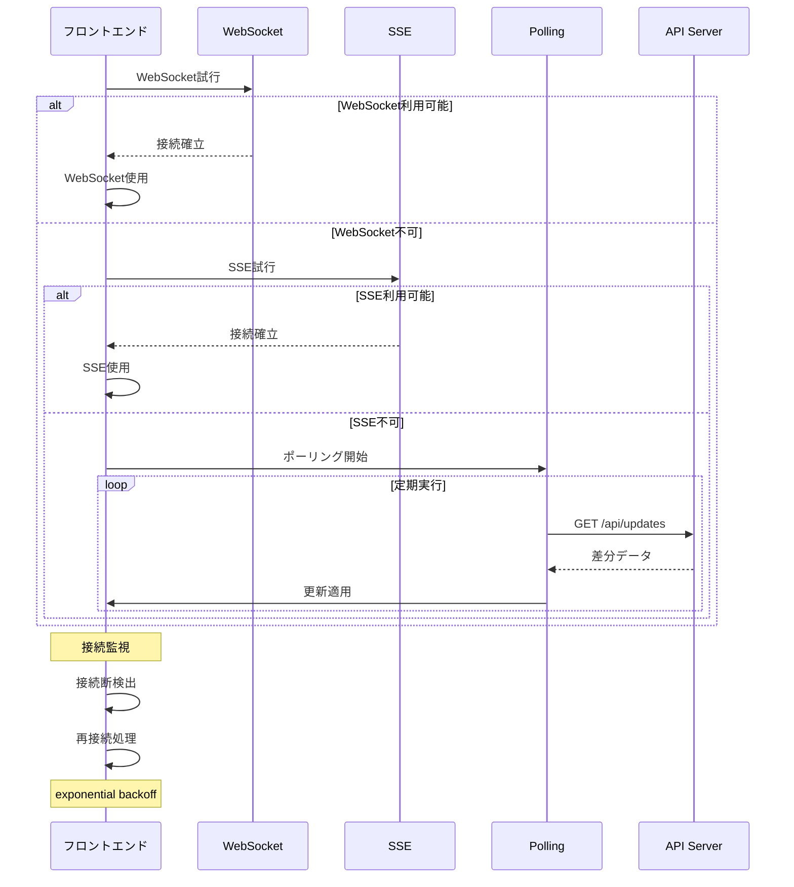
```mermaid
sequenceDiagram
    participant F as フロントエンド
    participant W as WebSocket
    participant S as SSE
    participant P as Polling
    participant A as API Server

    F->>W: WebSocket試行
    
    alt WebSocket利用可能
        W-->>F: 接続確立
        F->>F: WebSocket使用
    else WebSocket不可
        F->>S: SSE試行
        alt SSE利用可能
            S-->>F: 接続確立
            F->>F: SSE使用
        else SSE不可
            F->>P: ポーリング開始
            loop 定期実行
                P->>A: GET /api/updates
                A-->>P: 差分データ
                P->>F: 更新適用
            end
        end
    end
    
    Note over F: 接続監視
    
    F->>F: 接続断検出
    F->>F: 再接続処理
    Note over F: exponential backoff
```

## リアルタイムアナリティクス

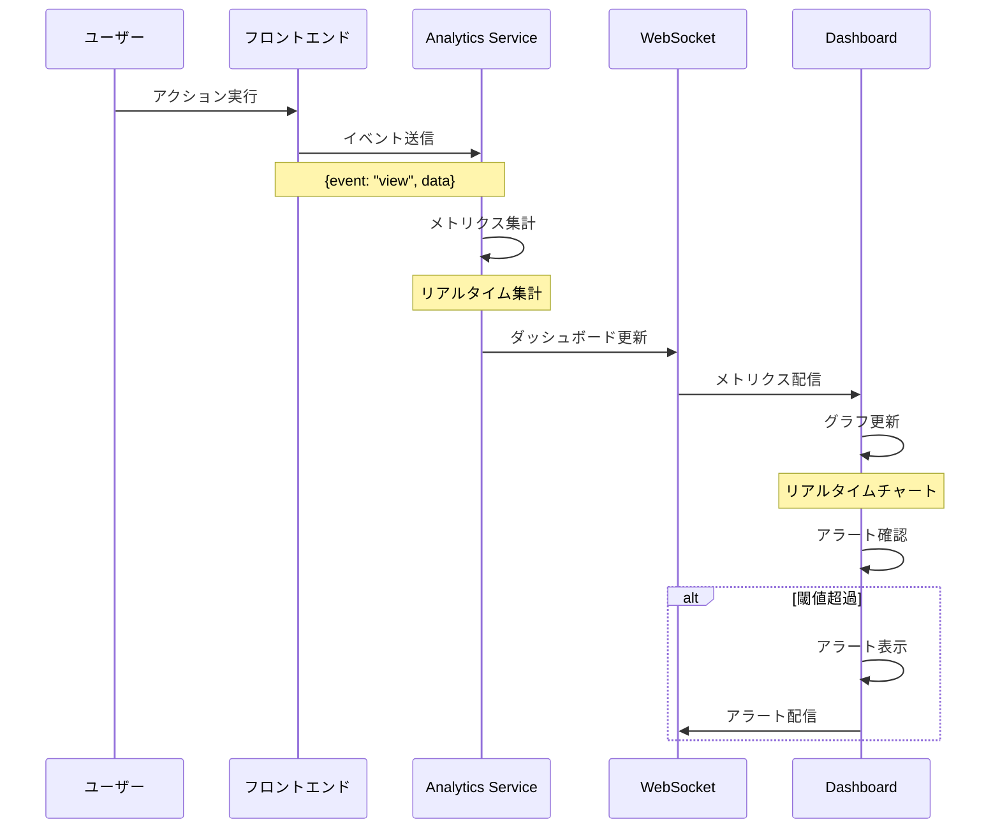
```mermaid
sequenceDiagram
    participant U as ユーザー
    participant F as フロントエンド
    participant A as Analytics Service
    participant W as WebSocket
    participant D as Dashboard

    U->>F: アクション実行
    
    F->>A: イベント送信
    Note over F,A: {event: "view", data}
    
    A->>A: メトリクス集計
    Note over A: リアルタイム集計
    
    A->>W: ダッシュボード更新
    
    W->>D: メトリクス配信
    
    D->>D: グラフ更新
    Note over D: リアルタイムチャート
    
    D->>D: アラート確認
    alt 閾値超過
        D->>D: アラート表示
        D->>W: アラート配信
    end
```