# PWA機能シーケンス図

## ServiceWorker登録

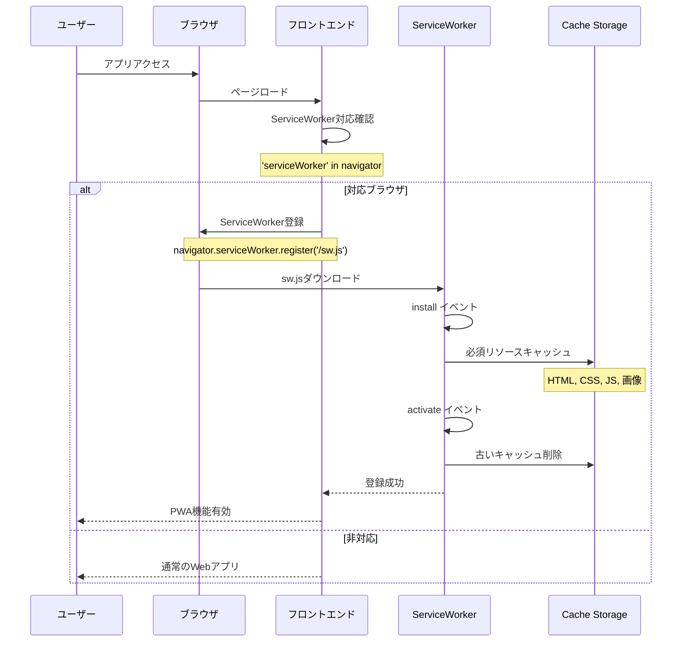

## オフライン対応

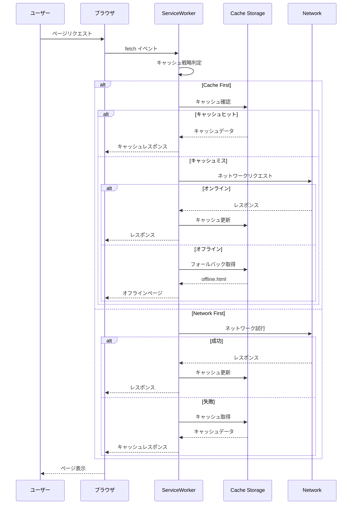

## アプリインストール

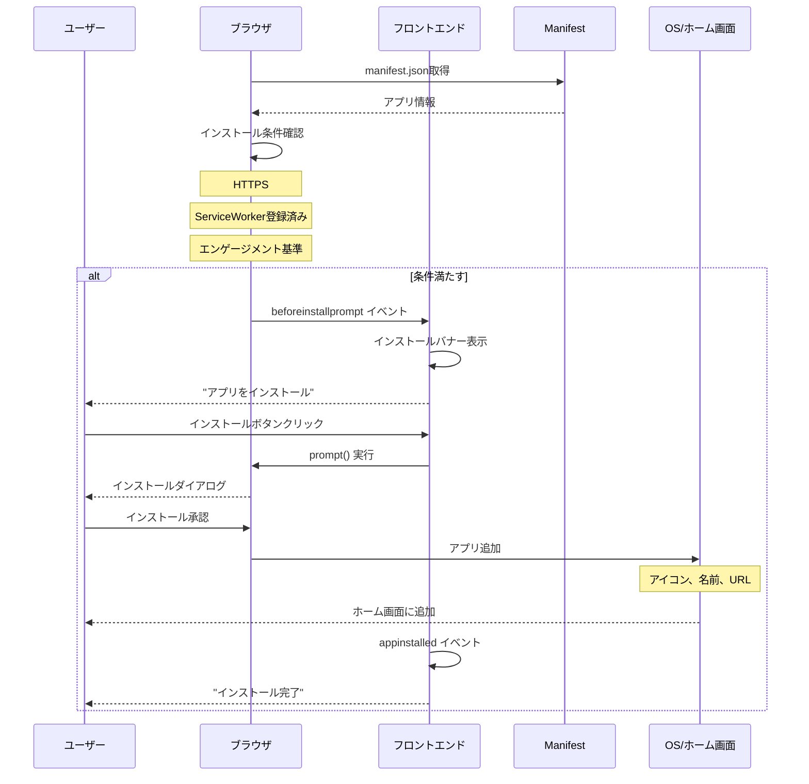

## プッシュ通知購読

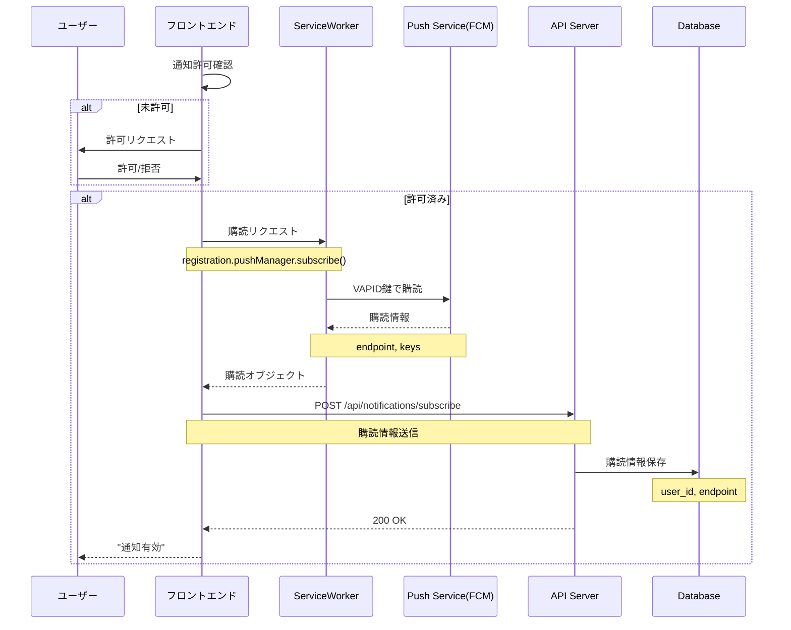

## バックグラウンド同期

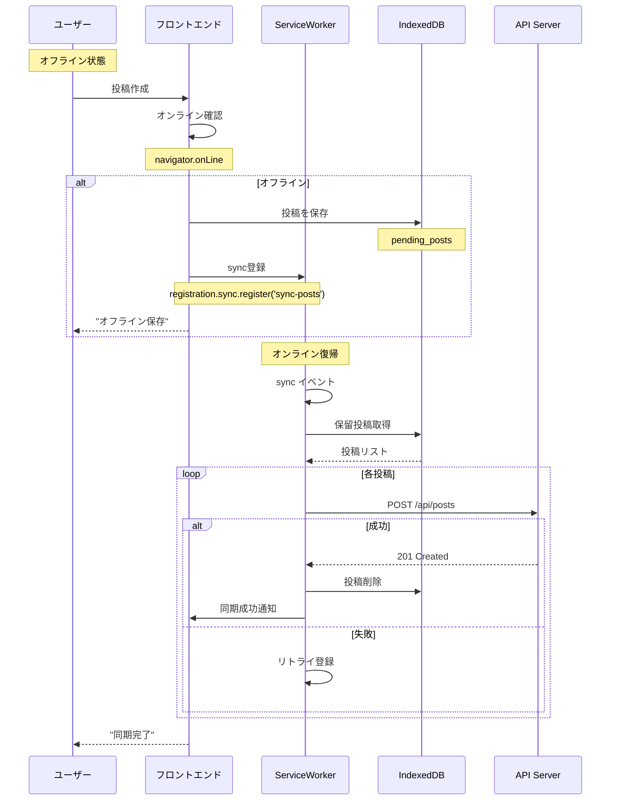

## キャッシュ更新戦略

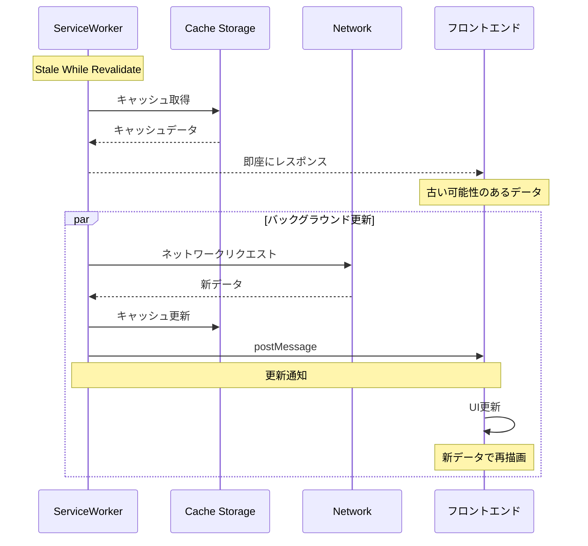

## アプリ更新

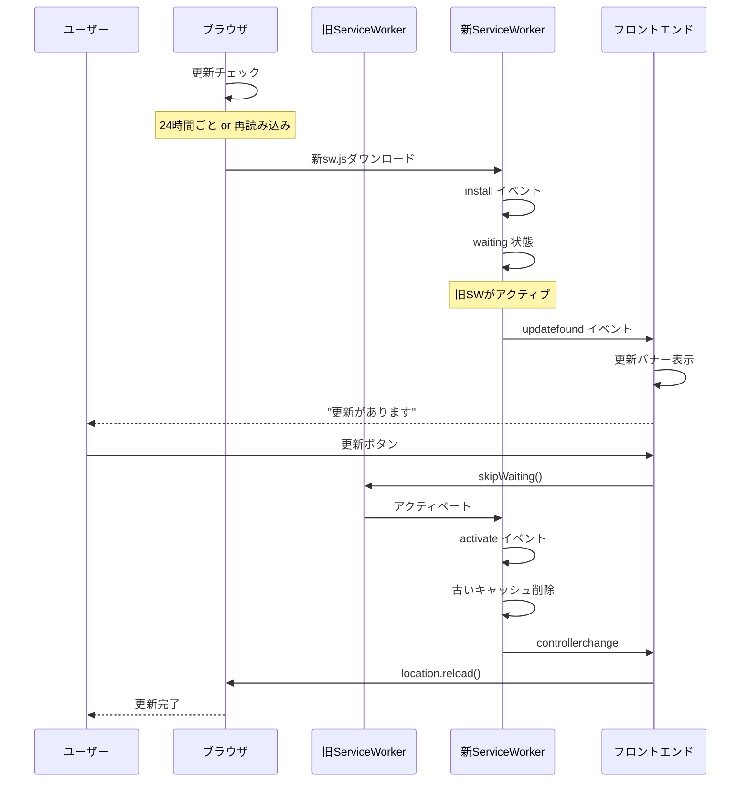

## ホーム画面から起動

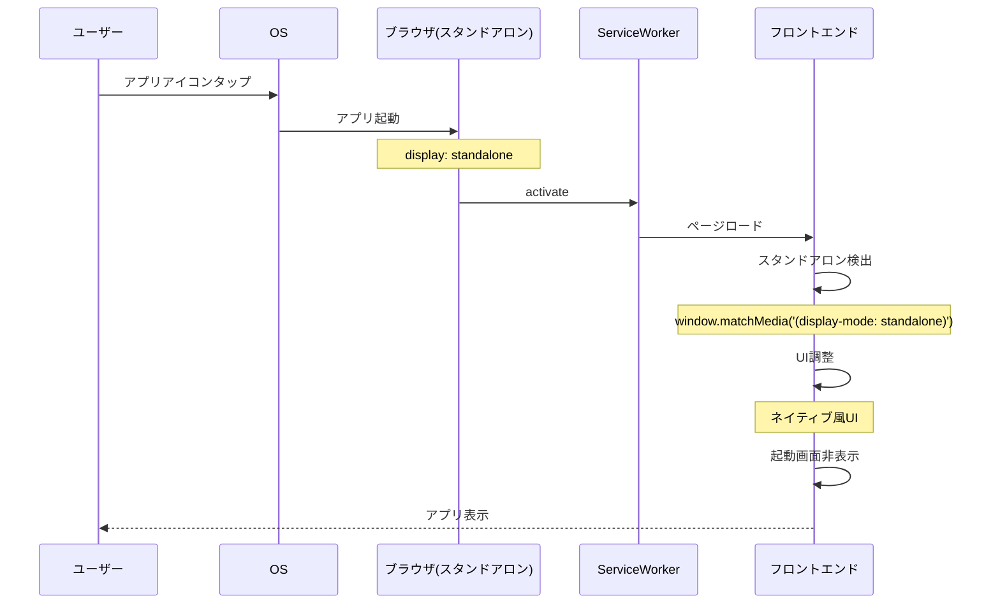

## Web Share API

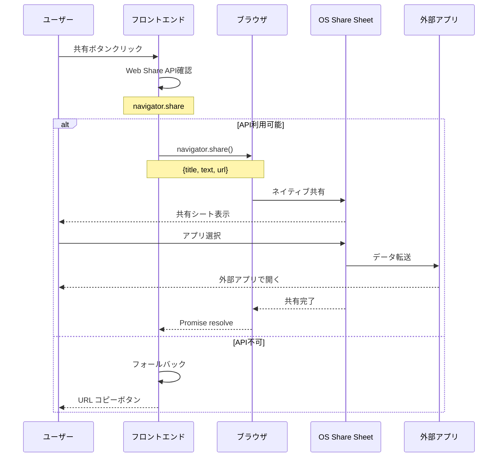

## IndexedDBでのデータ永続化

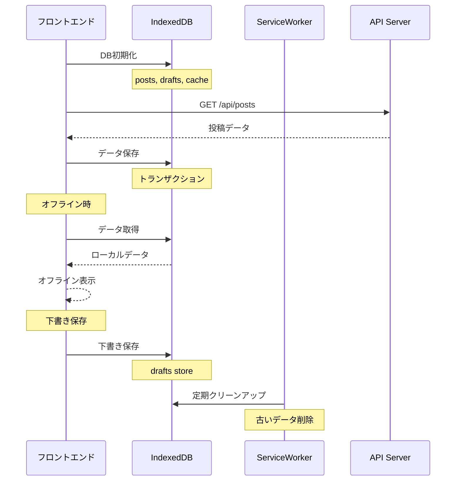

## パフォーマンス最適化

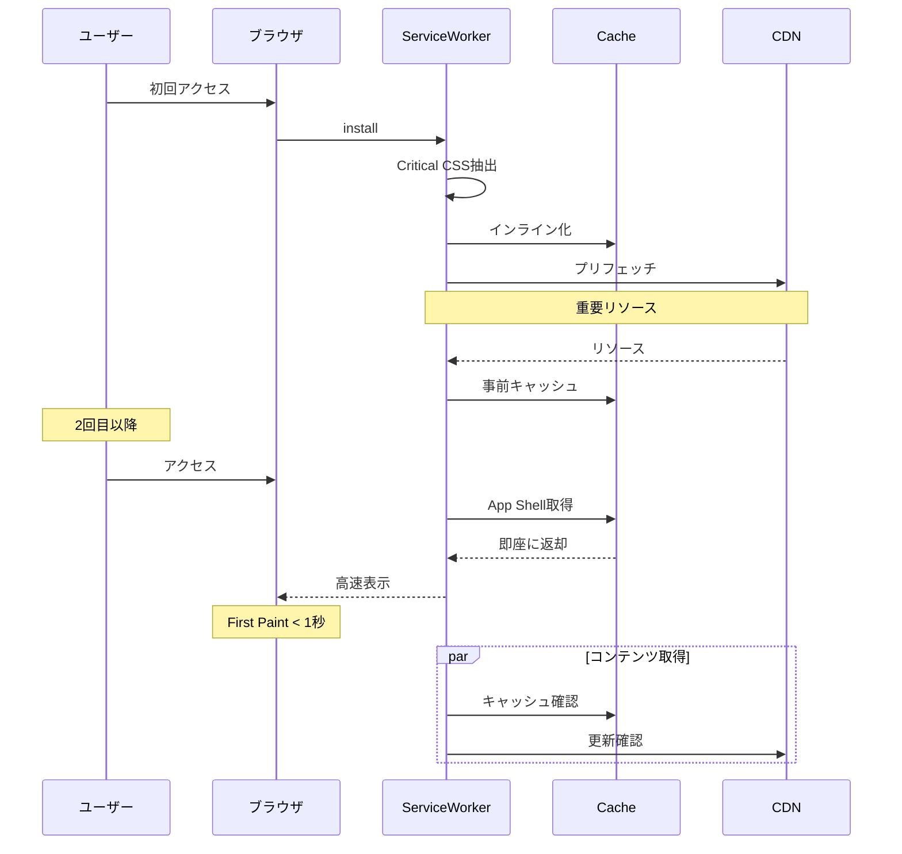

## Web App Manifest

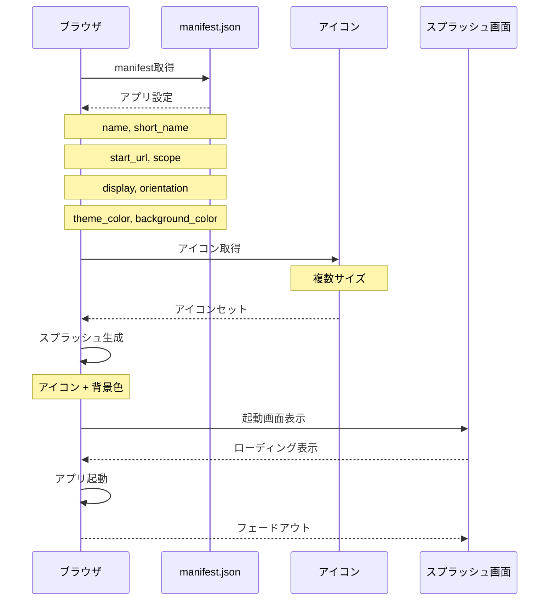