# データベース設計図

## ER図（全体）

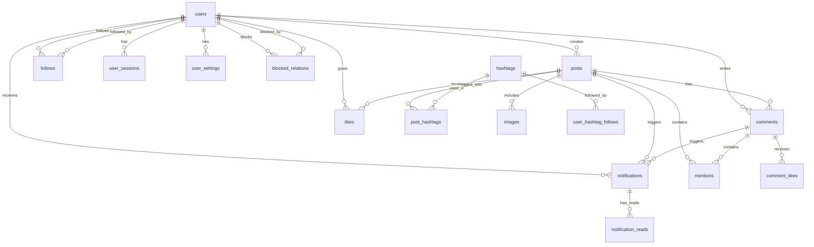
```mermaid
erDiagram
    users ||--o{ posts : creates
    users ||--o{ comments : writes
    users ||--o{ likes : gives
    users ||--o{ follows : follows
    users ||--o{ follows : followed_by
    users ||--o{ notifications : receives
    users ||--o{ user_sessions : has
    users ||--o{ user_settings : has
    users ||--o{ blocked_relations : blocks
    users ||--o{ blocked_relations : blocked_by
    
    posts ||--o{ comments : has
    posts ||--o{ likes : receives
    posts ||--o{ post_hashtags : tagged_with
    posts ||--o{ mentions : contains
    posts ||--o{ images : includes
    posts ||--o{ notifications : triggers
    
    hashtags ||--o{ post_hashtags : used_in
    hashtags ||--o{ user_hashtag_follows : followed_by
    
    comments ||--o{ comment_likes : receives
    comments ||--o{ mentions : contains
    comments ||--o{ notifications : triggers
    
    notifications ||--o{ notification_reads : has_reads
```

## テーブル詳細設計

### Users テーブル

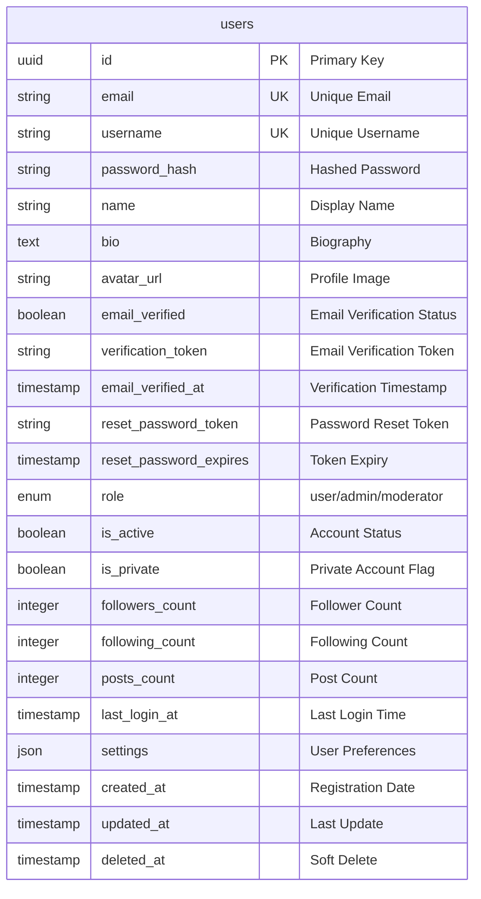
```mermaid
erDiagram
    users {
        uuid id PK "Primary Key"
        string email UK "Unique Email"
        string username UK "Unique Username"
        string password_hash "Hashed Password"
        string name "Display Name"
        text bio "Biography"
        string avatar_url "Profile Image"
        boolean email_verified "Email Verification Status"
        string verification_token "Email Verification Token"
        timestamp email_verified_at "Verification Timestamp"
        string reset_password_token "Password Reset Token"
        timestamp reset_password_expires "Token Expiry"
        enum role "user/admin/moderator"
        boolean is_active "Account Status"
        boolean is_private "Private Account Flag"
        integer followers_count "Follower Count"
        integer following_count "Following Count"
        integer posts_count "Post Count"
        timestamp last_login_at "Last Login Time"
        json settings "User Preferences"
        timestamp created_at "Registration Date"
        timestamp updated_at "Last Update"
        timestamp deleted_at "Soft Delete"
    }
```

### Posts テーブル

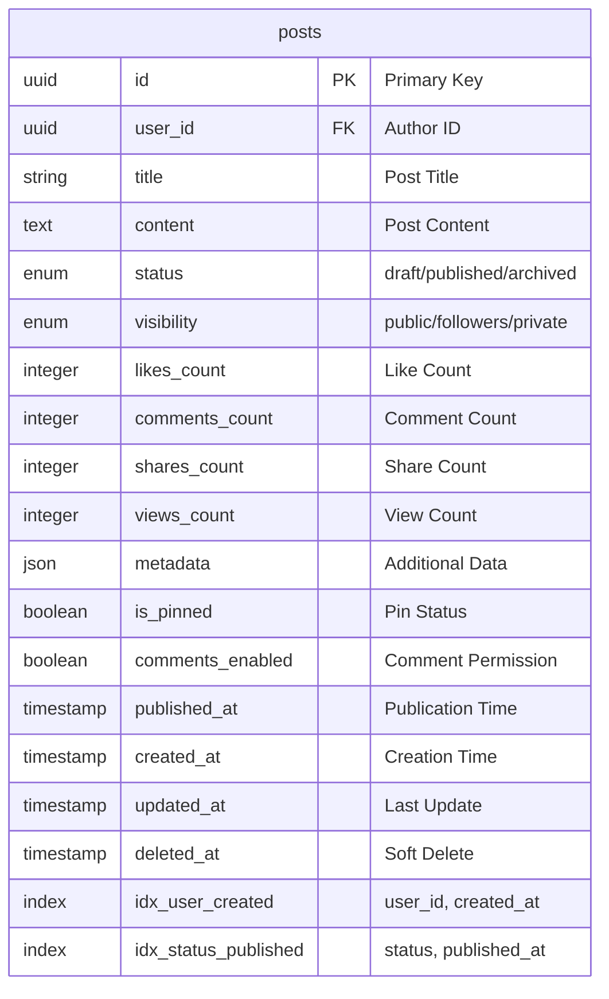
```mermaid
erDiagram
    posts {
        uuid id PK "Primary Key"
        uuid user_id FK "Author ID"
        string title "Post Title"
        text content "Post Content"
        enum status "draft/published/archived"
        enum visibility "public/followers/private"
        integer likes_count "Like Count"
        integer comments_count "Comment Count"
        integer shares_count "Share Count"
        integer views_count "View Count"
        json metadata "Additional Data"
        boolean is_pinned "Pin Status"
        boolean comments_enabled "Comment Permission"
        timestamp published_at "Publication Time"
        timestamp created_at "Creation Time"
        timestamp updated_at "Last Update"
        timestamp deleted_at "Soft Delete"
        index idx_user_created "user_id, created_at"
        index idx_status_published "status, published_at"
    }
```

### Comments テーブル

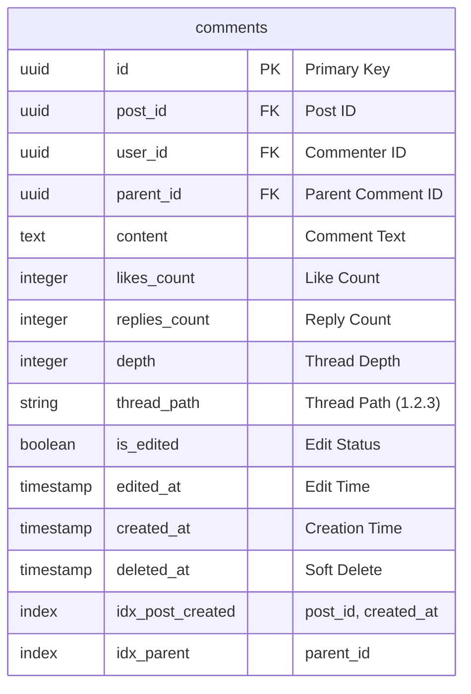
```mermaid
erDiagram
    comments {
        uuid id PK "Primary Key"
        uuid post_id FK "Post ID"
        uuid user_id FK "Commenter ID"
        uuid parent_id FK "Parent Comment ID"
        text content "Comment Text"
        integer likes_count "Like Count"
        integer replies_count "Reply Count"
        integer depth "Thread Depth"
        string thread_path "Thread Path (1.2.3)"
        boolean is_edited "Edit Status"
        timestamp edited_at "Edit Time"
        timestamp created_at "Creation Time"
        timestamp deleted_at "Soft Delete"
        index idx_post_created "post_id, created_at"
        index idx_parent "parent_id"
    }
```

### Likes テーブル

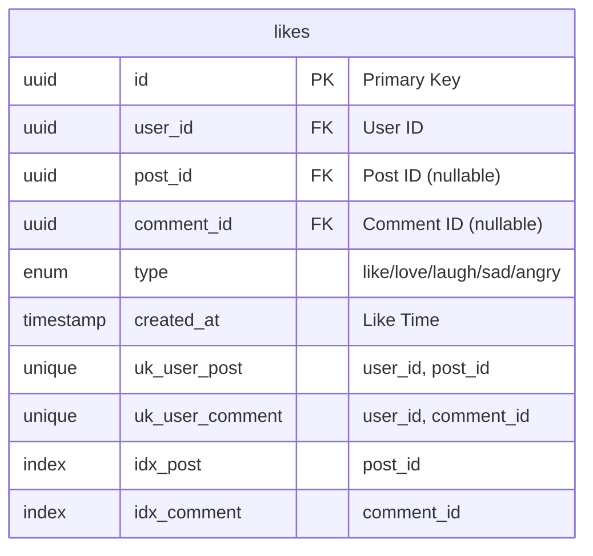
```mermaid
erDiagram
    likes {
        uuid id PK "Primary Key"
        uuid user_id FK "User ID"
        uuid post_id FK "Post ID (nullable)"
        uuid comment_id FK "Comment ID (nullable)"
        enum type "like/love/laugh/sad/angry"
        timestamp created_at "Like Time"
        unique uk_user_post "user_id, post_id"
        unique uk_user_comment "user_id, comment_id"
        index idx_post "post_id"
        index idx_comment "comment_id"
    }
```

### Follows テーブル

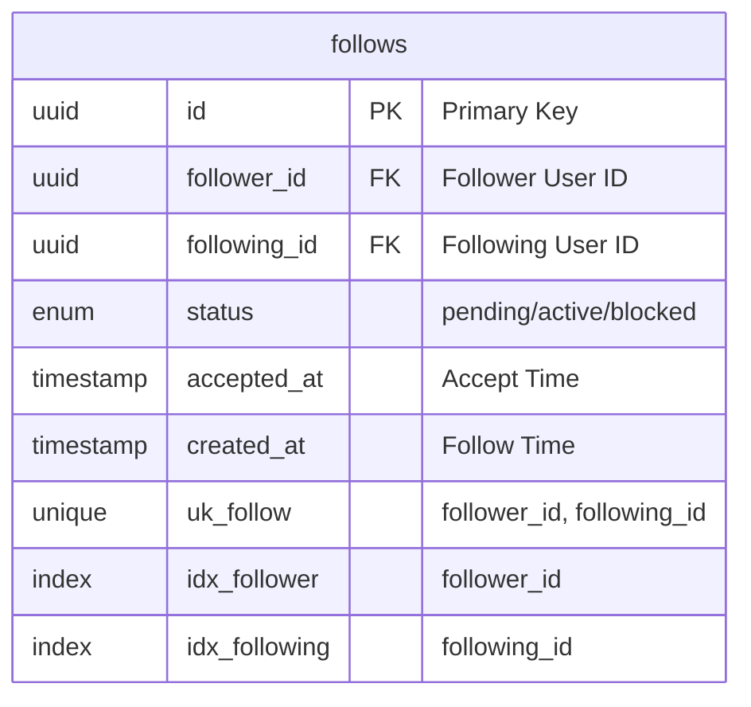
```mermaid
erDiagram
    follows {
        uuid id PK "Primary Key"
        uuid follower_id FK "Follower User ID"
        uuid following_id FK "Following User ID"
        enum status "pending/active/blocked"
        timestamp accepted_at "Accept Time"
        timestamp created_at "Follow Time"
        unique uk_follow "follower_id, following_id"
        index idx_follower "follower_id"
        index idx_following "following_id"
    }
```

### Hashtags テーブル

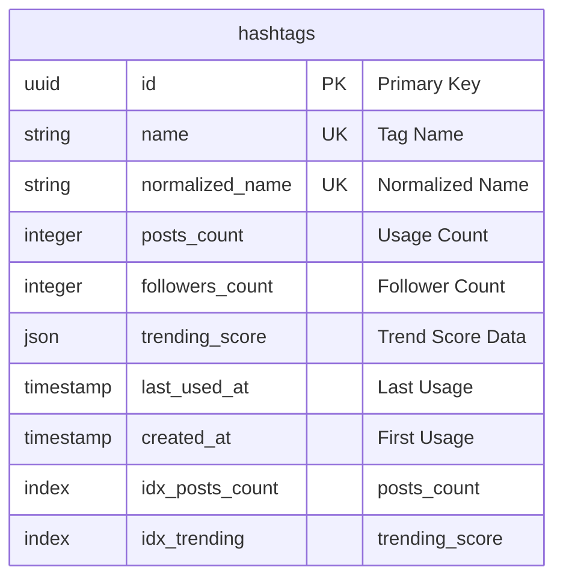
```mermaid
erDiagram
    hashtags {
        uuid id PK "Primary Key"
        string name UK "Tag Name"
        string normalized_name UK "Normalized Name"
        integer posts_count "Usage Count"
        integer followers_count "Follower Count"
        json trending_score "Trend Score Data"
        timestamp last_used_at "Last Usage"
        timestamp created_at "First Usage"
        index idx_posts_count "posts_count"
        index idx_trending "trending_score"
    }
```

### PostHashtags テーブル

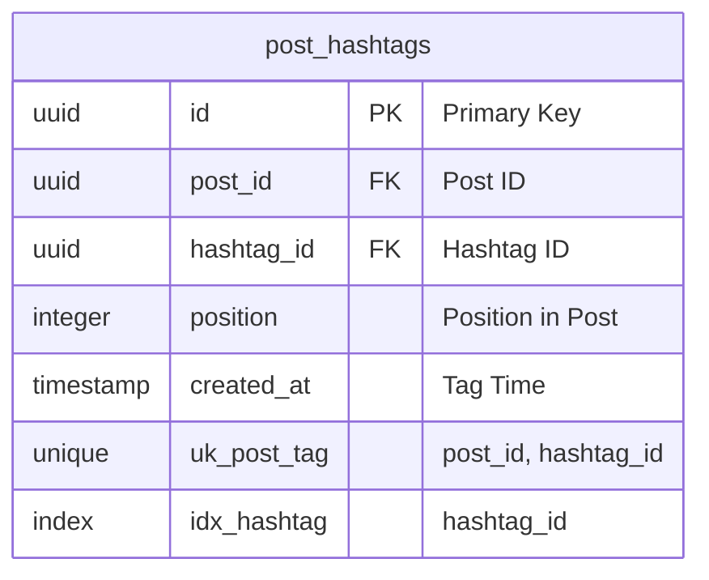
```mermaid
erDiagram
    post_hashtags {
        uuid id PK "Primary Key"
        uuid post_id FK "Post ID"
        uuid hashtag_id FK "Hashtag ID"
        integer position "Position in Post"
        timestamp created_at "Tag Time"
        unique uk_post_tag "post_id, hashtag_id"
        index idx_hashtag "hashtag_id"
    }
```

### Mentions テーブル

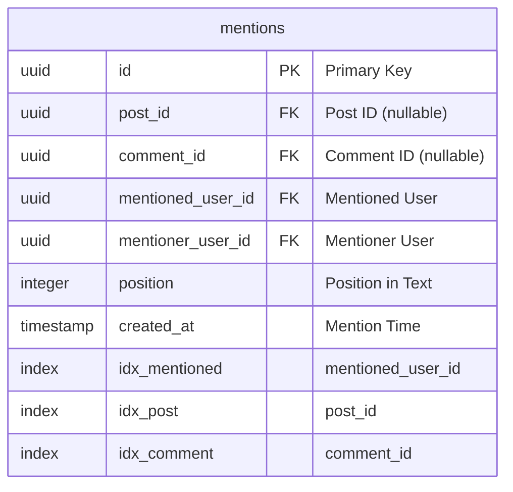
```mermaid
erDiagram
    mentions {
        uuid id PK "Primary Key"
        uuid post_id FK "Post ID (nullable)"
        uuid comment_id FK "Comment ID (nullable)"
        uuid mentioned_user_id FK "Mentioned User"
        uuid mentioner_user_id FK "Mentioner User"
        integer position "Position in Text"
        timestamp created_at "Mention Time"
        index idx_mentioned "mentioned_user_id"
        index idx_post "post_id"
        index idx_comment "comment_id"
    }
```

### Images テーブル

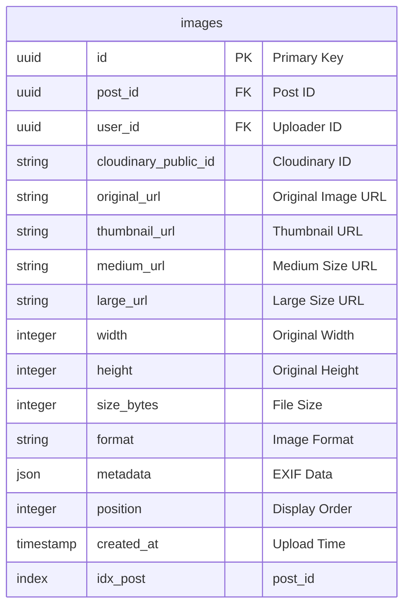
```mermaid
erDiagram
    images {
        uuid id PK "Primary Key"
        uuid post_id FK "Post ID"
        uuid user_id FK "Uploader ID"
        string cloudinary_public_id "Cloudinary ID"
        string original_url "Original Image URL"
        string thumbnail_url "Thumbnail URL"
        string medium_url "Medium Size URL"
        string large_url "Large Size URL"
        integer width "Original Width"
        integer height "Original Height"
        integer size_bytes "File Size"
        string format "Image Format"
        json metadata "EXIF Data"
        integer position "Display Order"
        timestamp created_at "Upload Time"
        index idx_post "post_id"
    }
```

### Notifications テーブル

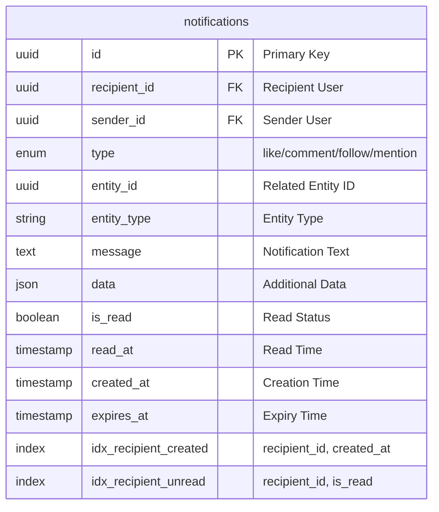
```mermaid
erDiagram
    notifications {
        uuid id PK "Primary Key"
        uuid recipient_id FK "Recipient User"
        uuid sender_id FK "Sender User"
        enum type "like/comment/follow/mention"
        uuid entity_id "Related Entity ID"
        string entity_type "Entity Type"
        text message "Notification Text"
        json data "Additional Data"
        boolean is_read "Read Status"
        timestamp read_at "Read Time"
        timestamp created_at "Creation Time"
        timestamp expires_at "Expiry Time"
        index idx_recipient_created "recipient_id, created_at"
        index idx_recipient_unread "recipient_id, is_read"
    }
```

### UserSessions テーブル

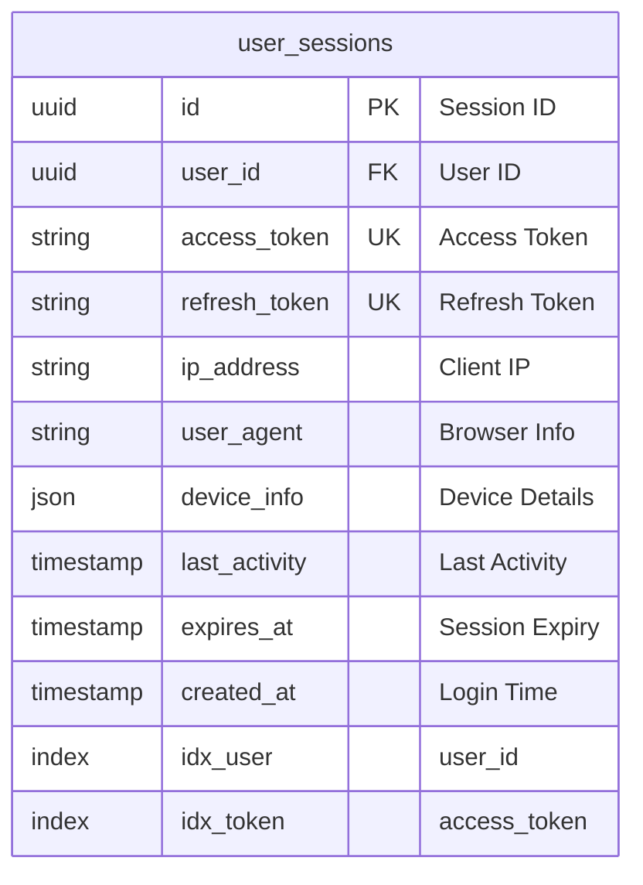
```mermaid
erDiagram
    user_sessions {
        uuid id PK "Session ID"
        uuid user_id FK "User ID"
        string access_token UK "Access Token"
        string refresh_token UK "Refresh Token"
        string ip_address "Client IP"
        string user_agent "Browser Info"
        json device_info "Device Details"
        timestamp last_activity "Last Activity"
        timestamp expires_at "Session Expiry"
        timestamp created_at "Login Time"
        index idx_user "user_id"
        index idx_token "access_token"
    }
```

### BlockedRelations テーブル

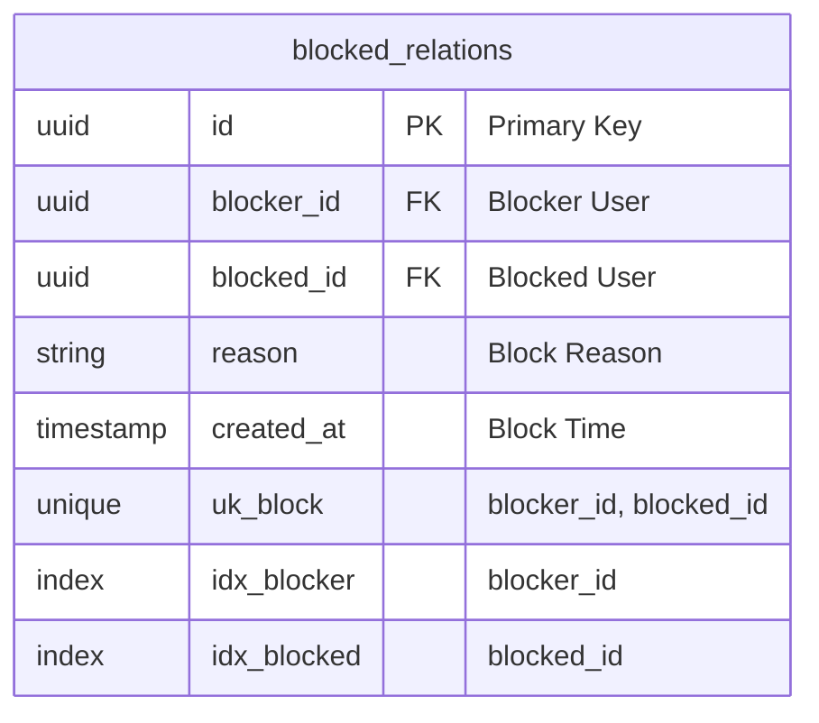
```mermaid
erDiagram
    blocked_relations {
        uuid id PK "Primary Key"
        uuid blocker_id FK "Blocker User"
        uuid blocked_id FK "Blocked User"
        string reason "Block Reason"
        timestamp created_at "Block Time"
        unique uk_block "blocker_id, blocked_id"
        index idx_blocker "blocker_id"
        index idx_blocked "blocked_id"
    }
```

### UserSettings テーブル

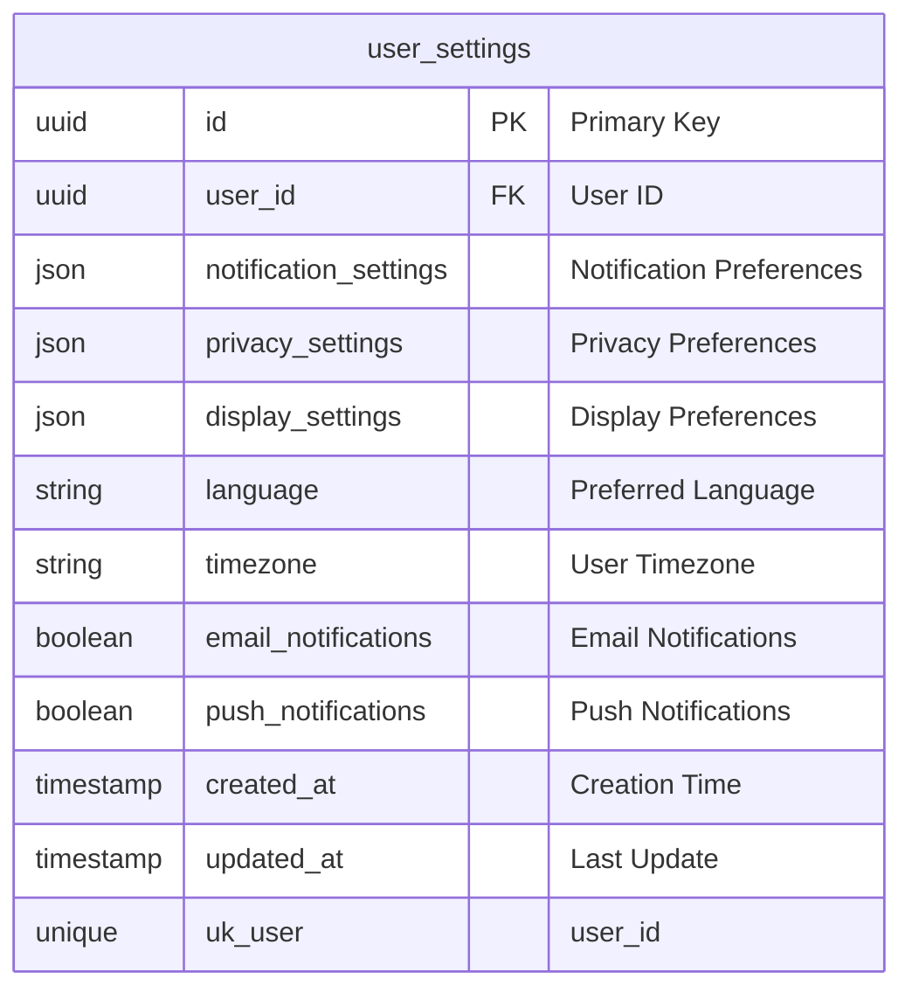
```mermaid
erDiagram
    user_settings {
        uuid id PK "Primary Key"
        uuid user_id FK "User ID"
        json notification_settings "Notification Preferences"
        json privacy_settings "Privacy Preferences"
        json display_settings "Display Preferences"
        string language "Preferred Language"
        string timezone "User Timezone"
        boolean email_notifications "Email Notifications"
        boolean push_notifications "Push Notifications"
        timestamp created_at "Creation Time"
        timestamp updated_at "Last Update"
        unique uk_user "user_id"
    }
```

### SearchHistory テーブル

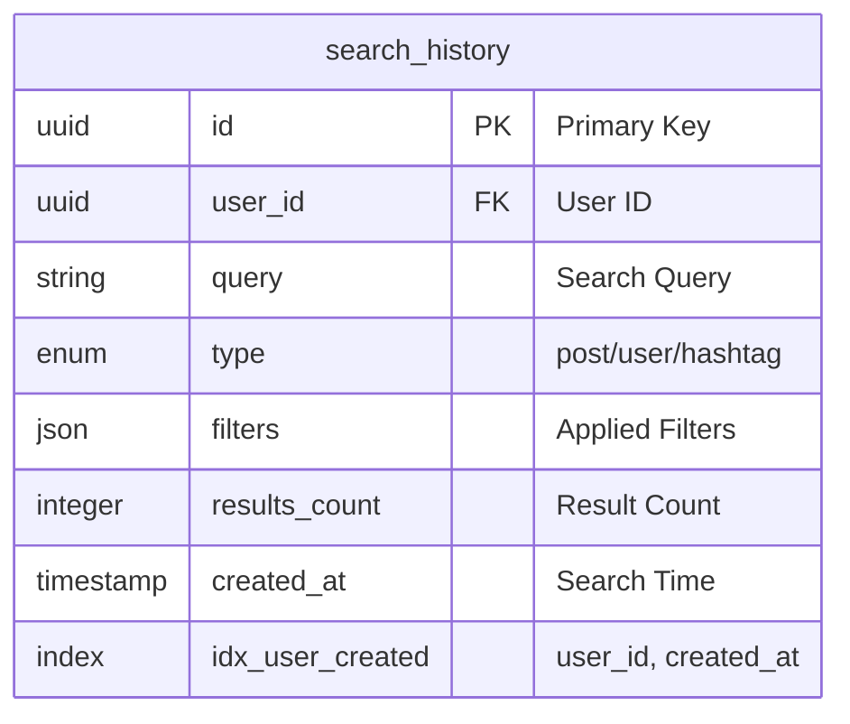
```mermaid
erDiagram
    search_history {
        uuid id PK "Primary Key"
        uuid user_id FK "User ID"
        string query "Search Query"
        enum type "post/user/hashtag"
        json filters "Applied Filters"
        integer results_count "Result Count"
        timestamp created_at "Search Time"
        index idx_user_created "user_id, created_at"
    }
```

### Reports テーブル

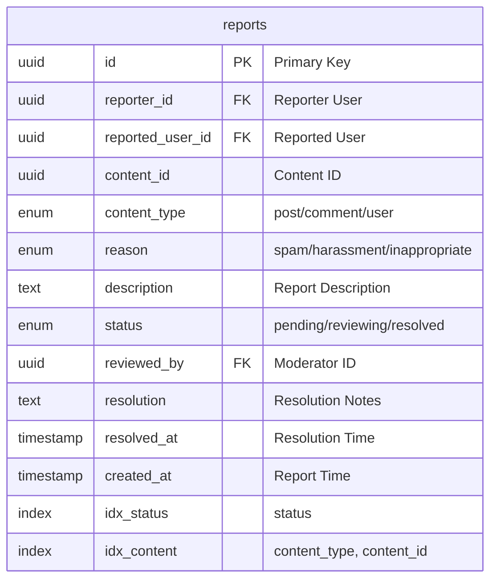
```mermaid
erDiagram
    reports {
        uuid id PK "Primary Key"
        uuid reporter_id FK "Reporter User"
        uuid reported_user_id FK "Reported User"
        uuid content_id "Content ID"
        enum content_type "post/comment/user"
        enum reason "spam/harassment/inappropriate"
        text description "Report Description"
        enum status "pending/reviewing/resolved"
        uuid reviewed_by FK "Moderator ID"
        text resolution "Resolution Notes"
        timestamp resolved_at "Resolution Time"
        timestamp created_at "Report Time"
        index idx_status "status"
        index idx_content "content_type, content_id"
    }
```

## インデックス設計

```sql
-- 高頻度クエリ用の複合インデックス
CREATE INDEX idx_posts_user_status_published 
    ON posts(user_id, status, published_at DESC);

CREATE INDEX idx_comments_post_created 
    ON comments(post_id, created_at DESC);

CREATE INDEX idx_likes_post_user 
    ON likes(post_id, user_id);

CREATE INDEX idx_follows_follower_status 
    ON follows(follower_id, status);

CREATE INDEX idx_notifications_recipient_unread_created 
    ON notifications(recipient_id, is_read, created_at DESC);

-- 全文検索インデックス
CREATE FULLTEXT INDEX idx_posts_search 
    ON posts(title, content);

CREATE FULLTEXT INDEX idx_users_search 
    ON users(username, name, bio);

-- 部分インデックス（PostgreSQL）
CREATE INDEX idx_active_users 
    ON users(username) 
    WHERE is_active = true AND deleted_at IS NULL;

CREATE INDEX idx_published_posts 
    ON posts(published_at DESC) 
    WHERE status = 'published' AND deleted_at IS NULL;
```

## パーティション設計

```sql
-- 時系列データのパーティショニング（PostgreSQL）
CREATE TABLE notifications_2024_01 PARTITION OF notifications
    FOR VALUES FROM ('2024-01-01') TO ('2024-02-01');

CREATE TABLE notifications_2024_02 PARTITION OF notifications
    FOR VALUES FROM ('2024-02-01') TO ('2024-03-01');

-- 自動パーティション作成トリガー
CREATE OR REPLACE FUNCTION create_monthly_partition()
RETURNS void AS $$
DECLARE
    partition_date DATE;
    partition_name TEXT;
BEGIN
    partition_date := date_trunc('month', CURRENT_DATE);
    partition_name := 'notifications_' || to_char(partition_date, 'YYYY_MM');
    
    EXECUTE format('CREATE TABLE IF NOT EXISTS %I PARTITION OF notifications
        FOR VALUES FROM (%L) TO (%L)',
        partition_name,
        partition_date,
        partition_date + interval '1 month'
    );
END;
$$ LANGUAGE plpgsql;
```