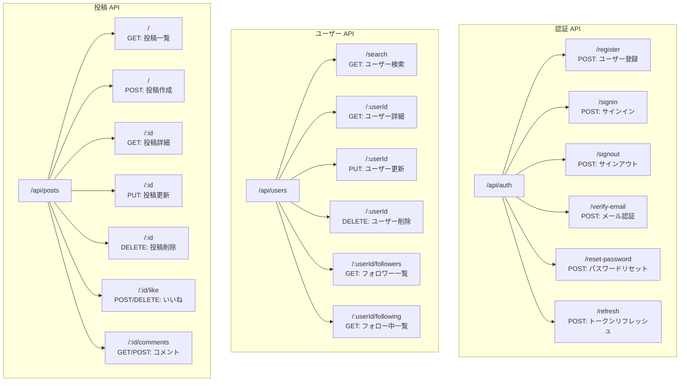
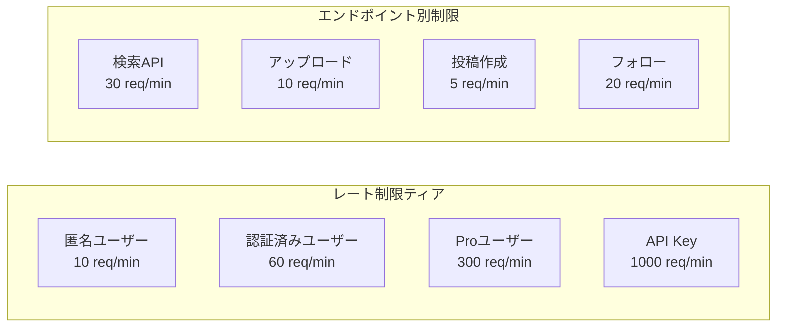
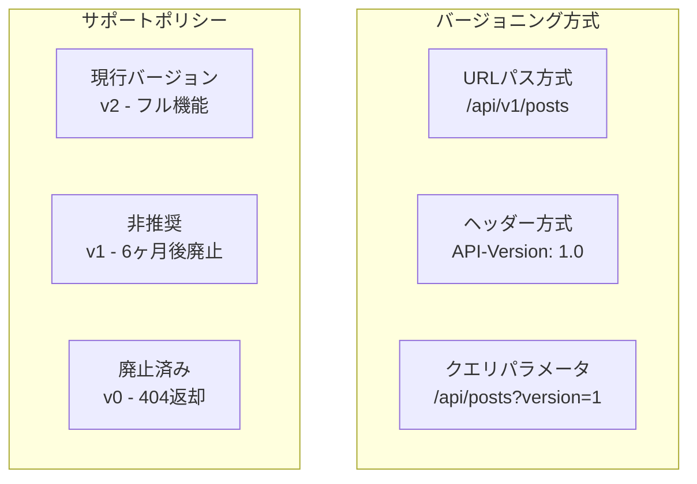
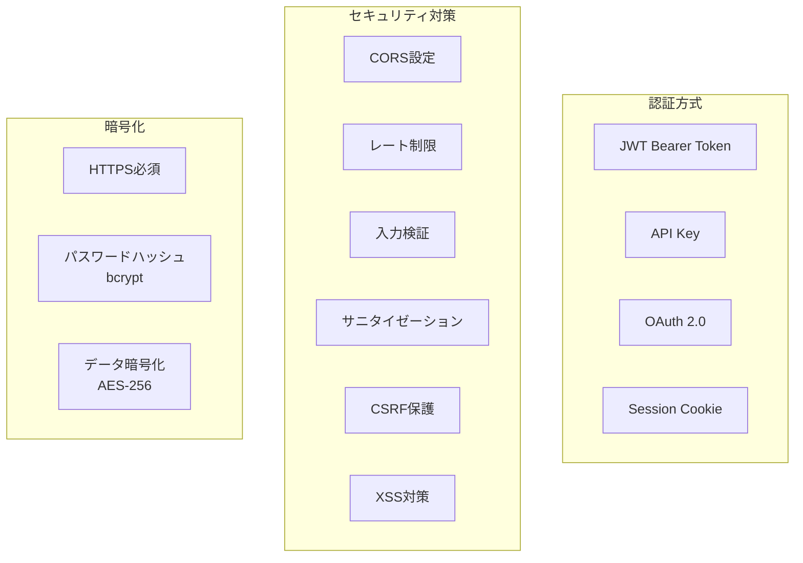
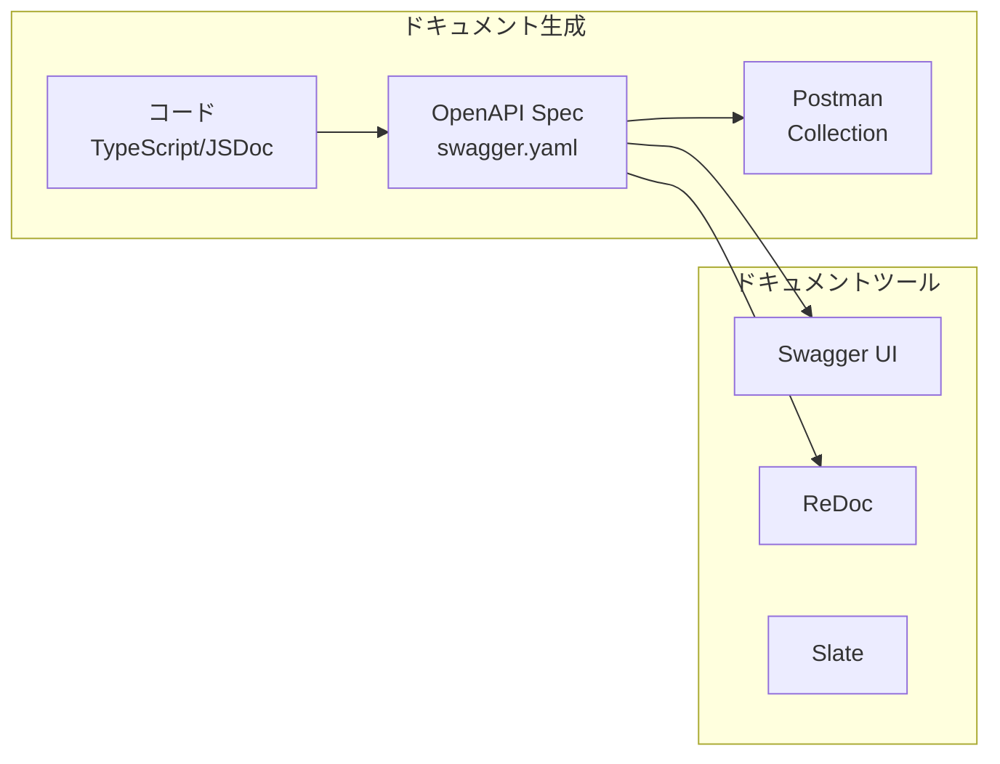

# API設計図

## RESTful API エンドポイント一覧



## API仕様詳細

### 認証エンドポイント

```yaml
openapi: 3.0.0
info:
  title: SNS Board API
  version: 1.0.0

paths:
  /api/auth/register:
    post:
      summary: ユーザー登録
      requestBody:
        required: true
        content:
          application/json:
            schema:
              type: object
              required:
                - email
                - password
                - username
              properties:
                email:
                  type: string
                  format: email
                password:
                  type: string
                  minLength: 8
                username:
                  type: string
                  pattern: '^[a-zA-Z0-9_]{3,20}$'
                name:
                  type: string
      responses:
        201:
          description: 登録成功
          content:
            application/json:
              schema:
                type: object
                properties:
                  message:
                    type: string
                  userId:
                    type: string
        400:
          description: バリデーションエラー
        409:
          description: ユーザー既存

  /api/auth/signin:
    post:
      summary: サインイン
      requestBody:
        required: true
        content:
          application/json:
            schema:
              type: object
              required:
                - email
                - password
              properties:
                email:
                  type: string
                password:
                  type: string
      responses:
        200:
          description: 認証成功
          content:
            application/json:
              schema:
                type: object
                properties:
                  accessToken:
                    type: string
                  refreshToken:
                    type: string
                  user:
                    $ref: '#/components/schemas/User'
        401:
          description: 認証失敗
```

### 投稿エンドポイント

```yaml
paths:
  /api/posts:
    get:
      summary: 投稿一覧取得
      parameters:
        - in: query
          name: page
          schema:
            type: integer
            default: 1
        - in: query
          name: limit
          schema:
            type: integer
            default: 20
            maximum: 100
        - in: query
          name: sort
          schema:
            type: string
            enum: [newest, popular, trending]
        - in: query
          name: filter
          schema:
            type: string
            enum: [all, following, media]
      responses:
        200:
          description: 成功
          content:
            application/json:
              schema:
                type: object
                properties:
                  posts:
                    type: array
                    items:
                      $ref: '#/components/schemas/Post'
                  pagination:
                    $ref: '#/components/schemas/Pagination'

    post:
      summary: 投稿作成
      security:
        - bearerAuth: []
      requestBody:
        required: true
        content:
          multipart/form-data:
            schema:
              type: object
              required:
                - content
              properties:
                title:
                  type: string
                  maxLength: 100
                content:
                  type: string
                  maxLength: 5000
                images:
                  type: array
                  items:
                    type: string
                    format: binary
                hashtags:
                  type: array
                  items:
                    type: string
                mentions:
                  type: array
                  items:
                    type: string
      responses:
        201:
          description: 作成成功
          content:
            application/json:
              schema:
                $ref: '#/components/schemas/Post'
```

## GraphQL スキーマ

```graphql
type Query {
  # ユーザー関連
  user(id: ID!): User
  users(filter: UserFilter, pagination: Pagination): UserConnection!
  currentUser: User
  
  # 投稿関連
  post(id: ID!): Post
  posts(filter: PostFilter, pagination: Pagination): PostConnection!
  timeline(pagination: Pagination): PostConnection!
  
  # 検索
  search(query: String!, type: SearchType): SearchResult!
  
  # 通知
  notifications(unreadOnly: Boolean): NotificationConnection!
  notificationCount: Int!
}

type Mutation {
  # 認証
  signUp(input: SignUpInput!): AuthPayload!
  signIn(input: SignInInput!): AuthPayload!
  signOut: Boolean!
  
  # 投稿
  createPost(input: CreatePostInput!): Post!
  updatePost(id: ID!, input: UpdatePostInput!): Post!
  deletePost(id: ID!): Boolean!
  
  # インタラクション
  likePost(postId: ID!): Like!
  unlikePost(postId: ID!): Boolean!
  createComment(input: CreateCommentInput!): Comment!
  deleteComment(id: ID!): Boolean!
  
  # フォロー
  followUser(userId: ID!): Follow!
  unfollowUser(userId: ID!): Boolean!
  
  # 通知
  markNotificationAsRead(id: ID!): Notification!
  markAllNotificationsAsRead: Boolean!
}

type Subscription {
  # リアルタイム更新
  postCreated: Post!
  postUpdated(id: ID!): Post!
  
  # 通知
  notificationReceived: Notification!
  
  # タイムライン
  timelineUpdate: TimelineUpdate!
  
  # タイピングインジケーター
  userTyping(postId: ID!): TypingIndicator!
}
```

## API レート制限



## エラーレスポンス標準化

```json
{
  "error": {
    "code": "VALIDATION_ERROR",
    "message": "入力値が不正です",
    "details": [
      {
        "field": "email",
        "message": "有効なメールアドレスを入力してください"
      }
    ],
    "timestamp": "2024-01-01T00:00:00Z",
    "requestId": "req_abc123"
  }
}
```

## API バージョニング戦略



## WebSocket API

```javascript
// WebSocket接続
ws://api.example.com/realtime

// 認証
{
  "type": "auth",
  "token": "jwt_token_here"
}

// ルーム参加
{
  "type": "join",
  "room": "post:123"
}

// イベント購読
{
  "type": "subscribe",
  "events": ["new_comment", "new_like", "typing"]
}

// メッセージ送信
{
  "type": "message",
  "data": {
    "content": "Hello",
    "timestamp": "2024-01-01T00:00:00Z"
  }
}
```

## API セキュリティ



## API モニタリング

```yaml
monitoring:
  metrics:
    - response_time:
        p50: < 100ms
        p95: < 500ms
        p99: < 1000ms
    
    - availability:
        target: 99.9%
        
    - error_rate:
        threshold: < 1%
    
  alerts:
    - high_error_rate:
        condition: error_rate > 5%
        action: page_oncall
        
    - slow_response:
        condition: p95 > 1000ms
        action: notify_team
        
    - rate_limit_exceeded:
        condition: rate_limit_violations > 100/min
        action: auto_scale
        
  logging:
    - access_log:
        format: combined
        retention: 30_days
        
    - error_log:
        level: error
        retention: 90_days
        
    - audit_log:
        events: [create, update, delete]
        retention: 365_days
```

## API ドキュメント自動生成



## バッチ API

```json
// バッチリクエスト
POST /api/batch
{
  "requests": [
    {
      "id": "1",
      "method": "GET",
      "url": "/api/posts/123"
    },
    {
      "id": "2",
      "method": "POST",
      "url": "/api/posts/123/like"
    },
    {
      "id": "3",
      "method": "GET",
      "url": "/api/users/456"
    }
  ]
}

// バッチレスポンス
{
  "responses": [
    {
      "id": "1",
      "status": 200,
      "body": { /* post data */ }
    },
    {
      "id": "2",
      "status": 201,
      "body": { /* like data */ }
    },
    {
      "id": "3",
      "status": 200,
      "body": { /* user data */ }
    }
  ]
}
```