# システムアーキテクチャ図

## 全体アーキテクチャ

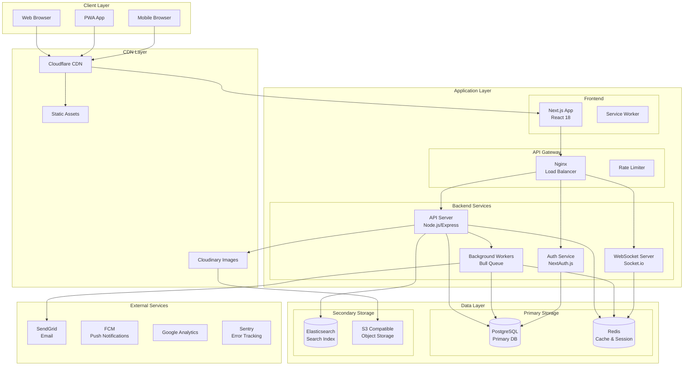

## マイクロサービスアーキテクチャ

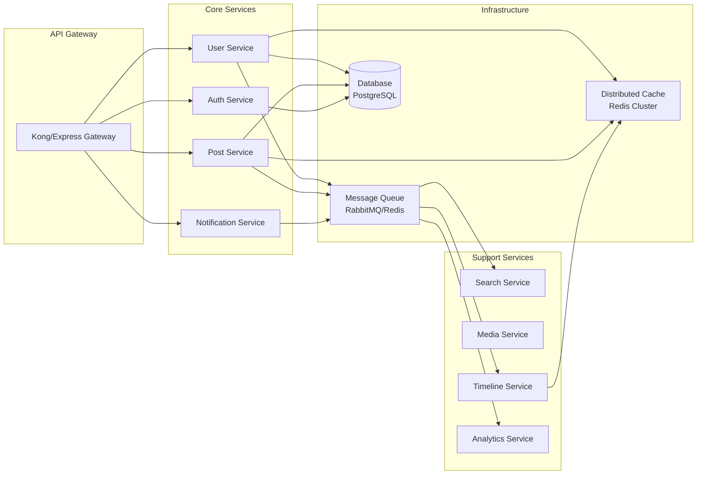

## デプロイメントアーキテクチャ

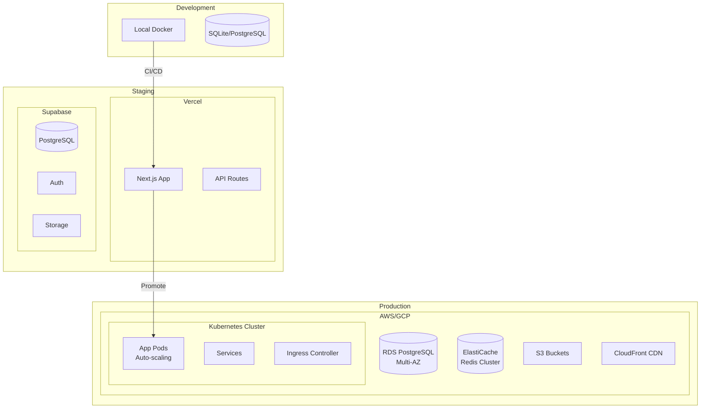

## データフローアーキテクチャ

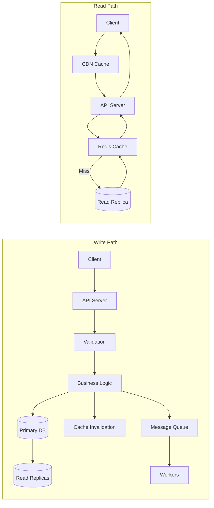

## セキュリティアーキテクチャ

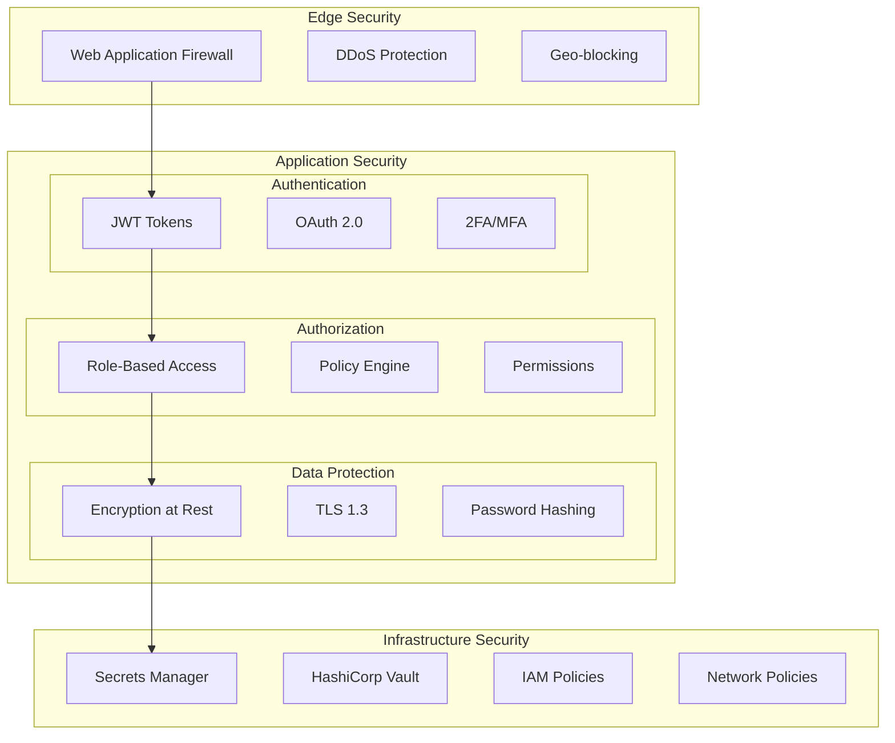

## スケーリング戦略

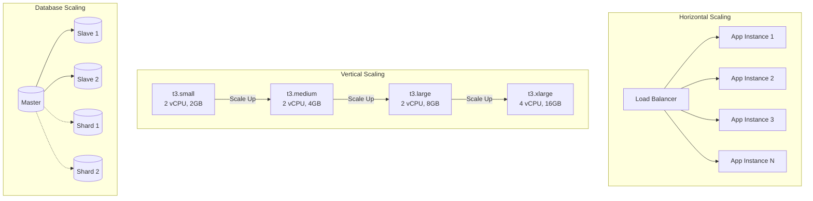

## 監視・ロギングアーキテクチャ

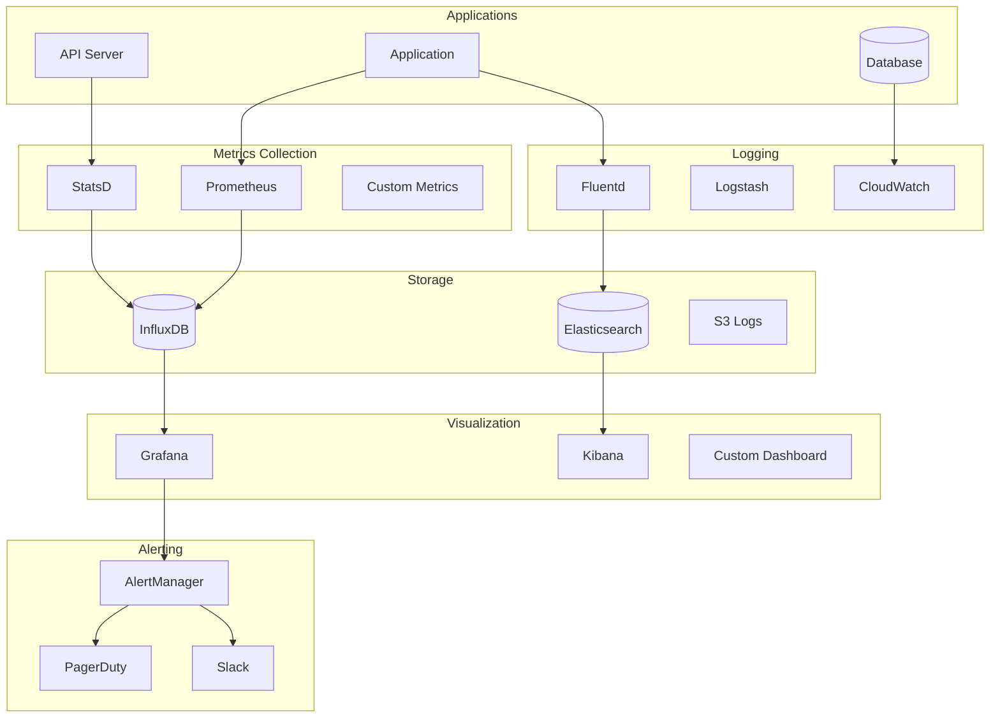

## 災害復旧アーキテクチャ

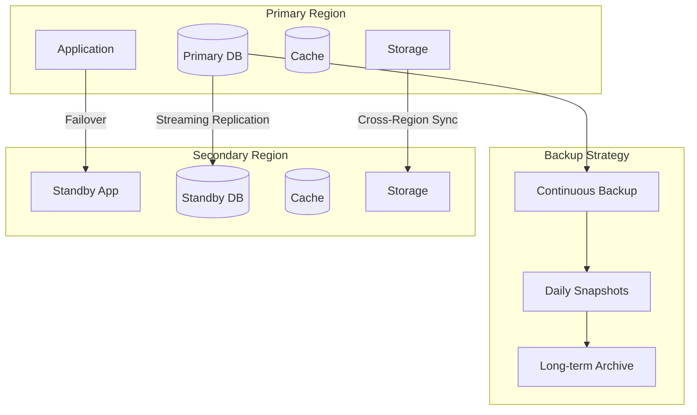

## CI/CD パイプライン

```mermaid
graph LR
    subgraph "Development"
        CODE[Source Code]
        GIT[Git Push]
    end
    
    subgraph "CI Pipeline"
        TRIGGER[GitHub Actions]
        LINT[Linting]
        TEST[Unit Tests]
        E2E[E2E Tests]
        BUILD[Build]
        SCAN[Security Scan]
    end
    
    subgraph "CD Pipeline"
        ARTIFACT[Build Artifacts]
        STAGING[Deploy Staging]
        SMOKE[Smoke Tests]
        APPROVAL[Manual Approval]
        PROD[Deploy Production]
        ROLLBACK[Rollback]
    end
    
    CODE --> GIT
    GIT --> TRIGGER
    TRIGGER --> LINT
    LINT --> TEST
    TEST --> E2E
    E2E --> BUILD
    BUILD --> SCAN
    SCAN --> ARTIFACT
    ARTIFACT --> STAGING
    STAGING --> SMOKE
    SMOKE --> APPROVAL
    APPROVAL --> PROD
    PROD -.-> ROLLBACK
```

## コンテナオーケストレーション

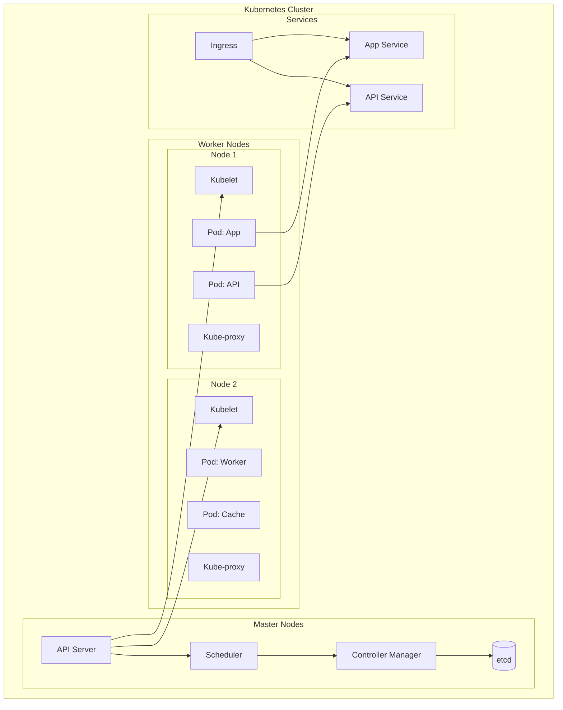

## キャッシング戦略

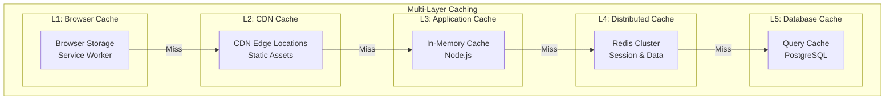