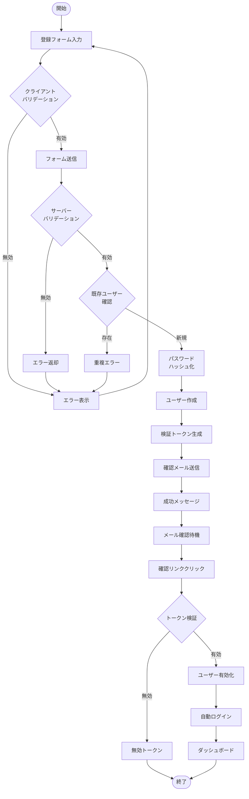
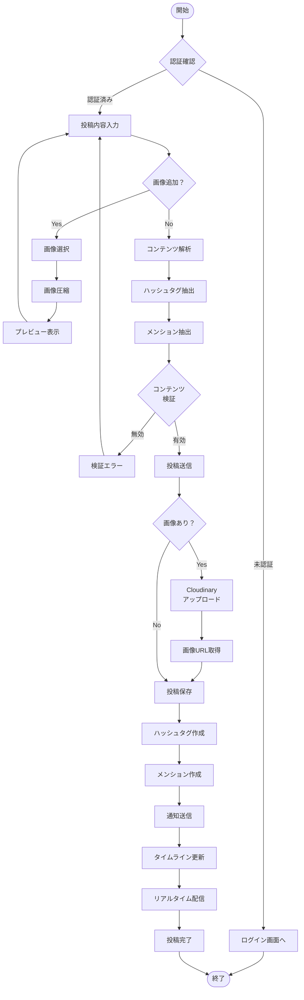
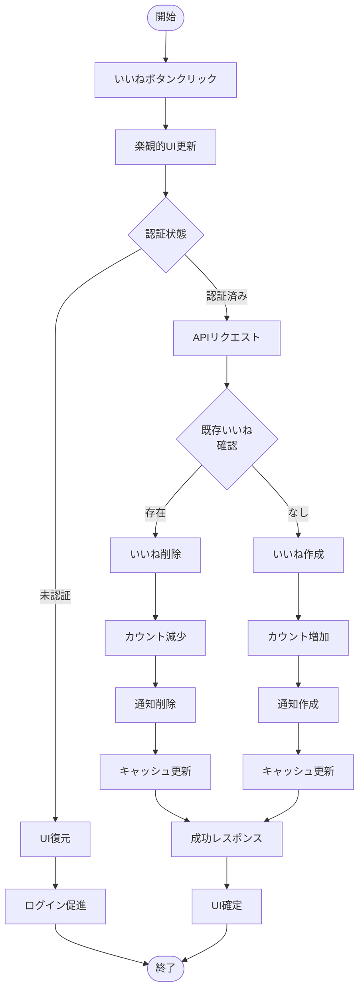
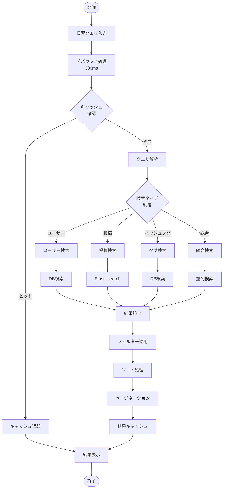
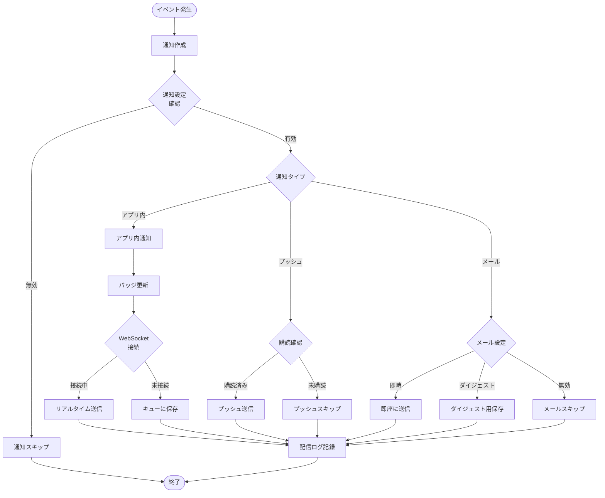
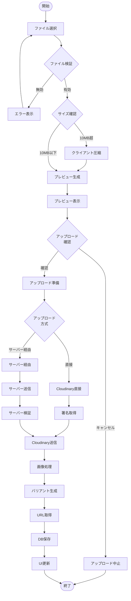
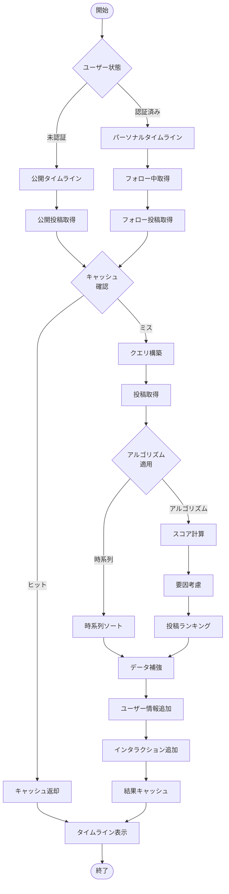
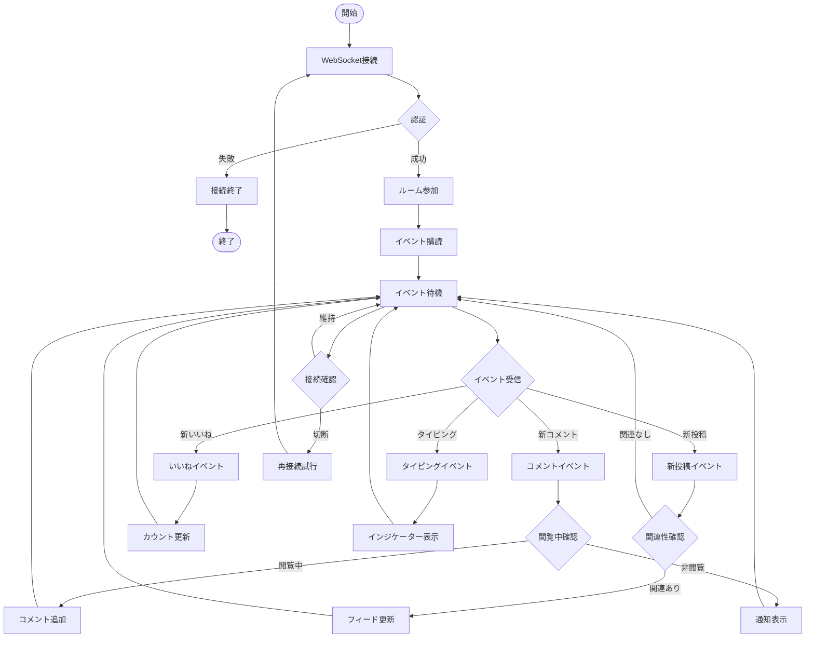
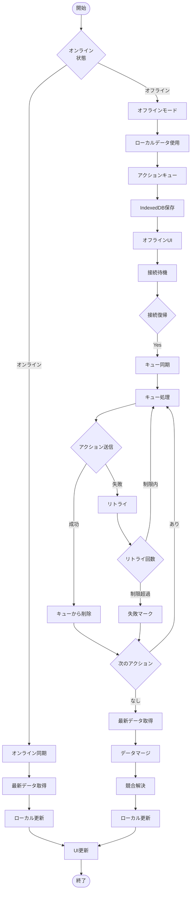

# 処理フロー図

## ユーザー登録フロー

```mermaid
flowchart TD
    Start([開始]) --> InputForm[登録フォーム入力]
    InputForm --> ValidateClient{クライアント<br/>バリデーション}
    
    ValidateClient -->|無効| ShowError[エラー表示]
    ShowError --> InputForm
    
    ValidateClient -->|有効| SubmitForm[フォーム送信]
    SubmitForm --> ValidateServer{サーバー<br/>バリデーション}
    
    ValidateServer -->|無効| ReturnError[エラー返却]
    ReturnError --> ShowError
    
    ValidateServer -->|有効| CheckExisting{既存ユーザー<br/>確認}
    
    CheckExisting -->|存在| DuplicateError[重複エラー]
    DuplicateError --> ShowError
    
    CheckExisting -->|新規| HashPassword[パスワード<br/>ハッシュ化]
    HashPassword --> CreateUser[ユーザー作成]
    CreateUser --> GenerateToken[検証トークン生成]
    GenerateToken --> SendEmail[確認メール送信]
    SendEmail --> ShowSuccess[成功メッセージ]
    ShowSuccess --> WaitVerification[メール確認待機]
    
    WaitVerification --> ClickLink[確認リンククリック]
    ClickLink --> VerifyToken{トークン検証}
    
    VerifyToken -->|無効| InvalidToken[無効トークン]
    InvalidToken --> End([終了])
    
    VerifyToken -->|有効| ActivateUser[ユーザー有効化]
    ActivateUser --> AutoLogin[自動ログイン]
    AutoLogin --> Dashboard[ダッシュボード]
    Dashboard --> End
```

## 投稿作成フロー

```mermaid
flowchart TD
    Start([開始]) --> CheckAuth{認証確認}
    
    CheckAuth -->|未認証| RedirectLogin[ログイン画面へ]
    RedirectLogin --> End([終了])
    
    CheckAuth -->|認証済み| InputContent[投稿内容入力]
    InputContent --> AddMedia{画像追加？}
    
    AddMedia -->|Yes| SelectImage[画像選択]
    SelectImage --> CompressImage[画像圧縮]
    CompressImage --> PreviewImage[プレビュー表示]
    PreviewImage --> InputContent
    
    AddMedia -->|No| ParseContent[コンテンツ解析]
    ParseContent --> ExtractHashtags[ハッシュタグ抽出]
    ExtractHashtags --> ExtractMentions[メンション抽出]
    ExtractMentions --> ValidateContent{コンテンツ<br/>検証}
    
    ValidateContent -->|無効| ShowValidationError[検証エラー]
    ShowValidationError --> InputContent
    
    ValidateContent -->|有効| SubmitPost[投稿送信]
    SubmitPost --> UploadImages{画像あり？}
    
    UploadImages -->|Yes| CloudinaryUpload[Cloudinary<br/>アップロード]
    CloudinaryUpload --> GetImageURLs[画像URL取得]
    GetImageURLs --> SavePost
    
    UploadImages -->|No| SavePost[投稿保存]
    SavePost --> CreateHashtags[ハッシュタグ作成]
    CreateHashtags --> CreateMentions[メンション作成]
    CreateMentions --> SendNotifications[通知送信]
    SendNotifications --> UpdateTimeline[タイムライン更新]
    UpdateTimeline --> BroadcastRealtime[リアルタイム配信]
    BroadcastRealtime --> ShowSuccess[投稿完了]
    ShowSuccess --> End
```

## いいね処理フロー

```mermaid
flowchart TD
    Start([開始]) --> ClickLike[いいねボタンクリック]
    ClickLike --> OptimisticUpdate[楽観的UI更新]
    OptimisticUpdate --> CheckAuth{認証状態}
    
    CheckAuth -->|未認証| RollbackUI[UI復元]
    RollbackUI --> ShowLoginPrompt[ログイン促進]
    ShowLoginPrompt --> End([終了])
    
    CheckAuth -->|認証済み| SendRequest[APIリクエスト]
    SendRequest --> CheckExisting{既存いいね<br/>確認}
    
    CheckExisting -->|存在| RemoveLike[いいね削除]
    RemoveLike --> DecrementCount[カウント減少]
    DecrementCount --> DeleteNotification[通知削除]
    DeleteNotification --> UpdateCache[キャッシュ更新]
    UpdateCache --> Success
    
    CheckExisting -->|なし| CreateLike[いいね作成]
    CreateLike --> IncrementCount[カウント増加]
    IncrementCount --> CreateNotification[通知作成]
    CreateNotification --> UpdateCache2[キャッシュ更新]
    UpdateCache2 --> Success[成功レスポンス]
    
    Success --> ConfirmUI[UI確定]
    ConfirmUI --> End
```

## 検索処理フロー

```mermaid
flowchart TD
    Start([開始]) --> InputQuery[検索クエリ入力]
    InputQuery --> Debounce[デバウンス処理<br/>300ms]
    Debounce --> CheckCache{キャッシュ<br/>確認}
    
    CheckCache -->|ヒット| ReturnCached[キャッシュ返却]
    ReturnCached --> DisplayResults
    
    CheckCache -->|ミス| ParseQuery[クエリ解析]
    ParseQuery --> DetermineType{検索タイプ<br/>判定}
    
    DetermineType -->|ユーザー| UserSearch[ユーザー検索]
    DetermineType -->|投稿| PostSearch[投稿検索]
    DetermineType -->|ハッシュタグ| HashtagSearch[タグ検索]
    DetermineType -->|総合| AllSearch[統合検索]
    
    UserSearch --> QueryDB1[DB検索]
    PostSearch --> QueryElastic[Elasticsearch]
    HashtagSearch --> QueryDB2[DB検索]
    AllSearch --> ParallelSearch[並列検索]
    
    QueryDB1 --> MergeResults
    QueryElastic --> MergeResults
    QueryDB2 --> MergeResults
    ParallelSearch --> MergeResults[結果統合]
    
    MergeResults --> ApplyFilters[フィルター適用]
    ApplyFilters --> SortResults[ソート処理]
    SortResults --> Paginate[ページネーション]
    Paginate --> CacheResults[結果キャッシュ]
    CacheResults --> DisplayResults[結果表示]
    DisplayResults --> End([終了])
```

## 通知配信フロー

```mermaid
flowchart TD
    Start([イベント発生]) --> CreateNotification[通知作成]
    CreateNotification --> CheckSettings{通知設定<br/>確認}
    
    CheckSettings -->|無効| SkipNotification[通知スキップ]
    SkipNotification --> End([終了])
    
    CheckSettings -->|有効| DetermineType{通知タイプ}
    
    DetermineType -->|アプリ内| InAppNotif[アプリ内通知]
    InAppNotif --> UpdateBadge[バッジ更新]
    UpdateBadge --> CheckWebSocket{WebSocket<br/>接続}
    
    CheckWebSocket -->|接続中| SendRealtime[リアルタイム送信]
    CheckWebSocket -->|未接続| QueueForLater[キューに保存]
    
    DetermineType -->|プッシュ| CheckSubscription{購読確認}
    CheckSubscription -->|購読済み| SendPush[プッシュ送信]
    CheckSubscription -->|未購読| SkipPush[プッシュスキップ]
    
    DetermineType -->|メール| CheckEmailSettings{メール設定}
    CheckEmailSettings -->|即時| SendImmediate[即座に送信]
    CheckEmailSettings -->|ダイジェスト| QueueDigest[ダイジェスト用保存]
    CheckEmailSettings -->|無効| SkipEmail[メールスキップ]
    
    SendRealtime --> LogDelivery
    QueueForLater --> LogDelivery
    SendPush --> LogDelivery
    SendImmediate --> LogDelivery
    QueueDigest --> LogDelivery
    SkipPush --> LogDelivery
    SkipEmail --> LogDelivery[配信ログ記録]
    
    LogDelivery --> End
```

## 画像アップロードフロー

```mermaid
flowchart TD
    Start([開始]) --> SelectFile[ファイル選択]
    SelectFile --> ValidateFile{ファイル検証}
    
    ValidateFile -->|無効| ShowFileError[エラー表示]
    ShowFileError --> SelectFile
    
    ValidateFile -->|有効| CheckSize{サイズ確認}
    
    CheckSize -->|10MB超| CompressClient[クライアント圧縮]
    CompressClient --> GeneratePreview
    
    CheckSize -->|10MB以下| GeneratePreview[プレビュー生成]
    GeneratePreview --> DisplayPreview[プレビュー表示]
    DisplayPreview --> ConfirmUpload{アップロード<br/>確認}
    
    ConfirmUpload -->|キャンセル| CancelUpload[アップロード中止]
    CancelUpload --> End([終了])
    
    ConfirmUpload -->|確認| PrepareUpload[アップロード準備]
    PrepareUpload --> DetermineMethod{アップロード<br/>方式}
    
    DetermineMethod -->|直接| DirectUpload[Cloudinary直接]
    DetermineMethod -->|サーバー経由| ServerUpload[サーバー経由]
    
    DirectUpload --> GetSignature[署名取得]
    GetSignature --> UploadToCloudinary[Cloudinary送信]
    
    ServerUpload --> SendToServer[サーバー送信]
    SendToServer --> ServerValidation[サーバー検証]
    ServerValidation --> UploadToCloudinary
    
    UploadToCloudinary --> ProcessImage[画像処理]
    ProcessImage --> GenerateVariants[バリアント生成]
    GenerateVariants --> GetURLs[URL取得]
    GetURLs --> SaveToDB[DB保存]
    SaveToDB --> UpdateUI[UI更新]
    UpdateUI --> End
```

## タイムライン生成フロー

```mermaid
flowchart TD
    Start([開始]) --> CheckUser{ユーザー状態}
    
    CheckUser -->|未認証| PublicTimeline[公開タイムライン]
    PublicTimeline --> GetPublicPosts[公開投稿取得]
    
    CheckUser -->|認証済み| PersonalTimeline[パーソナルタイムライン]
    PersonalTimeline --> GetFollowing[フォロー中取得]
    GetFollowing --> GetFollowingPosts[フォロー投稿取得]
    
    GetPublicPosts --> CheckCache{キャッシュ<br/>確認}
    GetFollowingPosts --> CheckCache
    
    CheckCache -->|ヒット| ReturnCache[キャッシュ返却]
    ReturnCache --> DisplayTimeline
    
    CheckCache -->|ミス| BuildQuery[クエリ構築]
    BuildQuery --> FetchPosts[投稿取得]
    FetchPosts --> ApplyAlgorithm{アルゴリズム<br/>適用}
    
    ApplyAlgorithm -->|時系列| ChronologicalSort[時系列ソート]
    ApplyAlgorithm -->|アルゴリズム| CalculateScore[スコア計算]
    
    CalculateScore --> ConsiderFactors[要因考慮]
    ConsiderFactors --> RankPosts[投稿ランキング]
    
    ChronologicalSort --> EnrichData
    RankPosts --> EnrichData[データ補強]
    
    EnrichData --> AddUserInfo[ユーザー情報追加]
    AddUserInfo --> AddInteractions[インタラクション追加]
    AddInteractions --> CacheResult[結果キャッシュ]
    CacheResult --> DisplayTimeline[タイムライン表示]
    DisplayTimeline --> End([終了])
```

## リアルタイム同期フロー

```mermaid
flowchart TD
    Start([開始]) --> EstablishConnection[WebSocket接続]
    EstablishConnection --> Authenticate{認証}
    
    Authenticate -->|失敗| CloseConnection[接続終了]
    CloseConnection --> End([終了])
    
    Authenticate -->|成功| JoinRooms[ルーム参加]
    JoinRooms --> Subscribe[イベント購読]
    Subscribe --> WaitEvents[イベント待機]
    
    WaitEvents --> ReceiveEvent{イベント受信}
    
    ReceiveEvent -->|新投稿| NewPostEvent[新投稿イベント]
    NewPostEvent --> CheckRelevance1{関連性確認}
    CheckRelevance1 -->|関連あり| UpdateFeed[フィード更新]
    CheckRelevance1 -->|関連なし| WaitEvents
    
    ReceiveEvent -->|新コメント| NewCommentEvent[コメントイベント]
    NewCommentEvent --> CheckViewing{閲覧中確認}
    CheckViewing -->|閲覧中| AddComment[コメント追加]
    CheckViewing -->|非閲覧| ShowNotification
    
    ReceiveEvent -->|新いいね| NewLikeEvent[いいねイベント]
    NewLikeEvent --> UpdateCount[カウント更新]
    
    ReceiveEvent -->|タイピング| TypingEvent[タイピングイベント]
    TypingEvent --> ShowIndicator[インジケーター表示]
    
    UpdateFeed --> WaitEvents
    AddComment --> WaitEvents
    ShowNotification[通知表示] --> WaitEvents
    UpdateCount --> WaitEvents
    ShowIndicator --> WaitEvents
    
    WaitEvents --> CheckConnection{接続確認}
    CheckConnection -->|切断| Reconnect[再接続試行]
    Reconnect --> EstablishConnection
    CheckConnection -->|維持| WaitEvents
```

## データ同期フロー

```mermaid
flowchart TD
    Start([開始]) --> CheckOnline{オンライン<br/>状態}
    
    CheckOnline -->|オンライン| OnlineSync[オンライン同期]
    OnlineSync --> FetchLatest[最新データ取得]
    FetchLatest --> UpdateLocal[ローカル更新]
    UpdateLocal --> UpdateUI[UI更新]
    
    CheckOnline -->|オフライン| OfflineMode[オフラインモード]
    OfflineMode --> UseLocalData[ローカルデータ使用]
    UseLocalData --> QueueActions[アクションキュー]
    
    QueueActions --> StoreInIDB[IndexedDB保存]
    StoreInIDB --> ShowOfflineUI[オフラインUI]
    ShowOfflineUI --> WaitConnection[接続待機]
    
    WaitConnection --> ConnectionRestored{接続復帰}
    ConnectionRestored -->|Yes| SyncQueue[キュー同期]
    SyncQueue --> ProcessQueue[キュー処理]
    
    ProcessQueue --> SendAction{アクション送信}
    SendAction -->|成功| RemoveFromQueue[キューから削除]
    SendAction -->|失敗| RetryAction[リトライ]
    
    RemoveFromQueue --> NextAction{次のアクション}
    NextAction -->|あり| ProcessQueue
    NextAction -->|なし| FetchLatest2[最新データ取得]
    
    RetryAction --> CheckRetries{リトライ回数}
    CheckRetries -->|制限内| ProcessQueue
    CheckRetries -->|制限超過| MarkFailed[失敗マーク]
    MarkFailed --> NextAction
    
    FetchLatest2 --> MergeData[データマージ]
    MergeData --> ResolveConflicts[競合解決]
    ResolveConflicts --> UpdateLocal2[ローカル更新]
    UpdateLocal2 --> UpdateUI
    
    UpdateUI --> End([終了])
```